## 参考博文
[Java学习：查看java字节码文件](https://www.jianshu.com/p/f97d5880eaa5)
[macOS 终端可用的 Hex 查看与编辑器
](https://learnku.com/articles/22249)
[【深入Java虚拟机】之二：Class类文件结构](https://blog.csdn.net/mmc_maodun/article/details/17675609)

[TOC]

# 1. Class文件结构
每个Class文件都对应着唯一的类或接口的定义信息

文件中的数据按照Class文件格式中的字段顺序紧密排列，没有分隔符。
Class文件中的字段数据类型有：
1. 无符号数：u1、u2、u4、u8分别代表1个字节、2个字节、4个字节和8个字节

2. 表：由多个无符号数或其他表构成的符合数据类型，字类型名以_info结尾


示例代码
```java
package JVM;

import java.io.Serializable;

public class ClassFile implements Serializable {

    private int id;
    private String name;

    public int getId() {
        return id;
    }

    public String getName() {
        return name;
    }

    public void setId(int id) {
        this.id = id;
    }

    public void setName(String name) {
        this.name = name;
    }
}
```
```shell
chenpeipeideMacBook-Pro:JVM chenpeipei$ hexdump /Users/chenpeipei/Documents/炸鸡/code/target/classes/JVM/ClassFile.class 
0000000 ca fe ba be 00 00 00 31 00 22 0a 00 05 00 1c 09
0000010 00 04 00 1d 09 00 04 00 1e 07 00 1f 07 00 20 07
0000020 00 21 01 00 02 69 64 01 00 01 49 01 00 04 6e 61
0000030 6d 65 01 00 12 4c 6a 61 76 61 2f 6c 61 6e 67 2f
0000040 53 74 72 69 6e 67 3b 01 00 06 3c 69 6e 69 74 3e
0000050 01 00 03 28 29 56 01 00 04 43 6f 64 65 01 00 0f
0000060 4c 69 6e 65 4e 75 6d 62 65 72 54 61 62 6c 65 01
0000070 00 12 4c 6f 63 61 6c 56 61 72 69 61 62 6c 65 54
0000080 61 62 6c 65 01 00 04 74 68 69 73 01 00 0f 4c 4a
0000090 56 4d 2f 43 6c 61 73 73 46 69 6c 65 3b 01 00 05
00000a0 67 65 74 49 64 01 00 03 28 29 49 01 00 07 67 65
00000b0 74 4e 61 6d 65 01 00 14 28 29 4c 6a 61 76 61 2f
00000c0 6c 61 6e 67 2f 53 74 72 69 6e 67 3b 01 00 05 73
00000d0 65 74 49 64 01 00 04 28 49 29 56 01 00 07 73 65
00000e0 74 4e 61 6d 65 01 00 15 28 4c 6a 61 76 61 2f 6c
00000f0 61 6e 67 2f 53 74 72 69 6e 67 3b 29 56 01 00 0a
0000100 53 6f 75 72 63 65 46 69 6c 65 01 00 0e 43 6c 61
0000110 73 73 46 69 6c 65 2e 6a 61 76 61 0c 00 0b 00 0c
0000120 0c 00 07 00 08 0c 00 09 00 0a 01 00 0d 4a 56 4d
0000130 2f 43 6c 61 73 73 46 69 6c 65 01 00 10 6a 61 76
0000140 61 2f 6c 61 6e 67 2f 4f 62 6a 65 63 74 01 00 14
0000150 6a 61 76 61 2f 69 6f 2f 53 65 72 69 61 6c 69 7a
0000160 61 62 6c 65 00 21 00 04 00 05 00 01 00 06 00 02
0000170 00 02 00 07 00 08 00 00 00 02 00 09 00 0a 00 00
0000180 00 05 00 01 00 0b 00 0c 00 01 00 0d 00 00 00 2f
0000190 00 01 00 01 00 00 00 05 2a b7 00 01 b1 00 00 00
00001a0 02 00 0e 00 00 00 06 00 01 00 00 00 05 00 0f 00
00001b0 00 00 0c 00 01 00 00 00 05 00 10 00 11 00 00 00
00001c0 01 00 12 00 13 00 01 00 0d 00 00 00 2f 00 01 00
00001d0 01 00 00 00 05 2a b4 00 02 ac 00 00 00 02 00 0e
00001e0 00 00 00 06 00 01 00 00 00 0b 00 0f 00 00 00 0c
00001f0 00 01 00 00 00 05 00 10 00 11 00 00 00 01 00 14
0000200 00 15 00 01 00 0d 00 00 00 2f 00 01 00 01 00 00
0000210 00 05 2a b4 00 03 b0 00 00 00 02 00 0e 00 00 00
0000220 06 00 01 00 00 00 0f 00 0f 00 00 00 0c 00 01 00
0000230 00 00 05 00 10 00 11 00 00 00 01 00 16 00 17 00
0000240 01 00 0d 00 00 00 3e 00 02 00 02 00 00 00 06 2a
0000250 1b b5 00 02 b1 00 00 00 02 00 0e 00 00 00 0a 00
0000260 02 00 00 00 13 00 05 00 14 00 0f 00 00 00 16 00
0000270 02 00 00 00 06 00 10 00 11 00 00 00 00 00 06 00
0000280 07 00 08 00 01 00 01 00 18 00 19 00 01 00 0d 00
0000290 00 00 3e 00 02 00 02 00 00 00 06 2a 2b b5 00 03
00002a0 b1 00 00 00 02 00 0e 00 00 00 0a 00 02 00 00 00
00002b0 17 00 05 00 18 00 0f 00 00 00 16 00 02 00 00 00
00002c0 06 00 10 00 11 00 00 00 00 00 06 00 09 00 0a 00
00002d0 01 00 01 00 1a 00 00 00 02 00 1b               
00002db
```
```shell
chenpeipeideMacBook-Pro:JVM chenpeipei$ javap -verbose /Users/chenpeipei/Documents/炸鸡/code/target/classes/JVM/ClassFile.class 
Classfile /Users/chenpeipei/Documents/炸鸡/code/target/classes/JVM/ClassFile.class
  Last modified 2020-4-30; size 731 bytes
  MD5 checksum acc8e898b238bf95d9a85593234754d7
  Compiled from "ClassFile.java"
public class JVM.ClassFile implements java.io.Serializable
  minor version: 0
  major version: 49
  flags: ACC_PUBLIC, ACC_SUPER
Constant pool:
   #1 = Methodref          #5.#28         // java/lang/Object."<init>":()V
   #2 = Fieldref           #4.#29         // JVM/ClassFile.id:I
   #3 = Fieldref           #4.#30         // JVM/ClassFile.name:Ljava/lang/String;
   #4 = Class              #31            // JVM/ClassFile
   #5 = Class              #32            // java/lang/Object
   #6 = Class              #33            // java/io/Serializable
   #7 = Utf8               id
   #8 = Utf8               I
   #9 = Utf8               name
  #10 = Utf8               Ljava/lang/String;
  #11 = Utf8               <init>
  #12 = Utf8               ()V
  #13 = Utf8               Code
  #14 = Utf8               LineNumberTable
  #15 = Utf8               LocalVariableTable
  #16 = Utf8               this
  #17 = Utf8               LJVM/ClassFile;
  #18 = Utf8               getId
  #19 = Utf8               ()I
  #20 = Utf8               getName
  #21 = Utf8               ()Ljava/lang/String;
  #22 = Utf8               setId
  #23 = Utf8               (I)V
  #24 = Utf8               setName
  #25 = Utf8               (Ljava/lang/String;)V
  #26 = Utf8               SourceFile
  #27 = Utf8               ClassFile.java
  #28 = NameAndType        #11:#12        // "<init>":()V
  #29 = NameAndType        #7:#8          // id:I
  #30 = NameAndType        #9:#10         // name:Ljava/lang/String;
  #31 = Utf8               JVM/ClassFile
  #32 = Utf8               java/lang/Object
  #33 = Utf8               java/io/Serializable
{
  public JVM.ClassFile();
    descriptor: ()V
    flags: ACC_PUBLIC
    Code:
      stack=1, locals=1, args_size=1
         0: aload_0
         1: invokespecial #1                  // Method java/lang/Object."<init>":()V
         4: return
      LineNumberTable:
        line 5: 0
      LocalVariableTable:
        Start  Length  Slot  Name   Signature
            0       5     0  this   LJVM/ClassFile;

  public int getId();
    descriptor: ()I
    flags: ACC_PUBLIC
    Code:
      stack=1, locals=1, args_size=1
         0: aload_0
         1: getfield      #2                  // Field id:I
         4: ireturn
      LineNumberTable:
        line 11: 0
      LocalVariableTable:
        Start  Length  Slot  Name   Signature
            0       5     0  this   LJVM/ClassFile;

  public java.lang.String getName();
    descriptor: ()Ljava/lang/String;
    flags: ACC_PUBLIC
    Code:
      stack=1, locals=1, args_size=1
         0: aload_0
         1: getfield      #3                  // Field name:Ljava/lang/String;
         4: areturn
      LineNumberTable:
        line 15: 0
      LocalVariableTable:
        Start  Length  Slot  Name   Signature
            0       5     0  this   LJVM/ClassFile;

  public void setId(int);
    descriptor: (I)V
    flags: ACC_PUBLIC
    Code:
      stack=2, locals=2, args_size=2
         0: aload_0
         1: iload_1
         2: putfield      #2                  // Field id:I
         5: return
      LineNumberTable:
        line 19: 0
        line 20: 5
      LocalVariableTable:
        Start  Length  Slot  Name   Signature
            0       6     0  this   LJVM/ClassFile;
            0       6     1    id   I

  public void setName(java.lang.String);
    descriptor: (Ljava/lang/String;)V
    flags: ACC_PUBLIC
    Code:
      stack=2, locals=2, args_size=2
         0: aload_0
         1: aload_1
         2: putfield      #3                  // Field name:Ljava/lang/String;
         5: return
      LineNumberTable:
        line 23: 0
        line 24: 5
      LocalVariableTable:
        Start  Length  Slot  Name   Signature
            0       6     0  this   LJVM/ClassFile;
            0       6     1  name   Ljava/lang/String;
}
SourceFile: "ClassFile.java"
```


## magic
magic代表魔术，有4个字节。他是一个标志，值固定为0xCAFEBABE，它标志着这是一个能被虚拟机处理的文件

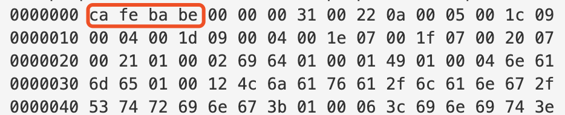

## minor_version、major_version
minor_version代表次版本号，有2个字节
major_version代表主版本号，有2个字节

虚拟机会拒绝执行超过他版本号的class文件

下图中次版本号为0x0000，主版本号为0x0031，代表十进制的49
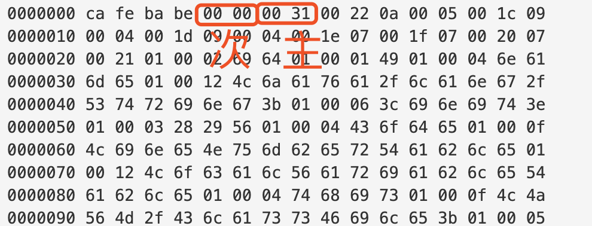

## constant_pool_count
constant_pool_count代表常量池容量的技术，有2个字节

Class文件中的计数只有常量池容量计数从1开始，索引值0代表不引用任何一个常量池项目

下图中值为0x0022,十进制为33，代表Class文件的常量池中有34项常量，索引为1-33
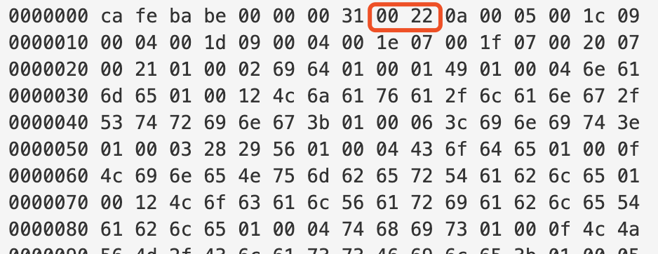

## constant_pool
constant_pool代表Class常量池，它存放两大类常量：字面量和符号引用。在Class文件中不会保存字段、方法的最终内存地址，需要在类加载时将Class常量池中的符号引用加载到运行时常量池中，再在类创建时解析成具体的内存地址，这样的过程叫动态连接的过程

字面量包括：
1. 文本字符串
2. 基本类型的值
3. 被声明为final的常量

符号引用包括：
1. 类和方法的全限定名
2. 字段的名称、描述符
3. 方法的名称、描述符

常量池中的每一项都是一个表，每个表都有各自的字段，但是每个表的第一个字段都是一个u1类型的标志位，代表这个常量是属于哪种类型
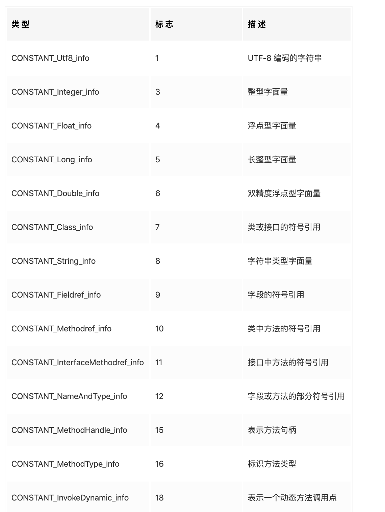


## access_flags
access_flags代表访问标志，有2个字节。识别类或接口的访问信息。包含：
1. 这个Class是类还是接口
2. 是否为public
3. 是否定义了abstract
4. 如果是类，是否声明了final


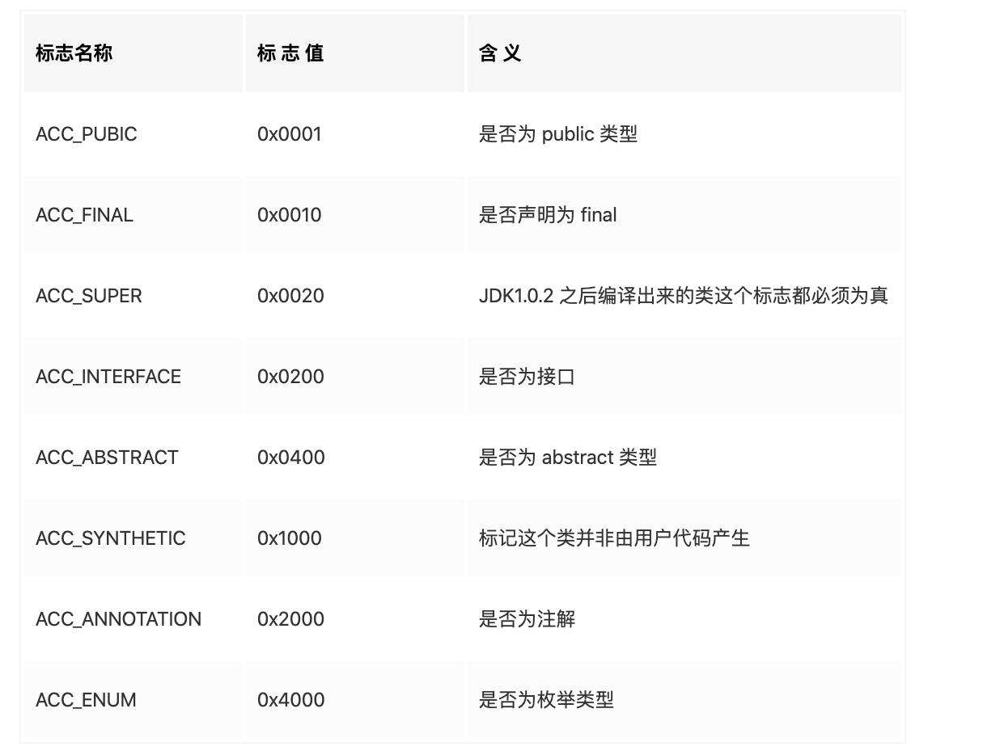

这是一个public的类，使用JDK1.2之后的编译期编译，所以ACC_PUBLIC和ACC_SUPER为真，其余都为假，所以access_flags为0x0001|0x0020=0x0021


## this_class、super_class、interfaces_count、interfaces
this_class代表类索引，有2个字节，用于确定这个类的全限定名；super_class代表父类索引，有2个字节，用于确定他的父类的全限定名
他们指向常量池中类型为CONSTANT_Class_info的类描述符常量，而通过CONSTANT_Class_info中的索引可以找到CONSTANT_Utf8_info常量中的全限定名字符串

interfaces_count代表接口索引表的容量，有2个字节。
interfaces代表接口索引表，描述这个类实现了哪些接口

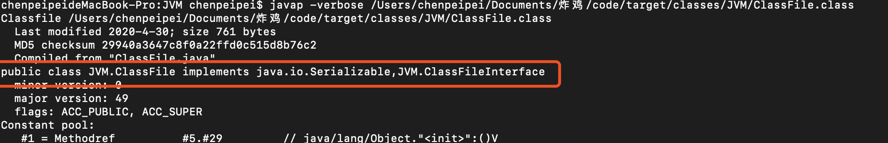

## fields_count、fields
fields_count代表字段表的容量，有2个字节
fields代表字段表，用来描述接口或类中声明的变量，包括类变量(static)或实例变量，但不包括方法中的局部变量

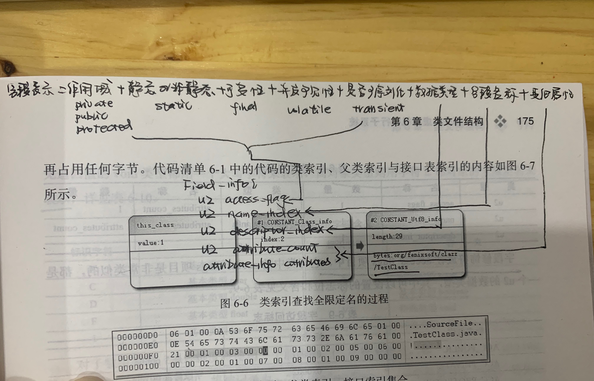

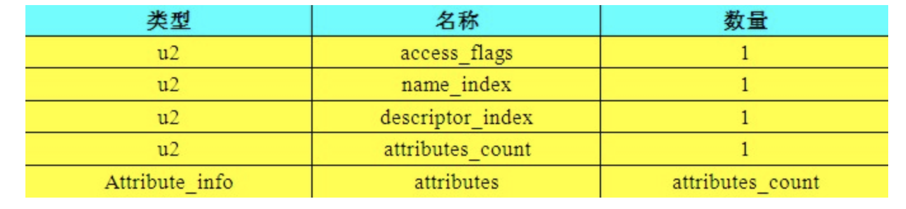

access_flag和类的访问标志差不多，定义了字段的如下内容：
1. 作用域：public、private、protected
2. 是类变量(static)还是实例变量
3. 可变性final
4. 并发可见性volatile
5. 是否可序列化transient

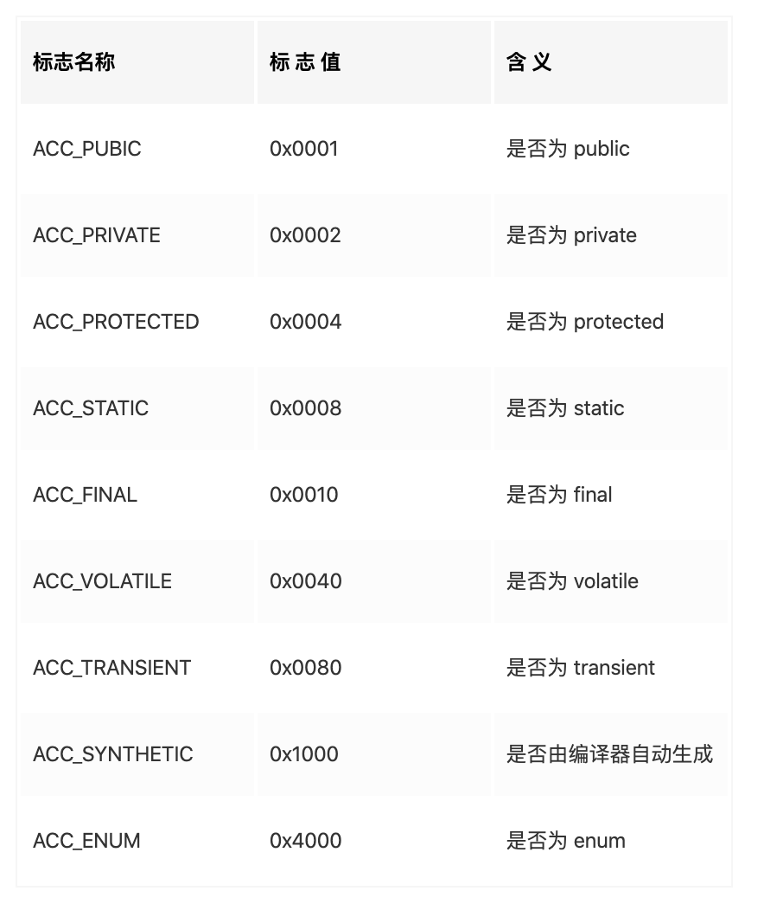


name_index代表字段或方法的简单名称，值为对常量池的引用。
全限定名称是包含包名的名称，例如"package/JVM/CompileTest;"
简单名称是没有类型和参数修饰的方法或字段名称，例如getId()方法和id字段的简单名称分别是getId和id

descriptor_index代表字段或方法的描述符，值为对常量池的引用
对于字段，描述符是描述字段的数据类型；对于方法，描述符是描述方法的参数列表(参数数量、类型、顺序)和返回值

对于基本数据类型(byte、char、double、float、int、long、short、boolean)和无返回值的void都用一个相应的大写字母表示，而对象类型用”字符L+对象全限定名称“来表示


对数组类型每一个维度都在最前面加一个[描述，例如java.lang.String[][]的描述符为"[[Ljava/lang/String;"

对方法的描述是先参数列表再返回值，，参数列表放在()中
例如:
```java
//()V
void inc()

//()Ljava/lang/String;
java.lang.String toString()

//([CII[CIII)I
int indexOf(char[] source, int sourceOfSet,int sourceCount, char[] target, int targetOfSet, int targetCount, int fromIndex)
```

attributes_count和attributes见下文
对于final static int m=123，属性表中会存在一个ConstantValue的属性来存放常量123


## methods_count、methods
用来描述方法表，方法表的内容和字段表一样。

不一样的是访问标志内容有一些不同
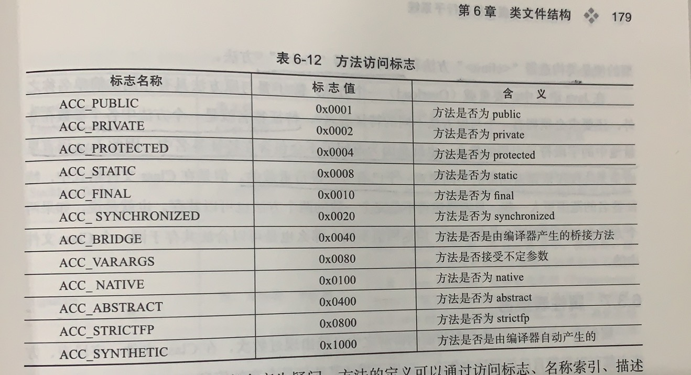

方法的代码被编译成字节码指令放入attributes属性表中一个名为"Code"的属性中了


## attributes
属性表不要求有顺序，只要求属性名不重复。每个属性都至少有一个attribute_name_index和attribute_length，attribute_name_index代表属性名称，是引用的常量池中CONSTANT_Utf8_info类型的常量
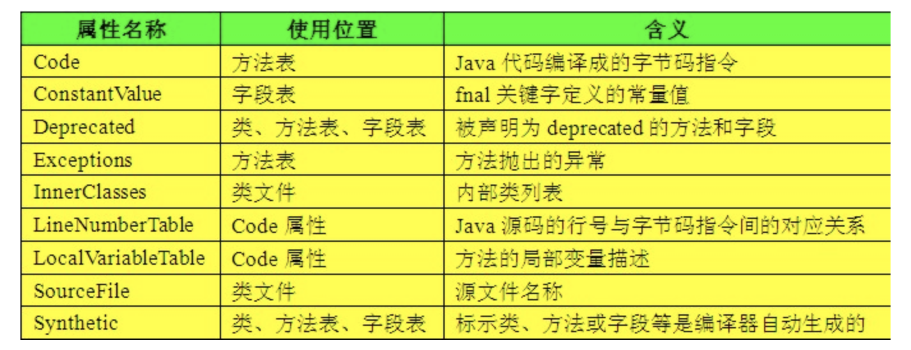

### Code属性
方法体经过编译之后变成字节码指令存在Code属性中

普通类的方法表的属性集合中存在Code，而接口和抽象类中的抽象方法没有

> attribute_name_index引用常量池中的CONSTANT_Utf8_info类型，固定值为"Code"

> attribute_length代表属性值的长度

> max_stack代表操作数栈深度的最大值，将根据这个分配栈帧的操作栈深度

>max_locals代表局部变量表所需要的空间

>code_length和code存储方法体被编译成的字节码指令。每个指令是u1的单字节。当虚拟机读到一个字节码，就可以找出该字节码对应的指令

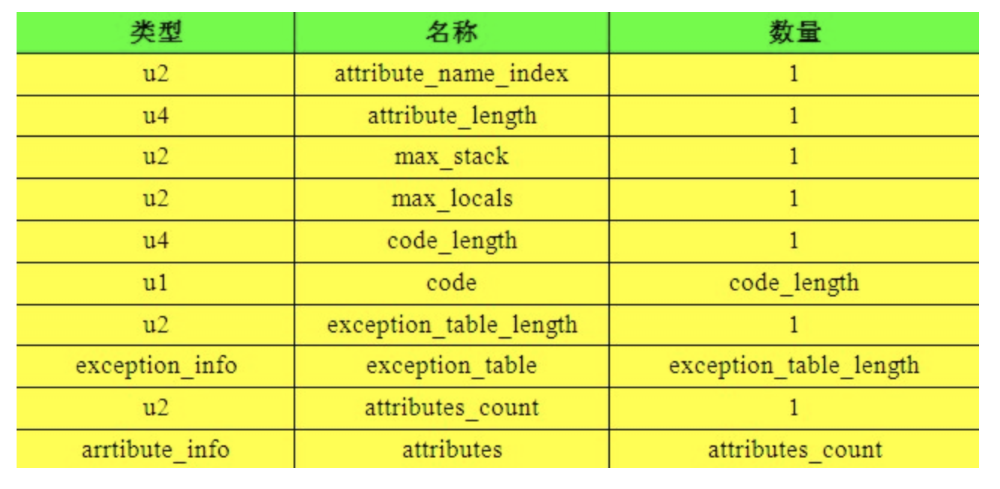
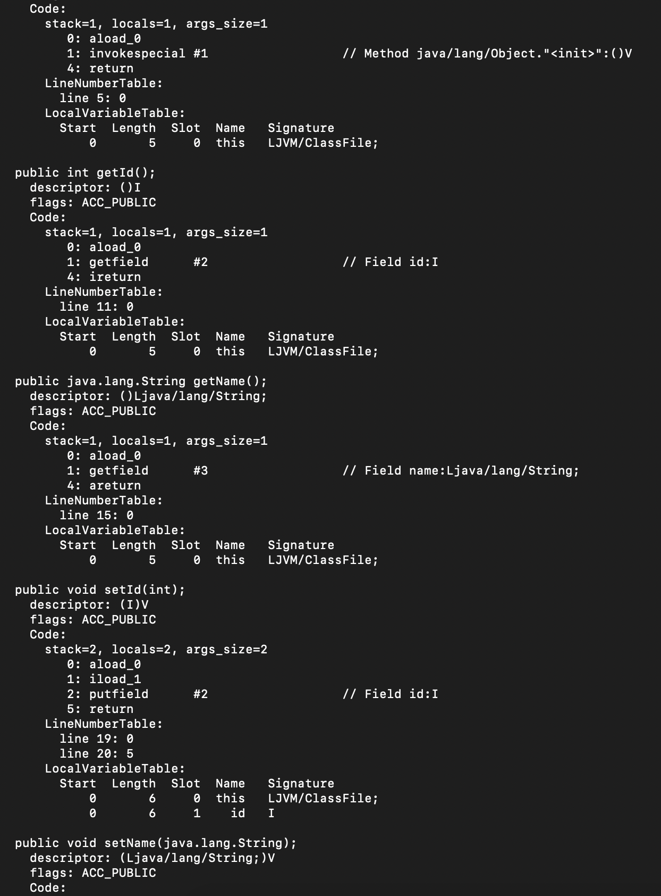

### LineNumberTable属性
用来描述Java源码中的行号与字节码行号之间的关系
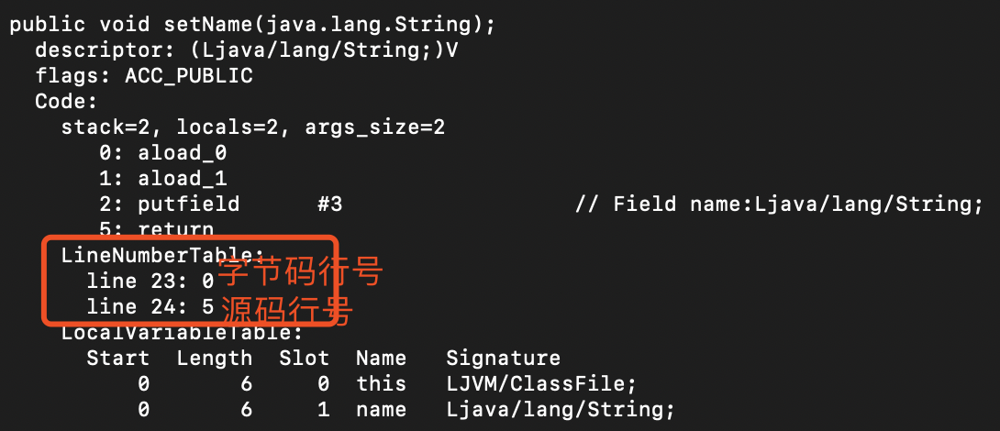

### LocalVariableTable属性
用来描述栈帧中的局部变量表中的变量与Java源码中定义的变量之间的关系


### SourceFile属性
用来描述生成这个class文件的源码文件名称


### ConstantValue属性
用于为static final变量进行赋值。static final变量在编译的时候就会被放入Class常量池中

constantvalue_index是对常量池中一个字面量常量的引用，字面量常量类型可以是：CONSTANT_Long_info、CONSTANT_Float_info、CONSTANT_Double_info、CONSTANT_Integer_info、CONSTANT_String_info、
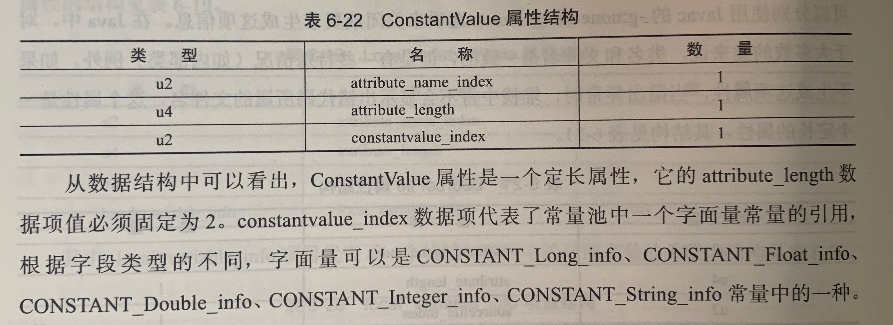


[init和clinit](./init和clinit.md)
对于非static变量(实例变量)的赋值是在类构造器<init>方法中进行的；
对于static变量(类变量)的赋值有两种方法：
1. 如果是static final的基本数据类型或String类型的变量，将生成ConstantValue并用于在类加载的准备阶段就进行赋值.例如static final int a=123会在准备阶段就赋值为123
2. 其余的static变量都在准备阶段进行初始化，而在类加载阶段的初始化阶段时执行clinit进行按代码意愿赋值。例如static int a=123会在准备阶段将a初始化为0，而在初始化阶段赋值为123


