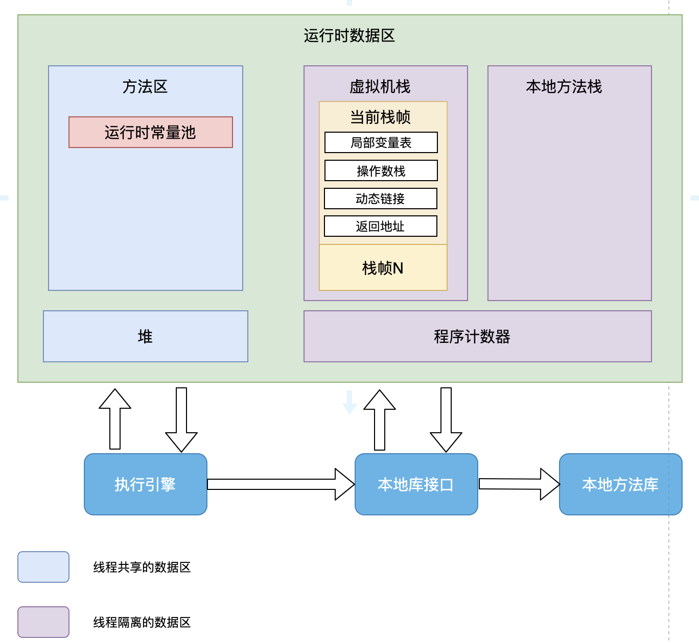
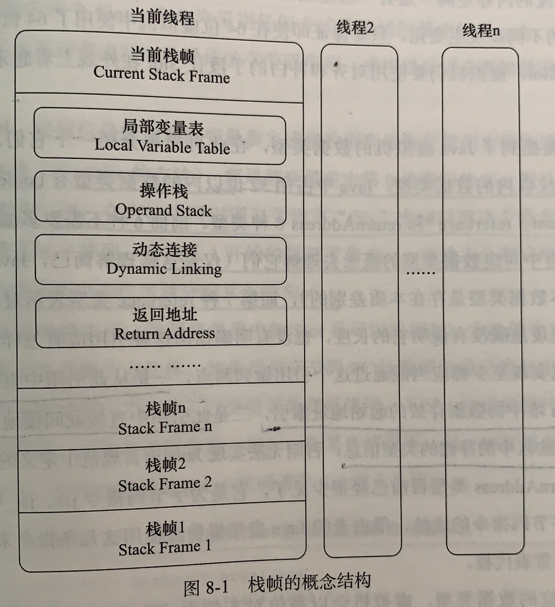
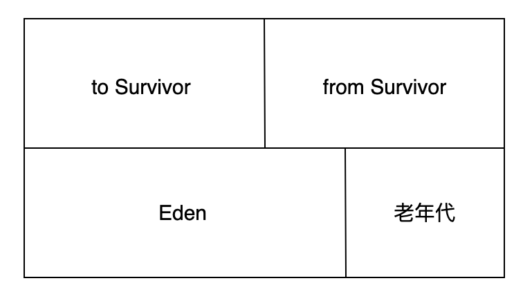

## 参考博文
[JVM-String常量池与运行时常量池](https://blog.csdn.net/Sugar_Rainbow/article/details/68150249)

[TOC]

# 1. 内存区域
方法区和堆是线程共享的内存区域；虚拟机栈、本地方法栈和程序计数器是线程私有的内存区域

方法区在加载阶段就被使用，其余在执行时才会被使用

## 1.1 程序计数器
1. 如果线程在运行Java方法，那他记录的是正在执行的虚拟机字节码指令的地址
2. 如果线程在运行native方法，那他记录的值为空

JVM内部维护，无OOM(OutOfMemoryError)

## 1.2 Java虚拟机栈
描述Java方法执行时的内存模型

每个方法从执行到结束都对应一个栈帧从入栈到出栈的过程，栈帧存放方法执行过程中的一些数据，包括局部变量表、操作数栈、动态链接和返回地址

在编译阶段，栈帧需要多大的局部变量表和多深的操作数栈都在方法被编译好后定义在方法表中的Code属性中，运行期间不会变 [Java内存区域](./Java内存区域.md)

在活动线程中，只有位于栈顶的当前栈帧有效，执行引擎运行的字节码指令只对当前栈帧操作

如果线程申请的栈深度大于虚拟机允许的深度，则抛出StackOverFlow
如果虚拟机栈扩展时没有足够的内存，则抛出OOM

### 局部变量表
局部变量表存放方法参数和方法内部定义的局部变量(基本数据类型或引用类型)
局部变量表以槽(slot)为单位存储：
1. 占用32位以内的数据类型使用1个slot：boolean、byte、char、short、int、float、
2. 占用64位的数据类型使用2个slot：long、double
reference类型与使用32位虚拟机还是64位虚拟机有关

虚拟机以索引定位的方式使用局部变量表，范围值为0~最大slot数量。对于32位数据类型，索引n嗲表使用第n个slot；而对于64位数据类型，会同时使用n和n+1两个slot，并且不允许单独访问其中的任何一个(否则会在类加载的校验阶段报错)

如果是实例方法(非static方法)，局部变量的第0位slot存放方法所属对象实例的引用(this关键字)，然后按顺序分配参数列表的slot，再分配方法内部局部变量的slot

针对方法参数中基本数据类型和引用数据类型是如何分配的，见 [值传递和引用传递](../Java基础/值传递和引用传递.md)

### 操作数栈

### 动态连接

### 方法返回地址

## 1.3 本地方法栈
和虚拟机栈类似，不过是描述本地方法

## 1.4 Java堆
存放对象实例的内存区域，GC的主要区域

分为新生代和老年代，新生代又分为Eden、from Survivor、to Survivor

为了更好的管理堆内存，或许还会分配出一部分区域作为线程私有的分配缓冲区(TLAB)

如果堆空间不够存放实例对象了，将抛出OOM

## 1.5 方法区
存储被加载的类信息、final常量，static静态变量、即时编译器(JIT)编译后的代码等

运行时常量池是方法区的一部分，在加载阶段，存放类加载后Class常量池的内容，包括编译期间生成的字面量或符号引用。在解析阶段，会将运行时常量池的符号引用转化为直接引用，解析过程中也会去查询字符串常量池

运行时常量池具有动态性，不仅可以存放编译期间的Class常量池的内容，在运行期间也可以将常量放入运行时常量池中，例如String.intern()方法

字面量包括：
1. 文本字符串
2. 基本类型的值
3. 被声明为final的常量

符号引用包括：
1. 类和方法的全限定名
2. 字段的名称、描述符
3. 方法的名称、描述符

当方法区的内存不够用时，将抛出OOM

# 2. Java的常量池
程序运行时，除非手动向常量池中添加常量(比如调用intern方法)，否则jvm不会自动添加常量到常量池
## 字符串常量池
存放字符串常量,JDK1.7后被移到堆里
[String](../java基础/String.md)

## Class常量池
每个Class文件有一个Class常量池，存放编译期编译产生的字面量和符号引用

## 运行时常量池
Class常量池被加载到内存后的版本