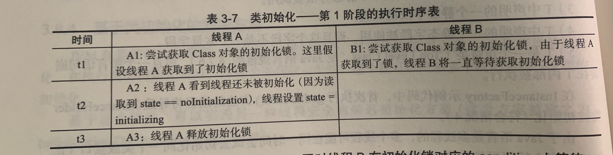
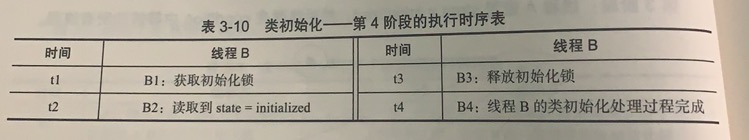
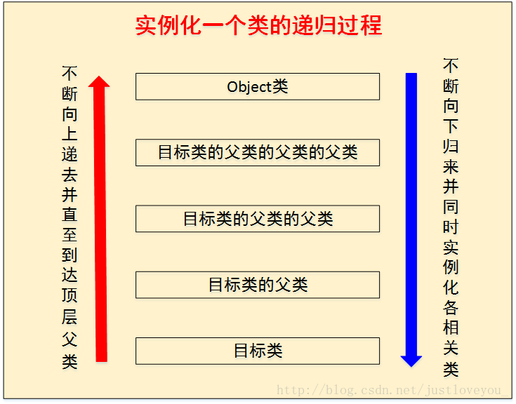
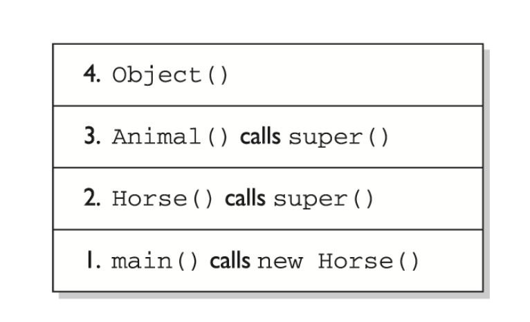

## 参考博文
[深入理解jvm--Java中init和clinit区别完全解析](https://blog.csdn.net/u013309870/article/details/72975536)


[TOC]

这两个方法都是在编译时的字节码生成阶段添加到语法树当中

# clinit
类构造器在加载过程中的==初始化阶段==执行，对static变量和static代码块进行赋值

1. clinit是由编译器按语句在源文件中的顺序收集static变量和static代码块产生的。对于static代码块，只能访问定义在它之前的static变量，对于定义在他后面的只能赋值不能访问
```java
public class Test{
static{
i=0；//给变量赋值可以正常编译通过
System.out.print（i）；//这句编译器会提示"非法向前引用"
}
static int i=1；
}
```

2. JVM会保证父类的clinit一定在子类的clinit执行之前执行。所以有以下执行内容和执行顺序。
>1. 父类静态变量、
>2. 父类静态代码块、
>3. 子类静态变量、
>4. 子类静态代码块、


## 多线程的初始化安全
虚拟机能保证一个类的clinit方法在多线程环境中能正确的加锁、同步。每个类或接口都有一个唯一的初始化锁LC，线程在初始化前会先获得这个锁，并且每个线程都至少获取释放一次来保证这个类被初始化过
1. 某个Class对象还没被初始化，state=noInitialization,线程A和B同时去初始化。A获得了锁，A将设置state=initializing并释放锁。B等待


2. A执行初始化过程。B获取到初始化锁，看到state=initializing后释放锁，在锁的condition中等待


3. A初始化完成后获取初始化锁，设置state=initialized并唤醒在condition中等待的线程，然后释放锁。A的初始化处理过程完成。


4. B获得初始化锁，读到state=initialized后释放锁，B的初始化处理过程完成。



# init
[对象创建过程](./对象创建过程.md)
实例构造器，构造函数会被编译成init方法，对非static变量进行赋值



init有以下执行内容和执行顺序：
>1. 父类非静态变量（父类实例成员变量）、
>2. 父类语句块、
>3. 父类构造函数、
>4. 子类非静态变量（子类实例成员变量）、
>5. 子类语句块、
>8. 子类构造函数

可以将以上步骤划分为3块：实例变量初始化、实例代码块初始化和构造函数初始化

## 实例变量初始化和实例代码块初始化
对类中定义的实例变量，可以在声明时直接赋值，也可以在代码块中赋值。这两个初始化一定是在构造函数之前执行。

但在编译过程中，编译器其实将这两部分代码放入了构造函数。放在调用父类构造函数之后(super)，在构造函数原有代码之前
```java
public static void tempAndBlock() {
        InstanceVariableInitializer a =new InstanceVariableInitializer(8);
}

    /**
     * 测试实例变量初始化和代码块初始化
     */
    public static class InstanceVariableInitializer {

        private int i = 1;
        private int j = i + 1;

        public InstanceVariableInitializer(int var) {
            System.out.println(i);
            System.out.println(j);
            this.i = var;
            System.out.println(i);
            System.out.println(j);
        }

        {               // 实例代码块
            j += 3;

        }
    }
//输出结果
/*
1
5
8
5
*/
```

虚拟机按照编写顺序执行这两部分的初始化，但是不允许使用定义在它后面的变量。以下两种情况都会编译不通过
```java
public class InstanceInitializer {  
    {  
        j = i;  
    }  

    private int i = 1;  
    private int j;  
}  

public class InstanceInitializer {  
    private int j = i;  
    private int i = 1;  
}  
```

## 构造函数初始化
构造函数的第一条语句必须是调用类中其他构造函数或者父类构造函数(super())，如果两者都没有显示调用，那么编译器会自动生成一个super()来调用父类构造函数，保证在父类一定在子类前实例化

如果在一个构造函数A中调用了另一个构造函数B，那么只允许B调用父类的构造函数。以下两种情况都不能通过编译
```java
public class ConstructorExample {  
    private int i;  

    ConstructorExample() {  
        super();
        this(1);//call this() must be first statement in a constructor
    }  

    ConstructorExample(int i) {   
        this.i = i;  
    }  
}


public class ConstructorExample {  
    private int i;  

    ConstructorExample() {  
        this(1); 
        super(); //call spuer() must be first statement in a constructor
    }  

    ConstructorExample(int i) {   
        this.i = i;  
    }  
}
```

## 举例
```java
    /**
     * 整体举例
     * 父类
     */
    static class Foo {
        int i = 1;

        Foo() {
            System.out.println(i); //(1)
            int x = getValue();
            System.out.println(x); //(2)
        }

        {
            i = 2;
        }

        protected int getValue() {
            return i;
        }
    }

    //子类
    static class Bar extends Foo {
        int j = 1;

        Bar() {
            j = 2;
        }

        {
            j = 3;
        }

        @Override
        protected int getValue() {
            return j;
        }
    }

    public static void test() {
        Bar bar = new Bar();
        System.out.println(bar.getValue());  //(3)
    }
    //结果
    /*
     2
     0
     2
    */
```
上述代码可以被改写成：
```java
    //Foo类构造函数的等价变换：
    Foo() {
        i = 1;
        i = 2;
        System.out.println(i);
        int x = getValue();
        System.out.println(x);
    }

   //Bar类构造函数的等价变换
    Bar() {
        Foo();
        j = 1;
        j = 3;
        j = 2
    }
```

1. 执行Bar bar = new Bar()，首先会调用父类的构造方法，所以(1)出打印2
2. int x = getValue()中的getValue()被子类重写成return j，而子类的构造方法还没执行，所以(2)处打印0
3. 执行System.out.println(bar.getValue())，经过子类的构造后，(3)处打印2



构造函数的第一条语句必须是super()或者使用this()调用自己的其他构造函数。
如果父类没有无参构造函数，那么编译器不能自动生成super()，那么需要我们手动super调用父类的有参构造函数或者使用this调用自己的其他构造函数