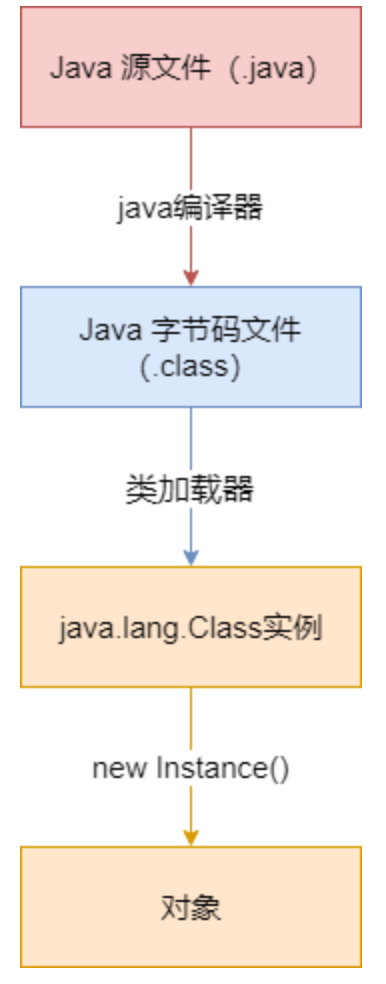

[TOC]

# 第二章 Java内存区域与内存溢出异常
[Java内存区域](./Java内存区域.md)

# 第三章 垃圾收集器和内存分配策略
[垃圾收集器](./垃圾收集器.md)
[堆内存分配策略](./堆内存分配策略.md)

# 第六章 类文件结构
[Class文件结构](./Class文件结构.md)

# 第七章 虚拟机类加载机制
[类加载机制](./类加载机制.md)

# 第八章 虚拟机字节码执行引擎
[类执行过程](./类执行过程.md)

# 第十章 编译期优化
[Java类的编译-加载-执行](./Java类的编译-加载-执行.md) 的1. 源码编译过程部分

# 第十一章 运行期优化
[源码编译过程](./源码编译过程.md)

# Java类的编译-加载-执行
[Java类的编译-加载-执行](./Java类的编译-加载-执行.md)

