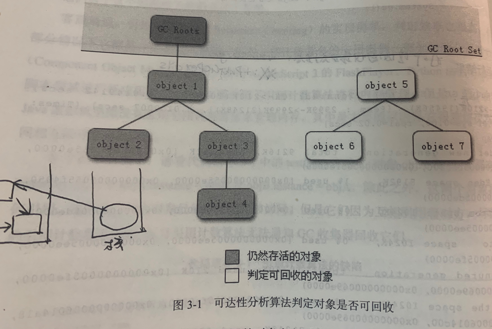
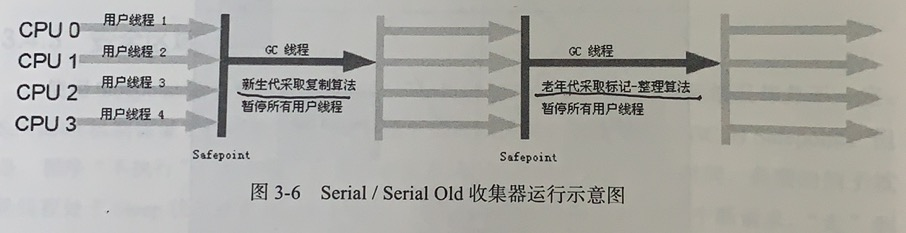
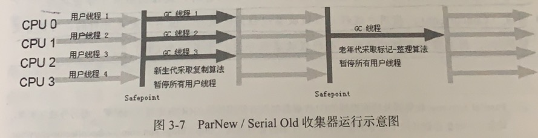
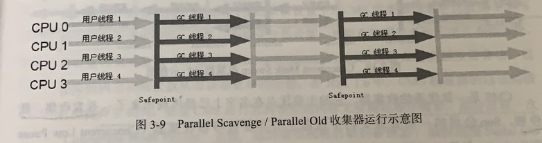
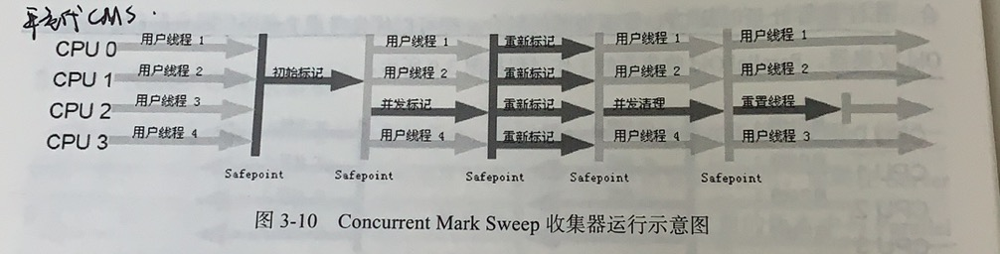

## 参考博文
[JVM GC 日志详解](https://juejin.im/post/5c80b0f451882532cd57b541)
[JVM内存管理及GC机制](https://blog.csdn.net/suifeng3051/article/details/48292193)


[TOC]

垃圾收集主要针对的是堆内存和方法区

# 1. 判断对象是否存活
## 引用计数法
给对象添加一个计数器，每当有个地方引用它时，计数器加1；当引用失效时，计数器减1.当计数器为0时，对象就死去了

但是会存在循环引用的问题。a和b被赋值为null，不能再被引用。但是他们之间存在循环引用，通过引用计数器无法通知GC收集器回收他们
```java
//运行时，VM Option添加：-XX:+PrintGCDetails
public class GCTest {
    private Object instance = null;

    public static void main(String[] args) {
        circleReference();
    }

    /**
     * 测试引用计数法的循环引用问题
     */
    public static void circleReference() {
        GCTest a = new GCTest();
        GCTest b = new GCTest();
        a.instance = b;
        b.instance = a;

        a = null;
        b = null;

        System.gc();
    }
}
/*
Heap
 PSYoungGen      total 76288K, used 5244K [0x000000076ab00000, 0x0000000770000000, 0x00000007c0000000)
  eden space 65536K, 8% used [0x000000076ab00000,0x000000076b01f188,0x000000076eb00000)
  from space 10752K, 0% used [0x000000076f580000,0x000000076f580000,0x0000000770000000)
  to   space 10752K, 0% used [0x000000076eb00000,0x000000076eb00000,0x000000076f580000)
 ParOldGen       total 175104K, used 0K [0x00000006c0000000, 0x00000006cab00000, 0x000000076ab00000)
  object space 175104K, 0% used [0x00000006c0000000,0x00000006c0000000,0x00000006cab00000)
 Metaspace       used 3189K, capacity 4496K, committed 4864K, reserved 1056768K
  class space    used 354K, capacity 388K, committed 512K, reserved 1048576K
*/
```

## 可达性分析法
定义一系列对象作为起始点GC Roots，从GC Roots开始向下搜索，和其他对象之间的关系称为引用链，当某个对象和GC Roots之间没有引用链值，该对象已经死亡

java通过这种方法判断对象是否存活



可作为GC Roots的对象有：
1. 虚拟方法栈中局部变量表引用的对象
2. 本地方法栈中native方法引用的对象
3. 方法区中static属性引用的对象
4. 方法区中final常量引用的对象

## 标记对象的死亡
对象要经历两次标记过程，才会被GC回收：
1. 第一次标记：

在进行可达性分析后，如果对象没有和GC Roots有引用链，将被第一次标记

2. 筛选：

对标记的对象进行筛选，筛选条件是该对象是否能执行finalize()方法。如果该对象没有覆盖finalize()方法或者finalize()方法已经被调用过，则没有必要执行

如果有必要执行，该对象会被放入一个F-Queue队列中，然后由一个虚拟机建立的、低优先级的Finalizer线程触发队列中对象的finalize()方法。finalize()方法是对象逃脱GC的最后一次机会，对象可以在finalize()方法中重新与引用链上任何一个对象建立关系就可以逃脱第二次标记，被移除GC集合

3. 第二次标记：

对F-Queue队列中的对象进行第二次可达性分析然后标记。经过第二次标记的对象将被GC


# 2. 方法区的回收
方法区的回收包含两部分内容：
1. 废弃常量
如果有一个字符串"abc",假如没有任何一个String对象引用他， 它将被移除常量池。常量池中的方法、字段的符号引用也是如此

2. 无用的类
无用的类要同时满足三个条件：
(1) 堆中不存在该类的任何实例，所有该类的实例都被回收了
(2) 加载该类的classloader已经被回收
(3) 该类的对应的java.lang.Class对象没有在任何地方被引用


# 3. 垃圾回收算法
## 3.1 标记-清除算法
该算法分为两个阶段进行GC：
1. 标记阶段
使用可达性分析法从GC Roots开始标记不存在引用的对象

2. 清除阶段
统一回收所有被标记的对象

该方法存在的问题是清除阶段完成后，会产生大量的内存碎片。当需要为大对象分配堆内存时，会找不到足够的连续内存而提前触发一次GC

## 3.2 复制算法
虚拟机使用该方式来回收新生代内存，因为新生代存活率低，复制操作较少

将堆中新生代内存分成Eden空间和两块Survivor空间，每次只使用Eden和其中一块Survivor。将对象进行标记后，将存活对象复制到另一块Survivor空间，然后一次性清理使用过的Eden和Survivor空间。
对象没被移到Survivor一次，他的年龄计数器就加1 [堆内存分配策略](./堆内存分配策略.md)

如果存活对象很多，Survivor空间不够用，将通过分配担保进制将对象移入老年代中


## 3.3 标记-整理算法
适合清除老年代对象，老年代对象存活较久

该算法分为两个阶段进行GC：
1. 标记阶段
和标记-清除算法一样

2. 整理阶段
将存活对象向一端移动，在内存中次序排列，然后清理掉边界外的内存。

## 3.4 分代收集算法
根据堆中老年代和新生代的特点采用不同算法：
1. 新生代：每次GC都有大批对象死去，适合采用复制算法。只需复制少量存活的对象
2. 老年代：对象存活率高，没有额外足够的空间对他进行分配担保，适合标记-清除或标记-整理算法


# 4. 垃圾收集器
- 并行：多条垃圾回收线程同时操作，用户线程仍处于等待状态
- 并发：垃圾回收线程与用户线程一起操作


## 4.1 分类
垃圾收集器|运行方式|垃圾收集算法|运用区域
---|---|---|--|
Serial|串行GC|复制|Client模式下新生代垃圾
ParNew|并行GC|复制|Server模式下新生代垃圾
Parallel Scavenge|并行GC|复制|新生代垃圾(关注吞吐量)
Serial Old|串行GC|标记-整理|Client模式下老年代垃圾
Parallel Old|并行GC|标记-整理|老年代垃圾
CMS|并发GC|标记-清除|老年代垃圾(关注最短回收停顿时间)
G1|并行与并发|整体：标记-整理；局部：复制|独立完成垃圾回收

## 4.2 组合
### Serial/Serial Old
- 新生代Serial收集器采用单个GC线程实现"复制"算法（包括扫描、复制）
- 老年代Serial Old收集器采用单个GC线程实现"标记-整理"算法
- Serial与Serial Old都会暂停所有用户线程（即STW）
- 适用场合：CPU核数<2，物理内存<2G的机器（简单来讲，单CPU，新生代空间较小且对STW时间要求不高的情况下使用）
- -XX:UseSerialGC：强制使用该GC组合
- -XX:PrintGCApplicationStoppedTime：查看STW时间




### ParNew/Serial Old
- ParNew除了采用多GC线程来实现复制算法以外，其他都与Serial一样，但是此组合中的Serial Old又是一个单GC线程，所以该组合是一个比较尴尬的组合，在单CPU情况下没有Serial/Serial Old速度快（因为ParNew多线程需要切换），在多CPU情况下又没有之后的三种组合快（因为Serial Old是单GC线程），所以使用其实不多
- -XX:ParallelGCThreads：指定ParNew GC线程的数量，默认与CPU核数相同，该参数在于CMS GC组合时，也可能会用到



### Parallel Scavenge/Parallel Old
- 新生代Parallel Scavenge收集器采用多个GC线程实现"复制"算法（包括扫描、复制）
- 老年代Parallel Old收集器采用多个GC线程实现"标记-整理"算法
- Parallel Scavenge与Parallel Old都会暂停所有用户线程（即STW）
- 说明
  - 吞吐量：CPU运行代码时间/(CPU运行代码时间+GC时间)
  - CMS主要注重STW的缩短（该时间越短，用户体验越好，所以主要用于处理很多的交互任务的情况）
  - Parallel Scavenge/Parallel Old主要注重吞吐量（吞吐量越大，说明CPU利用率越高，所以主要用于处理很多的CPU计算任务而用户交互任务较少的情况）
- 参数设置
  - -XX:+UseParallelOldGC：使用该GC组合
  - -XX:GCTimeRatio：直接设置吞吐量大小，假设设为19，则允许的最大GC时间占总时间的1/(1+19)，默认值为99，即1/(1+99)
  - -XX:MaxGCPauseMillis：最大GC停顿时间，该参数并非越小越好
  - -XX:+UseAdaptiveSizePolicy：开启该参数，-Xmn/-XX:SurvivorRatio/-XX:PretenureSizeThreshold这些参数就不起作用了，虚拟机会自动收集监控信息，动态调整这些参数以提供最合适的的停顿时间或者最大的吞吐量（GC自适应调节策略），而我们需要设置的就是-Xmx，-XX:+UseParallelOldGC或-XX:GCTimeRatio两个参数就好（当然-Xms也指定上与-Xmx相同就好）



### ParNew/CMS
- 年轻代ParNew收集器采用多个GC线程实现"复制"算法（包括扫描、复制）
- 老年代CMS收集器采用多线程实现"标记-清除"算法
  - 初始标记：标记与根集合节点直接关联的节点。时间非常短，需要STW
  - 并发标记：遍历之前标记到的关联节点，继续向下标记所有存活节点。时间较长。
  - 重新标记：重新遍历trace并发期间修改过的引用关系对象。时间介于初始标记与并发标记之间，通常不会很长。需要STW
  - 并发清理：直接清除非存活对象，清理之后，将该线程占用的CPU切换给用户线程



### G1
- G1与CMS相比，仅在最后的"筛选回收"部分不同（CMS是并发清除），实际上G1回收器的整个堆内存的划分都与其他收集器不同。
- CMS需要配合ParNew，G1可单独回收整个空间
- 原理
  - G1收集器将整个堆划分为多个大小相等的Region
  - G1跟踪各个region里面的垃圾堆积的价值（回收后所获得的空间大小以及回收所需时间长短的经验值），在后台维护一张优先列表，每次根据允许的收集时间，优先回收价值最大的region，这种思路：在指定的时间内，扫描部分最有价值的region（而不是扫描整个堆内存）并回收，做到尽可能的在有限的时间内获取尽可能高的收集效率。
- 运作流程
  - 初始标记：标记出所有与根节点直接关联引用对象。需要STW
  - 并发标记：遍历之前标记到的关联节点，继续向下标记所有存活节点。
在此期间所有变化引用关系的对象，都会被记录在Remember Set Logs中
  - 最终标记：标记在并发标记期间，新产生的垃圾。需要STW
  - 筛选回收：根据用户指定的期望回收时间回收价值较大的对象（看"原理"第二条）。需要STW  
- 优点
  - 停顿时间可以预测：我们指定时间，在指定时间内只回收部分价值最大的空间，而CMS需要扫描整个年老代，无法预测停顿时间
  - 无内存碎片：垃圾回收后会整合空间，CMS采用"标记-清理"算法，存在内存碎片
  - 筛选回收阶段：
    - 由于只回收部分region，所以STW时间我们可控，所以不需要与用户线程并发争抢CPU资源，而CMS并发清理需要占据一部分的CPU，会降低吞吐量
    - 由于STW，所以不会产生"浮动垃圾"（即CMS在并发清理阶段产生的无法回收的垃圾）


# 5. GC分类
## minor GC
发生在新生代的GC，当Eden区满时GC

## major GC/full GC
发生在老年代的GC

什么情况下full GC：
1. 调用System.gc()时
2. 堆中老年代空间不足时
3. 方法区空间不足时
4. 空间分配担保某些情况下[分配担保](#7-分配担保)

# 6. 理解GC日志
## 6.1 GC日志参数
```
-XX:+PrintGC 输出简要GC日志 
-XX:+PrintGCDetails 输出详细GC日志 
-Xloggc:gc.log  输出GC日志到文件
-XX:+PrintGCTimeStamps 输出GC的时间戳（以JVM启动到当期的总时长的时间戳形式） 
-XX:+PrintGCDateStamps 输出GC的时间戳（以日期的形式，如 2013-05-04T21:53:59.234+0800） 
-XX:+PrintHeapAtGC 在进行GC的前后打印出堆的信息
-verbose:gc
-XX:+PrintReferenceGC 打印年轻代各个引用的数量以及时长
```

### -XX:+PrintGC与-verbose:gc
```java
//GC和Full GC用来区分垃圾收集的停顿类型，而不是区分新生代和老年代。如果是Full,代表发生了stop the world
/*
3933K->536K(251392K)代表：GC前该内存区域已使用容量->GC后该内存区域已使用容量(该内存区域总容量)

0.0016206 secs代表：该内存区域GC花了多少时间
*/
[GC (System.gc())  3933K->536K(251392K), 0.0016206 secs]
[Full GC (System.gc())  536K->390K(251392K), 0.0042483 secs]
```
### -XX:+PrintGCDetails
```java
/*
PSYoungGen表示GC发生的区域名字，由收集器决定：
1. Serial收集器的新生代名：DefNew(Default New Generation)
2. ParNew收集器的新生代名：Parallel New Generation(ParNew)
3. Parallel Scanvenge收集器的新生代名：PSYoungGen

方括号内部的3933K->560K(76288K)代表：GC前该内存区域已使用容量->GC后该内存区域已使用容量(该内存区域总容量)

方括号外部的3933K->568K(251392K)代表：GC前Java堆已使用容量->GC后Java堆已使用容量(Java堆总容量)

后面的0.0012679 secs代表该区域GC花费的时间

[Times: user=0.01 sys=0.00, real=0.00 secs] 代表：
用户态消耗的CPU时间、内核态消耗CPU时间、操作从开始到结束经过的墙钟时间
墙钟时间是包含非运算的等待耗时(例如等待磁盘IO、等待线程阻塞)
*/
[GC (System.gc()) [PSYoungGen: 3933K->560K(76288K)] 3933K->568K(251392K), 0.0012679 secs] [Times: user=0.01 sys=0.00, real=0.00 secs] 
[Full GC (System.gc()) [PSYoungGen: 560K->0K(76288K)] [ParOldGen: 8K->390K(175104K)] 568K->390K(251392K), [Metaspace: 3136K->3136K(1056768K)], 0.0039963 secs] [Times: user=0.01 sys=0.00, real=0.01 secs] 
Heap
 PSYoungGen      total 76288K, used 655K [0x000000076ab00000, 0x0000000770000000, 0x00000007c0000000)
  eden space 65536K, 1% used [0x000000076ab00000,0x000000076aba3ee8,0x000000076eb00000)
  from space 10752K, 0% used [0x000000076eb00000,0x000000076eb00000,0x000000076f580000)
  to   space 10752K, 0% used [0x000000076f580000,0x000000076f580000,0x0000000770000000)
 ParOldGen       total 175104K, used 390K [0x00000006c0000000, 0x00000006cab00000, 0x000000076ab00000)
  object space 175104K, 0% used [0x00000006c0000000,0x00000006c0061b20,0x00000006cab00000)
 Metaspace       used 3143K, capacity 4496K, committed 4864K, reserved 1056768K
  class space    used 346K, capacity 388K, committed 512K, reserved 1048576K
```

# 6. 堆内存分配策略
[堆内存分配策略](./堆内存分配策略.md)


# 7. 分配担保
在minor GC前，将检查老年代最大可用的连续空间是否大于新生代所有对象总空间
1. 如果大于，则minor GC安全
2. 如果小于，查看HandlePromotionFailure设置值是否允许担保失败
   2.1 如果不允许，改为进行一次full GC
   2.2 如果允许,检查老年代最大可用的连续空间是否大于历次晋升到老年代对象的平均大小
       2.2.1 如果大于,冒险尝试进行minor GC
       2.2.2 如果小于，改为进行一次full GC

冒险尝试进行minor GC是指：
在使用复制算法GC时，当Survivor空间不足，某些对象要进入老年代。。前提是老年代本身还有空间容纳这些对象，但是有多少对象会活下来在实际完成内存回收前是不知道的，所以就取历次晋升到老年代对象的平均大小作为经验值