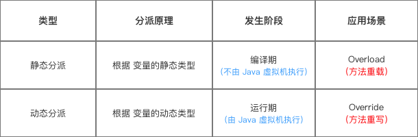

## 参考博文
[JVM之坑：深入理解Java解析和分派](https://blog.csdn.net/qq_32331073/article/details/80402979)
[Java虚拟机：手把手带你深入解析 - 静态分派 & 动态分派原理](https://cloud.tencent.com/developer/article/1572165)


[TOC]


当源码文件被编译成class文件时，所有方法的在class文件中都是符号引用。当class文件被加载到运行时常量池后，符号引用转换成直接引用有两种类型：
1. 静态解析：类加载的解析阶段转换 ([类加载机制](./类加载机制.md))
2. 动态解析(连接)：在运行期间转换


# 1. 方法调用
方法调用不等同方法执行。方法调用的任务是确定调用哪一个版本的方法。

在运行时，方法调用的字节码指令就以运行时常量池中方法的符号引用作为参数，虚拟机有5条方法调用的字节码指令：
1. invokestatic：调用静态方法
2. invokespecial：调用实例构造器init方法、私有方法和父类方法
3. invokevirtual：调用所有的虚方法，虚方法指除了静态方法、实例构造器、私有方法、父类方法、final方法的其他所有方法。但是final方法也是使用invokevirtual指令调用的
3. invokeinterface：调用接口方法，在运行时才确定实现接口的对象
4. invokedynamic：在运行时先解析出调用的方法，然后才去执行

根据方法是否有多个版本，可将方法调用分为两类：
1. 解析
2. 分派

## 1.1 解析调用
符合"编译器可知，运行期不可变"的方法，即程序只有一个确定的调用版本，并且在运行期间不会变。

解析调用一定是静态连接的过程，在类加载的解析阶段就会把方法的符号引用转换成直接引用

使用静态解析的方法是所有的非虚方法：
1. 能被invokestatic、invokespecial指令调用的方法，包括静态方法、实例构造函数、私有方法、父类方法
2. final方法

## 1.2 分派调用
分派是多态性的体现，一个方法会有多个版本。根据连接类型可以分为：
1. 静态分派：重载
2. 动态分派：重写



### 静态分派——重载
静态分派指的是在==编译阶段==根据参数的==静态类型==确定使用哪个版本的方法进行调用，由编译器执行。

对于重载，在编译阶段就能确定使用哪个方法进行调用，并将该方法的符号引用写到class文件中main方法的invokevirtual指令中。具体选择哪个方法取决于参数列表

重载发生在同一个类中多个方法之间的选择(同方法名、不同参数列表)，与返回值无关

DispatchTest中重载了sayHello方法，定义了两个静态类型都为Human的变量，最终选择的就是方法参数类型为Human的方法
```java
/**
 * 测试静态分派
 */
public class DispatchTest {

    public static void main(String[] args) {
        staticDispatch();
    }

    //静态分派
    public static void staticDispatch() {
        Human man = new Man();
        Human woman = new Woman();
        DispatchTest test = new DispatchTest();
        test.sayHello(man);
        test.sayHello(woman);
    }

    static abstract class Human {

    }

    static class Man extends Human {

    }

    static class Woman extends Human {

    }

    public void sayHello(Human guy) {
        System.out.println("hello guy");
    }

    public void sayHello(Man man) {
        System.out.println("hello man");
    }

    public void sayHello(Woman woman) {
        System.out.println("hello woman");
    }
}
/*
hello guy
hello guy
*/
```


### 动态分派——重写
动态分配指的是在==运行阶段==根据参数的==实际类型==确定使用哪个版本的方法进行调用，由虚拟机执行

重写发生在继承关系中，子类重写父类的方法。在编译阶段并不知道调用方法的对象实际类型是父类还是子类，所以只能在运行期间确定。具体选择哪个方法取决于调用者的实际类型

Man和Woman继承Human，并重写了sayHello方法。然后分别定义了实际类型分别为Man和Woman的变量，在调用这两个变量的sayHello时，根据实际类型选择的分别是Man和Woman中重写的方法
```java
package JVM;

/**
 * 测试静态分派和动态分派
 */
public class DispatchTest {

    public static void main(String[] args) {
        dynamicDispatch();
    }

    //动态分派
    public static void dynamicDispatch() {
        Human man = new Man();
        Human woman = new Woman();
        man.sayHello();
        woman.sayHello();
        man = new Woman();
        man.sayHello();
    }
    static abstract class Human {
        protected abstract void sayHello();
    }

    static class Man extends Human {
        protected void sayHello() {
            System.out.println("man say hello");
        }
    }

    static class Woman extends Human {
        protected void sayHello() {
            System.out.println("woman say hello");
        }
    }
}
/*
man say hello
woman say hello
woman say hello
*/
```

如果父类中有一个private方法，子类中定义了一个同名的方法，那么这个是定义的新方法，而不是重写。此时，如果子类对象引用的父类类型，那么调用的将是父类中的private方法
```java
public class Parent {
    private void f() {
        System.out.print("private f()");
    }
}

public class Children {
    //新定义的方法，没有重写父类的方法
    public void f() {
        System.out.print("public f()");
    }
}

public static void mian(String[] args) {
    Parent p = new Children();
    //输出：private f(
    p.f();
}
```


## 单分派和多分派
单分派是重载或重写只出现一个的情况，多分配是同时出现重载和重写的情况。


# 2. 静态类型和动态类型
```java
Human man = new Man();
```
Human是变量man的静态类型：
1. 就是man的引用类型
2. 静态类型的变化仅在使用变量man时通过强转发生，但是man本身的静态类型不会变
3. 变量的静态类型在定义该变量时就确定，所以静态类型在编译期就确定了
```java
//静态类型的变化
Human man = new Man();
sr.sayHello((Man)man);
sr.sayHello((Woman)man);
```

Man是man的实际类型：
1. 就是man的实例对象的类型
2. 变量本身的实例类型是可以变的，因为在运行前是没法连接所有语句的，说不定下一句就是重新new一个实例类型赋值给变量。所以在运行期才能确定实例类型是什么
```java
//实例类型的变化
Human man = new Man();
man = new Woman();
```

# 3. 连接

## 3.1 静态连接
在类加载到方法区后，有两种静态连接场景：
1. 在解析阶段将常量池中的一部分符号引用解析成直接引用(方法在内存中的入口地址)
2. 只在第一次调用该方法时转换成直接引用，并在运行时常量池中记录结果，把常量标识成已解析状态


## 3.2 动态连接
为了支持方法调用过程中的动态连接，每个方法的栈帧都有一个引用指向运行常量池中它对应的方法

动态连接指的是在每一次运行期间，当实际调用到该方法的时候，将常量池中的方法引用转换成直接引用