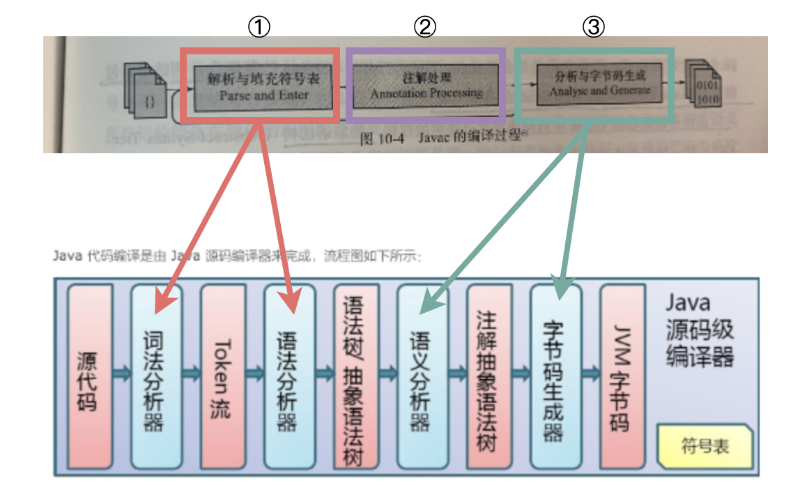

## 参考博文
[Java代码到底是如何编译成机器指令的](https://juejin.im/entry/5b441e5b5188251afb5c6b75)

[TOC]


# 1. 前端编译器(源码编译)


编译的入口是com.sun.tools.javac.main.JavaCompiler类，逻辑集中在compile()和compile2()两个方法中


## 1.1 解析与填充符号表
### (1)词法分析——标记集合
将源码中的字符流转变为标记(Token)集合。在源码中字符是最小单位，在编译过程中标记是最小单位。例如int a=b+2有6个标记，分别是int、a、=、b、+、2。

由com.sun.tools.javac.parser.Scanner实现
```shell
javac [ options ] [ sourcefiles ] [ @files ]
参数可按任意次序排列。

options:命令行选项。
sourcefiles:一个或多个要编译的源文件（例如 MyClass.java）。
@files:一个或多个对源文件进行列表的文件。
```

如果是在IDEA里面运行，.class文件都放在了/target/classes/里面


### (2)语法分析——抽象语法树
根据Token集合构造抽象语法树(AST),AST是描述代码语法结构的方式，树中每个节点都代表一个语法结构，例如包、类型、修饰符、运算符、接口、返回值等

由com.sun.tools.javac.parser.Parser实现，语法树由com.sun.tools.javac.tree.JCTree表示。

后面编译器的所有操作都针对抽象语法树

### (3)填充符号表
符号表是由一组符号地址和符号信息构成的K-V表格，将用于语义分析和生产中间代码，是对符号名分配地址的依据

由com.sun.tools.javac.comp.Enter类实现，返回一个待处理列表


## 1.2 注解处理
JDK1.6后提供了一组插入式注解处理器的API在编译期间对注解进行处理，而注解本身是在运行期间发挥作用

注解处理器可以读取、修改、添加抽象语法树中的元素，如果堆语法树进行了修改，编译器将重新执行解析与填充符号表过程，每一个这样的过程称为一个Round，直到所有处理器都不对语法树进行修改为止


## 1.3 分析与字节码生成
### (1)语义分析
判断源程序是否符合逻辑，例如一些类型检查。

例如数组下标必须为整数，如果使用浮点数作为下标，编译器就必须报错


#### 标注检查

检查变量使用前是否已经声明，变量与赋值之间的数据类型是否匹配，常量折叠等

在下面的赋值语句中，只有第1句int d=a+c;能通过语义分析
```java
int a=1;
boolean b=false;
char c=2;

int d=a+c;
int d=b+c;
char d=a+c
```

在下面的语句中，1+2在抽象语法树中会被折叠成3
```java
int a=1+2;
```

由com.sun.tools.javac.comp.Attr和com.sun.tools.javac.comp.Check类实现

#### 数据及控制流分析
检查局部变量使用前是否赋值、方法是否每个出口都有返回值等
由com.sun.tools.javac.comp.Flow类实现

#### 解语法糖
[语法糖](#语法糖)

### (2)生成字节码
将前面生成的语法树和符号表转化成字节码存在磁盘上，并进行少量的代码添加和转换工作
[Class文件结构](./Class文件结构.md)


# 2. 后端编译器
当某个方法或者某段代码被运行的很频繁时，他们会被认作热点代码。

即时编译器(JIT)会将这些代码对应的字节码编译成平台相关的机器码并进行优化，然后缓存起来执行，而不通过解释执行

当程序需要迅速启动运行时，使用解释器可以省去编译的时间，会更有优势。而随着程序的执行，使用编译器的优势会更大。

## C1和C2
HotSpot虚拟机中内置了client compiler(C1 编译器)和server compiler(C2编译器)

[类执行过程](./类执行过程.md)

## 热点代码
### 分类
被JIT认作热点代码的有两类：
1. 被多次调用的方法
2. 被多次执行的循环体

### 热点探测
根据两种方式检测热点代码：
1. 基于采样的热点探测：周期性检查虚拟机栈的栈顶，如果发现某些方法经常出现在栈顶，将他作为热点代码
2. 基于计数器的热点探测：给每个方法(或代码块)建立计数器，统计执行次数，如果超过一定阈值则被认为是热点代码。HotSpot使用这种方法


## 编译过程


## 编译优化技术


## 公共子表达式消除

## 数组边界检查消除

## 方法内联

## 逃逸分析
[发布与逸出](../线程与并发/发布与逸出.md)
逃逸是指在某个方法之内创建的对象，除了在方法体之内被引用之外，还在方法体之外被其它变量引用到；这样带来的后果是在该方法执行完毕之后，该方法中创建的对象将无法被GC回收，由于其被其它变量引用。正常的方法调用中，方法体中创建的对象将在执行完毕之后，将回收其中创建的对象；故由于无法回收，即成为逃逸

## 分析
逃逸分析的基本行为就是分析对象动态作用域

如果能证明一个对象不会逃逸到方法或线程外，则可能为这个变量进行一些高效的优化

如果开启了逃逸分析，即可将这些变量直接在栈上进行分配，而非堆上进行分配。这些变量的指针可以被全局所引用，或者被其它线程所引用

```
    /**
     * 无逃逸
     */
    void test01() {
        String test1 = "test1";
    }
```
```
    String test2;

    /**
     * 逃逸
     */
    void test02() {
        test2 = "test2";
    }
```

## 分类
- 方法逃逸

当一个对象在方法中被定义后，它可能被外部方法所引用，例如作为调用参数传递到其他地方中

```
//sb逃逸
public static StringBuffer craeteStringBuffer(String s1, String s2) {
    StringBuffer sb = new StringBuffer();
    sb.append(s1);
    sb.append(s2);
    return sb;
}
 
//sb没逃逸
public static String createStringBuffer(String s1, String s2) {
    StringBuffer sb = new StringBuffer();
    sb.append(s1);
    sb.append(s2);
    return sb.toString();
}

```


- 线程逃逸

还有可能被外部线程访问到，譬如赋值给类变量或可以在其他线程中访问的实例变量


## 参数指定
```
-XX:+DoEscapeAnalysis ： 表示开启逃逸分析

-XX:-DoEscapeAnalysis ： 表示关闭逃逸分析 从jdk 1.7开始已经默认开始逃逸分析，如需关闭，需要指定-XX:-DoEscapeAnalysis
```


# 语法糖
### 泛型与类型擦除
在编译后的字节码中，将泛型中的具体类型替换成了原生类型E，并在相应的地方做了类型强转

下面的两个重载方法无法编译通过，因为经过泛型擦除之后都变成了List<E>
```java
public void fanxing(List<String> list){
        
    }

    public void fanxing(List<Integer> list){

    }
```

### 自动装箱、拆箱与遍历循环
[自动拆箱与装箱](../java基础/自动拆箱与装箱.md)
Arrays.asList中的参数是可变参数，被编译成了数组类型的参数，并且把1，2，3，4调用了Integer.valueOf()方法包装成Integer

在遍历循环中，for循环被还原成迭代器的实现，所以被遍历的类要实现Iterable接口。并且每个数值又被调用intValue()方法拆箱成int
```java
    public void pack(){
        List<Integer> list = Arrays.asList(1,2,3,4);
        int sum = 0;
        for (int i : list) {
            sum += i;
        }
        System.out.println(sum);
    }
    /**
     * 经编译之后的代码
     */
    public void packJavac(){
        List list = Arrays.asList(new Integer[] {
                Integer.valueOf(1),
                Integer.valueOf(2),
                Integer.valueOf(3),
                Integer.valueOf(4)
        });
        int sum = 0;
        for (Iterator localIterator = list.iterator(); localIterator.hasNext();) {
            int i = ((Integer)localIterator.next()).intValue();
            sum += i;
        }
        System.out.println(sum);
    }
```
对于Integer的valueOf，JVM会在常量池中缓存-128到127之间的整数，所以任何在-128到127之间的整数的地址都是相同的，都是同一个引用。Integer、Short、Byte、Character、Long这几个类的valueOf方法的实现是类似的。

而Double、Float的valueOf方法的实现是类似的，他们不会有缓存

包装类的==在不遇到算数的情况下都不会自动拆箱，equals方法不处理数据类型转换
```java
public static void integerTest() {
        Integer a = 1;
        Integer b = 2;
        Integer c = 3;
        Integer d = 3;
        Integer e = 321;
        Integer f = 321;
        Long g = 3L;
        System.out.println(c == d);//T
        System.out.println(e == f);//F
        System.out.println(c == (a + b));//T
        System.out.println(c.equals(a + b));//T
        System.out.println(g == (a + b));//T
        System.out.println(g.equals(a + b));//F
    }
```

### 条件编译
只适用于条件为常量的if语句，对于其他例如while(true)就不能编译
```java
public void ifTest() {
        if (true) {
            System.out.println("t");
        } else {
            System.out.println("f");
        }
}

//会被编译成
public void ifTest() {
    System.out.println("t");
}
```