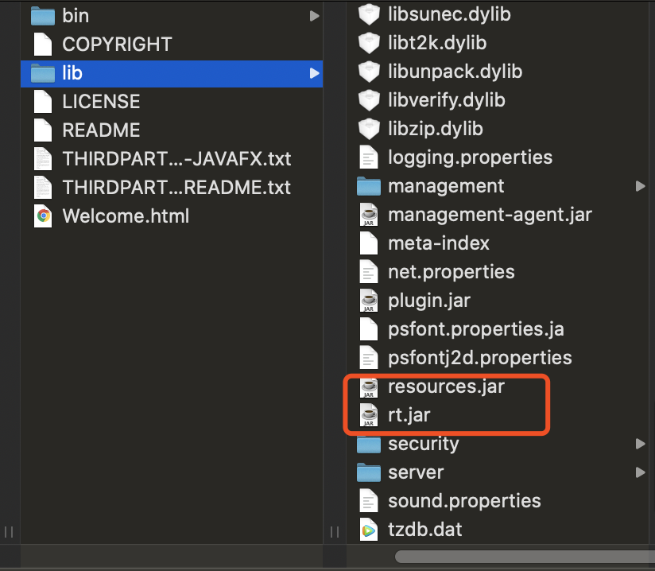
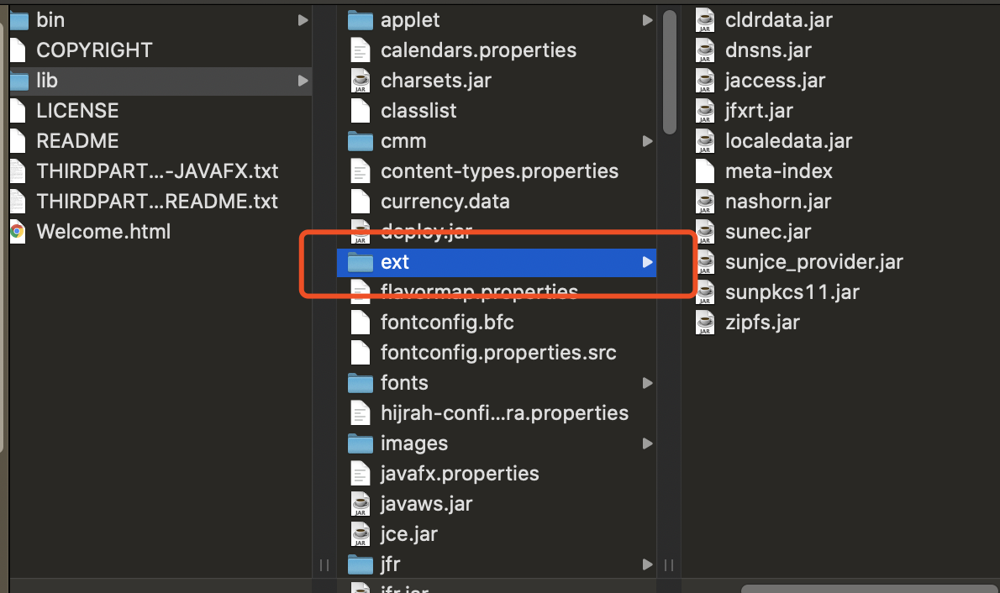
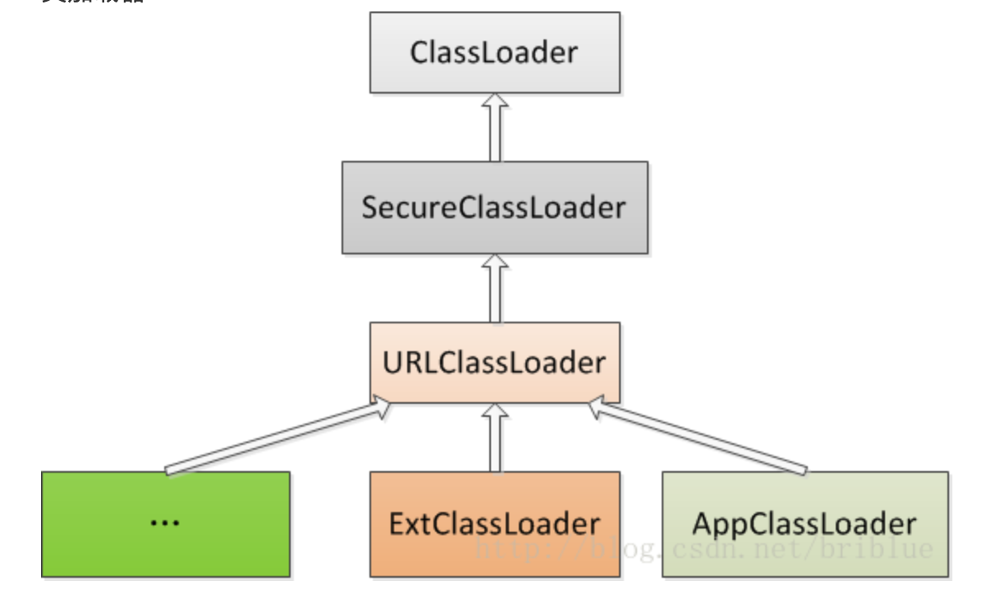
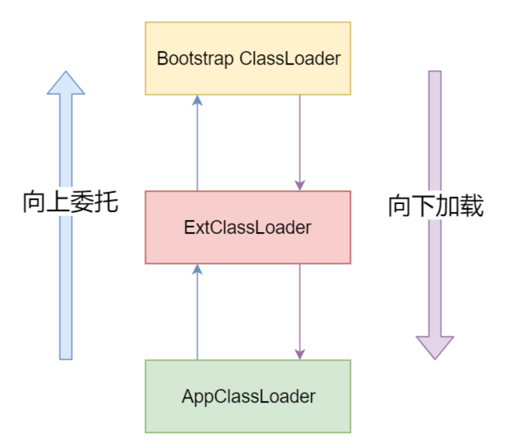
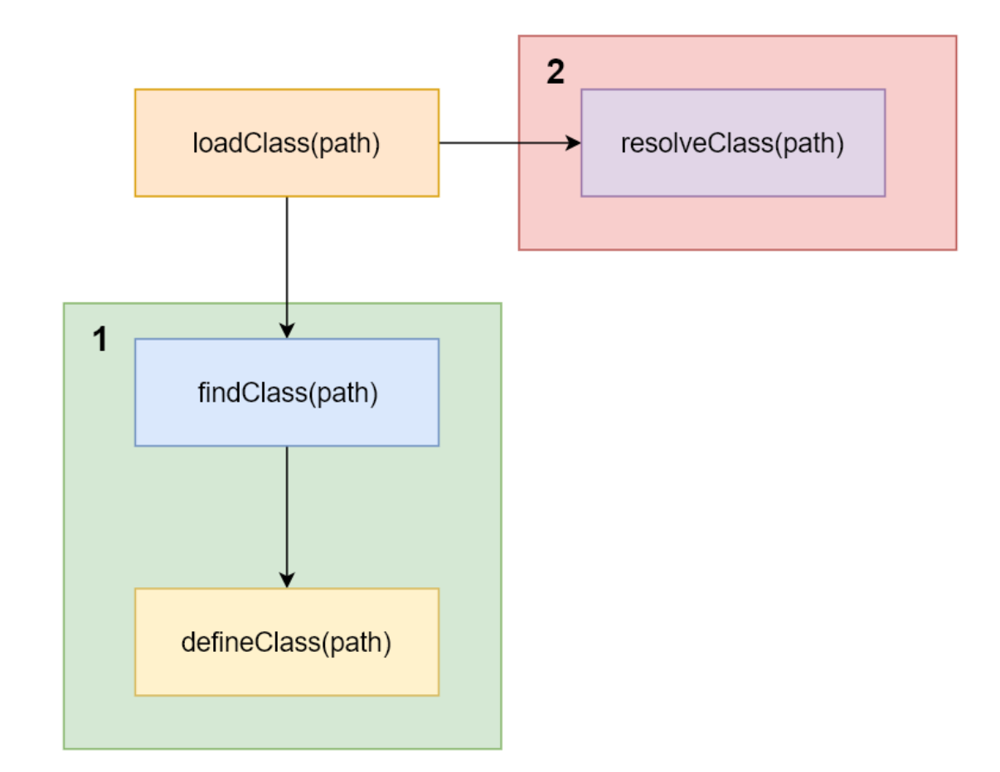

## 参考博文
[一看你就懂，超详细java中的ClassLoader详解](https://blog.csdn.net/briblue/article/details/54973413)

[TOC]


# 1. 基本概念
对非数组类来说，加载的第一个过程由类加载器实现，他是在虚拟机外部的。而数组类型是虚拟机直接创建的。

用户可以实现自己的类加载器，以便应用程序自己决定如何加载需要的类

每一个类加载器加载类后都有独立的类名称空间，而类的唯一性由类加载器和类本身一同确定。

即使两个类来自同一个Class文件、由同一个虚拟机加载，只要加载他们的类加载不是同一个，这两个类必定不相等

# 2. java环境变量

- JAVA_HOME

JDK的安装位置
```java
//windows
C:\Program Files\Java\jdk1.8.0_91

//macos
/Library/Java/JavaVirtualMachines/jdk1.8.0_171.jdk 
```

- PATH

指定path后，在终端执行javac、java等命令就不用输他的全路径了

```java
//windows
PATH=%JAVA_HOME%\bin;%JAVA_HOME%\jre\bin;%PATH%;

//macos
chenpeipeideMacBook-Pro:JVM chenpeipei$ cat /Users/chenpeipei/.bash_profile 
export M2_HOME="/Users/chenpeipei/apache-maven-3.5.4";

export PATH=$PATH:$M2_HOME/bin
export JAVA_HOME=/Library/Java/JavaVirtualMachines/jdk1.8.0_171.jdk/Contents/Home

export PATH=/Users/chenpeipei/phantomjs-2.1.1-macosx/bin:$PATH

alias mysql="/usr/local/mysql/bin/mysql";
```

- CLASSPATH

指向jar包的路径

```java
//.表示当前目录
CLASSPATH=.;%JAVA_HOME%\lib;%JAVA_HOME%\lib\tools.jar
```


# 3. java.lang.ClassLoader

## 3.1 树状结构(非继承关系)

- 引导类加载器 Bootstrap Classloader

加载%JAVA_HOME%\jre\lib下的核心类库。由C++实现，是虚拟机的一部分

```java
public static void printBootstrap() {
        System.out.println(System.getProperty("sun.boot.class.path"));

        URL[] urls = sun.misc.Launcher.getBootstrapClassPath().getURLs();
        for (int i = 0; i < urls.length; i++) {
            System.out.println(urls[i].toExternalForm());
        }
}

/*
file:/Library/Java/JavaVirtualMachines/jdk1.8.0_171.jdk/Contents/Home/jre/lib/resources.jar
//String、Integer这些类都在rt.jar中
file:/Library/Java/JavaVirtualMachines/jdk1.8.0_171.jdk/Contents/Home/jre/lib/rt.jar
file:/Library/Java/JavaVirtualMachines/jdk1.8.0_171.jdk/Contents/Home/jre/lib/sunrsasign.jar
file:/Library/Java/JavaVirtualMachines/jdk1.8.0_171.jdk/Contents/Home/jre/lib/jsse.jar
file:/Library/Java/JavaVirtualMachines/jdk1.8.0_171.jdk/Contents/Home/jre/lib/jce.jar
file:/Library/Java/JavaVirtualMachines/jdk1.8.0_171.jdk/Contents/Home/jre/lib/charsets.jar
file:/Library/Java/JavaVirtualMachines/jdk1.8.0_171.jdk/Contents/Home/jre/lib/jfr.jar
file:/Library/Java/JavaVirtualMachines/jdk1.8.0_171.jdk/Contents/Home/jre/classes
*/
```


可以在JVM启动时通过-Xbootclasspath改变bootstrap classloader的加载路径

```java
-Xbootclasspath:path
将path加入到bootstrap path,替代bootstrap path中的文件。独立于虚拟机外部，继承自抽象类java.lang.ClassLoader

-Xbootclasspath/a:path
追加path到bootstrap path中，而非替换

-Xbootclasspath/p:path
追加path到bootstrap path中，并且优先加载path
```

- 扩展类加载器 Extension Classloader

加载%JAVA_HOME%\jre\lib\ext下的jar包和class文件

类加载器-6


```java
public static void printExt() {
        System.out.println(System.getProperty("java.ext.dirs"));
}

/*
java.ext.dirs的默认路径：
C:\Program Files\Java\jdk1.8.0_211\jre\lib\ext;
C:\windows\Sun\Java\lib\ext
*/
```


可以通过-D java.ext.dirs 添加和改变Extension Classloader的加载路径

```java
//不指定$JAVA_HOME/jre/lib/ext的话，它会被path覆盖掉
-Djava.ext.dirs=./path:$JAVA_HOME/jre/lib/ext
```


- 应用程序类加载器 Application ClassLoader

加载当前应用下的jar包。独立于虚拟机外部，继承自抽象类java.lang.ClassLoader

```java
System.out.println(System.getProperty("java.class.path"));
```

## 3.2 源码分析
分析位于注释中

```java
package sun.misc;

//应用程序的入口
public class Launcher {
    //bootstrap classloader加载的jar包路径
    private static String bootClassPath = System.getProperty("sun.boot.class.path");
    private ClassLoader loader;
    
    public Launcher() {
        Launcher.ExtClassLoader var1;
        try {
            //初始化ExtClassLoader
            var1 = Launcher.ExtClassLoader.getExtClassLoader();
        } catch (IOException var10) {
            throw new InternalError("Could not create extension class loader", var10);
        }

        try {
            //初始化AppClassLoader
            //var1 说明AppClassLoader的parent（非继承关系）是ExtClassLoader
            //launcher返回的加载器是AppClassLoader
            this.loader = Launcher.AppClassLoader.getAppClassLoader(var1);
        } catch (IOException var9) {
            throw new InternalError("Could not create application class loader", var9);
        }

        Thread.currentThread().setContextClassLoader(this.loader);
    }
    
    public ClassLoader getClassLoader() {
        return loader;
    }
    
    static class ExtClassLoader extends URLClassLoader {
        private static volatile Launcher.ExtClassLoader instance;

        public static Launcher.ExtClassLoader getExtClassLoader() throws IOException {
            if (instance == null) {
                Class var0 = Launcher.ExtClassLoader.class;
                synchronized(Launcher.ExtClassLoader.class) {
                    if (instance == null) {
                        instance = createExtClassLoader();
                    }
                }
            }

            return instance;
        }

        private static Launcher.ExtClassLoader createExtClassLoader() throws IOException {
            try {
                return (Launcher.ExtClassLoader)AccessController.doPrivileged(new PrivilegedExceptionAction<Launcher.ExtClassLoader>() {
                    public Launcher.ExtClassLoader run() throws IOException {
                        //获取ExtClassLoader加载的文件
                        File[] var1 = Launcher.ExtClassLoader.getExtDirs();
                        int var2 = var1.length;

                        for(int var3 = 0; var3 < var2; ++var3) {
                            MetaIndex.registerDirectory(var1[var3]);
                        }

                        return new Launcher.ExtClassLoader(var1);
                    }
                });
            } catch (PrivilegedActionException var1) {
                throw (IOException)var1.getException();
            }
        }

        void addExtURL(URL var1) {
            super.addURL(var1);
        }

        public ExtClassLoader(File[] var1) throws IOException {
            // (ClassLoader)null说明ExtClassLoader的父加载器是null(Bootstrap Classloader)
            super(getExtURLs(var1), (ClassLoader)null, Launcher.factory);
            SharedSecrets.getJavaNetAccess().getURLClassPath(this).initLookupCache(this);
        }
        
        //获取ExtClassLoader加载的文件
        /*
        var1文件路径：
        C:\Program Files\Java\jdk1.8.0_211\jre\lib\ext
		C:\windows\Sun\Java\lib\ext
        */
        private static File[] getExtDirs() {
            String var0 = System.getProperty("java.ext.dirs");
            File[] var1;
            if (var0 != null) {
                StringTokenizer var2 = new StringTokenizer(var0, File.pathSeparator);
                int var3 = var2.countTokens();
                var1 = new File[var3];

                for(int var4 = 0; var4 < var3; ++var4) {
                    var1[var4] = new File(var2.nextToken());
                }
            } else {
                var1 = new File[0];
            }

            return var1;
        }
    ....
    }
    
    static class AppClassLoader extends URLClassLoader {
        final URLClassPath ucp = SharedSecrets.getJavaNetAccess().getURLClassPath(this);

        public static ClassLoader getAppClassLoader(final ClassLoader var0) throws IOException {
            final String var1 = System.getProperty("java.class.path");
            final File[] var2 = var1 == null ? new File[0] : Launcher.getClassPath(var1);
            return (ClassLoader)AccessController.doPrivileged(new PrivilegedAction<Launcher.AppClassLoader>() {
                public Launcher.AppClassLoader run() {
                    URL[] var1x = var1 == null ? new URL[0] : Launcher.pathToURLs(var2);
                    return new Launcher.AppClassLoader(var1x, var0);
                }
            });
        }

        AppClassLoader(URL[] var1, ClassLoader var2) {
            super(var1, var2, Launcher.factory);
            this.ucp.initLookupCache(this);
        }

        public Class<?> loadClass(String var1, boolean var2) throws ClassNotFoundException {
            int var3 = var1.lastIndexOf(46);
            if (var3 != -1) {
                SecurityManager var4 = System.getSecurityManager();
                if (var4 != null) {
                    var4.checkPackageAccess(var1.substring(0, var3));
                }
            }

            if (this.ucp.knownToNotExist(var1)) {
                Class var5 = this.findLoadedClass(var1);
                if (var5 != null) {
                    if (var2) {
                        this.resolveClass(var5);
                    }

                    return var5;
                } else {
                    throw new ClassNotFoundException(var1);
                }
            } else {
                return super.loadClass(var1, var2);
            }
        }

        protected PermissionCollection getPermissions(CodeSource var1) {
            PermissionCollection var2 = super.getPermissions(var1);
            var2.add(new RuntimePermission("exitVM"));
            return var2;
        }

        private void appendToClassPathForInstrumentation(String var1) {
            assert Thread.holdsLock(this);

            super.addURL(Launcher.getFileURL(new File(var1)));
        }

        private static AccessControlContext getContext(File[] var0) throws MalformedURLException {
            PathPermissions var1 = new PathPermissions(var0);
            ProtectionDomain var2 = new ProtectionDomain(new CodeSource(var1.getCodeBase(), (Certificate[])null), var1);
            AccessControlContext var3 = new AccessControlContext(new ProtectionDomain[]{var2});
            return var3;
        }

        static {
            ClassLoader.registerAsParallelCapable();
        }
    }
    
    //加载bootstarp classloader的jar包
    public static URLClassPath getBootstrapClassPath() {
        return Launcher.BootClassPathHolder.bcp;
    }
    
    private static class BootClassPathHolder {
        static final URLClassPath bcp;

        private BootClassPathHolder() {
        }

        static {
            URL[] var0;
            if (Launcher.bootClassPath != null) {
                var0 = (URL[])AccessController.doPrivileged(new PrivilegedAction<URL[]>() {
                    public URL[] run() {
                        //获取bootstrap classloader要加载的内容
                        File[] var1 = Launcher.getClassPath(Launcher.bootClassPath);
                        int var2 = var1.length;
                        HashSet var3 = new HashSet();

                        for(int var4 = 0; var4 < var2; ++var4) {
                            File var5 = var1[var4];
                            if (!var5.isDirectory()) {
                                var5 = var5.getParentFile();
                            }

                            if (var5 != null && var3.add(var5)) {
                                MetaIndex.registerDirectory(var5);
                            }
                        }

                        return Launcher.pathToURLs(var1);
                    }
                });
            } else {
                var0 = new URL[0];
            }

            bcp = new URLClassPath(var0, Launcher.factory, (AccessControlContext)null);
            bcp.initLookupCache((ClassLoader)null);
        }
    }
}
```

```java
public class URLClassLoader extends SecureClassLoader implements Closeable {
    private final URLClassPath ucp;
    
    public URLClassLoader(URL[] urls, ClassLoader parent) {
        super(parent);
        // this is to make the stack depth consistent with 1.1
        SecurityManager security = System.getSecurityManager();
        if (security != null) {
            security.checkCreateClassLoader();
        }
        this.acc = AccessController.getContext();
        ucp = new URLClassPath(urls, acc);
    }
    
    protected Class<?> findClass(final String name)
        throws ClassNotFoundException
    {
        final Class<?> result;
        try {
            result = AccessController.doPrivileged(
                new PrivilegedExceptionAction<Class<?>>() {
                    public Class<?> run() throws ClassNotFoundException {
                        String path = name.replace('.', '/').concat(".class");
                        Resource res = ucp.getResource(path, false);
                        if (res != null) {
                            try {
                                return defineClass(name, res);
                            } catch (IOException e) {
                                throw new ClassNotFoundException(name, e);
                            }
                        } else {
                            return null;
                        }
                    }
                }, acc);
        } catch (java.security.PrivilegedActionException pae) {
            throw (ClassNotFoundException) pae.getException();
        }
        if (result == null) {
            throw new ClassNotFoundException(name);
        }
        return result;
    }
}
```

```java
public class SecureClassLoader extends ClassLoader {
    protected SecureClassLoader(ClassLoader parent) {
        super(parent);
        // this is to make the stack depth consistent with 1.1
        SecurityManager security = System.getSecurityManager();
        if (security != null) {
            security.checkCreateClassLoader();
        }
        initialized = true;
    }
}
```

```java
public abstract class ClassLoader {
    
    //parent赋值有两种方法
    //1. 由外部传入parent
    protected ClassLoader(ClassLoader parent) {
        this(checkCreateClassLoader(), parent);
    }
    
    //2. 外部不指定parent,parent由getSystemClassLoader生成，即获取Launcher的ClassLoader, 即AppClassLoader
    //一个ClassLoader创建时如果没有指定parent，那么它的parent默认就是AppClassLoader
    protected ClassLoader() {
        this(checkCreateClassLoader(), getSystemClassLoader());
    }
    
    private ClassLoader(Void unused, ClassLoader parent) {
        this.parent = parent;
        if (ParallelLoaders.isRegistered(this.getClass())) {
            parallelLockMap = new ConcurrentHashMap<>();
            package2certs = new ConcurrentHashMap<>();
            domains =
                Collections.synchronizedSet(new HashSet<ProtectionDomain>());
            assertionLock = new Object();
        } else {
            // no finer-grained lock; lock on the classloader instance
            parallelLockMap = null;
            package2certs = new Hashtable<>();
            domains = new HashSet<>();
            assertionLock = this;
        }
    }
    
    public static ClassLoader getSystemClassLoader() {
        initSystemClassLoader();
        if (scl == null) {
            return null;
        }
        SecurityManager sm = System.getSecurityManager();
        if (sm != null) {
            checkClassLoaderPermission(scl, Reflection.getCallerClass());
        }
        return scl;
    }

    private static synchronized void initSystemClassLoader() {
        if (!sclSet) {
            if (scl != null)
                throw new IllegalStateException("recursive invocation");
            sun.misc.Launcher l = sun.misc.Launcher.getLauncher();
            if (l != null) {
                Throwable oops = null;
                //获取Launcher的ClassLoader
                scl = l.getClassLoader();
                try {
                    scl = AccessController.doPrivileged(
                        new SystemClassLoaderAction(scl));
                } catch (PrivilegedActionException pae) {
                    oops = pae.getCause();
                    if (oops instanceof InvocationTargetException) {
                        oops = oops.getCause();
                    }
                }
                if (oops != null) {
                    if (oops instanceof Error) {
                        throw (Error) oops;
                    } else {
                        // wrap the exception
                        throw new Error(oops);
                    }
                }
            }
            sclSet = true;
        }
    }
    
    
    //获取父类加载器
    public final ClassLoader getParent() {
        if (parent == null)
            return null;
        SecurityManager sm = System.getSecurityManager();
        if (sm != null) {
            // Check access to the parent class loader
            // If the caller's class loader is same as this class loader,
            // permission check is performed.
            checkClassLoaderPermission(parent, Reflection.getCallerClass());
        }
        return parent;
    }
    
    public String toString() {
        return getClass().getName() + "@" + Integer.toHexString(hashCode());
    }
}
```


## 3.3 继承关系



```java
ClassLoader classLoader = testClassLoader.class.getClassLoader();
System.out.println("AppClassLoader 's parent:" + classLoader.getParent());
System.out.println("ExtClassLoader 's parent:" + classLoader.getParent().getParent());

/*
AppClassLoader的parent是ExtClassLoader， ExtClassLoader的parent是null(Bootstrap Classloader)
AppClassLoader 's parent:sun.misc.Launcher$ExtClassLoader@63947c6b
ExtClassLoader 's parent:null
*/
```

```java
ClassLoader classLoader = testClassLoader.class.getClassLoader();
ClassLoader classLoader1 = Sort.class.getClassLoader();

System.out.println("testClassLoader 's classLoader:" + classLoader);
System.out.println("Sort 's classLoader:" + classLoader1);

/*
在一个应用程序中加载的类,他们的类加载器相同
testClassLoader 's classLoader:sun.misc.Launcher$AppClassLoader@18b4aac2
Sort 's            classLoader:sun.misc.Launcher$AppClassLoader@18b4aac2
*/
```

## 3.4 没有BootStrap ClassLoader这个类的原因

bootstrap classLoader是由C/C++编写的，是JVM的一部分，不是一个JAVA类

```java
/*
这些Class都位于rt.jar，rt.jar又是bootstrap classLoader加载的，所以打印结果为null
*/
System.out.println(String.class.getClassLoader());
System.out.println(int.class.getClassLoader());
System.out.println(Integer.class.getClassLoader());
System.out.println(Arrays.class.getClassLoader());
```


## 3.5 双亲委托机制


- 向上委托

从AppClassLoader开始，先看看缓存里有没有，没有的话就向上委托直到BootStrap ClassLoader, BootStrap ClassLoader就去缓存和sun.boot.class.path下找，没有的话就向下加载

- 向下加载

ClassLoader就去自己的路径下查找，成功就返回，失败就向下委托直到AppClassLoader,如果AppClassLoader都没有就抛出异常

- 为什么使用双亲委托：避免重复加载

如果父加载器已经加载了某个类，就不用再次重复加载了。不然自定义的String会替代核心库中的String

- JVM如何判断两个Class相同

类名相同&&由同一个类加载器加载


## 3.6 loadClass()
- Class loadClass(String name)

加载名称为name的类

- Class findClass(String name)

根据name查找名称为name的类

- Class defineClass(String, byte[], int, int)

将byte[]中的内容转换成JAVA类

- resolveClass(Class<?>)

链接指定的java类



```java
//通过指定的全限定类名加载
public abstract class ClassLoader {
    protected Class<?> loadClass(String name, boolean resolve)
        throws ClassNotFoundException
    {
        synchronized (getClassLoadingLock(name)) {
            // 1.首先检测是否已经加载
            Class<?> c = findLoadedClass(name);
            //2.如果没被加载
            if (c == null) {
                long t0 = System.nanoTime();
                try {
                    if (parent != null) {
                    	//3.父加载器不为空(AppClassLoader)则调用父加载器的loadClass(向上委托)
                        c = parent.loadClass(name, false);
                    } else {
                    	//父加载器为空(ExtClassLoader)则调用Bootstrap Classloader
                        c = findBootstrapClassOrNull(name);
                    }
                } catch (ClassNotFoundException e) {
                    // ClassNotFoundException thrown if class not found
                    // from the non-null parent class loader
                }

                if (c == null) {
                    // If still not found, then invoke findClass in order
                    // to find the class.
                    long t1 = System.nanoTime();
                    //父加载器没有找到，则调用findclass在自身的路径中找(向下加载)
                    //如果要自定义ClassLoader,就重写findClass方法，而不要重写loadClass方法
                    c = findClass(name);

                    // this is the defining class loader; record the stats
                    sun.misc.PerfCounter.getParentDelegationTime().addTime(t1 - t0);
                    sun.misc.PerfCounter.getFindClassTime().addElapsedTimeFrom(t1);
                    sun.misc.PerfCounter.getFindClasses().increment();
                }
            }
            //如果resolve为true,就链接置顶的Java类
            if (resolve) {
            	//调用resolveClass()
                resolveClass(c);
            }
            return c;
        }
    }
    
    protected final Class<?> findLoadedClass(String name) {
        if (!checkName(name))
            return null;
        return findLoadedClass0(name);
    }
    
    private native final Class<?> findLoadedClass0(String name);
    
    //委托bootstrap classloader加载
    private Class<?> findBootstrapClassOrNull(String name){
        if (!checkName(name)) return null;
        return findBootstrapClass(name);
    }
    
    // return null if not found
    private native Class<?> findBootstrapClass(String name);
    
    protected Class<?> findClass(String name) throws ClassNotFoundException {
        throw new ClassNotFoundException(name);
    }
    
    protected final void resolveClass(Class<?> c) {
        resolveClass0(c);
    }
    
    private native void resolveClass0(Class<?> c);
}
```

# 4. 自定义ClassLoader

- 场景
1. 三种ClassLoader只能加载指定路径下的文件，如果要动态加载class文件，从某个非工程文件夹加载class文件就要自定义ClassLoader
1. 从网络下载一个class文件加载
1. 通过网络传输字节码，为了安全这些字节码经过加密。然后需要自定义的类加载器从网络读取，解密字节码，进行验证，然后加载出Class对象


- 步骤
1. 写自定义ClassLoader继承ClassLoader
1. 重写findClass()方法
1. 在findClass()中调用defineClass()将字节码转换成Class对象

## 4.1 示例1：DiskClassLoader

- Test.java

```shell
# 得到Test.class
javac Test.java
```

```java
package com.frank.test;

public class Test {
	public void say(){
		System.out.println("Say Hello");
	}
}
```


- DiskClassLoader

```java
import java.io.ByteArrayOutputStream;
import java.io.File;
import java.io.FileInputStream;
import java.io.FileNotFoundException;
import java.io.IOException;

public class DiskClassLoader extends ClassLoader {
    //文件路径名
    private String mLibPath;
    
    public DiskClassLoader(String path) {
		// TODO Auto-generated constructor stub
		mLibPath = path;
	}
    
    @Override
    protected Class<?> findClass(String name) throws ClassNotFoundException {
        String fileName = getFileName(name);
        File file = new File(mLibPath, fileName);
        
        try {
            FileInputStream is = new FileInputStream(file);
            ByteArrayOutputStream bos = new ByteArrayOutputStream();
            int len = 0;
            try {
                while((len = is.read()) != -1) {
                    bos.write(len);   
                }
            } catch(IOException e) {
               e.printStackTrace();   
            }
            byte[] data = bos.toByteArray();
            is.close();
            bos.close();
        
            return defineClass(name, data, 0, data.length);
        } catch (IOException e) {
            e.printStackTrace();     
        }
        return super.findClass(name);
    }
    
    //将全限定类名.java转换成全限定类名.class
    private String getFileName(String name) {
        int index = name.lastIndexOf(".");
        if (index == -1) {
            return name +    
        } else {
            return name.substring(index+1) + ".class";   
        }
    }
}
```

- ClassLoaderTest

```java
import java.lang.reflect.InvocationTargetException;
import java.lang.reflect.Method;

public class ClassLoaderTest {
    public static void main(String[] args) {
        DiskClassLoader diskLoader = new DiskClassLoader("D:\\lib");
        try {
            Class c = diskLoader.loadClass("com.frank.test.Test");
            
            if (c != null) {
                try {
                    Object obj = c.newInstance();
                    Method method = c.getDeclaredMethod("say", null);
                    method.invoke(obj, null);
                } catch (InstantiationException | IllegalAccessException 
						| NoSuchMethodException
						| SecurityException | 
						IllegalArgumentException | 
						InvocationTargetException e) {
                       e.printStackTrace();
                }
            }
        } catch (ClassNotFoundException e) {
			// TODO Auto-generated catch block
			e.printStackTrace();
		}
    }
}
/*
Say Hello
*/
```

## 4.1 解密类加载器

将Class文件加密，然后用自定义ClassLoader解密，提高安全性

- FileUtils:加密工具类

```java
import java.io.File;
import java.io.FileInputStream;
import java.io.FileNotFoundException;
import java.io.FileOutputStream;
import java.io.IOException;

public class FileUtils {
    public static void test(String path) {
        File file = new File(path);
        try {
            FileInputStream fis = new FileInputStream(file);
            FileOutputStream fos = new FileOutputStream(path + "en");
            int b = 0;
            try {
                while((b = fis.read()) != -1) {
                    //加密算法为：每个byte异或2
                    fos.write(b ^ 2);   
                }
                fos.close();
                fis.close();
            } catch (IOException e) {
				// TODO Auto-generated catch block
				e.printStackTrace();
			}
		} catch (FileNotFoundException e) {
			// TODO Auto-generated catch block
			e.printStackTrace();
        }
    }
    
    public static void main(String[] args) {
        FileUtils.test("D:\\lib\\Test.class");   
    }
}
```

执行：

```java
javac FileUtils.java

java FileUtis

可以看到多了Test.classen文件
```

- DeClassLoader:自定义解密类加载器

```java
import java.io.ByteArrayOutputStream;
import java.io.File;
import java.io.FileInputStream;
import java.io.IOException;

public class DeClassLoader extends ClassLoader{
    private String mLbPath;
    
    public DeClassLoader(String mLbPath) {
        this.mLbPath = mLbPath;   
    }
    
    @Override
    public Class<?> findClass(String name) throws ClassNotFoundException {
        String fileName = getFileName(path);
        File file = new File(mLbPath, fileName);
        
        try {
            FileInputStream is = new FileInputStream(file);
            ByteArrayOutputStream bos = new ByteArrayOutputStream();
            int len = 0;
            int b = 0;
            try {
                while((len = is.read()) != -1) {
                    //对每个byte解密
                    b = (byte) (len ^ 2);
                    bos.write(b);
                }
            }catch (IOException e) {
	            e.printStackTrace();
	        }
	        
	        byte[] data = bos.toByteArray();
	        is.close();
	        bos.close();
	        
	        return defineClass(name,data,0,data.length);
			
		} catch (IOException e) {
			// TODO Auto-generated catch block
			e.printStackTrace();
		}
		
		return super.findClass(name);
    }
    
    //获取要加载 的class文件名
	private String getFileName(String name) {
		// TODO Auto-generated method stub
		int index = name.lastIndexOf('.');
		if(index == -1){ 
			return name+".classen";
		}else{
			return name.substring(index+1)+".classen";
		}
	}
}
```

- DeClassLoaderTest

```java
import java.lang.reflect.InvocationTargetException;
import java.lang.reflect.Method;

public class DeClassLoaderTest {
    public static void main(String[] args) {
        DeClassLoader loader = new DeClassLoader("D:\\lib");
        try {
            Class c = loader.loadClass("com.frank.test.Test");
            if (c != null) {
                try {
                    Object obj = c.newInstance();
                    Method method = c.getDeclaredMethod("say", null);
                    method.invoke(obj, null);
                } catch (InstantiationException | IllegalAccessException 
						| NoSuchMethodException
						| SecurityException | 
						IllegalArgumentException | 
						InvocationTargetException e) {
					// TODO Auto-generated catch block
					e.printStackTrace();
                }
			}
		} catch (ClassNotFoundException e) {
			// TODO Auto-generated catch block
			e.printStackTrace();
		}
    }
}
```

# 5. Context ClassLoader 线程上下文类加载器

```java
public class Thread implements Runnable {
    private ClassLoader contextClassLoader;
    
    public ClassLoader getContextClassLoader() {
        if (contextClassLoader == null)
            return null;
        SecurityManager sm = System.getSecurityManager();
        if (sm != null) {
            ClassLoader.checkClassLoaderPermission(contextClassLoader,
                                                   Reflection.getCallerClass());
        }
        return contextClassLoader;
    }
    
    public void setContextClassLoader(ClassLoader cl) {
        SecurityManager sm = System.getSecurityManager();
        if (sm != null) {
            sm.checkPermission(new RuntimePermission("setContextClassLoader"));
        }
        contextClassLoader = cl;
    }
    
    //线程构造方法中被调用
    private void init(ThreadGroup g, Runnable target, String name,
                      long stackSize, AccessControlContext acc,
                      boolean inheritThreadLocals) {
        if (name == null) {
            throw new NullPointerException("name cannot be null");
        }

        this.name = name;

        Thread parent = currentThread();
        SecurityManager security = System.getSecurityManager();
        if (g == null) {
            /* Determine if it's an applet or not */

            /* If there is a security manager, ask the security manager
               what to do. */
            if (security != null) {
                g = security.getThreadGroup();
            }

            /* If the security doesn't have a strong opinion of the matter
               use the parent thread group. */
            if (g == null) {
                g = parent.getThreadGroup();
            }
        }

        /* checkAccess regardless of whether or not threadgroup is
           explicitly passed in. */
        g.checkAccess();

        /*
         * Do we have the required permissions?
         */
        if (security != null) {
            if (isCCLOverridden(getClass())) {
                security.checkPermission(SUBCLASS_IMPLEMENTATION_PERMISSION);
            }
        }

        g.addUnstarted();

        this.group = g;
        this.daemon = parent.isDaemon();
        this.priority = parent.getPriority();
        //子线程继承父线程的ClassLoader
        if (security == null || isCCLOverridden(parent.getClass()))
            this.contextClassLoader = parent.getContextClassLoader();
        else
            this.contextClassLoader = parent.contextClassLoader;
        this.inheritedAccessControlContext =
                acc != null ? acc : AccessController.getContext();
        this.target = target;
        setPriority(priority);
        if (inheritThreadLocals && parent.inheritableThreadLocals != null)
            this.inheritableThreadLocals =
                ThreadLocal.createInheritedMap(parent.inheritableThreadLocals);
        /* Stash the specified stack size in case the VM cares */
        this.stackSize = stackSize;

        /* Set thread ID */
        tid = nextThreadID();
    }
}
```


- 子线程继承父线程类加载器测试

```java
public static void main(String[] args) {
    ClassLoader parent = testClassLoader.class.getClassLoader();
    System.out.println("parent：" + parent);

    Thread thread = new Thread();
    ClassLoader child = thread.getContextClassLoader();
    System.out.println("child：" + child);
}

/*
线程默认的ClassLoader是AppClassLoader
parent：sun.misc.Launcher$AppClassLoader@18b4aac2
child：sun.misc.Launcher$AppClassLoader@18b4aac2
*/
```

- 示例

```java
ClassLoader parentClassLoader = Thread.currentThread().getContextClassLoader();
System.out.println("panret: " + Thread.currentThread().getName() + ":" + parentClassLoader);

new Thread(new Runnable() {
    @Override
    public void run() {
        ClassLoader childClassLoader = Thread.currentThread().getContextClassLoader();
        System.out.println("child: " + Thread.currentThread().getName() + ":" + childClassLoader);
    }
}).start();

/*
panret: main:sun.misc.Launcher$AppClassLoader@18b4aac2
child: Thread-1:sun.misc.Launcher$AppClassLoader@18b4aac2
*/
```


