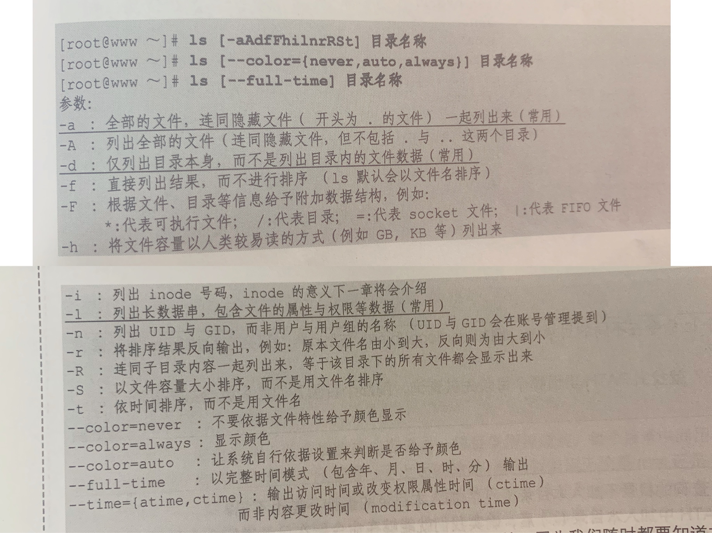
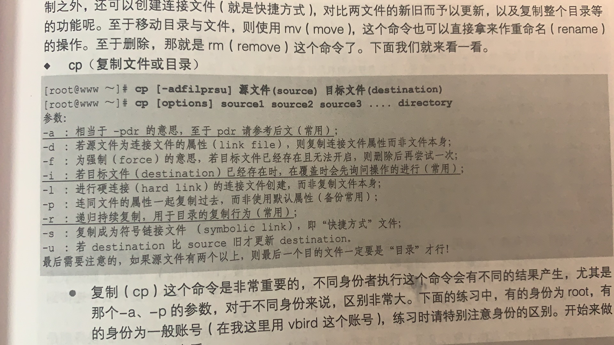
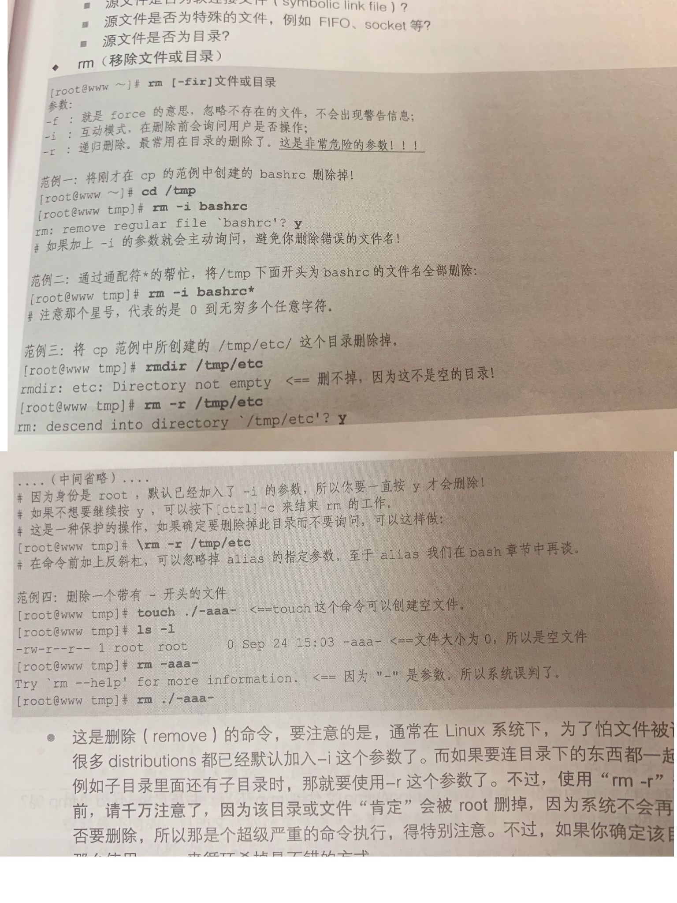
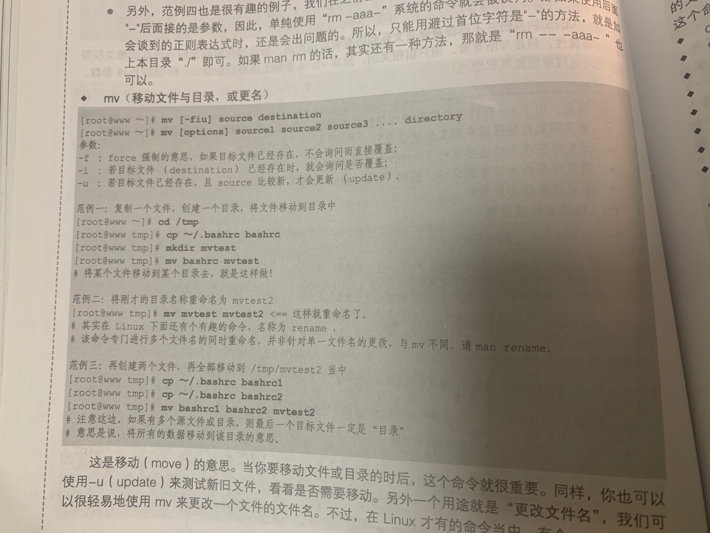
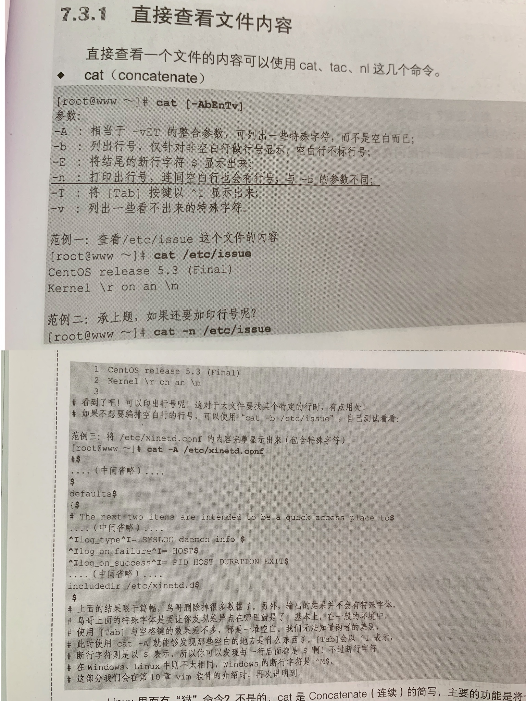
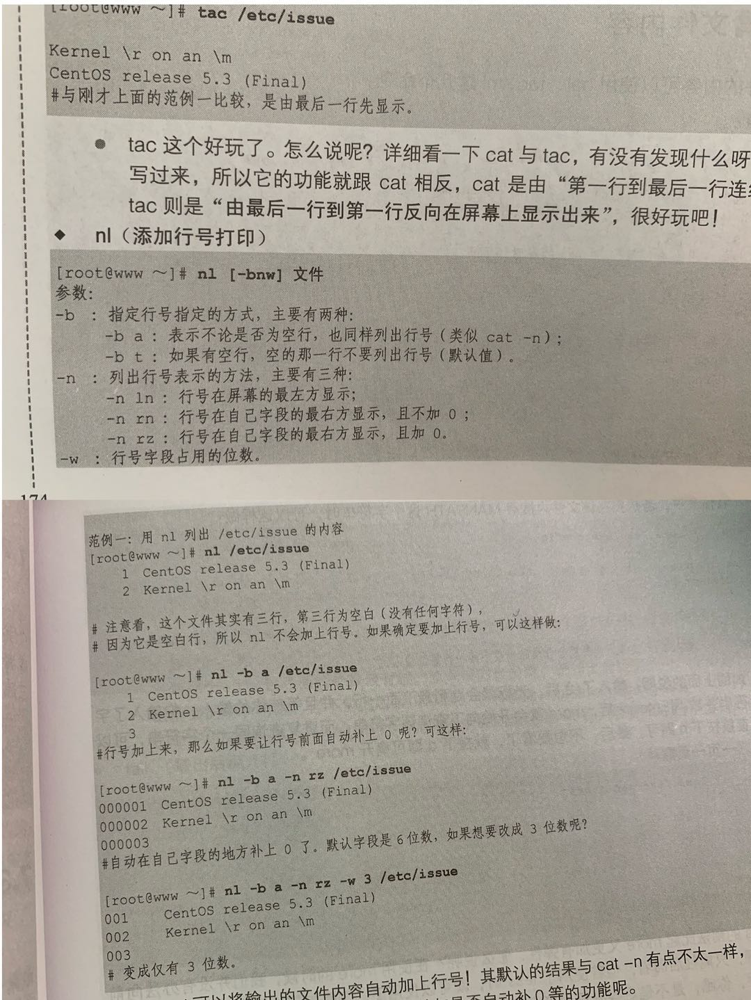
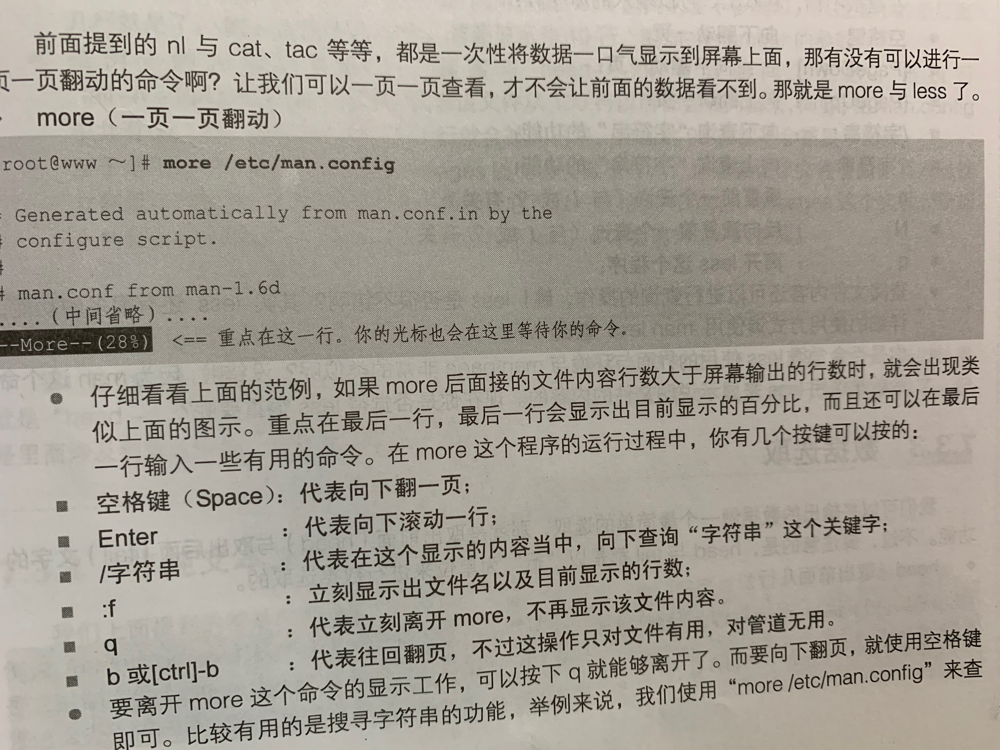
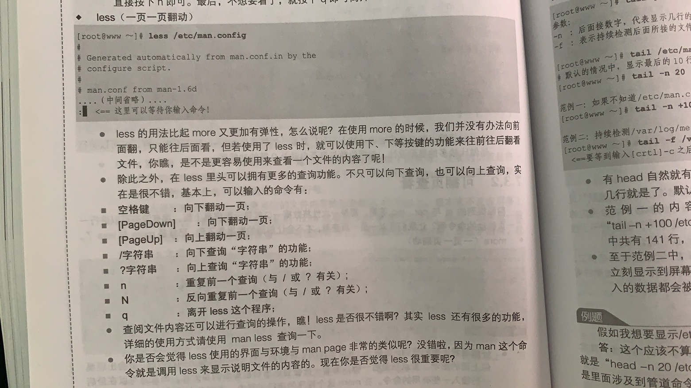
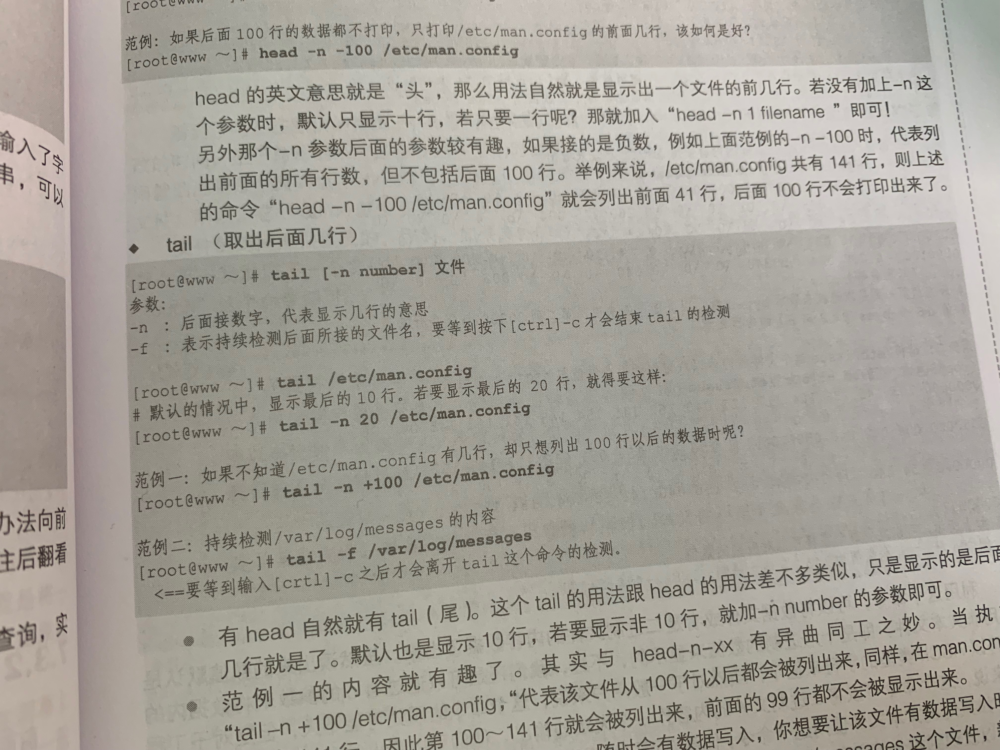
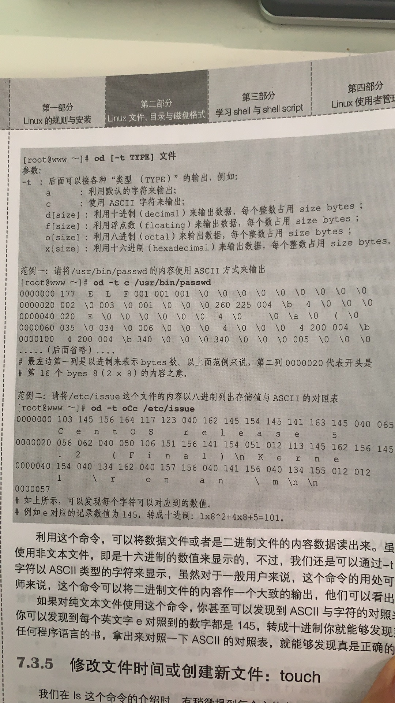

[TOC]

# 1. 目录的相关操作
```SQL
. 代表此目录
.. 代表上一层目录
- 代表前一个工作目录
~ 代表目前的用户所在的主文件夹
~account 代表account这个用户的主文件夹
```
## 切换目录cd
change directory
```shell
# 以root身份运行，主文件夹是/root/。vbird用户的主文件夹是/home/vbird

# 进入vbird的主文件夹/home/vbird
cd ~vbird 

# 回到root的主文件夹/root/
cd ~

# 到当前目录的上层目录，即/root/的上层目录
cd ..

# 回到刚才的目录
cd -

# 去到指定目录
cd /var/spool/mail

# 由/var/spool/mail 到/var/spool/mqueue
cd ../mqueue
```

## 显示当前所在目录pwd
print working directory
```
pwd [-P]
-P代表显示当前正确的完整路径，而不使用连接路径(相当于快捷方式)
```
```shell
chenpeipeideMacBook-Pro:etc chenpeipei$ cd /etc 
chenpeipeideMacBook-Pro:etc chenpeipei$ pwd
/etc
chenpeipeideMacBook-Pro:etc chenpeipei$ pwd -P
/private/etc
```

## 新建新目录mkdir
```
mkdir [-mp]
-m代表直接设置文件的权限
-p代表自动创建多级目录
```
```shell
chenpeipeideMacBook-Pro:~ chenpeipei$ mkdir test

chenpeipeideMacBook-Pro:~ chenpeipei$ mkdir -p test1/test2/test3

chenpeipeideMacBook-Pro:~ chenpeipei$ mkdir -m 711 test2

chenpeipeideMacBook-Pro:~ chenpeipei$ ls -l
drwx--x--x    2 chenpeipei  staff          64  4 27 19:39 test2
```

## 删除空目录rmdir
```
rmdir [-p]
-p:连同删除上层目录
```
```shell
chenpeipeideMacBook-Pro:~ chenpeipei$ mkdir test
chenpeipeideMacBook-Pro:~ chenpeipei$ rmdir test

chenpeipeideMacBook-Pro:~ chenpeipei$ mkdir -p test1/test2/test3
chenpeipeideMacBook-Pro:~ chenpeipei$ rmdir test1
rmdir: test1: Directory not empty

chenpeipeideMacBook-Pro:~ chenpeipei$ rmdir -p test1/test2/test3
```

# 2. 文件与目录管理
## 查看文件和目录ls
```
//查看ls的基础用法
man ls
info ls
```

ls代表list，作用是列出文件的文件名

参数-a连同列出文件名第一个字符为.的隐藏文件

参数-l列出非隐藏文件的详细权限和属性




## 复制文件或目录cp
```shell
chenpeipeideMacBook-Pro:~ chenpeipei$ cp package.json package2.json
chenpeipeideMacBook-Pro:~ chenpeipei$ cp -i package.json package2.json
overwrite package2.json? (y/n [n]) y

# 文件权限一起复制过来
chenpeipeideMacBook-Pro:~ chenpeipei$ cp -a package.json package2.json
```

        


## 移除文件或目录rm
```shell
chenpeipeideMacBook-Pro:~ chenpeipei$ mkdir -p test/test1/test2
# 即使文件不存在也不报错
chenpeipeideMacBook-Pro:~ chenpeipei$ rm -f test1

# 递归删除子目录
chenpeipeideMacBook-Pro:~ chenpeipei$ rm -r test

chenpeipeideMacBook-Pro:~ chenpeipei$ mkdir test
# 询问是否删除
chenpeipeideMacBook-Pro:~ chenpeipei$ rm -i test
```
        


## 移动文件与目录或更名mv



## 取文件名或目录
```shell
chenpeipeideMacBook-Pro:~ chenpeipei$ basename /Users/chenpeipei/package.json 
package.json

chenpeipeideMacBook-Pro:~ chenpeipei$ dirname /Users/chenpeipei/package.json 
/Users/chenpeipei
```


# 3. 文件内容查阅
## 3.1 直接查看
### cat(concatenate)
```shell
# -n连同空白行打印出行号
# -b为非空白行打印出行号
chenpeipeideMacBook-Pro:~ chenpeipei$ cat -n /Users/chenpeipei/package.json 
     1	{
     2	  "name": "package.json",
     3	  "version": "1.0.0",
     4	  "main": "index.js",
     5	  "dependencies": {
     6	    "element-ui": "^2.4.6",
     7	    "formidable": "^1.2.1",
     8	    "vue": "^2.5.17"
     9	  },
    10	  "devDependencies": {
    11	    "webpack": "^4.17.1",
    12	    "webpack-cli": "^3.1.0",
    13	    "webpack-command": "^0.4.1"
    14	  },
    15	  "scripts": {
    16	    "test": "echo \"Error: no test specified\" && exit 1"
    17	  },
    18	  "author": "",
    19	  "license": "ISC",
    20	  "keywords": [],
    21	  "description": ""
    22	}
```


### tac(反向列示)
由最后一行到第一行反向显示，和cat相反
```shell
tac /etc/issue
```

### nl(添加行号打印)



## 3.2 翻页查看
### more(一页一页向后翻动)



### less(一页一页前后翻动)



## 数据选取
### head(取出前面几行)
```
head [-n num] 文件
[-n num]:代表显示前num行，默认显示10行
```
```shell
chenpeipeideMacBook-Pro:~ chenpeipei$ head -n 15 /Users/chenpeipei/stock.xml 
<?xml version="1.0" encoding="UTF-8"?><Db flnm="stock" nm="stock" ver="1.3.4">
  <VerLbl/>
  <VerNotes/>
  <DefTblOpts/>
  <DocFolder>/Users/chenpeipei</DocFolder>
  <Sch Cm="" nm="stock">
    <Tbl UsSo="1" nm="balance">
      <TblOpts/>
      <Pk ClNs="balance_id" nm="pkbalance"/>
      <Cl au="0" df="" nm="balance_id" nu="0">
        <DT arr="0" ds="Integer" en="" id="4" ln="null" sc="null" sg="1" un="0"/>
      </Cl>
      <Cl au="0" df="" nm="user_id" nu="1">
        <DT arr="0" ds="Integer" en="" id="4" ln="null" sc="null" sg="1" un="0"/>
      </Cl>

```


### tail(取出后面几行)
```
tail [-n num] 文件
[-n num]:代表显示后面num行，默认10行
-f:持续检测该文件,按ctrl-c结束
```



## 非纯文本文件od


## 查看文件类型file
```shell
chenpeipeideMacBook-Pro:~ chenpeipei$ file /Users/chenpeipei/stock.xml 
/Users/chenpeipei/stock.xml: XML 1.0 document text, ASCII text
```

## 寻找命令的脚本文件
由PATH目录中的文件都可以列出
```shell
chenpeipeideMacBook-Pro:~ chenpeipei$ which cd
/usr/bin/cd
```
