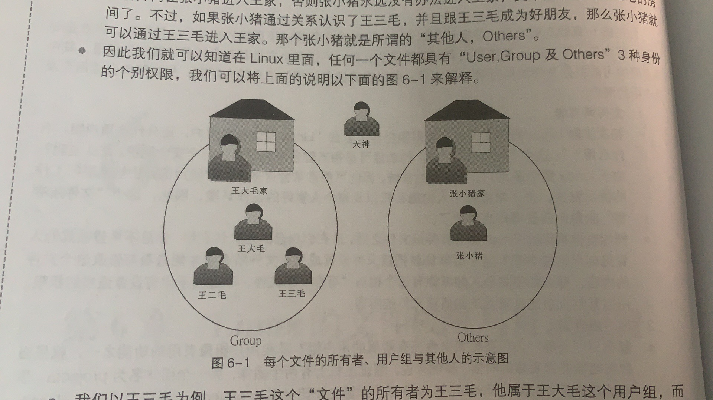
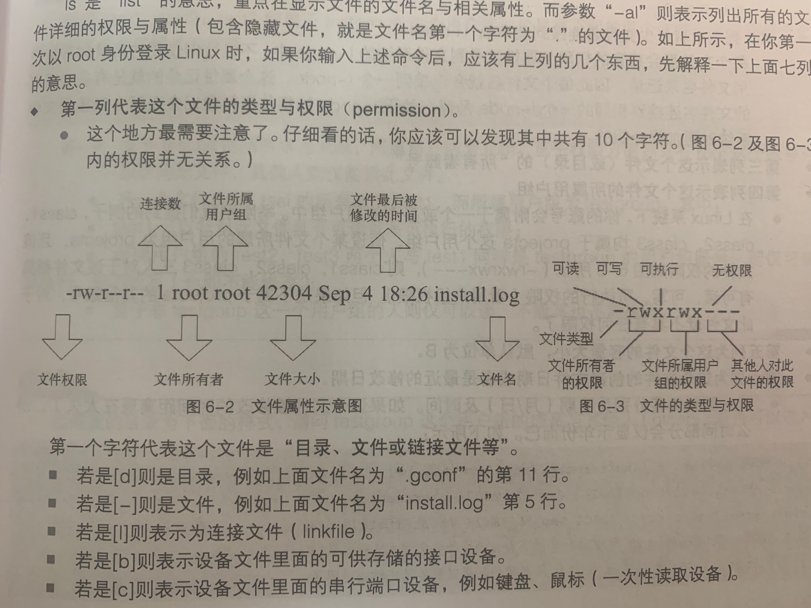

[TOC]

# 1. 用户和用户组
User、Group、Others


```SQL
//passwd记录账号和一般身份用户
chenpeipeideMacBook-Pro:~ chenpeipei$ cat /private/etc/passwd 
nobody:*:-2:-2:Unprivileged User:/var/empty:/usr/bin/false
root:*:0:0:System Administrator:/var/root:/bin/sh
daemon:*:1:1:System Services:/var/root:/usr/bin/false
_uucp:*:4:4:Unix to Unix Copy Protocol:/var/spool/uucp:/usr/sbin/uucico
_taskgated:*:13:13:Task Gate Daemon:/var/empty:/usr/bin/false
_networkd:*:24:24:Network Services:/var/networkd:/usr/bin/false
_installassistant:*:25:25:Install Assistant:/var/
...

//group记录Linux所有组名
chenpeipeideMacBook-Pro:~ chenpeipei$ cat /private/etc/group 
nobody:*:-2:
nogroup:*:-1:
wheel:*:0:root
daemon:*:1:root
kmem:*:2:root
sys:*:3:root
tty:*:4:root
operator:*:5:root
mail:*:6:_teamsserver
bin:*:7:
procview:*:8:root
procmod:*:9:root
owner:*:10:

```


# 2. Linux文件权限
## 2.1 Linux文件属性ls
[Linux文件与目录管理](./Linux文件与目录管理.md)
```shell
chenpeipeideMacBook-Pro:~ chenpeipei$ ls -al
total 3130776

drwxr-xr-x     3 chenpeipei  staff          96  8 13  2018 learning_log
drwxr-xr-x   458 chenpeipei  staff       14656  9  1  2018 node_modules
drwxr-xr-x     3 chenpeipei  staff          96 12  1  2018 oradiag_chenpeipei
-rw-r--r--     1 chenpeipei  staff      184796  9  1  2018 package-lock.json
-rw-r--r--     1 chenpeipei  staff         443  9  1  2018 package.json

chenpeipeideMacBook-Pro:~ chenpeipei$ ls -l
total 3130512
drwxr-xr-x   10 chenpeipei  staff         320 11 24  2018 AndroidStudioProjects
drwx------@   4 chenpeipei  staff         128 11 11  2018 Applications
drwx------@  23 chenpeipei  staff         736  4 26 14:26 Desktop
drwx------+  26 chenpeipei  staff         832  3 26 10:24 Documents
drwx------@  16 chenpeipei  staff         512  4 21 19:42 Downloads
```


## 2.2 改变文件属性和权限
### chgrp:改变文件所属用户组
```shell
# chgrp [-R] dir/filename:改变文件所属用户组,-R代表连同更改子目录下所有文件和目录

chgrp users install.log
```

### chown:改变文件所有者,也可以直接改变用户组
```shell
# chown [-R] 账号名称 dir/filename
# chown [-R] 账号名称：用户组名称 dir/filename

# 将install.log的所有者改为bin这个账号
chown bin install.log

# 将install.log的所有者和用户组都改为root
chown root:root install.log
```

### chmod:改变文件权限
可以用数字或字母代表权限
```
r:4
w:2
x:1
当权限是-rwxrwx---,分数为
user=rwx=4+2+1=7
group=rwx=4+2+1=7
other=---=0+0+0=0
```
```shell
# chmod [-R] xyz dir/filename

# -rwxrwxrwx
chmod 777 .bashrc

# -rwxr-xr--
chmod 754 .bashrc
```

