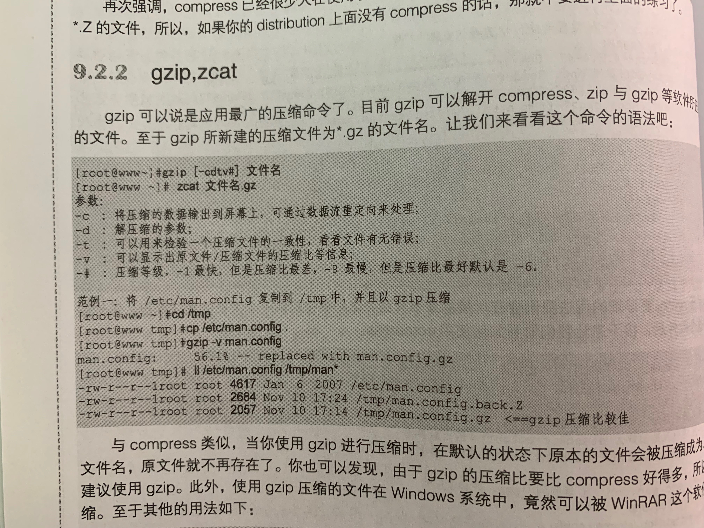
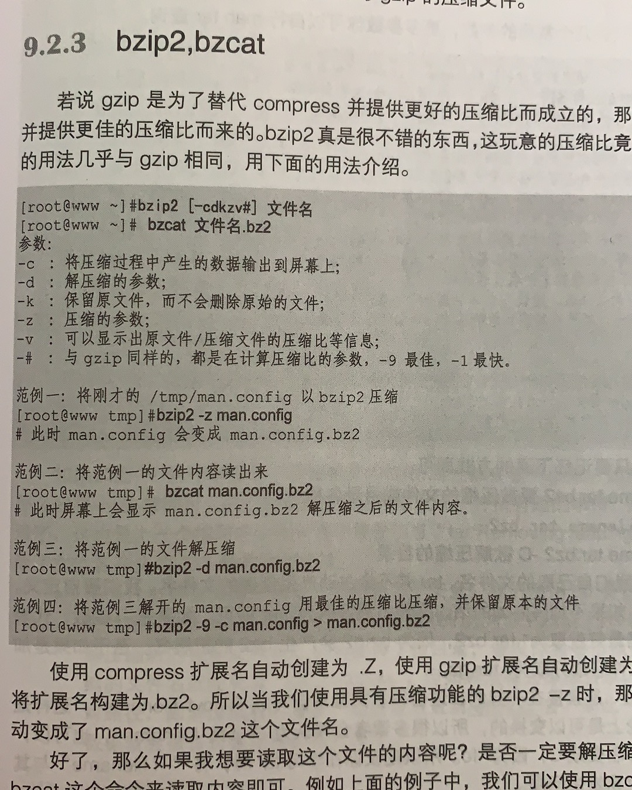
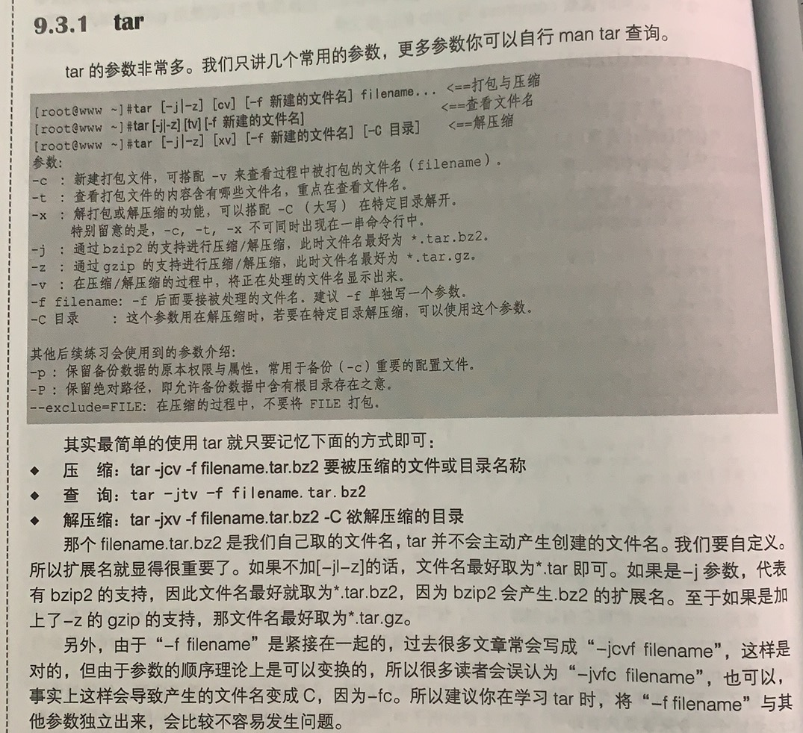

[TOC]

# 1. 压缩命令


## compress

## gzip、zcat(针对单一文件)
gzip:压缩命令，同时可以解压缩compress、zip、gzip的压缩文件。直接操作原文件
zcat:读取compress和gzip的压缩文件

```shell
# 对目录里的所有文件分别进行压缩
gzip -rf 文件
```



## bzip2、bzcat


# 2. 打包命令tar



# 3. 完整备份工具dump
## dump

## restore

# 4. 光盘写入工具
## mkisofs新建镜像文件

## Cdrecord光盘刻录工具