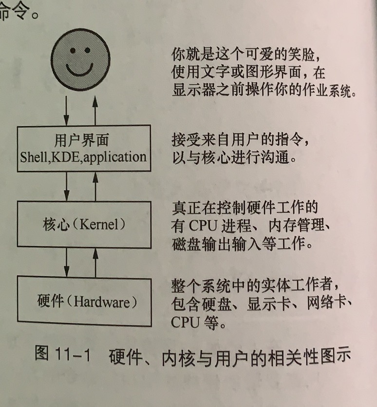
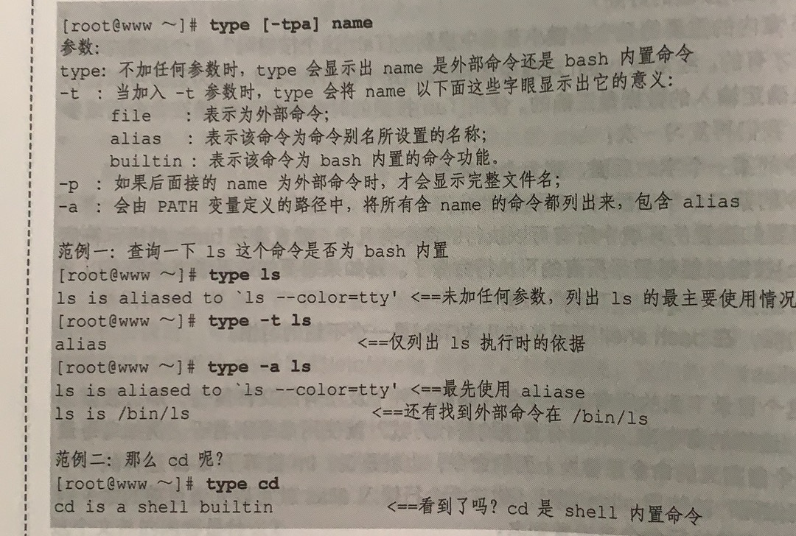
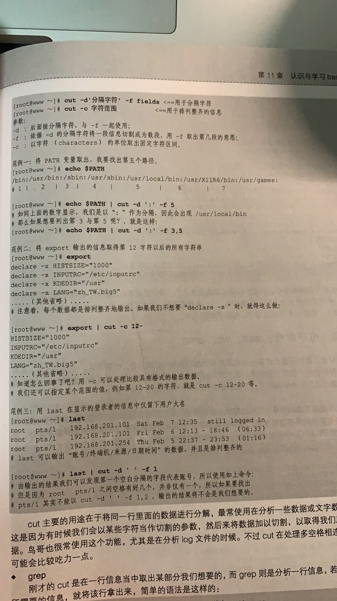
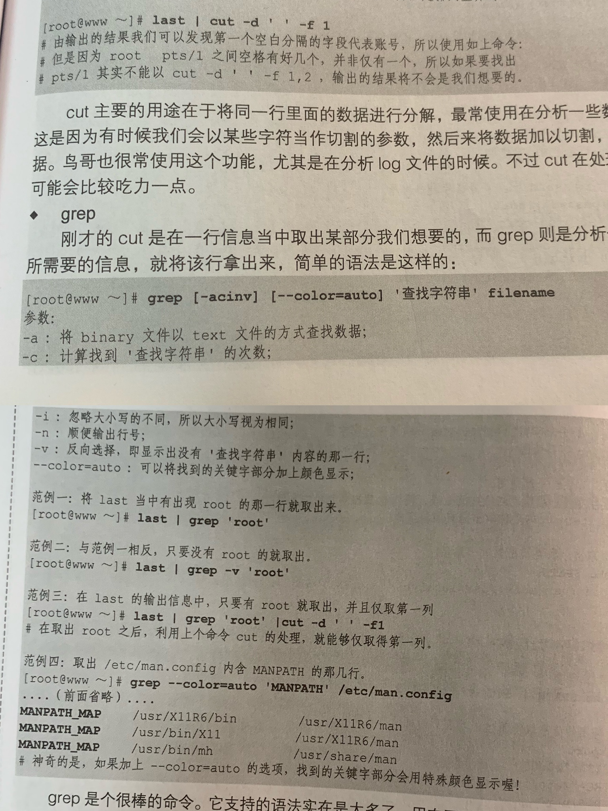
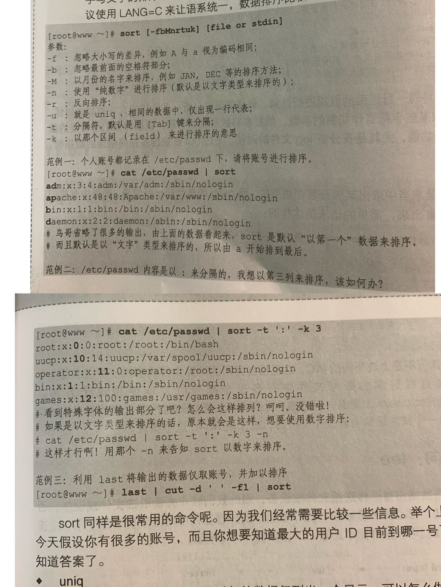
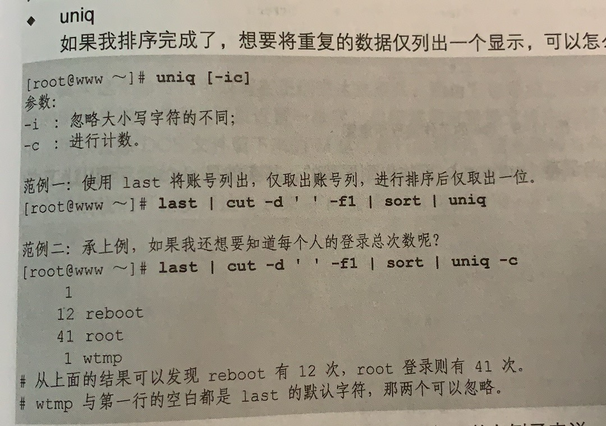
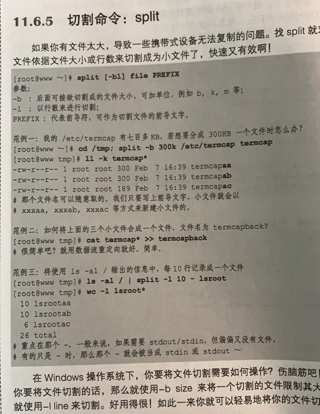

[TOC]

# 1. 认识shell
应用程序通过shell和操作系统内核进行通信，好让内核控制硬件来工作。

各种命令例如man、chmod、chown、vim等都是独立的应用程序，我们通过shell来操作这些应用程序，然后这些应用程序调用内核完成工作

广义的shell包括命令行模式软件和图形化界面软件



shell有很多版本，例如Bourne SHell(sh),Sun默认的C SHell,商业上用的K SHell等

Linux用的是Bourne Again SHell(简称bash)，是Bourne SHell的增强版本

查看有哪几种shell
```shell
chenpeipeideMacBook-Pro:~ chenpeipei$ cat /private/etc/shells 
# List of acceptable shells for chpass(1).
# Ftpd will not allow users to connect who are not using
# one of these shells.

/bin/bash
/bin/csh
/bin/dash
/bin/ksh
/bin/sh
/bin/tcsh
/bin/zsh
```


# 2. bash shell的内置命令type
有很多命令可能是独立的应用程序，也可能是bash的内置命令，可以通过type查看。
```shell
chenpeipeideMacBook-Pro:~ chenpeipei$ type cd
cd is a shell builtin
chenpeipeideMacBook-Pro:~ chenpeipei$ type chmod
chmod is /bin/chmod
chenpeipeideMacBook-Pro:~ chenpeipei$ type type
type is a shell builtin
```



# 3. 管道命令pipe
能接受standard input的数据，例如less、more、head、tail
```shell
# 使用less能一页一页翻阅ls出来的内容
chenpeipeideMacBook-Pro:~ chenpeipei$ ls -al /Users/chenpeipei/node_modules | less
```

## 3.1 选取命令
### 在一行信息中选取某部分cut 
```
cut -d '分隔字符' -f 第几段
cut -c 字符范围
-d:分隔行的字符
-f:和-d一起用，取出分隔后的某几段
-c:取出某个位子范围内的字符
```
```shell
# 取出PATH变量的第5个路径
chenpeipeideMacBook-Pro:~ chenpeipei$ echo $PATH
/Users/chenpeipei/phantomjs-2.1.1-macosx/bin:/usr/local/bin:/usr/bin:/bin:/usr/sbin:/sbin:/Applications/VMware Fusion.app/Contents/Public:/Users/chenpeipei/apache-maven-3.5.4/bin
chenpeipeideMacBook-Pro:~ chenpeipei$ echo $PATH | cut -d ':' -f 5
/usr/sbin
# 取出PATH变量的第3个和第5个路径
chenpeipeideMacBook-Pro:~ chenpeipei$ echo $PATH | cut -d ':' -f 3,5
/usr/bin:/usr/sbin
chenpeipeideMacBook-Pro:~ chenpeipei$ 

# 取出export每行信息中第12个字符以后的字符串
chenpeipeideMacBook-Pro:~ chenpeipei$ export
declare -x HOME="/Users/chenpeipei"
declare -x JAVA_HOME="/Library/Java/JavaVirtualMachines/jdk1.8.0_171.jdk/Contents/Home"
declare -x LANG="zh_CN.UTF-8"
...
chenpeipeideMacBook-Pro:~ chenpeipei$ export | cut -c 12-
HOME="/Users/chenpeipei"
JAVA_HOME="/Library/Java/JavaVirtualMachines/jdk1.8.0_171.jdk/Contents/Home"
LANG="zh_CN.UTF-8"
...

# 取出export每行信息中第12-20个字符
chenpeipeideMacBook-Pro:~ chenpeipei$ export | cut -c 12-20
HOME="/Us
JAVA_HOME
LANG="zh_
...
```



### 取出包含关键字的某行grep
```shell
# 取出last包含Apr的行
chenpeipeideMacBook-Pro:~ chenpeipei$ last | grep 'Apr'
chenpeipei  ttys002                   Sat Apr 25 16:08 - 16:08  (00:00)
chenpeipei  ttys001                   Fri Apr 24 13:59   still logged in
chenpeipei  ttys000                   Fri Apr 24 13:29 - 13:29  (00:00)
chenpeipei  ttys003                   Fri Apr 24 12:04 - 12:04  (00:00)

# -v 取出last中不包含Apr的行
chenpeipeideMacBook-Pro:~ chenpeipei$ last | grep -v 'Apr'
chenpeipei  ttys009                   Wed Mar 25 00:18 - 00:18  (00:00)
chenpeipei  ttys008                   Wed Mar 25 00:18 - 00:18  (00:00)
chenpeipei  console                   Tue Mar 24 23:10   still logged in
reboot    ~                         Tue Mar 24 23:06

# 取出last中包含Apr的行，并且用分隔符' '取出第一段
chenpeipeideMacBook-Pro:~ chenpeipei$ last | grep 'Apr' | cut -d ' ' -f 1
chenpeipei
chenpeipei
chenpeipei
chenpeipei
chenpeipei

# 取出文件package.json中包含author的行，并且加颜色显示
chenpeipeideMacBook-Pro:~ chenpeipei$ cat /Users/chenpeipei/package.json 
{
  "name": "package.json",
  "version": "1.0.0",
  "main": "index.js",
  "dependencies": {
    "element-ui": "^2.4.6",
    "formidable": "^1.2.1",
    "vue": "^2.5.17"
  },
  "devDependencies": {
    "webpack": "^4.17.1",
    "webpack-cli": "^3.1.0",
    "webpack-command": "^0.4.1"
  },
  "scripts": {
    "test": "echo \"Error: no test specified\" && exit 1"
  },
  "author": "",
  "license": "ISC",
  "keywords": [],
  "description": ""
}
chenpeipeideMacBook-Pro:~ chenpeipei$ grep --color=auto 'author' /Users/chenpeipei/package.json 
  "author": "",
```



## 3.2 排序命令
### sort
```shell
chenpeipeideMacBook-Pro:~ chenpeipei$ cat /Users/chenpeipei/package.json 
{
  "name": "package.json",
  "version": "1.0.0",
  "main": "index.js",
  "dependencies": {
    "element-ui": "^2.4.6",
    "formidable": "^1.2.1",
    "vue": "^2.5.17"
  },
  "devDependencies": {
    "webpack": "^4.17.1",
    "webpack-cli": "^3.1.0",
    "webpack-command": "^0.4.1"
  },
  "scripts": {
    "test": "echo \"Error: no test specified\" && exit 1"
  },
  "author": "",
  "license": "ISC",
  "keywords": [],
  "description": ""
}
chenpeipeideMacBook-Pro:~ chenpeipei$ cat /Users/chenpeipei/package.json | sort
    "element-ui": "^2.4.6",
    "formidable": "^1.2.1",
    "test": "echo \"Error: no test specified\" && exit 1"
    "vue": "^2.5.17"
    "webpack": "^4.17.1",
    "webpack-cli": "^3.1.0",
    "webpack-command": "^0.4.1"
  "author": "",
  "dependencies": {
  "description": ""
  "devDependencies": {
  "keywords": [],
  "license": "ISC",
  "main": "index.js",
  "name": "package.json",
  "scripts": {
  "version": "1.0.0",
  },
  },
  },
{
}

# 以：分隔内容，并且按第三列排序
chenpeipeideMacBook-Pro:~ chenpeipei$ cat /Users/chenpeipei/package.json | sort -t ':' -k 1
    "element-ui": "^2.4.6",
    "formidable": "^1.2.1",
    "test": "echo \"Error: no test specified\" && exit 1"
    "vue": "^2.5.17"
    "webpack": "^4.17.1",
    "webpack-cli": "^3.1.0",
    "webpack-command": "^0.4.1"
  "author": "",
  "dependencies": {
  "description": ""
  "devDependencies": {
  "keywords": [],
  "license": "ISC",
  "main": "index.js",
  "name": "package.json",
  "scripts": {
  "version": "1.0.0",
  },
  },
  },
{
}

# 将last输出的内容仅取第一列并排序
chenpeipeideMacBook-Pro:~ chenpeipei$ last | cut -d ' ' -f 1 | sort

chenpeipei
chenpeipei
chenpeipei
chenpeipei
chenpeipei
chenpeipei
chenpeipei
chenpeipei
chenpeipei
chenpeipei
chenpeipei
chenpeipei
chenpeipei
reboot
wtmp
```


### uniq
排序后，仅列出重复的第一个数据
```shell
chenpeipeideMacBook-Pro:~ chenpeipei$ last | cut -d ' ' -f 1 | sort |uniq

chenpeipei
reboot
wtmp
```


### wc
计算一些统计信息


## 3.3 切割命令split

