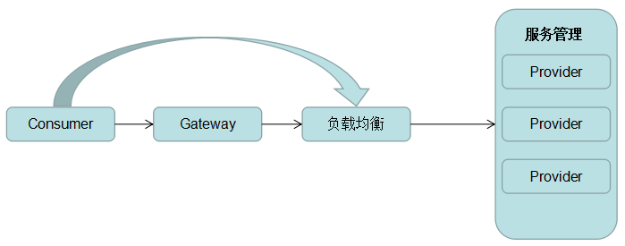
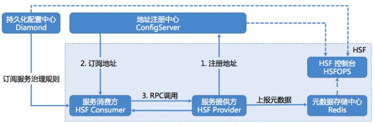

[TOC]

## 使用


将service包的接口打成二方包调用，调用者和服务提供者都需要配置


1. 自己的应用实现service

impl需要注册成hsf服务的提供者，xml配置或者注解配置
服务提供者的配置会发送到
```java
//注解配置（同时包含了@Component注解，首先他得是一个bean，其次才能提供远程服务）
@HSFProvider(serviceInterface = ContentReadService.class, serviceVersion = "${hsf.provider.service.version}")
public class ContentReadServiceImpl implements ContentReadService {
}


//xml配置
//1. bean配置
<bean id="juQianNiuSellerreportService" class="com.taobao.ju.mango.service.mtop.JuQianNiuSellerreportServiceImpl"/>

//2. HSF服务配置
<bean class="com.taobao.hsf.app.spring.util.HSFSpringProviderBean" init-method="init">
	<property name="serviceInterface" value="com.taobao.ju.mango.service.mtop.JuQianNiuSellerreportService"/>
	<property name="target" ref="juQianNiuSellerreportService"/>
	<property name="serviceVersion" value="${hsf.provider.service.version}"/>
	<property name="serializeType" value="java"/>
</bean>

<bean class="com.taobao.hsf.app.spring.util.HSFSpringProviderBean" init-method="init">
    <!--[设置] 发布服务的接口-->
    <property name="serviceInterface" value="com.alibaba.middleware.hsf.guide.api.service.OrderService"/>
    <!--[设置] 服务的实现对象 target必须配置[ref]，为需要发布为HSF服务的spring bean id-->
    <property name="target" ref="引用的BeanId"/>
    <!--[设置] 服务的版本-->
    <property name="serviceVersion" value="1.0.0"/>
    <!--[设置] 服务的归组-->
    <property name="serviceGroup" value="HSF"/>
    <!--[设置] 服务的响应时间-->
    <property name="clientTimeout" value="3000"/>
    <!--[设置] 服务传输业务对象时的序列化类型-->
    <property name="preferSerializeType" value="hessian2"/>
</bean>
```


2. 别人的应用调用

配置service的consumer，xml配置或者注解配置
```java
//注解配置（同时包含了@autowired注解，首先他得是一个bean，其次才能提供远程服务）
@HSFConsumer(serviceVersion = "${hsf.version.mango}")
private MarketContentApplyService marketContentApplyService;

//xml配置
<bean id="uicReadService" class="com.taobao.hsf.app.spring.util.HSFSpringConsumerBean" init-method="init">
	<property name="interfaceName" value="com.taobao.uic.common.service.userinfo.UicReadService"/>
	<property name="version" value="${hsf.version.uic}"/>
</bean>
```


但是这样的话会有一个问题，当服务端添加一个service的时候，调用端就要在自己的应用中配置对应的HSFSpringConsumerBean，会很麻烦。所以可以直接在服务端通过一个client来包掉这部分配置，服务端将HSFSpringConsumerBean注册好放到一个文件里，然后调用端加载client的时候将文件加载进来，这样就相当于在调用端配置了HSFSpringConsumerBean

以下是服务端代码：
```java
public class CargoClient implements InitializingBean, ApplicationContextAware {
    
    @Override
    public void afterPropertiesSet() throws Exception {
        init();
    }

    public void init() {
        if (started.compareAndSet(false, true)) {
            try {
                if (StringUtils.isBlank(appName)) {
                    throw new CargoException("appName must not be null.");
                }
                //会将配置HSFSpringConsumerBean的文件加载进来
                clientContainer = new CargoClientContext(this);
                Cargo.init(this);
                try {
                    Thread.sleep(maxWaitTimeForCsAddress);
                } catch (InterruptedException e) {
                    logger.error(e.getMessage(), e);
                }
            } catch (Exception e) {
                throw new CargoException("cargo client start exception.", e);
            }
        }
    }
}


public class CargoClientContext extends ClassPathXmlApplicationContext {

    private static final String CONFIG_FILES = "classpath:com/taobao/ju/cargo/bootstrap/config/cargo-hsf.xml";
    public CargoClientContext(CargoClient cargoClient) {
        super(new String[]{CONFIG_FILES}, false);
        this.addBeanFactoryPostProcessor(new PropertyConfigurer(cargoClient, new DiamondConfigLoader()));
        super.refresh();
    }
}
```


下面的文件就是配置了HSFSpringConsumerBean的cargo-hsf.xml
```xml
<?xml version="1.0" encoding="UTF-8"?>
<beans xmlns="http://www.springframework.org/schema/beans"
       xmlns:xsi="http://www.w3.org/2001/XMLSchema-instance"
       xsi:schemaLocation="http://www.springframework.org/schema/beans http://www.springframework.org/schema/beans/spring-beans.xsd"
        default-autowire="byName">

    <bean id="signRecordReadService" class="com.taobao.hsf.app.spring.util.HSFSpringConsumerBean">
        <property name="interfaceName" value="com.taobao.ju.cargo.service.signrecord.SignRecordReadService"/>
        <property name="version" value="${cargo.service.version}"/>
    </bean>

    <bean id="signRecordWriteService" class="com.taobao.hsf.app.spring.util.HSFSpringConsumerBean">
        <property name="interfaceName" value="com.taobao.ju.cargo.service.signrecord.SignRecordWriteService"/>
        <property name="version" value="${cargo.service.version}"/>
    </bean>
</beans>
```
Cargo里面就包含了各个service对应的client
```java
package com.taobao.ju.cargo.bootstrap;
/**
 * @author: liangzhan.qj
 */
public class Cargo {

    public static BranchWriteClient branchUpdate() {
        return applicationContext.getBean("branchWriteClient", BranchWriteClient.class);
    }

    public static MaterialServiceClient material() {
        return applicationContext.getBean("materialServiceClient", MaterialServiceClient.class);
    }
}

```


service对应的client里面就包装了service
```java
package com.taobao.ju.cargo.client.branch;

@Component
public class BranchWriteClient extends ServiceClient {

    @Resource
    private BranchProcessWriteService branchProcessWriteService;

    public Void auditReject(final BranchQueryInfo branchQueryInfo, final BizContext bizContext, final Operator operator) {
        return clientTemplate.execute(new CargoServiceInvoker<Void>() {
            @Override
            public ResultDO<Void> invoke() {
                return branchProcessWriteService.auditReject(branchQueryInfo, bizContext, operator, appInfo);
            }
        });
    }
}

```


在调用端就可以用如下调用:
```java
Cargo.marketContent().query().getContentBySignRecordId(contentQueryInfo, new AppInfo("porsche"));
```


## 原理
### RPC    
RPC（Remote Process Call）即远程服务调用，其流程较为简单。客户端consumer携带参数发送RPC请求到服务提供方provider，provider根据参数路由到具体函数、方法，并将执行获得的结果返回，至此一次RPC调用完成。


随着业务的发展，大数据时代的到来，服务提供方的压力也日益增大。单机应用的处理能力无论在软件，硬件上都受到限制，provider也不可能一直无限扩容。即使扩容，也存在着很多问题，即服务的路由和Consumer的负载均衡问题。因此，分布式服务架构应运而生，RPC发展到一定阶段思考的变革，成为了分布式服务、云计算的计算机基础。


### SOA
由于简单的RPC调用已经不能随着时代发展满足需求，因此复杂的业务逻辑对于分布式应用架构体系的需求愈发强烈。业务希望自己的服务是分布式部署的，请求是分流的，对数据的操作是能读写分离的，同时能屏蔽许多复杂需要自己编写的底层服务。借助已有的公共服务去快速的构建自己的应用，降低人力开发维护的成本和提高应用交付的效率，基因此，基于分布式服务思想的SOA（Service-Oriented Architecture）成了新的受追捧的架构。常见的SOA服务调用流程图如下



目前流行的分布式框架就是HSF


HSF (High-speed Service Framework)，高速服务框架，是在阿里巴巴内部广泛使用的分布式 RPC 服务框架。
HSF功能结构上分为6个部分，分别是：服务消费方、服务提供方、地址注册中心、持久化配置中心、元数据存储中心和HSF运维平台（HSF 控制台），它们组合在一起可以提供全功能的分布式服务，其中必须的是服务消费方、服务提供方和地址注册中心，上述功能结构的描述如下表：

| 名称 | 是否必须 | 功能描述 |
| --- | --- | --- |
| 服务消费方 | 是 | 消费服务提供方提供的服务，服务消费者通过地址注册中心订阅服务，根据订阅到的地址信息发起调用，地址注册中心作为旁路不参与调用 |
| 服务提供方 | 是 | 服务提供方会绑定一个端口（一般是12200），接受请求并提供服务，同时将地址信息发布到地址注册中心 |
| 地址注册中心 | 是 | 接受服务提供方发布的地址，当服务消费方根据服务进行订阅时，会将地址信息推送给服务消费方，注册中心就是服务信息的中介，提供服务发现的能力 |
| 持久化配置中心 | 否 | 持久化的配置中心用于存储 HSF 服务的各种治理规则，HSF 客户端在启动的过程中会向持久化配置中心订阅各种服务治理规则，如路由规则、归组规则、权重规则等，从而根据规则对调用过程的选址逻辑进行干预 |
| 元数据存储中心 | 否 | 元数据是指 HSF 服务对应的方法列表以及参数结构等信息，元数据不会对 HSF 的调用过程产生影响，因此元数据存储中心也并不是必须的。但考虑到服务运维的便捷性，HSF客户端在启动时会将元数据上报到元数据存储中心，以便提供给服务运维使用 |
| HSF运维平台 | 否 | HSF 控制台通过打通地址注册中心 ConfigServer、持久化配置中心 Diamond、元数据存储中心 Redis，为用户提供了一些列服务运维功能，包括服务查询、服务治理规则管理、服务测试、服务 Mock、单机运维等，旨在提高 HSF 服务研发的效率、运维的便捷性 |


> 在阿里巴巴集团内部：
> 地址注册中心的角色是由 ConfigServer 承担的
> 持久化配置中心的角色是由 Diamond 承担的
> 元数据存储中心的角色是由 Redis 承担的
> HSF 控制台的角色是由 HSFOPS 承担的


HSF功能结构之间的关系如下：



HSF框架如下：


