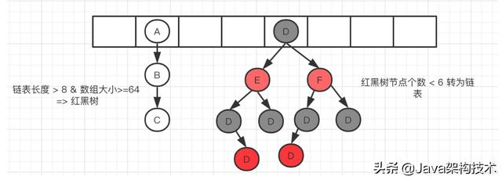
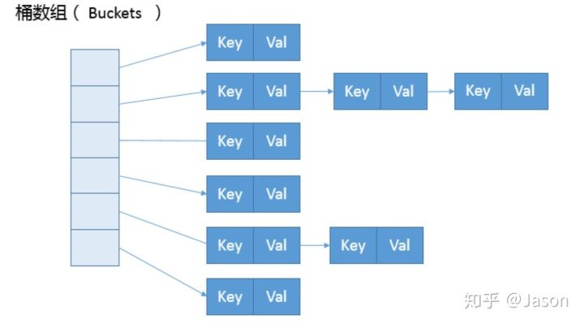
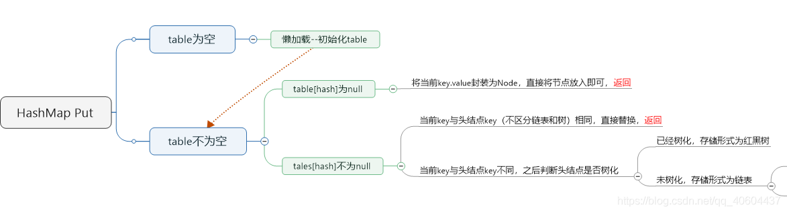
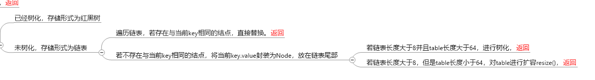
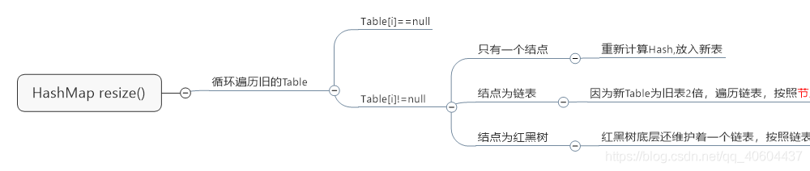
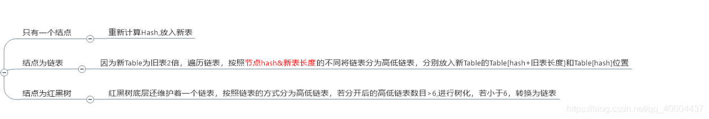
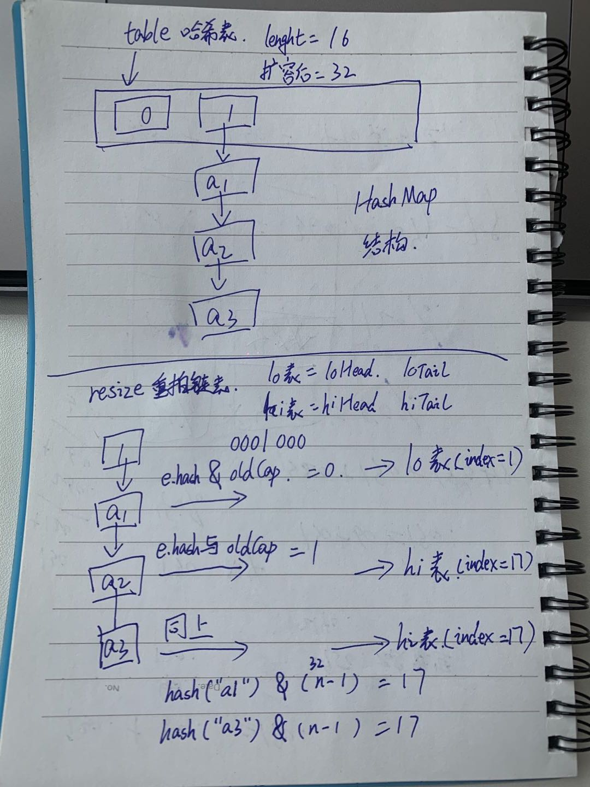
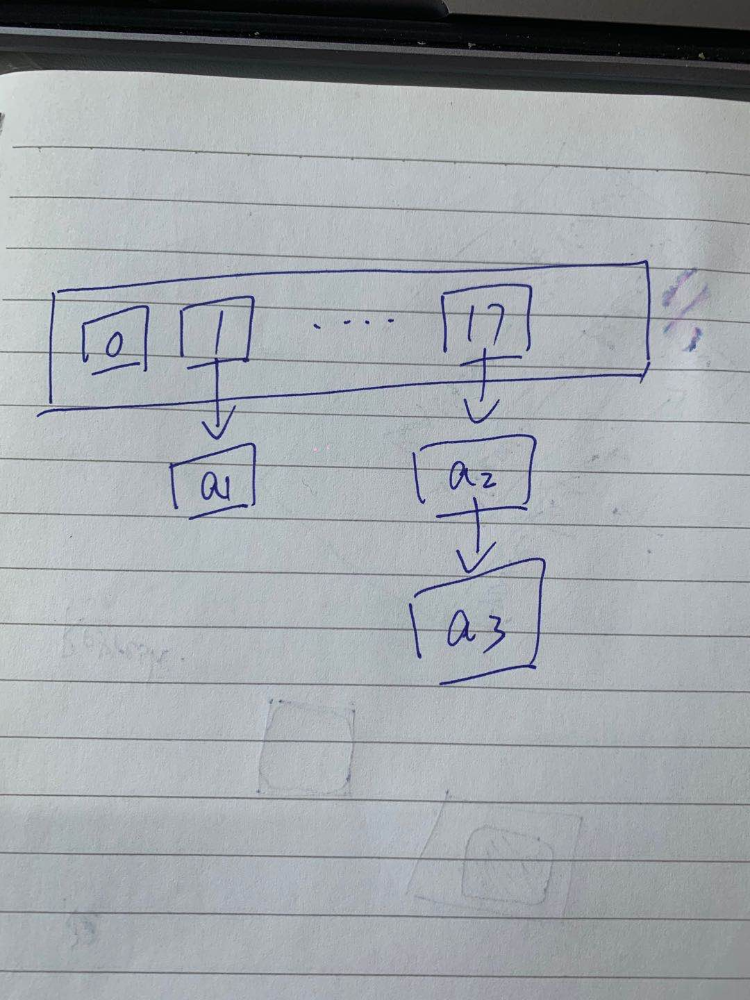

# 参考博文
[深入解析HashMap原理（基于JDK1.8）](https://blog.csdn.net/qq_37113604/article/details/81353626)

[HashMap底层原理详解(JDK1.8)](https://blog.csdn.net/qq_40604437/article/details/107806395?utm_medium=distribute.pc_relevant.none-task-blog-baidujs_title-0&spm=1001.2101.3001.4242)

[hashmap为什么是2的倍数_关于HashMap你需要知道的一些细节](https://blog.csdn.net/weixin_42534103/article/details/112423009)

[Java基础之HashMap原理分析（put、get、resize）](https://www.cnblogs.com/kezhuang/p/13673695.html)

[深入解读HashMap线程安全性问题](https://juejin.cn/post/6844903796225605640)

[阿里面试官：HashMap死循环问题？](https://zhuanlan.zhihu.com/p/80878915)

# 底层结构


## Node
数组+链表+红黑树

主体是一个Node数组(1.7中是Entry数组)，存储的是以Node为节点的链表，Node结构如下：
Node包含这个hash值、key、value和他的下一个节点
```java
static class Node<K,V> implements Map.Entry<K,V> {
        final int hash;
        final K key;
        V value;
        Node<K,V> next;
 
        Node(int hash, K key, V value, Node<K,V> next) {
            this.hash = hash;
            this.key = key;
            this.value = value;
            this.next = next;
        }
 
        public final int hashCode() {
            return Objects.hashCode(key) ^ Objects.hashCode(value);
        }
 
        public final boolean equals(Object o) {
            if (o == this)
                return true;
            if (o instanceof Map.Entry) {
                Map.Entry<?,?> e = (Map.Entry<?,?>)o;
                if (Objects.equals(key, e.getKey()) &&
                    Objects.equals(value, e.getValue()))
                    return true;
            }
            return false;
        }
}
```



## 构造函数
- 重要字段
```java
/**
默认初始容量为16
0000 0001 右移4位 0001 0000为16
必须为2的倍数
*/
static final int DEFAULT_INITIAL_CAPACITY = 1 << 4; 
 
//最大容量为int的最大值除2
static final int MAXIMUM_CAPACITY = 1 << 30;
 
//默认加载因子为0.75
//负载因子的作用是计算一个扩容阀值，当容器内数量达到阀值时，HashMap会进行一次resize
//扩容阀值=容器数量 * 负载因子
static final float DEFAULT_LOAD_FACTOR = 0.75f;
 
//阈值，如果主干数组上的链表的长度大于8，链表转化为红黑树
 static final int TREEIFY_THRESHOLD = 8;
 
//hash表扩容后，如果发现某一个红黑树的长度小于6，则会重新退化为链表
 static final int UNTREEIFY_THRESHOLD = 6;
 
//当hashmap容量大于64时，链表才能转成红黑树
 static final int MIN_TREEIFY_CAPACITY = 64;
 
//临界值=主干数组容量*负载因子
```

- 构造方法
```java
//initialCapacity为初始容量，loadFactor为负载因子
public HashMap(int initialCapacity, float loadFactor) {
        //初始容量小于0，抛出非法数据异常
        if (initialCapacity < 0)
            throw new IllegalArgumentException("Illegal initial capacity: " +
                                               initialCapacity);
        //初始容量最大为MAXIMUM_CAPACITY
        if (initialCapacity > MAXIMUM_CAPACITY)
            initialCapacity = MAXIMUM_CAPACITY;
        //负载因子必须大于0，并且是合法数字
        if (loadFactor <= 0 || Float.isNaN(loadFactor))
            throw new IllegalArgumentException("Illegal load factor: " +
                                               loadFactor);
        
        this.loadFactor = loadFactor;
        //将初始容量转成2次幂
        this.threshold = tableSizeFor(initialCapacity);
    }
 
    //tableSizeFor的作用就是，如果传入A，当A大于0，小于定义的最大容量时，
  //  如果A是2次幂则返回A，否则将A转化为一个比A大且差距最小的2次幂。  
    //例如传入7返回8，传入8返回8，传入9返回16
  static final int tableSizeFor(int cap) {
        int n = cap - 1;
        n |= n >>> 1;
        n |= n >>> 2;
        n |= n >>> 4;
        n |= n >>> 8;
        n |= n >>> 16;
        return (n < 0) ? 1 : (n >= MAXIMUM_CAPACITY) ? MAXIMUM_CAPACITY : n + 1;
    }
 
 
    //调用上面的构造方法，自定义初始容量，负载因子为默认的0.75
 public HashMap(int initialCapacity) {
        this(initialCapacity, DEFAULT_LOAD_FACTOR);
    }
 
 
    //默认构造方法，负载因子为0.75，初始容量为DEFAULT_INITIAL_CAPACITY=16，初始容量在第一次put时才会初始化
 public HashMap() {
        this.loadFactor = DEFAULT_LOAD_FACTOR; // all other fields defaulted
    }
 
 
    //传入一个MAP集合的构造方法
 public HashMap(Map<? extends K, ? extends V> m) {
        this.loadFactor = DEFAULT_LOAD_FACTOR;
        putMapEntries(m, false);
}
```

# 冲突解决方法
指对于一个待插入哈希表的数据元素，若按给定的哈希函数求得的哈希地址已经被占用，那么就按一定规则求下一哈希地址。如此重复，直到找到一个可用的地址保存该元素

## 1. 开放地址法

令H(i)=(H(key)+d(i))%m,i=1,2,...,m-1,其中H(key)为哈希函数，m为哈希表长，d(i)为增量序列

若取d(i)=1,2,3,...,m-1,则称线性探测再散列
若取d(i)=1^2 , -1^2 , 2^2 , -2^2 ,..., ±k^2,则称二次探测再散列
若取d(i)=伪随机数序列，则称伪随机探测再散列


## 2. 链地址法

将所有按给定的哈希函数求得的哈希地址相同的关键字存储在同一线性链表中，且使链表按关键字有序

HashMap就是采用链地址法。在node数组中，如果那个位置已经有node了，就会在哪个位子形成一个链表。将当前元素的key和链表中的数据key做比较，如果没有就插入链表，否则替换。

当链表过长时，查找效率就会降低，所以当链表长度大于8就会转换成红黑树

## 3. 公共溢出区

若关键字对应的哈希地址已经被占用，则保存到公共溢出区中


# put过程


1. 若table没有初始化则调用reszie()方法初始化。
2. 计算命中的散列表索引位置，公式为(n - 1) & hash（等价于hash%n）。其中n为散列表长度，hash为插入的键值对的key的哈希值。
判断散列表对应索引中的首节点是否为null，若为null，则创建链表，否则进入下一步。
3. 判断该首节点是否与插入的键值对的key和hash一致，若一致则替换该节点的值为value，否则进入下一步
4. 判断首节点是否为树节点，若是则调用树节点的putTreeVal()方法遍历红黑树，否则遍历链表。
5. 遍历红黑树时，若存在key和hash相同的节点就替换对应节点的值value，若不存在则插入新的树节点。
6. 遍历链表时，若存在key和hash相同的节点就替换对应节点的值为value。若找不到key和hash相同的节点，则链表尾部插入节点，同时进入下一步。
7. 若当前链表长度大于或等于树化阈值TREEIFY_THRESHOLD(8)时，则将链表转化为红黑树
```java
pulic V put(K key, V value) {
    putVal(hash(key), key, value, false, true);
}

/**
hash值高16位异或低16的理由：为了降低hash冲突的几率

假如数组容量是16(10000)，那么当hashCode&(n-1)时，只要hashCode后4为都是0，那不管高位怎么变，最终结果都是0，很容易碰撞。所以和高位异或是的hash分布更均匀
*/
public static final int(Object key) {
    int h;
    return (key == null) ? 0 : (h = key.hashCode()) ^ (h >>> 16);
}
transient Node<K,V>[] table;

final V putVal(int hash, K key, V value, boolean onlyIfAbsent,
               boolean evict) {
    Node<K,V>[] tab; Node<K,V> p; int n, i;
    //先判断当前容器内的哈希表是否是空的，如果table都是空的就会触发resize()扩容
    if ((tab = table) == null || (n = tab.length) == 0)
        n = (tab = resize()).length;
    //通过 (n - 1) & hash 计算索引，稍后单独展开计算过程
    if ((p = tab[i = (n - 1) & hash]) == null)
        //如果算出来的索引上是空的数据，直接创建Node对象存储在tab下
        tab[i] = newNode(hash, key, value, null);
    else {
        //如果tab[i]不为空，说明之前已经存有值了
        Node<K,V> e; K k;
        //如果key相同，则需要先把旧的 Node 对象取出来存储在e上，下边会对e做替换value的操作
        if (p.hash == hash &&
            ((k = p.key) == key || (key != null && key.equals(k))))
            e = p;
        else if (p instanceof TreeNode)
            e = ((TreeNode<K,V>)p).putTreeVal(this, tab, hash, key, value);
        else {
            //在这里解决hash冲突，判断当前 node[index].next 是否是空的，如果为空，就直接
            //创建新Node在next上，比如我贴的图上，a -> aa -> a1
            //大概逻辑就是a占了0索引，然后aa通过 (n - 1) & hash 得到的还是0索引
            //就会判断a的next节点，如果a的next节点不为空，就继续循环next节点。直到为空为止
            for (int binCount = 0; ; ++binCount) {
                if ((e = p.next) == null) {
                    p.next = newNode(hash, key, value, null);
                    //如果当前这个链表上数量超过8个，会直接转化为红黑树，因为红黑树查找效率
                    //要比普通的单向链表速度快，性能好
                    if (binCount >= TREEIFY_THRESHOLD - 1) // -1 for 1st
                        treeifyBin(tab, hash);
                    break;
                }
                if (e.hash == hash &&
                    ((k = e.key) == key || (key != null && key.equals(k))))
                    break;
                p = e;
            }
        }
        //只有替换value的时候，e才不会空
        if (e != null) { // existing mapping for key
            V oldValue = e.value;
            if (!onlyIfAbsent || oldValue == null)
                e.value = value;
            afterNodeAccess(e);
            return oldValue;
        }
    }
    //在增加计数器
    ++modCount;
    //判断是否超过了负载，如果超过了会进行一次扩容操作
    if (++size > threshold)
        resize();
    afterNodeInsertion(evict);
    return null;
}
```

# get()
1. 调用hash()方法获取到key的hash值
2. 若散列表table不为null且长度大于0且其索引为(n - 1) & hash（等价于hash%n）的节点不为null。则进入下一步，否则直接返回null
3. 判断首节点的key和hash是否与入参一致，若相同则返回首节点，否则进入下一步。
4. 判断首节点是否为树节点，若是则遍历红黑树，否则为链表，进入下一步
5. 遍历链表，检索key和hash与入参相同的节点，若找到则返回该节点，否则返回null
```java
/**
 * 返回key对应的value，如果不存在则返回null
 */
public V get(Object key) {
        Node<K,V> e;
        return (e = getNode(hash(key), key)) == null ? null : e.value;
    }

    final Node<K,V> getNode(int hash, Object key) {
        //tab用于暂存散列表table。first为散列表中对应索引的链表的头节点的指针。n存储tab的长度。i则为命中的散列表的索引
        Node<K,V>[] tab; Node<K,V> first, e; int n; K k;
        //初始化方法内的变量，同时尝试命中散列表
        if ((tab = table) != null && (n = tab.length) > 0 &&
            (first = tab[(n - 1) & hash]) != null) {
            if (first.hash == hash && 
                ((k = first.key) == key || (key != null && key.equals(k))))// 总是先检查链表的头节点
                return first;//头节点符合直接返回头节点
            if ((e = first.next) != null) {//是否只有一个节点
                if (first instanceof TreeNode)//判断头节点是否为红黑树节点
                    return ((TreeNode<K,V>)first).getTreeNode(hash, key);//改为遍历红黑树
                do {//遍历链表是否有符合的节点
                    if (e.hash == hash &&
                        ((k = e.key) == key || (key != null && key.equals(k))))
                        return e;
                } while ((e = e.next) != null);
            }
        }
        //不存在对应的key，返回null
        return null;
    }
```

# resize()



根据(e.hash & oldCap) == 0将节点区分放在高低链表。讲解如下：
```
16的二进制是 0001 0000
32的二进制是 0010 0000
64的二进制是 0100 0000

HashMap内的索引是 hash & n - 1，n代表哈希表的长度，
当n=16的时候，就是hash & 0000 1111，其实就是hash的后四位，
当n=32的时候，就是 hash & 0001 1111，就是后五位

假设我们的HashMap从16扩容都了32
其实可以用 e.hash & newCap -1 的方式来重新计算索引，然后在重排链表。
但是作者采用的是直接比对 e.hash 的第五位（16长度是后四位，32长度是后五位）进行 0 1校验，
如果为0那么就可以说明 (hash & n - 1)算出来的索引没有变化，还是当前位置。
要是第五位校验为1，那么这里（hash & n - 1)的公式得出来的索引就是向数据后偏移了16(oldCap)位

所以作者在这里定义了两个链表，
loHead低位表头，loTail低位表尾（靠近索引0）
hiHead高位表头，hiTail高位表尾（远离索引0）

然后对链表进行拆分，如果计算出来索引没有变化，那么还让他停留在这个链表上（拼接在loTail.next上）
如果计算索引发生了变化。那么数据就要放置在高位链表上（拼接在hiTail.next）上
```




```java
final Node<K,V>[] resize() {
    Node<K,V>[] oldTab = table;
    //检测旧容器，如果旧容器是空的，就代表不需要处理旧数据
    int oldCap = (oldTab == null) ? 0 : oldTab.length;
    //保存扩容阀值
    int oldThr = threshold;
    int newCap, newThr = 0;
    if (oldCap > 0) {
        if (oldCap >= MAXIMUM_CAPACITY) {
            threshold = Integer.MAX_VALUE;
            return oldTab;
        }
        // 对阀值进行扩容更新，左移1位代表一次2次幂
        else if ((newCap = oldCap << 1) < MAXIMUM_CAPACITY &&
                 oldCap >= DEFAULT_INITIAL_CAPACITY)
            newThr = oldThr << 1; // double threshold
    }
    else if (oldThr > 0) // initial capacity was placed in threshold
        newCap = oldThr;
    else {               // zero initial threshold signifies using defaults
        newCap = DEFAULT_INITIAL_CAPACITY;
        newThr = (int)(DEFAULT_LOAD_FACTOR * DEFAULT_INITIAL_CAPACITY);
    }
    //如果哈希表是空的，这里会进行初始化扩容阀值，
    if (newThr == 0) {
        float ft = (float)newCap * loadFactor;
        newThr = (newCap < MAXIMUM_CAPACITY && ft < (float)MAXIMUM_CAPACITY ?
                  (int)ft : Integer.MAX_VALUE);
    }
    threshold = newThr;
    @SuppressWarnings({"rawtypes","unchecked"})
        Node<K,V>[] newTab = (Node<K,V>[])new Node[newCap];
    table = newTab;
    //处理旧数据，把旧数据挪到newTab内，newTab就是扩容后的新数组
    if (oldTab != null) {
        for (int j = 0; j < oldCap; ++j) {
            Node<K,V> e;
            if ((e = oldTab[j]) != null) {
                oldTab[j] = null;
                //如果当前元素无链表，直接安置元素
                if (e.next == null)
                    newTab[e.hash & (newCap - 1)] = e;
                //红黑树处理
                else if (e instanceof TreeNode)
                    ((TreeNode<K,V>)e).split(this, newTab, j, oldCap);
                else { // preserve order
                    //对链表的索引重新计算，如果还是0，那说明索引没变化
                    //如果hash的第5位等于1的情况下，那说明 hash & n - 1 得出来的索引已经发生变化了，变化规则就是 j + oldCap，就是索引内向后偏移16个位置
                    Node<K,V> loHead = null, loTail = null;
                    Node<K,V> hiHead = null, hiTail = null;
                    Node<K,V> next;
                    do {
                        next = e.next;
                        if ((e.hash & oldCap) == 0) {
                            if (loTail == null)
                                loHead = e;
                            else
                                loTail.next = e;
                            loTail = e;
                        }
                        else {
                            if (hiTail == null)
                                hiHead = e;
                            else
                                hiTail.next = e;
                            hiTail = e;
                        }
                    } while ((e = next) != null);
                    if (loTail != null) {
                        loTail.next = null;
                        newTab[j] = loHead;
                    }
                    if (hiTail != null) {
                        hiTail.next = null;
                        newTab[j + oldCap] = hiHead;
                    }
                }
            }
        }
    }
    return newTab;
}
```

# 1.7 VS 1.8
1. jdk 8底层的数组是：Node[],而非Entry []
2. jdk7底层结构：数组+链表。jdk8底层结构：数组+链表+红黑树。
当链表过长时，查找效率就会变低
3. 形成链表时，七上八下(jdk7:新的元素指向旧的元素,头插。jdk8：旧的元素指向新的元素，尾插)。因为jdk8中需要在链表长度大于8的时候对链表进行树化，就需要遍历链表计算长度，就自然而然的可以查到最后一个位子
4. 当数组的某一个索引位置上的元素以链表形式存在的数据个数 > 8 且当前数组的长度 > 64时，此时此索引位置上的所数据改为使用红黑树存储。
5. JDK8使用了tableSizeFor方法计算阈值


# 为什么容量必须是2的幂次方
length 取 2 的整数次幂，是为了使不同 hash 值发生碰撞的概率较小，这样就能使元素在哈希表中均匀地散列。

为了找到 KEY 的位置在哈希表的哪个槽里面，需要计算hash(KEY) & (length - 1)

假设现在数组的长度 length 可能是偶数也可能是奇数

length 为偶数时，length-1 为奇数，奇数的二进制最后一位是 1，这样便保证了 hash &(length-1) 的最后一位可能为 0，也可能为 1（这取决于 h 的值），即 & 运算后的结果可能为偶数，也可能为奇数，这样便可以保证散列的均匀性。
```
例如 length = 4，length - 1 = 3, 3 的 二进制是 11
若此时的 hash 是 2，也就是 10，那么 10 & 11 = 10（偶数位置）
hash = 3，即 11 & 11 = 11 （奇数位置）
```
而如果 length 为奇数的话，很明显 length-1 为偶数，它的最后一位是 0，这样 hash & (length-1) 的最后一位肯定为 0，即只能为偶数，这样任何 hash 值都只会被散列到数组的偶数下标位置上，这便浪费了近一半的空间
```
length = 3， 3 - 1 = 2，他的二进制是 10
10 无论与什么树进行 & 运算，结果都是偶数
```


# 线程安全问题
## 多线程put数据丢失问题
场景：假如线程1和线程2都执行put操作，他们插入的key hash值相同，要插入到数组中同一个位置。

此时两个人都执行到if ((e = p.next) == null)这句代码，接下来线程1执行插入操作p.next = newNode(hash, key, value, null);

然后线程2也执行插入操作，那这样就覆盖掉了线程1插入的节点

## put和get并发时，可能导致get为null
场景：线程1执行put时，因为元素个数超出threshold而导致resize，线程2此时执行get，有可能导致这个问题

resize是先创建一个新的node数组赋值给HashMap维护的table数组，然后再进行rehash，假如线程1刚执行完赋值，线程2就执行get操作，这个时候get到的就是空的


## JDK7中HashMap并发put会造成循环链表，导致get时出现死循环
- JDK7
假如两个线程都执行resize操作，他们会使用同一个旧链表，但是会插入各自的新链表。而且新链表的顺序和旧链表的数据顺序是相反的(头插法)
假如旧链表中节点是：A->B->C,线程1和线程2都执行到指向A和A.next
1. 线程2抢到CPU，往自己的新链表中插入A
```
旧链表：B->C
线程1链表：null
线程2链表：A
```
2. 线程2再次抢到CPU，往自己的新链表中插入B，得到 B->A
```
旧链表：C
线程1链表：null
线程2链表：B->A
```
3. 线程1抢到CPU，他此时持有A和A.next的指针,A.next=B
```
旧链表：C
线程1链表：A
线程2链表：B->A
```
4. 线程1抢到CPU，他此时指向节点B，获取到B的next是A(线程2导致的结果)，将B插入链表
```
旧链表：C
线程1链表：B->A
线程2链表：B->A
```
5. 线程1再次抢到CPU，上一步获取到B的next是A，插入链表，导致循环链表
```
旧链表：C
线程1链表：A->B->A
线程2链表：B->A
```

- JDK8
使用了高低链表，hash&oldLength=0的在原位，hash&oldLength=1的放在后移oldLength的位子


# 为什么在解决hash冲突的时候，不直接用红黑树?而选择先用链表，再转红黑树?

因为红黑树需要进行左旋，右旋，变色这些操作来保持平衡，而单链表不需要。

当元素小于8个当时候，此时做查询操作，链表结构已经能保证查询性能。当元素大于8个的时候，此时需要红黑树来加快查询速度，但是新增节点的效率变慢了。

因此，如果一开始就用红黑树结构，元素太少，新增效率又比较慢，无疑这是浪费性能的


# 不用红黑树，用二叉查找树可以么?

可以。但是二叉查找树在特殊情况下会变成一条线性结构（这就跟原来使用链表结构一样了，造成很深的问题），遍历查找会非常慢