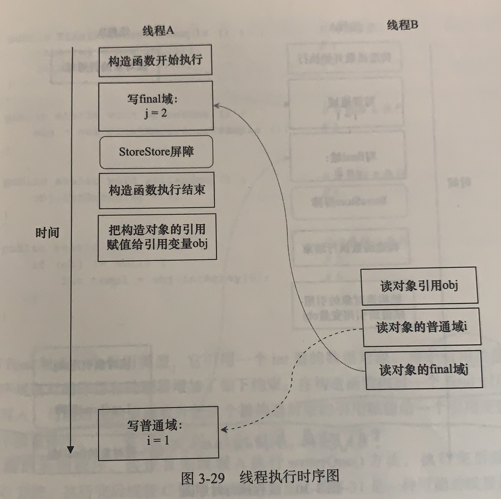
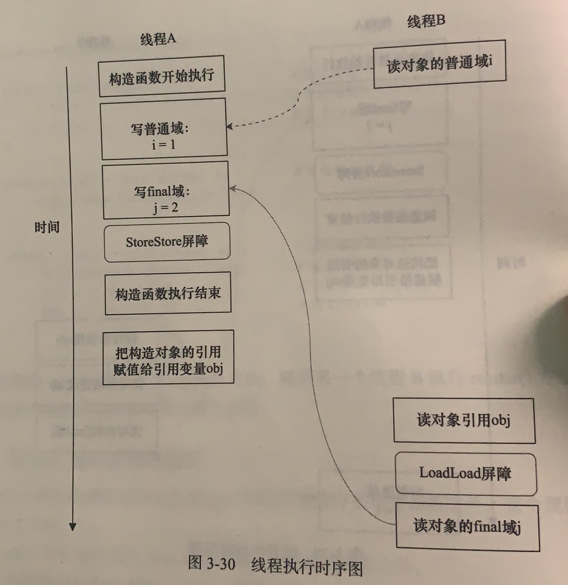
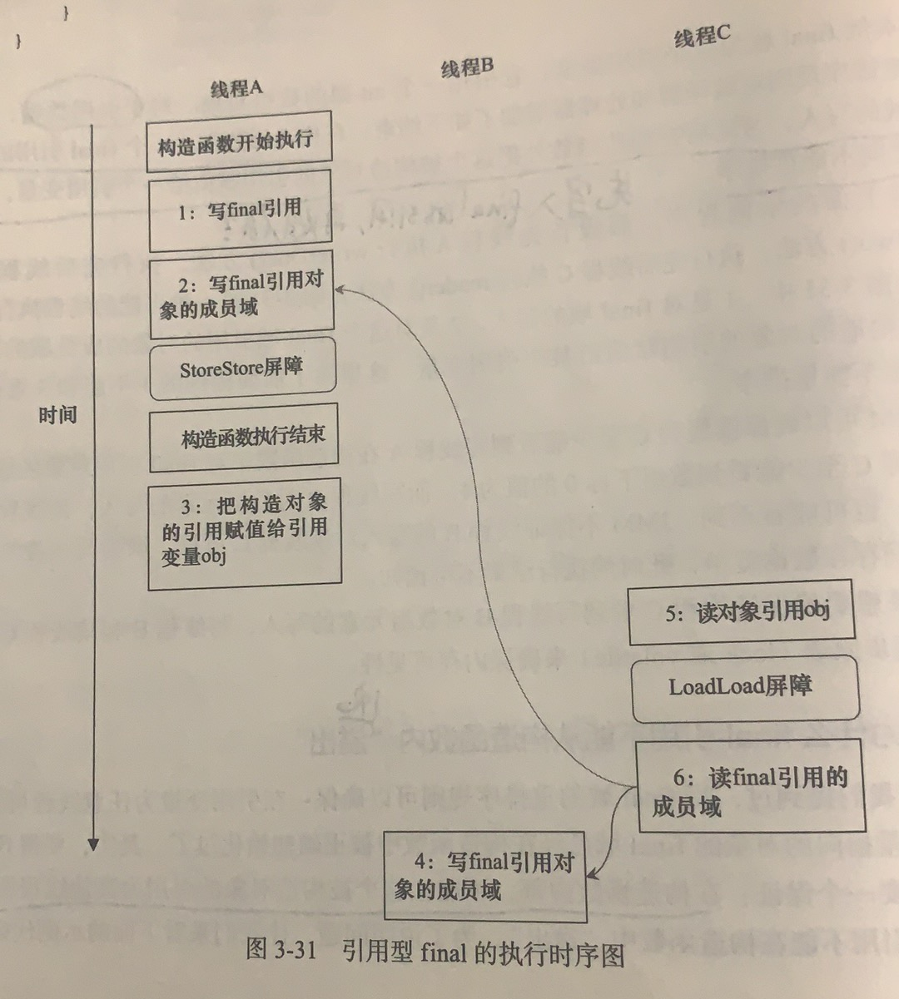

## 参考博文
[关键字: final详解](https://www.pdai.tech/md/java/thread/java-thread-x-key-final.html#final%e5%9f%9f%e9%87%8d%e6%8e%92%e5%ba%8f%e8%a7%84%e5%88%99)
[从class文件与JVM加载机制理解final、static、static final](https://bestqiang.github.io/2019/05/06/%E4%BB%8Eclass%E6%96%87%E4%BB%B6%E4%B8%8EJVM%E5%8A%A0%E8%BD%BD%E6%9C%BA%E5%88%B6%E7%90%86%E8%A7%A3final%E3%80%81static%E3%80%81static-final/)

[TOC]

# 1. final基础使用
## 1.1 修饰类
某个类被定义成final类代表他不能被继承，他的方法都隐式的final的，无法被重写。

如果想扩展final类，可以使用组合关系。例如String是final类型，想写个MyString复用所有String中方法，同时增加一个新的toMyString()的方法
```java
class MyString{

    private String innerString;

    // ...init & other methods

    // 支持老的方法
    public int length(){
        return innerString.length(); // 通过innerString调用老的方法
    }

    // 添加新方法
    public String toMyString(){
        //...
    }
}
```

## 1.2 修饰方法
### public final
如果某个public方法被定义成final方法，那么该类的子类不能重写这个方法

### private final
父类
```java
public class Base {
    private void test() {
    }
}
```

子类
```java
public class Son extends Base{
    public void test() {
    }
    public static void main(String[] args) {
        Son son = new Son();
        Base father = son;
        //father.test();
    }
}
```

Son中定义的test方法并不是重写Base中的test方法，而是自己定义了和Base无关的方法。
father.test()是不能被编译通过的，因为是private方法，只能在Base内部被调用

### final方法是可以被重载的
final方法不能被子类重写，但是可以被重载
```java
public class FinalExampleParent {
    public final void test() {
    }

    public final void test(String str) {
    }
}
```

## 1.3 修饰参数
如果将方法参数列表中的参数定义为final，那么不能对他重新赋值。但对于引用变量，可以更改它内部的属性
```java
package thread;

public class FinalTest {

    public static void main(String[] args) {
        Student student = new Student();
        student.setId(1);
        testParameterFinal(student);
        System.out.println(student.getId());
    }

    /**
     * 测试参数列表中的final参数
     */
    public static void testRefParameterFinal(final Student student) {
        //cannot assign a value to final variable "student"
        //student = new Student();
        student.setId(2);
    }

    public static void testBaseParameterFinal(final int param) {
        ////cannot assign a value to final variable "param"
        param = 2;
    }
}

```

## 1.4 修饰变量
### 不是final修饰的字段都是编译期常量
```java
public class Test {
    //编译期常量
    final int i = 1;
    final static int J = 1;
    final int[] a = {1,2,3,4};
    //非编译期常量
    Random r = new Random();
    final int k = r.nextInt();

    public static void main(String[] args) {

    }
}
```

### static final
static final变量必须在定义时赋值，不能在构造方法中赋值,因为它属于某个类
```java
package thread;

import java.util.Random;

public class FinalTest {

    static Random r = new Random();
    final int k = r.nextInt(10);
    static final int k2 = r.nextInt(10);

    public static void main(String[] args) {
        testStaticFinal();
    }

    public static void testStaticFinal() {
        FinalTest t1 = new FinalTest();
        System.out.println("k=" + t1.k + " k2=" + t1.k2);
        FinalTest t2 = new FinalTest();
        System.out.println("k=" + t2.k + " k2=" + t2.k2);
    }
}
/*
对于不同对象k的值不同，而k2的值相同。因为k2是static的，他仅在类第一次加载时赋值，而k会在每个对象被创建时赋值
k=1 k2=2
k=9 k2=2
*/
```


### blank final
对于final变量，必须在使用前赋值，他有两种方式
1. 在定义处进行赋值(这不叫空白final)
2. 在构造器中进行赋值，保证了该值在被使用前赋值。

```java
public class Test {
    final int i1 = 1;
    final int i2;//空白final
    public Test() {
        i2 = 1;
    }
    public Test(int x) {
        this.i2 = x;
    }
}
  
```

# 2. final和static
static变量在准备阶段初始化，在初始化阶段赋值 ([类加载机制](../JVM/类加载机制.md))

final变量在运行期间初始化。可以在定义时赋值，也可以在构造方法中赋值。必须保证final变量在使用前就被初始化

static final修饰的字段在javac编译时生成comstantValue属性，在类加载的准备阶段直接把constantValue的值赋给该字段

```java
private static final int random = new Random().nestInt();//每次发生类装载时都会赋值一次，且赋的值都不一样 
private final int random = new Random().nestInt();//每次生成这个类的实例时都会赋值一次，且赋的值都不一样
```


# 3. final域重排序规则
对final变量，编译器和处理器要遵循两个重排序规则：
1. 在构造函数中给final变量赋值，和将该对象的引用赋值给其他引用变量之间不能重排序。就是对final变量的赋值必须在构造函数结束之前完成
2. 
```java
public class FinalDemo {
    private int a;  //普通域
    private final int b; //final域
    private static FinalDemo finalDemo;

    public FinalDemo() { //构造函数
        a = 1; // 1. 写普通域
        b = 2; // 2. 写final域
    }

    public static void writer() { //写线程A执行
    //1. 构造FinalDemo类型的对象
    //2. 将该对象的引用赋值给引用变量finalDemo
        finalDemo = new FinalDemo();
    }

    public static void reader() { //读线程B执行
        FinalDemo demo = finalDemo; // 3.读对象引用
        int a = demo.a;    //4.读普通域
        int b = demo.b;    //5.读final域
    }
}
```

## 3.1 写final域
写final域的重排序规则禁止把final变量的写(给final变量赋值)重排序到构造函数之外：
1. JMM禁止==编译器==把给final变量的赋值操作重排序到构造函数之外
2. 编译器会在给final变量的赋值语句后面，构造函数return之前，插入一个storestore屏障来禁止==处理器==把final域的写重排序到构造函数之外


writer()由线程A执行，它只包含一行代码，该行代码包含两个步骤：
1. 构造FinalDemo类型的对象
2. 将该对象的引用赋值给引用变量finalDemo


下面是可能的一种执行顺序：
1. 对于final变量：在构造函数结束之前，该对象被其他线程访问之前，对final的写操作已经完成
2. 对于普通变量：对普通变量的赋值有可能被重排序到构造函数之外。对于普通变量i,线程B就在线程A执行i=1之前读了i，导致线程B读到错误的i




## 3.2 读final域
读final变量的重排序规则是：
1. 针对处理器：JMM禁止对初次读对象引用，和初次读该对象包含的final变量这两个操作的重排序
2. 针对编译器：编译器在读final变量的代码之前插入loadload屏障


reader()由线程B执行，它包含3个操作：
1. 初次读引用变量finalDemo;
2. 初次读引用变量finalDemo的普通域a;
3. 初次读引用变量finalDemo的final与b


下面是可能的一种执行顺序：
1. 对于final变量：在读final变量前，一定会先读包含该变量的对象的引用。
2. 对于普通变量：可能对普通变量的读操作会被重排序到读对象引用之前。对于普通变量i，线程A还没执行i=1，线程B就去读了。



## 3.3 对于引用类型的final
如果final变量是引用类型，还会增加一条重排序规则：
在构造函数中对final引用的对象的成员域的写入，和将该对象赋值给其他引用变量，这两个操作不能重排序

```java
public class FinalReferenceDemo {
    final int[] arrays;
    private FinalReferenceDemo finalReferenceDemo;

    public FinalReferenceDemo() { //构造函数
        arrays = new int[1];  //1
        arrays[0] = 1;        //2
    }

    public void writerOne() { //写线程A执行
        finalReferenceDemo = new FinalReferenceDemo(); //3
    }

    public void writerTwo() { //写线程B执行
        arrays[0] = 2;  //4
    }

    public void reader() { // 读线程C执行
        if (finalReferenceDemo != null) {  //5
            int temp = finalReferenceDemo.arrays[0];  //6
        }
    }
}
```

下面是可能的一个执行过程：
1. 线程A执行writeone方法，除了1和3不能重排序外，2和3也不能重排序。
2. 线程C一定能看到线程A执行构造函数过程中对intArray[0]的写入。但是线程B的写入不能保证线程C看的见，需要使用锁或volatile保证可见性



## 3.4 被构造对象的引用不能在构造函数中溢出
意思是说不要在构造函数中将this赋值给任何变量

因为构造函数中操作1和2之间没有数据依赖性，1和2可以重排序，先执行了2，这个时候引用对象referenceDemo是个没有完全初始化的对象，而当线程B去读取该对象时就会出错。尽管依然满足了final域写重排序规则：在引用对象对所有线程可见时，其final域已经完全初始化成功。但是，引用对象“this”逸出，该代码依然存在线程安全的问题。
```java
public class FinalReferenceEscapeDemo {
    private final int a;
    private FinalReferenceEscapeDemo referenceDemo;

    public FinalReferenceEscapeDemo() {
        a = 1;  //1
        referenceDemo = this; //2
    }

    public void writer() { //线程A执行
        new FinalReferenceEscapeDemo();
    }

    public void reader() { //线程B执行
        if (referenceDemo != null) {  //3
            int temp = referenceDemo.a; //4
        }
    }
}
```

可能的执行顺序：[发布与逸出](../线程与并发/发布与逸出.md)


# 4. final会禁止所有类型转换
```java
byte b1=1;
byte b2=3;
/*当程序执行到这一行的时候会出错，因为b1、b2可以自动转换成int类型的变量，
运算时java虚拟机对它进行了转换，结果导致把一个int赋值给byte-----出错。
byte是8位，int是32位。byte可以转换成int，int不能转换成byte
*/
byte b3=b1+b2;


//对b1 b2加上final就不会出错
final byte b1=1;
final byte b2=3;
byte b3=b1+b2;
 
```