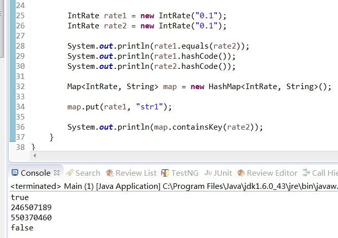

当Object类int java.lang.Object.equals()方法被重写时，通常有必要重写 hashCode 方法，以维护 hashCode 方法的常规协定，该协定声明相等对象必须具有相等的哈希码
```
object对象中的 public boolean equals(Object obj)，对于任何非空引用值 x 和 y，
1. 当且仅当 x 和 y 引用同一个对象时，此方法才返回 true；
2. 当obj1.equals(obj2)为true时，obj1.hashCode() == obj2.hashCode()必须为true
3. 当obj1.hashCode() == obj2.hashCode()为false时，obj1.equals(obj2)必须为false
```

hashcode是用于散列数据的快速存取，如利用HashSet/HashMap/Hashtable类来存储数据时，都是根据存储对象的hashcode值来进行判断是否相同的。这样如果我们对一个对象重写了euqals，意思是只要对象的成员变量值都相等那么euqals就等于true，但不重写hashcode，那么我们再new一个新的对象，当原对象.equals（新对象）等于true时，两者的hashcode却是不一样的，由此将产生了理解的不一致，如在存储散列集合时（如Set类），将会存储了两个值一样的对象，导致混淆，因此，就也需要重写hashcode()。




hashMap源码：


 hashMap会先判断容器中是否存在与IntRate2相同hashCode的对象，如果找不到直接就返回false，如果找到了再调用equals(Object)方法判断2个对象是否相等。所以在重写equals方法的同时，也不要忘记重写hashCode方法。


扩展Set如何存储不重复对象的场景：

这里的不重复是有场景语义信息的，需要开发自己去定义自己的hashCode和equals，当向集合Set中增加对象时，首先计算要增加对象的hashCode码，根据该值来得到一个位置来存放当前的对象，当在该位置没有一个对象存在的话，那么集合Set认为该对象在集合中不存在，直接增加进去。如果在该位置有一个对象的话，接着将准备增加到集合中的对象与该位置上的对象进行equals方法比较，如果该equals方法返回false，那么集合认为集合中不存在该对象，再进行一次散列，将该对象放到散列后计算出的新地址里，如果equals方法返回true，那么集合认为集合中已经存在该对象了，不会再将该对象增加到集合中了。

最后，虽然使用自定义对象做为key是不常见的编程方式，但如果真用到了，那么是必须重写hashCode和equals方法，否则集合存入Map，那么如何提取出来呢？因为新生成的对象它的hashCode值并不相同