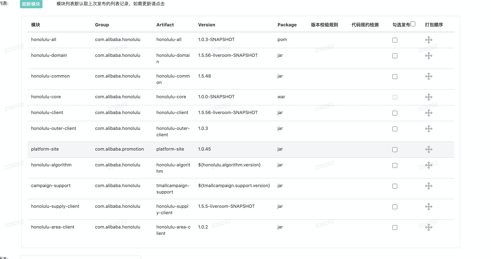

# maven问题

## 类找不到问题
如果在引入一个新的包之后，发现某个类找不到了，可以做以下排查：

1. 看这个类是在哪个包里面，可以按情况选择升级包版本或者引入新包
1. 看这个包的maven结构
```
mvn dependency:tree>tree.log
```

3. 不要使用snapshot的包


## 包冲突问题
假如在tmc-business上有三个分支有A B C三个版本,Porsche上引入了这A B C三个版本,那么在部署的时候就会造成冲突的问题。


解决方案是：

1. 在IDEA中切换到集成分支，将集成分支的包版本改成A，部署
1. 在aone上“提交二方库发布”一起打包



3. Porsche上所有的版本都选择A版本


