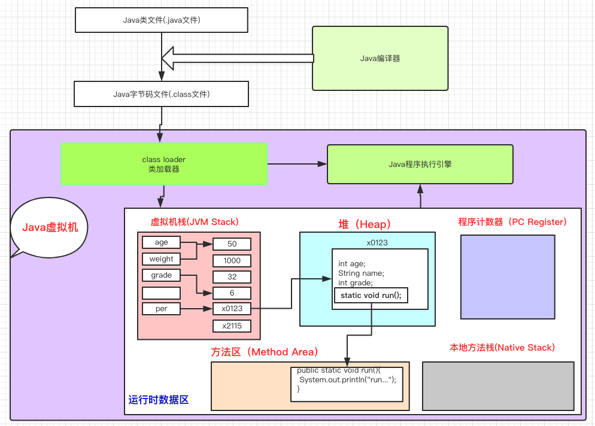
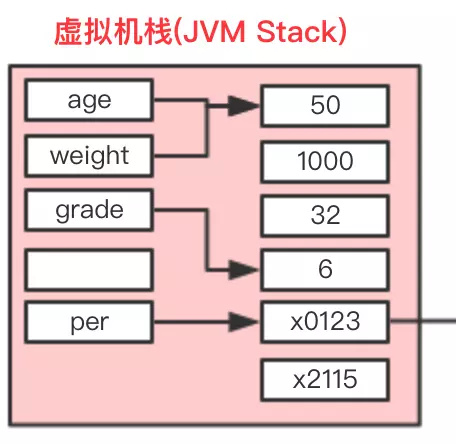
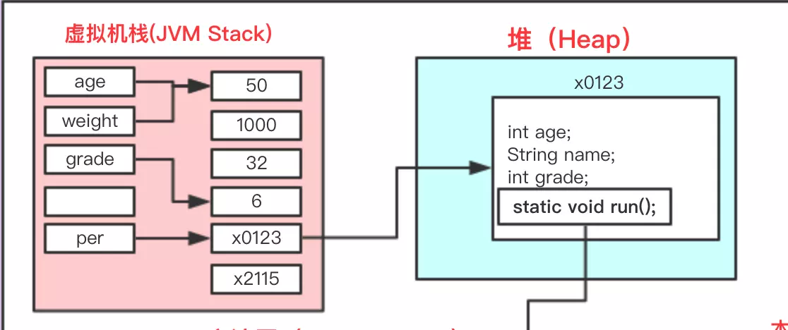
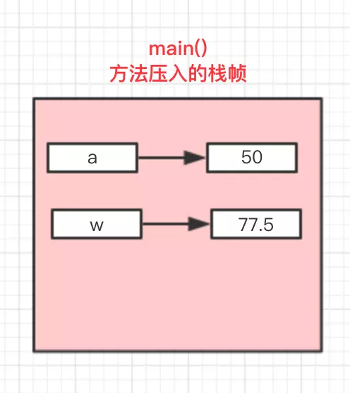
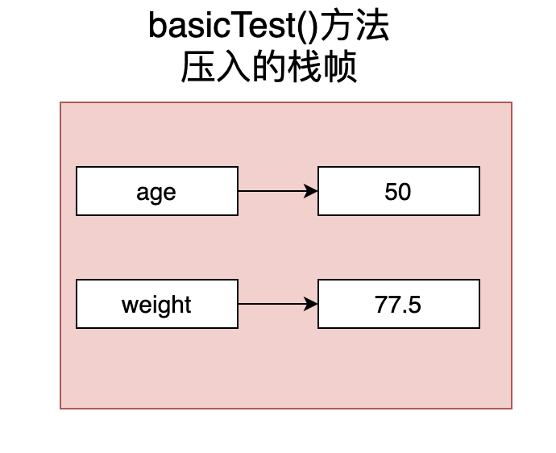

## 参考博文
[这一次，彻底解决Java的值传递和引用传递](https://juejin.im/post/5bce68226fb9a05ce46a0476)


[TOC]

# 1. 形参和实参
1. 形参：
方法的参数列表，例如func(int a)中的a只有在方法被调用时才在栈帧的局部变量表中分配内存。在方法结束后，栈帧退出，a的内存也被释放

2. 实参：
方法被调用时传进来的实际值，在方法调用前他就已经初始化好。


int a=10是实参，而func(int a)中的a是形参
```java
public static void main(String[] args){
    int a=10;//实参
    func(a);
}

public static void func(int a){
    a=20;
    System.out.println(a);
}
```

# 2. 变量在内存中的存储


## 2.1 基本数据类型的存储
### 基本数据类型的局部变量
局部变量是定义在方法中的，所以局部变量名会存在局部变量表中，而值也会存在虚拟机栈的内存空间内。所以声明并初始化基本数据类型的局部变量，他的变量名和字面值都是存在虚拟机栈中的

以下赋值操作其实分为两个步骤：
1. 创建一个名为age的变量放入局部变量表中
2. 在虚拟机栈中查找是否存在值为50的内容，如果存在则将age指向这个地址。否则在栈中开辟一块内存放入50，并将age指向这个地址
```java
int age = 50;
```

再接着执行以下语句：
1. 创建一个名为weight的变量放入局部变量表中
2. 在栈中找到一个50的值，将weight指向这个地址
```java
int weight = 50;
```

再接着执行以下语句：
在栈中寻找是否有40的值，没有就开辟空间存入40，并将weight指向这个地址。而age的值不会变
```java
weight = 40;
```
所以虚拟机栈中的值是该线程内共享的，对于多个变量赋值同一个值会指向同一个地址。而当变量再次赋值时，并不去改变原指向的字面量的内容。而是去寻找是否存在要赋值的数据，如果存在就重新指向这个地址；如果不存在就开辟新空间再指向他





### 基本数据类型的成员变量
这里的成员变量指的是在类中定义的非static变量。

对象的成员变量的名和值存在堆为该对象分配的内存中




### 基本数据类型的静态变量
这里的静态变量指的是在类中定义的static变量

对象的类变量的名和初始值已经在类加载的准备阶段就放入方法区的运行时常量池中了，并在初始化阶段赋值。随着类的生命周期加载和释放


## 2.2 引用数据类型的存储
[对象创建过程](../JVM/对象创建过程.md)
引用类型包括对象和数组，局部变量表中存储变量名，他的值是对象在堆中的内存地址。而对象的具体内容(属性字段)则存在堆里


# 3. 值传递和引用传递
## 3.1 值传递
实参传入到形参中传递的是实参的一份副本，无论形参怎么变不会影响实参。

对于下面的代码，传入的a,w在经过方法调用后值没有变
```java
public static void main(String[] args) {
        int a=50;
        float w=77.5f;
        basicTest(a,w);
        System.out.println("方法执行后的age："+a);
        System.out.println("方法执行后的weight："+w);

}

public static void basicTest(int age, float weight) {
        System.out.println("传入的age：" + age);
        System.out.println("传入的weight：" + weight);
        age = 33;
        weight = 89.5f;
        System.out.println("方法内重新赋值后的age：" + age);
        System.out.println("方法内重新赋值后的weight：" + weight);
}
/*
传入的age：50
传入的weight：77.5
方法内重新赋值后的age：33
方法内重新赋值后的weight：89.5
方法执行后的age：50
方法执行后的weight：77.5
*/
```
1. 程序启动时，首先调用main方法。
2. 为main方法往虚拟机栈中插入一个栈帧来存放main的局部变量表，操作数，方法出口等信息
3. a和w存在栈帧的局部变量表中


4. 调用basicTest方法，，为basicTest方法插入一个栈帧，栈帧的局部变量表中也有a和w两个变量值，他们是独立于main栈帧中的，是传入参数的一个拷贝


5. 当内部重新赋值时，会在basicTest存找是否存在这两个新值，如果存在就将a和w的指针指向新值。basicTest的a和w的改动都只影响当前栈帧，当basicTest执行结束后，basicTest的a和w都会销毁。当返回main方法的栈帧后，输出的又是main栈帧中的a和w


## 3.2 引用传递
引用变量的值是指向堆中该对象的内存地址，那么当实参传入形参时，传递的是实参中存储的堆地址的拷贝。实参和形参就指向同一块内存地址，形参对对象的改变会影响到实参

在下面的代码中:
1. 在main方法栈帧的局部变量表中存入一个p的引用，并在堆中开辟地址存储对象p的数据，同时让p指向该内存地址
![referencemain]](./pic/值传递和引用传递_referencemain.png)
2. 执行referenceTest，传入person的是p值的一份拷贝。那么referenceTest的person就和p指向了同一个地址。但是p和person仍然是局部变量表中独立的两个变量，他们存储的地址值也是相互独立的，只是存储了同一个堆中的地址
3. 当person对name进行改变时，因为指向同一个堆对象，p打印name也会发生改变

```java
public static void main(String[] args) {
        Person p= new Person();
        p.setName("我是pp");
        p.setAge(45);
        referenceTest(p);
        System.out.println("方法执行后的name："+p.getName());

}
public static void referenceTest(Person person) {
        System.out.println("传入的person的name：" + person.getName());
        person.setName("我是张小龙");
        System.out.println("方法内重新赋值后的name：" + person.getName());
}
/*
传入的person的name：我是pp
方法内重新赋值后的name：我是张小龙
方法执行后的name：我是张小龙
*/
```

但如果在referenceTest重新赋值person，那么person就指向了一个新的堆内存地址。person所做的操作和p无关
```java
public static void referenceTest(Person person) {
        System.out.println("传入的person的name：" + person.getName());
        person = new Person();
        person.setName("我是张小龙");
        System.out.println("方法内重新赋值后的name：" + person.getName());
}
/*
传入的person的name：我是pp
方法内重新赋值后的name：我是张小龙
方法执行后的name：我是pp
*/
```
而针对String类型，因为他是final的，对String做的改变都会生成一个新的对象，从而使形参指向新的地址，不会影响到实参