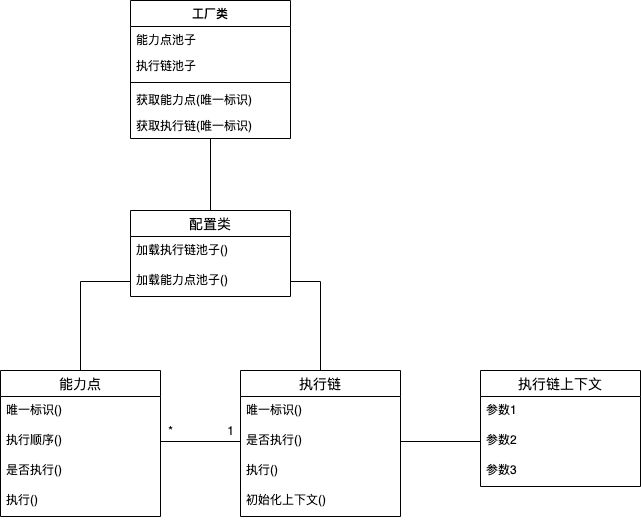
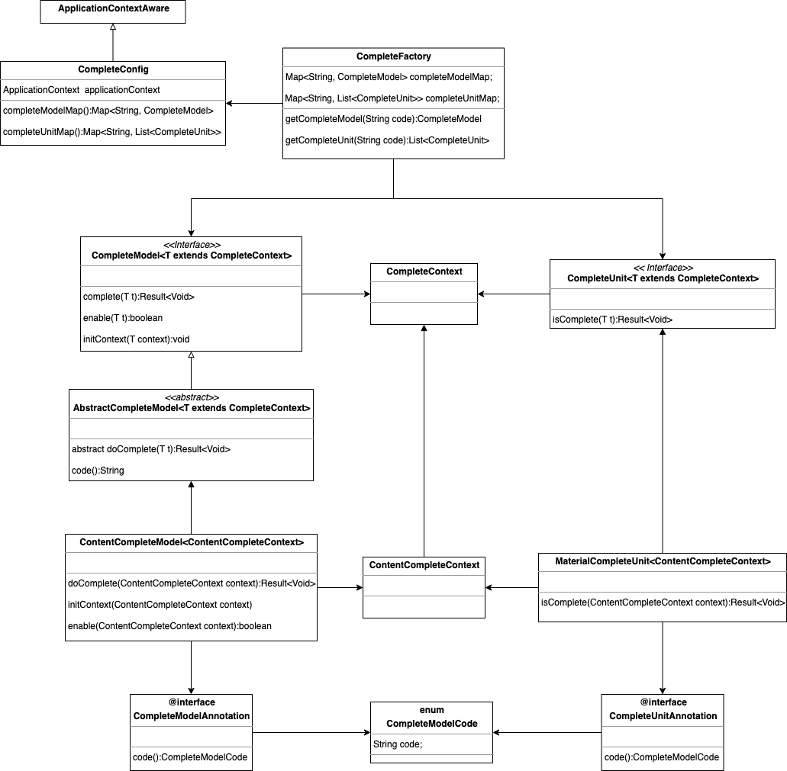

# 取缔if-else：执行链框架

# 设计背景
我们在程序设计中经常会遇到类似以下这样的场景：

1. 通过一系列的逻辑判断决定数据A是否应该从状态1变成状态2
1. 通过一系列的逻辑判断决定某个操作是否执行完成


最简单的代码可能是这样
```java
if (!逻辑1) {
    return false;
}

if (!逻辑2) {
    return false;
}

if (!逻辑3) {
    return false;
}

change status to 状态2
return true;
```


这样的代码堆砌大概是对当前来说最简单粗暴的实现，但是对后期的维护和逻辑的变更又是最头疼和残忍的了。


对于这类场景，其实我们可以把它们都抽象成如下思想：

1. 将一系列逻辑判断抽象成一个个独立的能力点
1. 建立自动化执行链去执行能力点


# 思路分析
### 能力点
能力点应该具备以下功能：

1. 能力点是一个个独立的单元，各能力点之间互不影响、独立执行
1. 执行链中，某个能力点是否执行可以动态扩展
1. 建立一个能力点池子


### 执行链
执行链应该具备以下功能：

1. 在能力点池子中找到所有归属本链的能力点并且执行
1. 如果当所有能力点执行完后还有最终操作则执行
1. 建立一个执行链池子


# 模型设计



- 工厂类

根据能力点/执行链的唯一标识获取实例


- 配置类

加载能力点/执行链，建立对应的池子


- 能力点

| 接口 | 说明 |
| --- | --- |
| 唯一标识() | 唯一标识一个能力点，执行链根据这个标识来寻找能力点

可以使用自定义注解来替代唯一标识，并且使得能力点和执行链的唯一标识相同 |
| 执行顺序() | 决定该能力点在执行链中的执行次序 |
| 是否执行() | 在某次执行中该能力点是否需要执行 |
| 执行() | 能力点的具体执行 |


- 执行链

| 接口 | 说明 |
| --- | --- |
| 唯一标识() | 唯一标识一条执行链 |
| 是否执行() | 是否需要启动执行链上能力点的执行 |
| 执行() | 非必须
如果所有能力点都执行完成后有一个最终操作，则由执行链执行 |
| 初始化上下文 | 初始化执行链上下文中的参数 |


- 执行链上下文

存放执行链执行过程中需要的参数


# 学以致用
## 场景1：完整性校验
在招商活动中，商家的一些提交操作都会触发数据完整性校验。
完整性校验指的是：当某些业务条件被满足后，将改变目的数据的状态。比如活动报名有活动报名记录的完整性校验，商品报名有商品报名记录的完整性校验，内容报名有内容报名记录的完整性校验。


那么相应的：

1. 能力点：要校验的业务条件
1. 执行链：业务条件的串联，当业务条件都执行完成后，改变数据的状态


具体的说：
在内容招商场景下，当商家提报内容后生成内容报名记录，此时内容报名记录的状态是草稿。
商家还需要填写内容下的素材，素材的填写将会生成素材报名记录，并且会触发内容报名记录的完整性校验。
如果素材报名记录的状态是完整状态的，那么完整性校验过程是：将内容报名记录的状态从草稿态转变成待审核状态。


那么在内容招商完整性校验的场景下：

1. 能力点：只包含素材报名记录的状态是否完整
1. 执行链：当能力点执行完成后将内容报名记录的状态从草稿态转变成待审核状态


那么此时模型可以设计如下：



