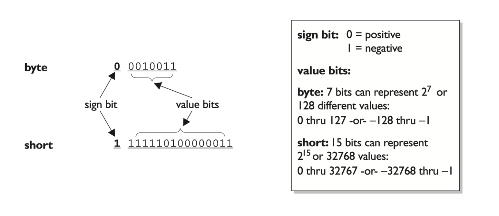
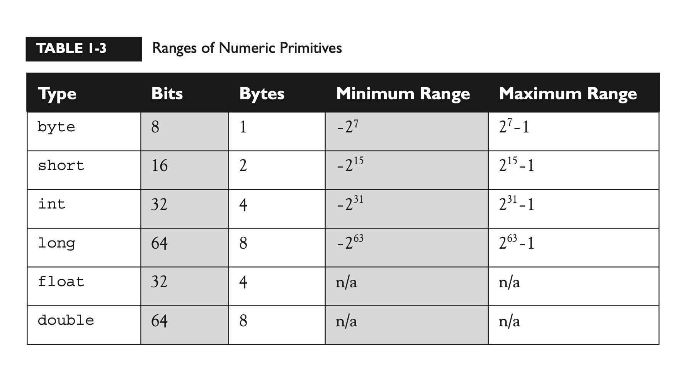
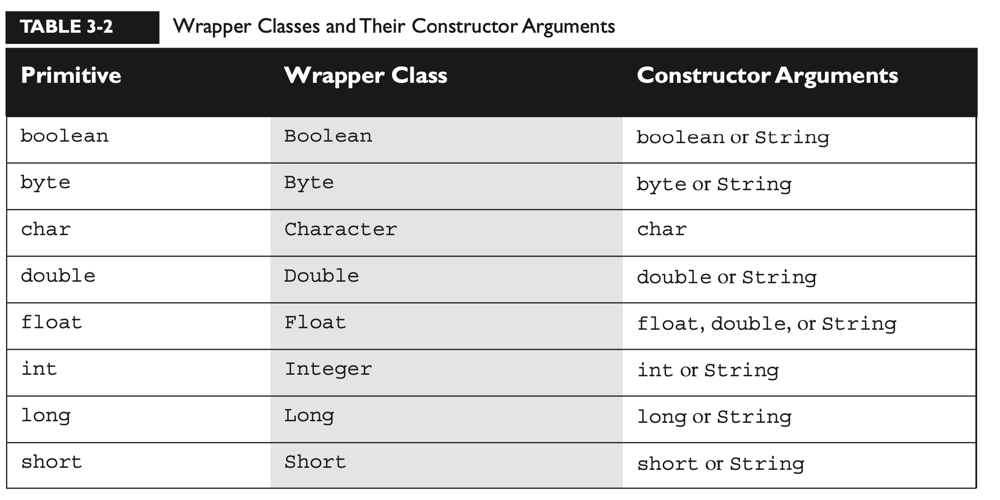

[TOC]

# 1. 基本数据类型






### 包装类型
1. 构造包装类型
```java
Integer i1 = new Integer(42); 
Integer i2 = new Integer("42");

Float f1 = new Float(3.14f); 
Float f2 = new Float("3.14f");

Character c1 = new Character('c');

Boolean b = new Boolean("false");
```

2. valueOf()
```java
Integer i2 = Integer.valueOf("101011", 2);
       // converts 101011
       // to 43 and
       // assigns the value
       // 43 to the
       // Integer object i2

Float f2 = Float.valueOf("3.14f"); // assigns 3.14 to the 
                                   // Float object f2
```

3. parsexxx()
```java
double d4 = Double.parseDouble("3.14"); // convert a String to a primitive
System.out.println("d4 = " + d4); // result is d4 = 3.14

Double d5 = Double.valueOf("3.14");
System.out.println(d5 instanceof Double); // result is "true"
```

4. xxxValue()
```java
Integer i2 = new Integer(42);  //  make a new wrapper object
byte b = i2.byteValue(); //  convert i2's value to a byte primitive
short s = i2.shortValue(); //  another of Integer's xxxValue methods
double d = i2.doubleValue(); ////  yet another of Integer's xxxValue methods

Float f2 = new Float(3.14f);  // make a new wrapper object
short s = f2.shortValue(); // convert f2's value to a short primitive
System.out.println(s); // result is 3 (truncated, not rounded) 


```

5. 自动拆箱装箱
```java
Integer y = 567; 
Integer x = y;
System.out.println(y==x);
y++;
System.out.println(x + " " + y);
System.out.println(y==x);
/*
true
567 568
false
*/

//相当于
int x2 = y.intValue();  // unwrap it
x2++; // use it
y = new Integer(x2); // re-wrap it


Integer i1 = 1000;
Integer i2 = 1000;
if (i1 != i2) System.out.println("different objects");
if (i1.equals(i2)) System.out.println("meaningfully equal");
/*
different objects
meaningfully equal
*/

Integer i3 = 10;
Integer i4 = 10;
if(i3 == i4) System.out.println("same object");
if(i3.equals(i4)) System.out.println("meaningfully equal");
/*
same object
meaningfully equal
*/

```

# 2. 引用数据类型


# 3. 枚举类型
[枚举类型](./枚举类型.md)