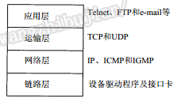

## 参考博文
[【Socket】Java Socket编程基础及深入讲解](https://www.cnblogs.com/yiwangzhibujian/p/7107785.html#q5.3)
[Socket编程入门（基于Java实现）](https://juejin.im/post/5ad9dd61518825671c0e1d71)
[java网络编程Socket通信详解](https://www.cnblogs.com/ltb6w/p/8848872.html)


[TOC]


1、TCP协议是面向连接的、可靠的、有序的、以字节流的方式发送数据，通过三次握手方式建立连接，形成传输数据的通道，在连接中进行大量数据的传输，效率会稍低
2、Java中基于TCP协议实现网络通信的类：客户端的Socket类和服务器端的ServerSocket类


# 1. 单向通信
- 服务端

 ① 创建ServerSocket对象，绑定监听端口
② 通过accept()方法监听客户端请求
③ 连接建立后，通过输入流读取客户端发送的请求信息
④ 通过输出流向客户端发送响应信息
⑤ 关闭相关资源


```java
package javaBase.socket;

import java.io.IOException;
import java.io.InputStream;
import java.net.ServerSocket;
import java.net.Socket;

/**
 * socket服务端
 */
public class SocketServer {

    public static void main(String[] args) throws IOException {
        int port = 5533;
        ServerSocket server = new ServerSocket(port);
        System.out.println("server将一直等待连接的到来");
        //// server将一直等待连接的到来
        Socket socket = server.accept();

        // 建立好连接后，从socket中获取输入流，并建立缓冲区进行读取
        InputStream inputStream = socket.getInputStream();
        byte[] bytes = new byte[1024];
        int len;
        StringBuilder sb = new StringBuilder();
        //从输入流中取出字节放置到缓冲区，再从缓冲区中取出字节构建到字符串中去
        while ((len = inputStream.read(bytes)) != -1) {
            //注意指定编码格式，发送方和接收方一定要统一，建议使用UTF-8
            sb.append(new String(bytes, 0, len,"UTF-8"));
        }

        System.out.println("get message from client: " + sb);
        inputStream.close();
        socket.close();
        server.close();

    }
}
/*
server将一直等待连接的到来
get message from client: 你好
*/
```


- 客户端

① 创建Socket对象，指明需要连接的服务器的地址和端口号
② 连接建立后，通过输出流向服务器端发送请求信息
③ 通过输入流获取服务器响应的信息
④ 关闭响应资源 

```java
package javaBase.socket;

import java.io.IOException;
import java.io.OutputStream;
import java.net.Socket;

/**
 * Socket客户端
 */
public class SocketClient {
    public static void main(String[] args) throws IOException {
        // 要连接的服务端IP地址和端口
        String host = "127.0.0.1";
        int port = 5533;

        // 与服务端建立连接
        /*
        相当于：
        Socket socket = new Socket();
        socket.bind(new InetSocketAddress(55534));
        socket.connect(new InetSocketAddress(host, port));
        */
        Socket socket = new Socket(host, port);

        // 建立连接后获得输出流
        OutputStream outputStream = socket.getOutputStream();
        String message="你好";
        outputStream.write(message.getBytes("utf-8"));
        outputStream.close();
        socket.close();
    }
}
```

# 2. 双向通信
- 服务端
```java
package javaBase.socket;

import java.io.IOException;
import java.io.InputStream;
import java.io.OutputStream;
import java.net.ServerSocket;
import java.net.Socket;

/**
 * socket服务端
 */
public class SocketServer {

    public static void main(String[] args) throws IOException {
        int port = 5533;
        ServerSocket server = new ServerSocket(port);
        System.out.println("server将一直等待连接的到来");
        //// server将一直等待连接的到来
        Socket socket = server.accept();

        // 建立好连接后，从socket中获取输入流，并建立缓冲区进行读取
        InputStream inputStream = socket.getInputStream();
        byte[] bytes = new byte[1024];
        int len;
        StringBuilder sb = new StringBuilder();
        while ((len = inputStream.read(bytes)) != -1) {
            //注意指定编码格式，发送方和接收方一定要统一，建议使用UTF-8
            sb.append(new String(bytes, 0, len,"UTF-8"));
        }

        System.out.println("get message from client: " + sb);

        // 告诉客户端接收已经完毕，之后只能发送
        this.socket.shutdownInput(); 

        //双向通信
        OutputStream outputStream = socket.getOutputStream();
        outputStream.write("Hello Client,I get the message.".getBytes("UTF-8"));

        inputStream.close();
        outputStream.close();
        socket.close();
        server.close();

    }
}
/*
server将一直等待连接的到来
get message from client: 你好
*/
```

- 客户端

```java
package javaBase.socket;

import java.io.IOException;
import java.io.InputStream;
import java.io.OutputStream;
import java.net.Socket;

/**
 * Socket客户端
 */
public class SocketClient {
    public static void main(String[] args) throws IOException {
        // 要连接的服务端IP地址和端口
        String host = "127.0.0.1";
        int port = 5533;

        // 与服务端建立连接
        Socket socket = new Socket(host, port);

        // 建立连接后获得输出流
        OutputStream outputStream = socket.getOutputStream();
        String message="你好";
        outputStream.write(message.getBytes("utf-8"));
        //调用shutdownOutput会告诉服务端消息发送完毕，客户端此时只能接受消息不能发送消息
        socket.shutdownOutput();

        //双向通信
        InputStream inputStream = socket.getInputStream();
        byte[] bytes = new byte[1024];
        int len;
        StringBuilder sb = new StringBuilder();
        while ((len = inputStream.read(bytes)) != -1) {
            //注意指定编码格式，发送方和接收方一定要统一，建议使用UTF-8
            sb.append(new String(bytes, 0, len,"UTF-8"));
        }
        System.out.println("get message from server: " + sb);

        inputStream.close();
        outputStream.close();
        socket.close();
    }
}
/*
get message from server: Hello Client,I get the message.
*/
```

# 3. 如何告知对方消息发送完毕
客户端消息发送完毕后会关闭socket，socket被关闭后也会通知服务端，服务端就知道消息发送完了。有五种关闭方式：
1. socket.close()：不能发消息也不能收消息
2. socket.shutdownOutput()：还能收消息，不能发消息
3. socket.shutdownInput()：还能发消息，不能收消息
4. 通过约定符号：例如使用end作为结束标志。服务端只要读到对应的符号就可以完成一次读取，然后进行相关的处理操作
```java
//服务端
Socket socket = server.accept();
// 建立好连接后，从socket中获取输入流，并建立缓冲区进行读取
BufferedReader read=new BufferedReader(new InputStreamReader(socket.getInputStream(),"UTF-8"));
String line;
StringBuilder sb = new StringBuilder();
while ((line = read.readLine()) != null && "end".equals(line)) {
  //注意指定编码格式，发送方和接收方一定要统一，建议使用UTF-8
  sb.append(line);
}
```

5. 接受指定长度的数据
客户端先发送数据长度，再发送数据。服务端先读取长度，再读取数据
```java
//服务端
public class SocketServer {
  public static void main(String[] args) throws Exception {
    // 监听指定的端口
    int port = 55533;
    ServerSocket server = new ServerSocket(port);

    // server将一直等待连接的到来
    System.out.println("server将一直等待连接的到来");
    Socket socket = server.accept();
    // 建立好连接后，从socket中获取输入流，并建立缓冲区进行读取
    InputStream inputStream = socket.getInputStream();
    byte[] bytes;
    // 因为可以复用Socket且能判断长度，所以可以一个Socket用到底
    while (true) {
      // 首先读取两个字节表示的长度
      int first = inputStream.read();
      //如果读取的值为-1 说明到了流的末尾，Socket已经被关闭了，此时将不能再去读取
      if(first==-1){
        break;
      }
      int second = inputStream.read();
      int length = (first << 8) + second;
      // 然后构造一个指定长的byte数组
      bytes = new byte[length];
      // 然后读取指定长度的消息即可
      inputStream.read(bytes);
      System.out.println("get message from client: " + new String(bytes, "UTF-8"));
    }
    inputStream.close();
    socket.close();
    server.close();
  }
}

//客户端
public class SocketClient {
  public static void main(String args[]) throws Exception {
    // 要连接的服务端IP地址和端口
    String host = "127.0.0.1";
    int port = 55533;
    // 与服务端建立连接
    Socket socket = new Socket(host, port);
    // 建立连接后获得输出流
    OutputStream outputStream = socket.getOutputStream();
    String message = "你好  yiwangzhibujian";
    //首先需要计算得知消息的长度
    byte[] sendBytes = message.getBytes("UTF-8");
    //然后将消息的长度优先发送出去
    outputStream.write(sendBytes.length >>8);
    outputStream.write(sendBytes.length);
    //然后将消息再次发送出去
    outputStream.write(sendBytes);
    outputStream.flush();
    //==========此处重复发送一次，实际项目中为多个命名，此处只为展示用法
    message = "第二条消息";
    sendBytes = message.getBytes("UTF-8");
    outputStream.write(sendBytes.length >>8);
    outputStream.write(sendBytes.length);
    outputStream.write(sendBytes);
    outputStream.flush();
    //==========此处重复发送一次，实际项目中为多个命名，此处只为展示用法
    message = "the third message!";
    sendBytes = message.getBytes("UTF-8");
    outputStream.write(sendBytes.length >>8);
    outputStream.write(sendBytes.length);
    outputStream.write(sendBytes);    
    
    outputStream.close();
    socket.close();
  }
}
```

# 4. 服务端多线程处理多个socket请求
- 服务端

① 服务器端创建ServerSocket，循环调用accept()等待客户端连接
② 客户端创建一个socket并请求和服务器端连接
③ 服务器端接受客户端请求，创建socket与该客户建立专线连接
④ 建立连接的两个socket在一个单独的线程上对话
⑤ 服务器端继续等待新的连接   

```java
    //服务端多线程处理多个socket
    public static void cicleSocket() throws IOException {
        // 监听指定的端口
        int port = 5533;
        ServerSocket server = new ServerSocket(port);
        ThreadPoolExecutor executor = new ThreadPoolExecutor(10, 15, 10, TimeUnit.SECONDS, new ArrayBlockingQueue<Runnable>(10));

        while (true) {
            //每来一个socket请求，就从线程池中取出线程来处理。然后主线程继续监听端口
            Socket socket = server.accept();
            executor.submit(new Runnable() {
                @Override
                public void run() {
                    InputStream stream = null;
                    try {
                        stream = socket.getInputStream();
                        byte[] bytes = new byte[1024];
                        int len;
                        StringBuilder sb = new StringBuilder();
                        while ((len = stream.read(bytes)) != -1) {
                            // 注意指定编码格式，发送方和接收方一定要统一，建议使用UTF-8
                            sb.append(new String(bytes, 0, len, "UTF-8"));
                        }
                        System.out.println("get message from client: " + sb);
                        stream.close();
                        socket.close();
                    } catch (IOException e) {
                        e.printStackTrace();
                    }

                }
            });

        }

    }
```

# 5. socket是否可用
socket状态
```java
//是否绑定
public boolean isBound()

//是否关闭
public boolean isClosed()

//是否连接
public boolean isConnected()

//是否关闭输入流
public boolean isInputShutdown()

//是否关闭输出流
public boolean isOutputShutdown()
```

除了判断socket本身是否可用，当网络断开、服务器主动断开时是不会检测到socket状态变更的，还需要额外的手段

## 自定义心跳包
双方需要约定，什么样的消息属于心跳包，什么样的消息属于正常消息

例如头两个字节是数据长度，第三个字节是数据类型，后面的才是数据

数据类型可以是1为心跳，0为正常消息

1. 双方约定好心跳包的格式，要能够区别于普通的消息。
2. 客户端每隔一定时间，就向服务端发送一个心跳包
3. 服务端每接收到心跳包时，将其抛弃
4. 如果客户端的某个心跳包发送失败，就可以判断连接已经断开
5. 如果对实时性要求很高，服务端也可以定时检查客户端发送心跳包的频率，如果超过一定时间没有发送可以认为连接已经断开

## 断开时重连


# 6. 关于socket的理解
## 6.1 三次握手和四次挥手


Socket是归属于应用层，被TCP使用

经过TCP三次握手之后，操作系统才会将连接交给应用层，才能通过accept()获取到socket

系统接收TCP连接请求放入缓存队列，而SocketServer从缓存队列获取Socket
```java
ServerSocket server = new ServerSocket(port);
Socket socket = server.accept();
```

关闭输出流对应TCP4次挥手的第一次
```java
socket.shutdownOutput();
```


## 6.2 拆包和黏包
## 拆包
当一次发送（Socket）的数据量过大，而底层（TCP/IP）不支持一次发送那么大的数据量，则会发生拆包现象

最大报文段长度（MSS）表示TCP传往另一端的最大块数据的长度。当一个连接建立时，连接的双方都要通告各自的 MSS。客户端会尽量满足服务端的要求且不能大于服务端的MSS值，当没有协商时，会使用值536字节

拆包的问题就是[如何告知对方消息发送完毕](#3-如何告知对方消息发送完毕),解决方案可以采用接受指定长度的数据


## 黏包
当在短时间内发送（Socket）很多数据量小的包时，底层（TCP/IP）会根据一定的算法（指Nagle）把一些包合作为一个包发送


黏包其实是一种优化，但可能会造成延迟

如果不希望发生黏包，那么通过禁用TCP_NODELAY即可。
通过设置为true即可防止在发送的时候黏包，但是当发送的速率大于读取的速率时，在服务端也会发生黏包，即因服务端读取过慢，导致它一次可能读取多个包
```java
socket.setTcpNoDelay(boolean on);
```