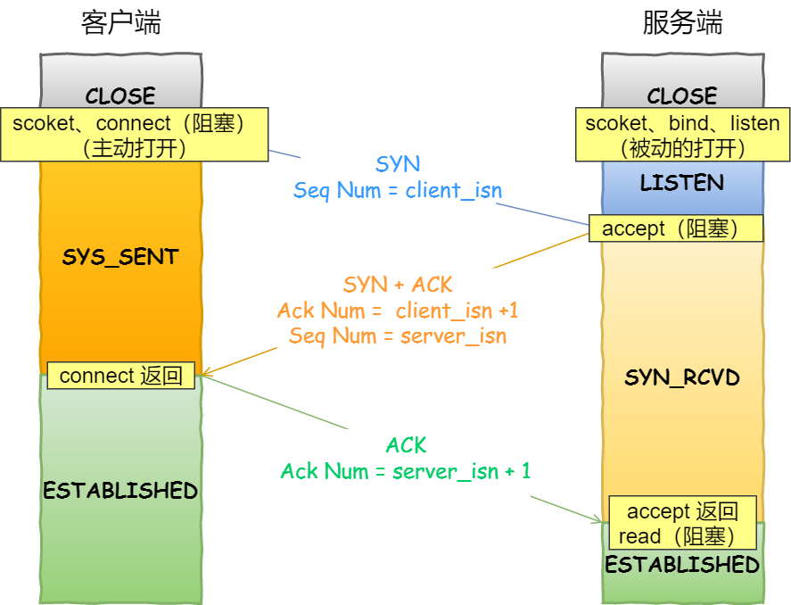

[TOC]

# 1. socket连接
```
1. 服务端和客户端初始化 socket，得到文件描述符；
2. 服务端调用 bind，将绑定在 IP 地址和端口;
3. 服务端调用 listen，进行监听；
4. 服务端调用 accept，等待客户端连接；
5. 客户端调用 connect，向服务器端的地址和端口发起连接请求；
6. 服务端 accept 返回用于传输的 socket 的文件描述符；
7. 客户端调用 write 写入数据；服务端调用 read 读取数据；
8. 客户端断开连接时，会调用 close，那么服务端 read 读取数据的时候，就会读取到了 EOF，待处理完数据后，服务端调用 close，表示连接关闭。
```


## listen 时候参数 backlog 的意义？
```
//参数一 socketfd 为 socketfd 文件描述符
//参数二 backlog，accept 队列长度
int listen (int socketfd, int backlog)
```

Linux内核中会维护两个队列：
```
1. 未完成连接队列（SYN 队列）：接收到一个 SYN 建立连接请求，处于 SYN_RCVD 状态；
2. 已完成连接队列（Accpet 队列）：已完成 TCP 三次握手过程，处于 ESTABLISHED 状态；
```


## connect和accept什么时候返回
```
客户端 connect 成功返回是在第二次握手

服务端 accept 成功返回是在三次握手成功之后
```

```
1. 客户端的协议栈向服务器端发送了 SYN 包，并告诉服务器端当前发送序列号 client_isn，客户端进入 SYNC_SENT 状态；

2. 服务器端的协议栈收到这个包之后，和客户端进行 ACK 应答，应答的值为 client_isn+1，表示对 SYN 包 client_isn 的确认，同时服务器也发送一个 SYN 包，告诉客户端当前我的发送序列号为 server_isn，服务器端进入 SYNC_RCVD 状态；

3. 客户端协议栈收到 ACK 之后，使得应用程序从 connect 调用返回，表示客户端到服务器端的单向连接建立成功，客户端的状态为 ESTABLISHED，同时客户端协议栈也会对服务器端的 SYN 包进行应答，应答数据为 server_isn+1；

4. 应答包到达服务器端后，服务器端协议栈使得 accept 阻塞调用返回，这个时候服务器端到客户端的单向连接也建立成功，服务器端也进入 ESTABLISHED 状态
```


