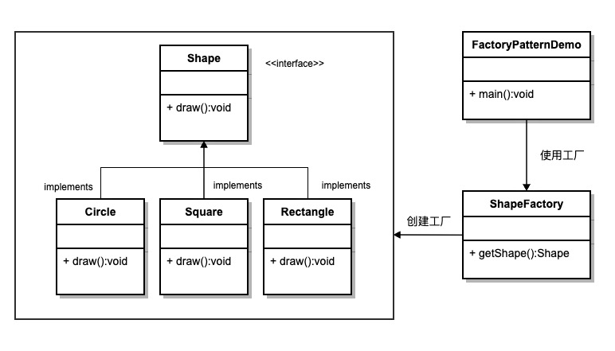

## 参考博文
[设计模式1](https://refactoringguru.cn/design-patterns/factory-method)
[设计模式2](https://www.runoob.com/design-pattern/abstract-factory-pattern.html)

# 工厂模式
将对象实例化封装在工厂类中，根据具体场景来决定实例化哪个类型的子类

例如：
日志记录器：记录可能记录到本地硬盘、系统事件、远程服务器等，用户可以选择记录日志到什么地方



```java
//工厂类
public class ShapeFactory {
    
   //使用 getShape 方法获取形状类型的对象
   public Shape getShape(String shapeType){
      if(shapeType == null){
         return null;
      }        
      if(shapeType.equalsIgnoreCase("CIRCLE")){
         return new Circle();
      } else if(shapeType.equalsIgnoreCase("RECTANGLE")){
         return new Rectangle();
      } else if(shapeType.equalsIgnoreCase("SQUARE")){
         return new Square();
      }
      return null;
   }
}

public class FactoryPatternDemo {
 
   public static void main(String[] args) {
      ShapeFactory shapeFactory = new ShapeFactory();
 
      //获取 Circle 的对象，并调用它的 draw 方法
      Shape shape1 = shapeFactory.getShape("CIRCLE");
      //调用 Circle 的 draw 方法
      shape1.draw();
 
      //获取 Rectangle 的对象，并调用它的 draw 方法
      Shape shape2 = shapeFactory.getShape("RECTANGLE");
      //调用 Rectangle 的 draw 方法
      shape2.draw();
   }
}

/*
Inside Circle::draw() method.
Inside Rectangle::draw() method.
*/
```


# 抽象工厂模式
在工厂模式的基础上对工厂类做抽象，具体用哪个工厂类根据实际场景决定


```java

//构造颜色和形状的抽象工厂类
public abstract class AbstractFactory {
   public abstract Color getColor(String color);
   public abstract Shape getShape(String shape) ;
}

//形状工厂类
public class ShapeFactory extends AbstractFactory {
    
   @Override
   public Shape getShape(String shapeType){
      if(shapeType == null){
         return null;
      }        
      if(shapeType.equalsIgnoreCase("CIRCLE")){
         return new Circle();
      } else if(shapeType.equalsIgnoreCase("RECTANGLE")){
         return new Rectangle();
      }
      return null;
   }
   
   @Override
   public Color getColor(String color) {
      return null;
   }
}

//颜色工厂类
public class ColorFactory extends AbstractFactory {
    
   @Override
   public Shape getShape(String shapeType){
      return null;
   }
   
   @Override
   public Color getColor(String color) {
      if(color == null){
         return null;
      }        
      if(color.equalsIgnoreCase("RED")){
         return new Red();
      } else if(color.equalsIgnoreCase("GREEN")){
         return new Green();
      }
      return null;
   }
}

//工厂创造器，动态决定使用哪个工厂
public class FactoryProducer {
   public static AbstractFactory getFactory(String choice){
      if(choice.equalsIgnoreCase("SHAPE")){
         return new ShapeFactory();
      } else if(choice.equalsIgnoreCase("COLOR")){
         return new ColorFactory();
      }
      return null;
   }
}

public class AbstractFactoryPatternDemo {
   public static void main(String[] args) {
 
      //获取形状工厂
      AbstractFactory shapeFactory = FactoryProducer.getFactory("SHAPE");
 
      //获取形状为 Circle 的对象
      Shape shape1 = shapeFactory.getShape("CIRCLE");
      //调用 Circle 的 draw 方法
      shape1.draw();
 
      //获取形状为 Rectangle 的对象
      Shape shape2 = shapeFactory.getShape("RECTANGLE");
      //调用 Rectangle 的 draw 方法
      shape2.draw();
 
      //获取颜色工厂
      AbstractFactory colorFactory = FactoryProducer.getFactory("COLOR");
 
      //获取颜色为 Red 的对象
      Color color1 = colorFactory.getColor("RED");
      //调用 Red 的 fill 方法
      color1.fill();
 
      //获取颜色为 Green 的对象
      Color color2 = colorFactory.getColor("Green");
      //调用 Green 的 fill 方法
      color2.fill();
 
   }
}
```


# 单例模式
[单例模式](./单例模式.md)


# 建造者模式
将一个复杂对象分隔成多个子部分构造，通过一个director对他们进行组装，由director决定组装顺序

例如一个套餐中有可乐、汉堡、薯条，由director来组装这个套餐


# 原型模式
将克隆对象的功能放入被克隆对象内部，通过实现Cloneable接口，对一个对象调用它的clone接口就能获取它的副本

# 适配器模式
使用一个adaptor将一个类的接口转换成客户希望的另外一个接口


# 代理模式
[代理模式](./代理模式.md)


# 策略模式
如果在一个系统里面有许多类，它们之间的区别仅在于它们的行为，那么使用策略模式可以动态地让一个对象在许多行为中选择一种行为


```java
public class StrategyPatternDemo {
   public static void main(String[] args) {
      Context context = new Context(new OperationAdd());    
      System.out.println("10 + 5 = " + context.executeStrategy(10, 5));
 
      context = new Context(new OperationSubtract());      
      System.out.println("10 - 5 = " + context.executeStrategy(10, 5));
 
      context = new Context(new OperationMultiply());    
      System.out.println("10 * 5 = " + context.executeStrategy(10, 5));
   }
}
```