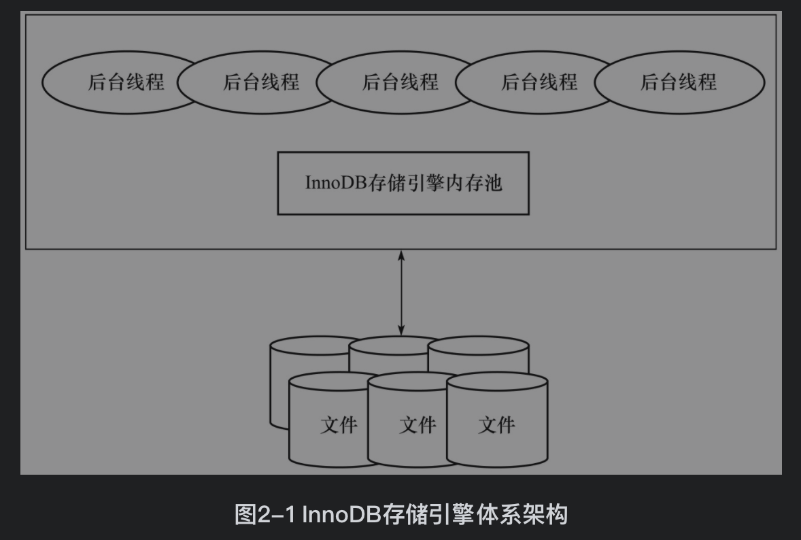
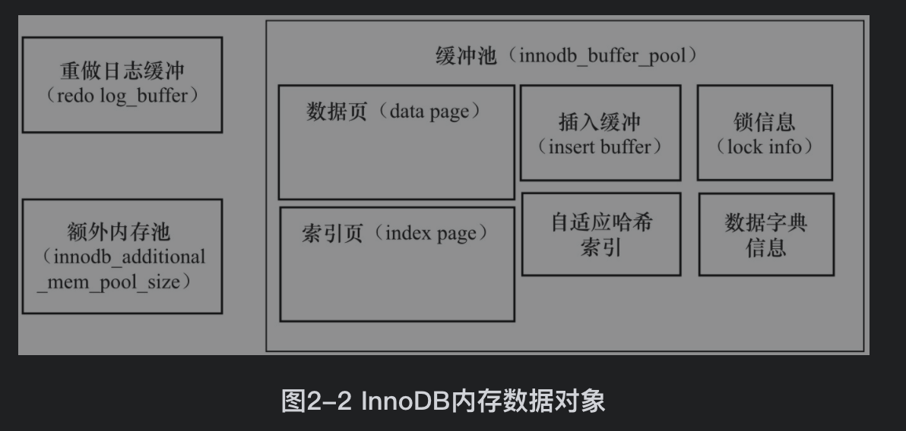

[TOC]


# 1. InnoDB体系架构
主要包括后台线程和内存两大块

InnoDB的内存池中有很多内存块，他负责：
1. 缓存磁盘中的数据，在对磁盘数据修改前也是先在内存修改
2. 缓存redo log
3. 缓存后台线程用到的内部数据结构



## 1.1 后台线程
后台线程负责刷新内存中的数据(保证内存中存储的是最近的数据)，以及在内存数据变更时将数据刷到磁盘

InddoDB是多线程模型， 因此有多个不同的后台线程：
#### 1. Master Thread
负责将内存中的数据刷到磁盘，来保证数据一致性。包括脏页(Flush List中)的刷新、合并插入缓冲（INSERT BUFFER）、UNDO页的回收


#### 2. IO Thread
InnoDB中的IO大量使用AIO来处理IO请求，IO Thread负责这些IO请求的回调处理

共有4种IO Thread：read、write、insert buffer、log IO thread，其中使用innodb_read_io_threads和innodb_write_io_threads参数两个参数控制read、write thread的数量
```SQL
mysql> show variables like 'innodb_version';
+----------------+--------+
| Variable_name  | Value  |
+----------------+--------+
| innodb_version | 5.7.23 |
+----------------+--------+
1 row in set (0.03 sec)

mysql> show variables like 'innodb_%io_threads';
+-------------------------+-------+
| Variable_name           | Value |
+-------------------------+-------+
| innodb_read_io_threads  | 4     |
| innodb_write_io_threads | 4     |
+-------------------------+-------+
2 rows in set (0.01 sec)

//IO Thread 0为insert buffer thread。IO Thread 1为log thread
mysql> show engine innodb status;
--------
FILE I/O
--------
I/O thread 0 state: waiting for i/o request (insert buffer thread)
I/O thread 1 state: waiting for i/o request (log thread)
I/O thread 2 state: waiting for i/o request (read thread)
I/O thread 3 state: waiting for i/o request (read thread)
I/O thread 4 state: waiting for i/o request (read thread)
I/O thread 5 state: waiting for i/o request (read thread)
I/O thread 6 state: waiting for i/o request (write thread)
I/O thread 7 state: waiting for i/o request (write thread)
I/O thread 8 state: waiting for i/o request (write thread)
I/O thread 9 state: waiting for i/o request (write thread)
Pending normal aio reads: [0, 0, 0, 0] , aio writes: [0, 0, 0, 0] ,
 ibuf aio reads:, log i/o's:, sync i/o's:
Pending flushes (fsync) log: 0; buffer pool: 0
532 OS file reads, 662 OS file writes, 429 OS fsyncs
0.00 reads/s, 0 avg bytes/read, 0.00 writes/s, 0.00 fsyncs/s
1 row in set (0.00 sec)
```

#### 3. Purge Thread
事务提交后，使用的undo log可能不再需要，由Purge Thread回收被分配的undo log页

```SQL
mysql> show variables like 'innodb_purge_threads';
+----------------------+-------+
| Variable_name        | Value |
+----------------------+-------+
| innodb_purge_threads | 4     |
+----------------------+-------+
1 row in set (0.00 sec)
```

#### 4. Page Cleaner Thread
当LRU List空闲页不够时，负责LRU List中脏页的刷新操作
当重做日志文件不够用时，负责Flush List中脏页的刷新操作


## 1.2 内存
### 缓冲池
缓冲池就是一块内存区域，存储页。缓存的数据页类型有：索引页、数据页、undo页、插入缓冲（insert buffer）、自适应哈希索引（adaptive hash index）、InnoDB存储的锁信息（lock info）、数据字典信息（data dictionary）等

1. 页读取
要读取页时，先判断缓冲池是否命中该页。如果缓冲池中有则直接返回，否则从磁盘中读取并且放入缓冲池

2. 页修改
首先修改缓冲池中的页，然后通过Checkpoint机制以一定频率刷新到磁盘中

```SQL
mysql> show variables like 'innodb_buffer_pool_size';
+-------------------------+-----------+
| Variable_name           | Value     |
+-------------------------+-----------+
| innodb_buffer_pool_size | 134217728 |
+-------------------------+-----------+
1 row in set (0.00 sec)
```



从InnoDB 1.0.x版本开始，允许有多个缓冲池实例。每个页根据哈希值平均分配到不同缓冲池实例中。多个实例可以减少资源的竞争，提高并发度
```SQL
mysql> show variables like 'innodb_buffer_pool_instances';
+------------------------------+-------+
| Variable_name                | Value |
+------------------------------+-------+
| innodb_buffer_pool_instances | 1     |
+------------------------------+-------+
1 row in set (0.00 sec)
```

### LRU List、Free List和Flush List
Free List用来管理未被使用的页(即未被使用的内存区域)，LRU List用来管理已经读取的页。当数据启动时，LRU中没有任何页，所有空闲页都在Free List中。

当从磁盘中读取数据时，先去Free List找一个空闲页放入LRU List中，并从Free List删除。如果Free List中没有空闲页，将根据LRU算法淘汰末尾的页，并将该内存空间分配给新的页

缓冲池通过LRU(最近最少使用)算法管理页，页的默认大小为16k，最频繁使用的放在前面，最少使用的放在后面。当缓冲池满了不能放新页时，就淘汰末尾的页

但是InnoDB对LRU做了一些优化，最新的页不是放在头部而是放在LRU列表midpoint的位置，被称为midpoint insertion strategy。在默认配置下，该位置在LRU列表长度的5/8处
```SQL
//参数innodb_old_blocks_pct默认值为37，表示新读取的页插入到LRU列表尾端的37%的位置（差不多3/8的位置）
mysql> show variables like 'innodb_old_blocks_pct';
+-----------------------+-------+
| Variable_name         | Value |
+-----------------------+-------+
| innodb_old_blocks_pct | 37    |
+-----------------------+-------+
1 row in set (0.00 sec)
```

mindpoint前的列表叫new列表，代表活跃的热点数据。midpoint后的列表成为old列表。当页被读到midpoint位置后需要等待innodb_old_blocks_time后才会被加入到new列表中。当页从old移动到new时的操作被称为page made young。
```SQL
mysql> show variables like 'innodb_old_blocks_time';
+------------------------+-------+
| Variable_name          | Value |
+------------------------+-------+
| innodb_old_blocks_time | 1000  |
+------------------------+-------+
1 row in set (0.00 sec)
```
当LRU中的页被修改后，这一页就被成为脏页，因为缓存和磁盘中页的数据产生了不一致，将通过checkpoint机制将脏页刷回磁盘。
Flush List就是脏页列表，用于将脏页刷回磁盘

```SQL
mysql> show engine innodb status;
----------------------
BUFFER POOL AND MEMORY
----------------------
Total large memory allocated 137428992
Dictionary memory allocated 322268
//缓冲池大小
Buffer pool size   8191
//Free List中页的数量
Free buffers       7614
//LRU列表中页的数量
Database pages     577
Old database pages 224
Modified db pages  0
Pending reads      0
Pending writes: LRU 0, flush list 0, single page 0
//LRU列表中页移动到前端的次数
Pages made young 0, not young 0
0.00 youngs/s, 0.00 non-youngs/s
Pages read 477, created 100, written 342
0.00 reads/s, 0.00 creates/s, 0.00 writes/s
No buffer pool page gets since the last printout
Pages read ahead 0.00/s, evicted without access 0.00/s, Random read ahead 0.00/s
LRU len: 577, unzip_LRU len: 0
I/O sum[0]:cur[0], unzip sum[0]:cur[0]
--------------
ROW OPERATIONS
--------------
0 queries inside InnoDB, 0 queries in queue
0 read views open inside InnoDB
Process ID=83040, Main thread ID=123145569779712, state: sleeping
Number of rows inserted 114, updated 0, deleted 2, read 178
0.00 inserts/s, 0.00 updates/s, 0.00 deletes/s, 0.00 reads/s
1 row in set (0.01 sec)
```

### redo log缓冲
InnoDB将redo log记录到redo log缓冲中，再按一定频率刷回磁盘中的重做日志文件。
```SQL
mysql> show variables like 'innodb_log_buffer_size';
+------------------------+----------+
| Variable_name          | Value    |
+------------------------+----------+
| innodb_log_buffer_size | 16777216 |
+------------------------+----------+
1 row in set (0.01 sec)
```

# 2. Checkpoint技术
Checkpoint技术为了解决以下几个问题：
1. 缩短数据库恢复时间：当数据库宕机时，只需要重新执行Checkpoint后的redo log，因为Checkpoint前的页都已经刷回磁盘
2. 当缓冲池不够用时，将脏页刷回磁盘：当缓冲池不够用时，将根据LRU算法淘汰尾页。如果这页是脏页，还要执行Checkpoint将脏页的数据刷到磁盘中
3. 重做日志不可用时，刷新脏页：当重做日志缓存不够用时，会执行Checkpoint将脏页刷到磁盘中

InnoDB使用LSN（Log Sequence Number）标记版本，他是一个8字节的数字。每个页有LSN，重做日志中也有LSN，Checkpoint也有LSN
```SQL
mysql> show engine innodb status;
---
LOG
---
Log sequence number 5560498
Log flushed up to   5560498
Pages flushed up to 5560498
Last checkpoint at  5560489
0 pending log flushes, 0 pending chkp writes
243 log i/o's done, 0.00 log i/o's/second
```

### Sharp Checkpoint
在数据库关闭时将所有的脏页刷到磁盘，innodb_fast_shutdown=1

### Fuzzy Checkpoint
将部分脏页刷到磁盘，InnoDB内部使用这种方式的Checkpoint

会有以下几种情况：
1. Master Thread Checkpoint
在Master Thread中发生的Checkpoint，异步的以每秒或每十秒的速度从缓冲池中的Flush List将脏页刷回磁盘

2. FLUSH_LRU_LIST Checkpoint
InnoDB要保证LRU List有100个空闲页，如果空闲页不够了就需要淘汰末尾页，如果这个末尾页是脏页，PageCleaner线程就要将LRU List中的这个脏页刷到磁盘
```SQL
//LRU列表中可用页的数量
mysql> show variables like 'innodb_lru_scan_depth';
+-----------------------+-------+
| Variable_name         | Value |
+-----------------------+-------+
| innodb_lru_scan_depth | 1024  |
+-----------------------+-------+
1 row in set (0.00 sec)
```

3. Async/Sync Flush Checkpoint
当重做日志文件不可用时(文件存储已经满了)，PageCleaner线程需要将Flush List中的脏页刷回磁盘


# 3. InnoDB关键特性
## 插入缓冲（Insert Buffer）
Insert Buffer和数据页一样，也是物理页的一个组成部分。Insert Buffer带给InnoDB存储引擎的是性能上的提升

数据页是按照聚簇索引排序存储的，插入顺序会按照聚簇索引插入。那么对于非聚簇索引的插入就变成了随机插入，可能会许多导致页的IO，所以引入Insert Buffer提高非聚簇索引的插入性能

Insert Buffer使用的场景要满足两个条件：
1. 索引是辅助索引
2. 索引不是唯一索引:因为不去读取辅助索引页判断唯一性

当插入非聚簇索引时，先判断要插入的辅助索引页是否在缓存中。如果在则直接插入，否则先放入到一个Insert Buffer对象中。然后再以一定的频率将存储的该页数据一次性插入到缓存中的辅助索引页中

```SQL
//seg size显示了当前Insert Buffer的大小为2X16KB
//free list len代表了空闲列表的长度
//size代表了已经合并记录页的数量
mysql> show engine innodb status;
-------------------------------------
INSERT BUFFER AND ADAPTIVE HASH INDEX
-------------------------------------
Ibuf: size 1, free list len 0, seg size 2, 0 merges
merged operations:
 insert 0, delete mark 0, delete 0
discarded operations:
 insert 0, delete mark 0, delete 0
Hash table size 34673, node heap has 0 buffer(s)
Hash table size 34673, node heap has 0 buffer(s)
Hash table size 34673, node heap has 0 buffer(s)
Hash table size 34673, node heap has 0 buffer(s)
Hash table size 34673, node heap has 0 buffer(s)
Hash table size 34673, node heap has 0 buffer(s)
Hash table size 34673, node heap has 0 buffer(s)
Hash table size 34673, node heap has 0 buffer(s)
0.00 hash searches/s, 0.00 non-hash searches/s
1 row in set (0.01 sec)
```
Change Buffer是对Insert Buffer的升级，对INSERT、DELETE、UPDATE都进行缓冲，他们分别是：Insert Buffer、Delete Buffer、Purge buffer

Change Buffer适用的对象依然是非唯一的辅助索引

Insert Buffer的实现是在共享表空间中有一颗全局的B+树负责对所有的表的辅助索引进行Insert Buffer

Insert Buffer合并到辅助索引页的时间：
1. 辅助索引页被读取到缓冲池时
当执行select操作，辅助索引页被读取到缓冲池时，要检查Insert Buffer Bitmap页确认Insert Buffer中是否存有该页的记录，如果有则进行合并操作

2. Insert Buffer Bitmap页追踪到该辅助索引页已无可用空间时
Insert Buffer Bitmap页会记录每个辅助索引页的剩余可用空间，如果插入记录后空间不够了，会强制读取辅助索引页进行合并

3. Master Thread
在Master Thread线程中每秒或每10秒会进行一次Merge Insert Buffer的操作

## 两次写（Double Write）
doublewrite（两次写）带给InnoDB存储引擎的是数据页的可靠性

当从缓存将数据刷回磁盘时，某页写入磁盘写了一半就宕机了，这时通过redo log也没法恢复。需要先还原出这页本来的数据，再通过redo log重做。所以引入Double Writewrite

在将数据刷磁盘时，先通过memcpy函数将脏页写到内存中的Double Write Buffer中，然后通过Double Write Buffer会写入磁盘中的两个位置。一个是写入磁盘上共享表空间的Double Write中，这块区域在物理上都是连续的，所以顺序写入速度很快。另一个是写入表文件中

如果操作系统在将页写入磁盘的过程中发生了崩溃，在恢复过程中，InnoDB存储引擎可以从共享表空间中的doublewrite中找到该页的一个副本，将其复制到表空间文件，再应用重做日志

```sql
mysql> show global status like 'innodb_dblwr%';
+----------------------------+-------+
| Variable_name              | Value |
+----------------------------+-------+
| Innodb_dblwr_pages_written | 299   |
| Innodb_dblwr_writes        | 35    |
+----------------------------+-------+
2 rows in set (0.00 sec)
```

## 自适应哈希索引（Adaptive Hash Index）
因为哈希根据某个key查找的速度非常快，为O(1)。而B+树一般为3~4层，需要3~4次查询。

InnoDB会检测各表上对索引页的查询，如果检测到建立哈希索引将提升性能，就会通过缓冲池中的B+树索引页建立哈希索引，称之为自适应哈希索引（Adaptive Hash Index，AHI


## 异步IO（Async IO）
可以连续发出多个IO请求，等待响应

AIO的好处是可以合并多个IO，对于连续页的操作可以合并成1个操作


## 刷新邻接页（Flush Neighbor Page）
当刷新一个脏页时，InnoDB存储引擎会检测该页所在区（extent）的所有页，如果是脏页，那么一起进行刷新


# 4. 启动、关闭与恢复
