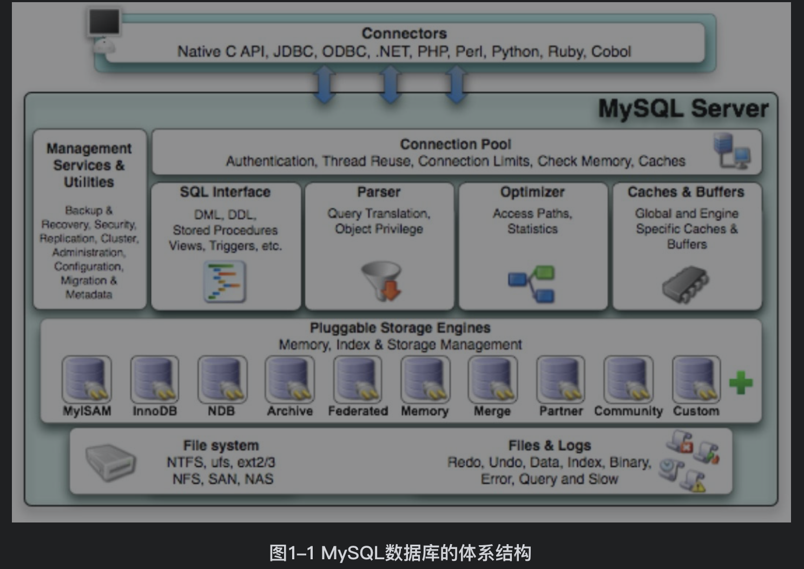
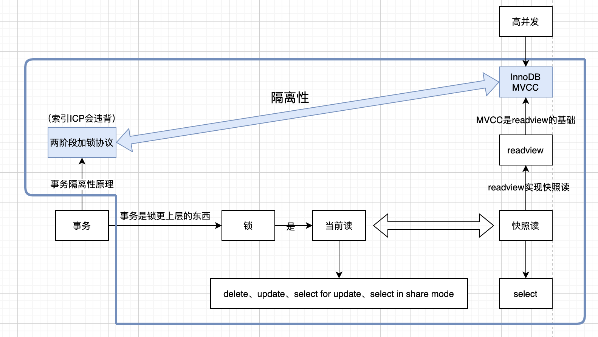

[TOC]

# 第一章 SQL编程
MySQL数据库由以下几部分组成：
1. 连接池组件（Connection Pool）
2. 管理服务和工具组件（Management Services &Utilities）
3. SQL接口组件（SQL Interface）
4. 查询分析器组件（Parser）
5. 优化器组件（Optimizer）
6. 缓冲组件（Caches & Buffers）
7. 插件式存储引擎（Pluggable Storage Engines）
8. 物理文件（File system）

# 第二章 数据类型

# 第三章 查询处理

# 第四章 子查询

# 第五章 连接与集合操作

# 第六章 聚合和旋转操作

# 第七章 游标

# 第八章 事务编程

# 第九章 索引

# 第十章 分区