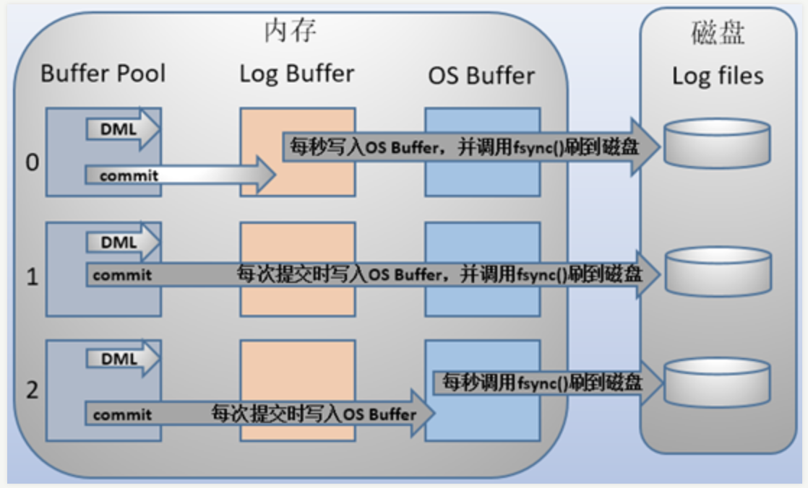
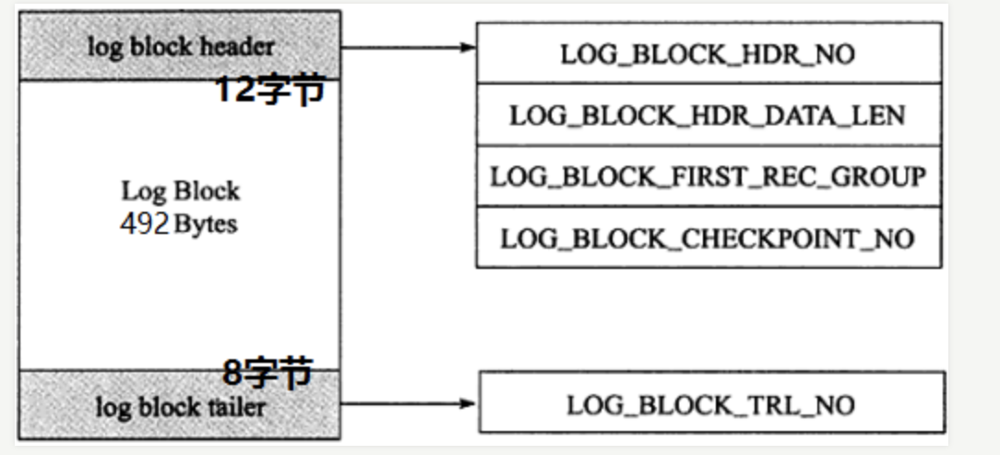
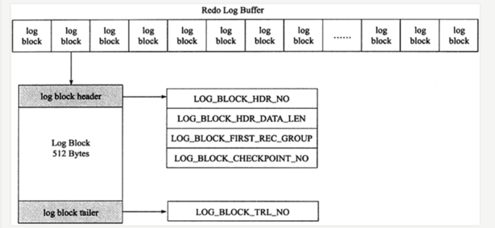

## 参考博文
[详细分析MySQL事务日志(redo log和undo log)](https://www.cnblogs.com/f-ck-need-u/archive/2018/05/08/9010872.html)
[MySQL日志查看详解](https://www.cnblogs.com/mungerz/p/10442791.html)
[详细分析MySQL的日志(一)](https://www.cnblogs.com/f-ck-need-u/p/9001061.html#blog5)
[开启MySQL的binlog日志](https://blog.csdn.net/king_kgh/article/details/74800513)

[TOC]

# MySQL服务层日志
## 1. 错误日志
错误日志默认开启且不能被关闭

错误日志文件通常的名称为hostname.err（hostname表示服务器的主机名）

错误日志记录信息：服务器启动关闭信息、运行错误信息、时间调度器运行一个事件时产生的信息、在服务器上启动进程产生的信息。

```SQL
mysql> show variables like 'log_error%';
+---------------------+----------------------------------------+
| Variable_name       | Value                                  |
+---------------------+----------------------------------------+
| log_error           | /usr/local/mysql/data/mysqld.local.err |
| log_error_verbosity | 3                                      |
+---------------------+----------------------------------------+
2 rows in set (0.00 sec)

mysql> system hostname;
chenpeipeideMacBook-Pro.local
```

## 2. 查询日志
用来记录未超过指定时间的查询。默认关闭，会记录用户所有操作，性能消耗太大。

## 3. 慢查询日志
[服务器性能剖析](./服务器性能剖析.md)

用来记录执行时间超过指定时间的查询语句


## 4. 二进制日志
[复制](./复制.md)

二进制日志也叫作变更日志，主要用于记录修改数据或有可能引起数据改变的mysql语句，以每个语句为单位而不是以事务为单位。并且记录了语句发生时间、执行时长、操作的数据等等。不会包括select和show这样的查询语句。
所以说通过二进制日志可以查询mysql数据库中进行了哪些变化。一般大小体积上限为1G

```SQL
//在my.cnf中配置log-bin[=name]可以启动二进制日志
chenpeipeideMacBook-Pro:~ chenpeipei$ sudo vim /private/etc/my.cnf 
//1. 添加以下内容
log-bin=/usr/local/mysql/data/mysql-bin
server-id=10

//2. 重启MySQL实例

mysql> show variables like '%log_bin';
+---------------+-------+
| Variable_name | Value |
+---------------+-------+
| log_bin       | ON    |
| sql_log_bin   | ON    |
+---------------+-------+
2 rows in set (0.00 sec)

mysql> show binary logs;
+------------------+-----------+
| Log_name         | File_size |
+------------------+-----------+
| mysql-bin.000001 |       154 |
+------------------+-----------+
1 row in set (0.00 sec)

mysql> update account set money=1000 where id=5;
Query OK, 1 row affected (0.01 sec)
Rows matched: 1  Changed: 1  Warnings: 0

mysql> show binlog events;
+------------------+------+----------------+-----------+-------------+---------------------------------------+
| Log_name         | Pos  | Event_type     | Server_id | End_log_pos | Info                                  |
+------------------+------+----------------+-----------+-------------+---------------------------------------+
| mysql-bin.000001 |    4 | Format_desc    |        10 |         123 | Server ver: 5.7.23-log, Binlog ver: 4 |
| mysql-bin.000001 |  123 | Previous_gtids |        10 |         154 |                                       |
| mysql-bin.000001 |  154 | Anonymous_Gtid |        10 |         219 | SET @@SESSION.GTID_NEXT= 'ANONYMOUS'  |
| mysql-bin.000001 |  219 | Query          |        10 |         299 | BEGIN                                 |
| mysql-bin.000001 |  299 | Table_map      |        10 |         361 | table_id: 108 (spring-class.account)  |
| mysql-bin.000001 |  361 | Write_rows     |        10 |         410 | table_id: 108 flags: STMT_END_F       |
| mysql-bin.000001 |  410 | Xid            |        10 |         441 | COMMIT /* xid=48 */                   |
| mysql-bin.000001 |  441 | Anonymous_Gtid |        10 |         506 | SET @@SESSION.GTID_NEXT= 'ANONYMOUS'  |
| mysql-bin.000001 |  506 | Query          |        10 |         586 | BEGIN                                 |
| mysql-bin.000001 |  586 | Table_map      |        10 |         648 | table_id: 108 (spring-class.account)  |
| mysql-bin.000001 |  648 | Write_rows     |        10 |         704 | table_id: 108 flags: STMT_END_F       |
| mysql-bin.000001 |  704 | Xid            |        10 |         735 | COMMIT /* xid=56 */                   |
| mysql-bin.000001 |  735 | Anonymous_Gtid |        10 |         800 | SET @@SESSION.GTID_NEXT= 'ANONYMOUS'  |
| mysql-bin.000001 |  800 | Query          |        10 |         880 | BEGIN                                 |
| mysql-bin.000001 |  880 | Table_map      |        10 |         942 | table_id: 108 (spring-class.account)  |
| mysql-bin.000001 |  942 | Write_rows     |        10 |         988 | table_id: 108 flags: STMT_END_F       |
| mysql-bin.000001 |  988 | Xid            |        10 |        1019 | COMMIT /* xid=61 */                   |
| mysql-bin.000001 | 1019 | Anonymous_Gtid |        10 |        1084 | SET @@SESSION.GTID_NEXT= 'ANONYMOUS'  |
| mysql-bin.000001 | 1084 | Query          |        10 |        1164 | BEGIN                                 |
| mysql-bin.000001 | 1164 | Table_map      |        10 |        1226 | table_id: 108 (spring-class.account)  |
| mysql-bin.000001 | 1226 | Update_rows    |        10 |        1284 | table_id: 108 flags: STMT_END_F       |
| mysql-bin.000001 | 1284 | Xid            |        10 |        1315 | COMMIT /* xid=63 */                   |
+------------------+------+----------------+-----------+-------------+---------------------------------------+
22 rows in set (0.00 sec)

mysql> show variables like 'datadir';
+---------------+------------------------+
| Variable_name | Value                  |
+---------------+------------------------+
| datadir       | /usr/local/mysql/data/ |
+---------------+------------------------+
1 row in set (0.00 sec)
```

### 写入时间
对于事务表，二进制日志对每个查询的记录都先写入缓存，在事务提交前一次性写入磁盘。
对于非事务表，二进制日志对每个查询的记录在语句执行完后就写入磁盘。

### 记录格式
1. 基于行

2. 基于语句


# 存储引擎层日志(只有InnoDB有、事务日志)
## 5. redo log重做日志：修改后的数据
redo log 记录的是数据物理页的修改(而不是像二进制一样记录具体被修改的数据)，同一事务中对一个记录的多次修改只记录最后一个版本

InnoDB的data目录下有两个默认的redo log
```SQL
mysql> system ls -lh /usr/local/mysql-5.7.23-macos10.13-x86_64/data 
...
-rw-r-----    1 _mysql  _mysql    48M  4 24 14:14 ib_logfile0
-rw-r-----    1 _mysql  _mysql    48M  8 26  2018 ib_logfile1
...
```

每个InnoDB存储引擎至少有1个重做日志文件组（group），每个文件组下至少有2个重做日志文件，例如ib_logfile0和ib_logfile1位于一个重做日志文件组。

在组中的每个文件大小一致，并以循环写入的方式写。先写ib_logfile0，当他满了之后再写ib_logfile1。当ib_logfile1满了后再去写ib_logfile0

```SQL
mysql> show variables like 'innodb%log%';
+----------------------------------+------------+
| Variable_name                    | Value      |
+----------------------------------+------------+
| innodb_api_enable_binlog         | OFF        |
| innodb_flush_log_at_timeout      | 1          |
| innodb_flush_log_at_trx_commit   | 1          |
| innodb_locks_unsafe_for_binlog   | OFF        |
| innodb_log_buffer_size           | 16777216   |
| innodb_log_checksums             | ON         |
| innodb_log_compressed_pages      | ON         |
//指定每个重做日志文件的大小
| innodb_log_file_size             | 50331648   |
//指定了日志文件组中重做日志文件的数量
| innodb_log_files_in_group        | 2          |
//指定了日志文件组所在路径
| innodb_log_group_home_dir        | ./         |
| innodb_log_write_ahead_size      | 8192       |
| innodb_max_undo_log_size         | 1073741824 |
| innodb_online_alter_log_max_size | 134217728  |
| innodb_undo_log_truncate         | OFF        |
| innodb_undo_logs                 | 128        |
+----------------------------------+------------+
15 rows in set (0.00 sec)
```

redo log包含两部分：
1）内存中的日志缓冲(redo log buffer):易失性
2）磁盘上的重做日志文件(redo log file):持久的

写入缓存时间：
在语句执行前，会将修改后的数据记录在redo log buffer中

写入磁盘时间：通过innodb_flush_log_at_trx_commit的值可以自定义什么时候将redo log buffer的数据写入磁盘中：
>当值为0：不在事务提交前写入，而是每秒将redo log buffer中的数据写入os buffer中并调用fsync()刷到redo log file中

>当值为1：事务每次提交前都将redo log buffer中的数据写入os buffer中并调用fsync()刷到redo log file中

>当值为2：事务每次提交，将redo log buffer中的数据写入os buffer中，并每秒调用fsync()刷到redo log file中



### 日志块(log block)
redo log以redo log block为单位进行存储，每个块512字节。log buffer、OS buffer、log file都以块为单位。

每个redo log block由3部分组成：日志块头(12字节)、日志块尾(8字节)和日志主体(492字节)

redo log记录的是数据页的变化，当一个数据页产生的变化需要超过492字节的block来记录时，就会使用多个redo log block


日志块头包含4部分：
1. log_block_hdr_no：(4字节)该日志块在redo log buffer中的位置ID。
2. log_block_hdr_data_len：(2字节)该log block中已记录的log大小。写满该log block时为0x200，表示512字节。
3. log_block_first_rec_group：(2字节)该log block中第一个log的开始偏移位置：某一数据页产生了552字节的日志量，那么需要占用两个日志块，第一个日志块占用492字节，第二个日志块需要占用60个字节，那么对于第二个日志块来说，它的第一个log的开始位置就是73字节(60+12)
4. lock_block_checkpoint_no：(4字节)写入检查点信息的位置。



### group commit 
group commit的功能是一次fsync可以刷新确保多个事务日志被写入文件。

## 6. undo log
innodb存储引擎对undo的管理采用段的方式。rollback segment称为回滚段，每个回滚段中有1024个undo log segment，在每个undo log segment段中进行undo页的申请。InnoDB支持128个回滚段

当事务提交时，首先将undo log放入链表中，然后判断undo页的使用空间是否小于3/4，若是则表示该undo页可以被重用，之后新的undo log记录在当前undo log的后面

在InnoDB存储引擎中，undo log分为：
1. insert undo log：insert undo log是指在insert操作中产生的undo log。因为insert操作的记录，只对事务本身可见，对其他事务不可见（这是事务隔离性的要求），故该undo log可以在事务提交后直接删除。不需要进行purge操作
2. update undo log：update undo log记录的是对delete和update操作产生的undo log。该undo log可能需要提供MVCC机制，因此不能在事务提交时就进行删除。提交时放入undo log链表，等待purge线程进行最后的删除

### purge
delete和update并不直接删除原有数据，而是将记录delete flag设置为1。因为MVCC，记录不能在事务提交时马上被处理，这行记录可能被其他事务在引用。当这行没有其他事务在引用时，就可以被delete和update，就由purge清理之前的delete和update操作