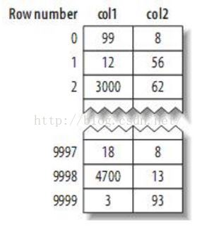
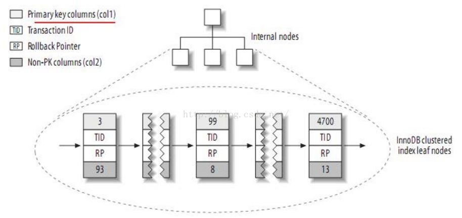
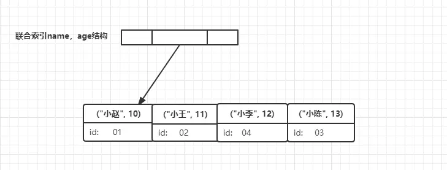

##### 参考博文

[B树和B+树的插入、删除图文详解](https://www.cnblogs.com/nullzx/p/8729425.html)
[Mysql最左匹配原则](https://blog.csdn.net/sinat_41917109/article/details/88944290)
[MySQL 覆盖索引详解](https://juejin.im/post/5da5d1966fb9a04e252c94bf)
[MYSQL索引：对聚簇索引和非聚簇索引的认识](https://blog.csdn.net/alexdamiao/article/details/51934917)
[什么是索引下推](https://juejin.im/post/5deef343e51d455819022033)
[浅析MySQL中的Index Condition Pushdown (ICP 索引条件下推)和Multi-Range Read（MRR 索引多范围查找）查询优化](https://yq.aliyun.com/articles/259696)
[MYSQL索引条件下推的简单测试](https://cloud.tencent.com/developer/article/1068845)
[MySQL5.6之Index Condition Pushdown(ICP,索引条件下推)](http://mdba.cn/2014/01/21/index-condition-pushdownicp%E7%B4%A2%E5%BC%95%E6%9D%A1%E4%BB%B6%E4%B8%8B%E6%8E%A8/)
[MySQL索引类型](https://www.cnblogs.com/luyucheng/p/6289714.html)

[TOC]

# 1. 索引存储类型
在存储引擎层实现

存储引擎使用索引的方式：先  在索引中找到匹配的索引记录，然后返回包含该索引值的数据行。
## 1.1 B树索引
##### 扫描
B树索引避免了全表扫描，而是从索引根节点开始搜索，不断向下寻找(左指针指向值更小的节点，右指针指向值更大的节点)

##### 排序
对多个值进行排序的规则是依照create table语句中定义索引时列的顺序。

##### 可以使用B树索引的查询类型
1. 全值匹配：和索引中所有列匹配

在用到所有索引列的情况下，where语句中索引列的顺序不影响
```SQL
select * from table_name where a = '1' and b = '2' and c = '3' 
select * from table_name where b = '2' and a = '1' and c = '3' 
select * from table_name where c = '3' and b = '2' and a = '1' 
```
2. 最左前缀匹配：针对索引key(a, b,c)，其实创建了(a)、(a,b)、(a,b,c)三个索引
```SQL
//都可以进行索引匹配
select * from table_name where a = '1' 
select * from table_name where a = '1' and b = '2'  
select * from table_name where a = '1' and b = '2' and c = '3'
```
```SQL
//会进行全表扫描
select * from table_name where  b = '2' 
select * from table_name where  c = '3'
select * from table_name where  b = '1' and c = '3'
```
```SQL
//只用到了a的索引
select * from table_name where a = '1' and c = '3' 
```
假如创建一个联合索引(a,b),他的索引树如图所示。a的值是有序的(1,1,2,2,3,3)，b的值是无序的(1,2,1,4,1,2)。只有在a相等的情况下，才会使用b排序。

最左匹配原则在遇上范围查询(>、<、between、like)就会停止，后面的字段不使用索引。例如a>1 and b>2的情况下，a可以使用索引而b不可以使用，因为b是无序的。所以在优化查询时，如果范围查询的列值是有限的，可以用多个等于条件代替范围查询。

3. 列前缀匹配：针对第一个索引列：索引列如果是字符型的，比较顺序是先比较第一个字母，然后在比较第二个字母。。。
```SQL
select * from table_name where a like 'As%'; //前缀都是排好序的，走索引查询
select * from table_name where  a like '%As'//全表查询
select * from table_name where  a like '%As%'//全表查询
```
4. 范围值匹配：针对第一个索引列
```SQL
//b是无序的，只有a能范围匹配
select * from table_name where  a > 1 and a < 3 and b > 1;
```
5. 精确匹配某一列，范围匹配另一列：针对第一个索引列精确匹配，第二个索引列范围匹配
```SQL
//a=1的情况下，b是有序的
select * from table_name where  a = 1 and b > 3;
```
6. 排序
```SQL
//b+树索引的数据本身就是有序的，可以直接返回
select * from table_name order by a,b,c limit 10;
```
```SQL
//没有用到索引，order by后面的列也必须满足最左匹配原则
select * from table_name order by b,c,a limit 10;
```
```SQL
//用到(a)、(a,b)索引
select * from table_name order by a limit 10;
select * from table_name order by a,b limit 10;
```
```SQL
a=1的情况下，b,c可以作为索引
select * from table_name where a =1 order by b,c limit 10;
```
## 1.2 哈希索引
哈希索引基于哈希表实现，只能用于精确匹配所有列。存储引擎对所有索引列

计算哈希值存在索引中，值存储指向每个数据行的指针。

- 不能使用索引值避免读取行
- 索引数据不按照索引列的值排序，不可以用于排序
- 不只是部分索引列匹配查找
- 只支持等值查询，不支持范围查询
举例如下：
```SQL
create table testhash(
    fname varchar(50) not null,
    lname varchar(50) not null,
    key using hash(fname),
)engine=memory
```
fname|lname
---|---|
a|aa
b|bb
c|cc
d|dd

哈希值：
```
f('a')=2323
f('b')=7437
f('c')=8784
f('d')=2458
```
哈希索引数据结构：每个slot是顺序排序的，但是针对表记录不是
槽(slot)|值(value)
---|---|
2323|指向第1行的指针
2458|指向第4行的指针
7437|指向第2行的指针
8784|指向第3行的指针

首先计算c的哈希值，f('c')=8784，在索引中找到8784，然后根据记录的第三行指针寻找数据。
```SQL
select lname from testhash where fname='c';
```

## 1.3 空间数据索引(R-Tree)

## 1.4 全文索引

# 2. 索引优化策略
#### 2.1 独立的列
索引列不可以是表达式的一部分，也不可以作为函数参数
```MYSQL
//以下两种都不行
select actor_id from actor where actor+1=5;
select...where to_days(current_date)-to_days(date_col)<=10;
```
#### 2.2 前缀索引
针对值很长的索引可以索引开始的部分字符，要选择哪些选择性高的索引。选择性高指的是不重复的索引值和数据表中记录总数的比值。选择性越高，越能筛选不符合条件的记录，唯一索引的选择性就为1。
```
alter table city add key(city(7));
```
但是无法使用前缀索引做order by和group by，还有无法做覆盖扫描

#### 2.3 多列索引
为没个列创建单个索引并不是好策略

#### 2.4 选择合适的索引列顺序

# 3. 聚簇索引(InnoDB)和非聚簇索引(MyISAM)
```SQL
create table test(
    col1 int not null,
    col2 int not null,
    primary key(col1),
    key(col2)
)
```

## 3.1 聚簇索引
聚簇索引是为每张表的主键构造一颗B+树，树的叶子节点存放表的数据，每个节点也叫数据页，数据页之间的是双向链表，按照主键的大小顺序排序。每页中的记录也是双向链表，按顺序排序。

非叶节点又叫索引页，存放索引值和指向数据页的指针。

InnoDB主键索引(聚簇索引)如下图所示：每个叶子节点包含主键值、事务ID、DB_ROLL_PTR以及剩余的列值


InnoDB二级索引(辅助索引、非聚簇索引)如下图所示：每个叶子节点包含二级索引列值、主键值，InnoDB在更新时无需更新二级索引中的指针。如果索引的是二级索引，那么需要先从二级索引树中找到对应的主键，然后从主键的索引树中找出记录。


- 提高了I/O密集型应用的性能
- 插入速度依赖于插入顺序，==对于按主键顺序插入的记录效率很高==
- 更新索引列值的代价很高，因为索引列更新了会强制移动到新的位置
- 插入新行或者主键被更新可能导致页分裂问题，页分裂占用磁盘空间更大

避免使用uuid作为主键：
1. 写入的目标也可能已经刷回磁盘并从缓存中删除，需要频繁的从磁盘加载目标页到内存
2. uuid是乱序的，可能导致大量的页分裂，或许会造成每个页数据都很稀疏的现象
## 3.2 非聚簇索引
非聚簇索引的叶子节点存放索引值和存放数据的物理地址指针。

MyISAM主键索引(非聚簇索引)如下图所示：叶子节点存储主键值和指向记录的指针


MyISAM的二级索引的B+树和主键索引相同，叶子节点中存储二级索引列值和指向记录的指针

InnoDB的索引B+树 VS MyISAM的索引B+树


## 3.3 覆盖索引
覆盖索引是指一个索引包含查询和条件需要的字段，只能使用B+树实现。例如当有一个索引(a,b),并且只访问这两列时，就是一个覆盖索引

当发起一个覆盖索引的请求时，explain的extra列会显示"using index"，key中代表的就是覆盖索引。

例子：
```SQL
SELECT age FROM student WHERE name = '小李'；
```



## 3.4 使用索引扫描做排序
- order by的顺序和索引顺序一致(但如果第一列指定成常量条件，剩余的索引列仍可以做排序)
- where中的列和order by中的列的组合需要满足最左匹配原则

# 4. 索引条件下推(ICP)
当不使用ICP时，存储引擎会根据索引检索出数据，然后将数据返回给MYSQL服务器，由服务器根据where条件对数据进行过滤。当使用ICP时，如果条件中存在索引列，服务器将索引列的判断条件也交给存储引擎，存储引擎根据索引列条件过滤不满足的数据，然后交给服务器。这可以减少存储引擎和磁盘间的I/O和存储引擎和服务器间的数据传输量。

使用场景：
1. InndoDB的二级索引，因为聚簇索引直接会把数据也加载到内存。二级索引会先去找聚簇索引，然后加载数据。如果二级索引不符合条件，就不用加载对应的聚簇索引和数据到内存了。
2. 需要范围查找的情况
3. 二级索引必须是组合索引，并且满足最左匹配原则，当前面的索引列进行范围索引查找，剩余的索引列不能用于索引查找后，经过ICP剩余的索引列将用来当条件过滤查找出来的数据。

### 不使用ICP的过程
explain的extra会显示“using where”
①服务器发起读取数据的命令，通过handle接口调取索引读或者全表读(此处将使用索引读)
②调用索引读进如存储引擎，存储引擎将读取索引树
③在索引树上使用满足最左匹配原则的二级索引列查找叶子数据(不能被索引的列将不被使用)
④找到叶子数据后，根据数据中的主键去磁盘表中加载数据到内存
⑤⑥存储引擎将数据返回给服务器
⑦⑧服务器收到数据后，进行where条件过滤


### 使用ICP的过程
explain的extra会显示“using index condition”
```SQL
set optimizer_switch='index_condition_pushdown=off/on'
```


①②同上
③对查出来的数据进行条件过滤，将不能被利用的索引列当条件过滤数据，不满足条件的将不去磁盘加载数据，因此减少了I/O
④⑤⑥同上
⑦⑧收到的数据将是少量的

### 例子
order_id = 10900是可以直接进行索引查找的，虽然product_name也包含在复合索引中，但是product_name like '%00163e0496af%'是无法使用索引的。利用ICP就是：在利用第一个条件 order_id = 10900 进行索引查找的过程中，同时使用product_name like '%00163e0496af%'这个无法直接使用索引查找的条件进行过滤。
```SQL
create index idx_orderid_productname on test_orderdetail(order_id,product_name);

select * from test_orderdetail where order_id = 10900 and product_name like '%00163e0496af%';
```


# 5. 索引的应用类型
```SQL
CREATE TABLE table_name[col_name data type]
[unique|fulltext][index|key][index_name](col_name[length])[asc|desc]
```
## 普通索引index | key
作为基本索引，没有限制
```SQL
CREATE INDEX index_name ON table(column(length));

ALTER TABLE table_name ADD INDEX index_name ON (column(length));

CREATE TABLE `table` (
    `id` int(11) NOT NULL AUTO_INCREMENT ,
    `title` char(255) CHARACTER NOT NULL ,
    `content` text CHARACTER NULL ,
    `time` int(10) NULL DEFAULT NULL ,
    PRIMARY KEY (`id`),
    INDEX|key index_name (title(length))
);

DROP INDEX index_name ON table;
```

## 唯一索引unique
列值必须唯一且可以为空，如果是组合索引，那么组合值必须唯一
```SQL
CREATE UNIQUE INDEX(key) indexName ON table(column(length));

ALTER TABLE table_name ADD UNIQUE indexName ON (column(length));

CREATE TABLE `table` (
    `id` int(11) NOT NULL AUTO_INCREMENT ,
    `title` char(255) CHARACTER NOT NULL ,
    `content` text CHARACTER NULL ,
    `time` int(10) NULL DEFAULT NULL ,
    UNIQUE indexName (title(length))
);;
```
## 主键索引
一个表只能有一个主键索引，主键索引值唯一且不能为空
```SQL
CREATE TABLE `table` (
    `id` int(11) NOT NULL AUTO_INCREMENT ,
    `title` char(255) NOT NULL ,
    PRIMARY KEY (`id`)
);
```
## 组合索引
在多个字段上创建索引，需要满足最左匹配原则
```SQL
ALTER TABLE `table` ADD INDEX name_city_age (name,city,age); 
```

## 全文索引fulltext
- 只能应用于char、varchar、text，配合match against使用
- 先将数据插入没有fulltext的表，再创建fulltext索引，比将数据插入有fulltext索引的表速度快
```SQL
CREATE TABLE `table` (
    `id` int(11) NOT NULL AUTO_INCREMENT ,
    `title` char(255) CHARACTER NOT NULL ,
    `content` text CHARACTER NULL ,
    `time` int(10) NULL DEFAULT NULL ,
    PRIMARY KEY (`id`),
    FULLTEXT (content)
);

ALTER TABLE article ADD FULLTEXT index_content(content);

CREATE FULLTEXT INDEX index_content ON article(content);

SELECT * FROM `student` WHERE MATCH(`name`) AGAINST('聪')
```


