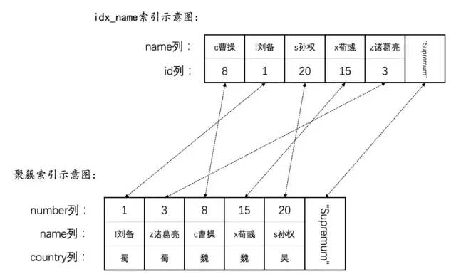
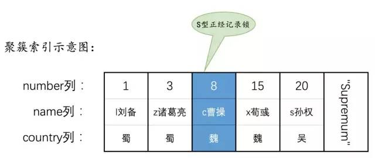

##### 1.参考博客
[超全面的MySQL语句加锁分析](https://blog.csdn.net/bjweimengshu/article/details/90056126)

例子准备：
```SQL
CREATE TABLE hero (
    number INT,
    name VARCHAR(100),
    country varchar(100),
    PRIMARY KEY (number),
    KEY idx_name (name)
) Engine=InnoDB CHARSET=utf8;

INSERT INTO hero VALUES
    (1, 'l刘备', '蜀'),
    (3, 'z诸葛亮', '蜀'),
    (8, 'c曹操', '魏'),
    (15, 'x荀彧', '魏'),
    (20, 's孙权', '吴');
```
每个聚簇索引number含有记录所有内容，二级索引name只含有一级索引的内容

## 1. 普通select语句
隔离级别|加锁情况|读问题
---|---|---|
READ UNCOMMITTED|不加锁|脏读、不可重复读、幻读
READ COMMITTED|不加锁，每次select都生成read view|不可重复读、幻读
REPEATABLE READ|不加锁，只有第一次select生成read view||
SERIALIZABLE|


## 2. 锁定读语句

```SQL
语句一：SELECT ... LOCK IN SHARE MODE;

语句二：SELECT ... FOR UPDATE;

语句三：UPDATE ...

语句四：DELETE ...
```
### 2.1 使用主键等值查询
##### 2.1.1 SELECT ... LOCK IN SHARE MODE
```
SELECT * FROM hero WHERE number = 8 LOCK IN SHARE MODE;
```
只给聚簇索引中number为8的记录加S锁


### 2.2 使用主键范围查询

### 2.3 使用二级索引等值查询

### 2.4 使用二级索引范围查询

### 2.5 全表扫描