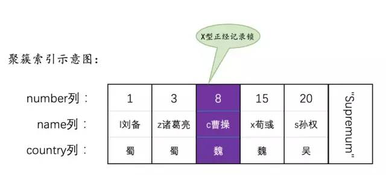
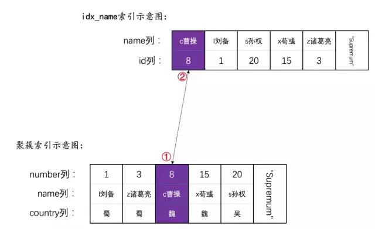
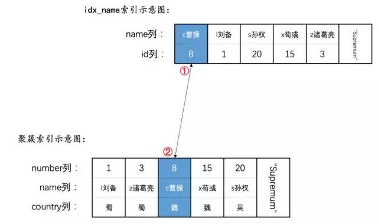
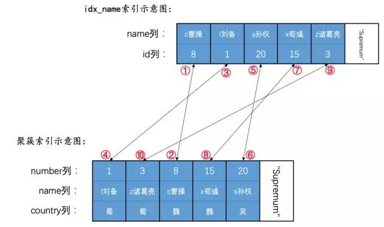
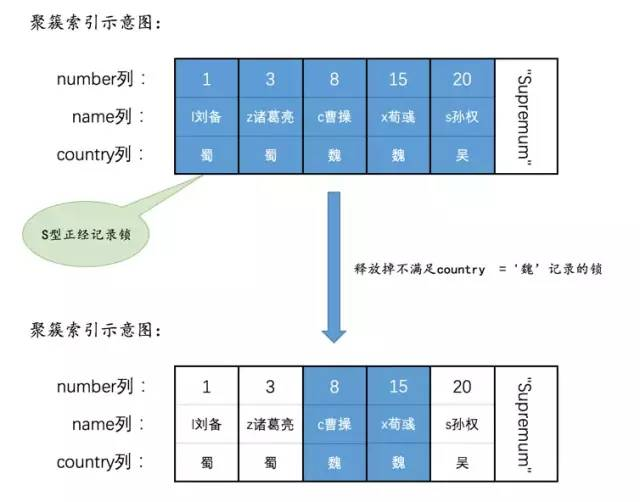

## 参考博文
[超全面的MySQL语句加锁分析](https://blog.csdn.net/bjweimengshu/article/details/90056126)
[全面了解mysql锁机制（InnoDB）与问题排查](https://www.lagou.com/lgeduarticle/59329.html)⚠️
[mysql 索引加锁分析](https://www.jianshu.com/p/13f5777966dd)⚠️

例子准备：
```SQL
CREATE TABLE hero (
    number INT,
    name VARCHAR(100),
    country varchar(100),
    PRIMARY KEY (number),
    KEY idx_name (name)
) Engine=InnoDB CHARSET=utf8;

INSERT INTO hero VALUES
    (1, 'l刘备', '蜀'),
    (3, 'z诸葛亮', '蜀'),
    (8, 'c曹操', '魏'),
    (15, 'x荀彧', '魏'),
    (20, 's孙权', '吴');
```
每个聚簇索引number含有记录所有内容，二级索引name只含有一级索引的内容

## 1. 普通select语句
隔离级别|加锁情况|读问题
---|---|---|
READ UNCOMMITTED|不加锁|脏读、不可重复读、幻读
READ COMMITTED|不加锁，每次select都生成read view|不可重复读、幻读
REPEATABLE READ|不加锁，只有第一次select生成read view||
SERIALIZABLE|


## 2. 锁定读语句

```SQL
语句一：SELECT ... LOCK IN SHARE MODE;

语句二：SELECT ... FOR UPDATE;

语句三：UPDATE ...

语句四：DELETE ...
```

### 2.1 使用主键等值查询(READ UNCOMMITTED/READ COMMITTED隔离级别下)
##### 2.1.1 SELECT ... LOCK IN SHARE MODE
只给聚簇索引中number为8的记录加S锁
```SQL
SELECT * FROM hero WHERE number = 8 LOCK IN SHARE MODE;
```


##### 2.1.2 SELECT ... FOR UPDATE
只给聚簇索引中number为8的记录加X锁
```SQL
SELECT * FROM hero WHERE number = 8 FOR UPDATE;
```


##### 2.1.3 UPDATE
没有更新二级索引，只更新一级索引的情况下，和SELECT ... FOR UPDATE相同，给number=8的记录加X锁
```SQL
UPDATE hero SET country = '汉' WHERE number = 8;
```
在更新二级索引的情况下：
1. 先给number=8的聚簇索引记录加X锁，更新聚簇索引中name的值
2. 再将聚簇索引对应的二级索引记录加X锁，更新二级索引记录中name的值

```SQL
UPDATE hero SET name = 'cao曹操' WHERE number = 8;
```


##### 2.1.4 DELETE
1. 先给number=8的聚簇索引记录加X锁，删除聚簇索引中number=8的值
2. 再将聚簇索引对应的二级索引记录加X锁，删除二级索引记录中对应的记录
```sql
DELETE FROM hero WHERE number = 8;
```
### 2.2 使用主键范围查询
##### 2.2.1 SELECT ... LOCK IN SHARE MODE
```SQL
SELECT * FROM hero WHERE number <= 8 LOCK IN SHARE MODE;
```
1. 存储引擎在聚簇索引中找到满足number<=8的第一条记录，即number=1，给这条记录加S锁
2. 判断是否符合ICP，因为是聚集索引，所以不进行ICP的判断
3. 判断是否满足number<=8的边界条件，InnoDB会对聚簇索引中取出的记录判断是否满足边界条件，如果不满足将释放锁(这种情况违背了2PL)并给服务器层返回查询完毕的信息，否则返回给服务器层处理
4. 服务器层收到数据后，如果是查询完毕则结束。否则对没有索引条件下推的条件进行判断，如果满足条件则返回给客户端，否则将释放这行上的锁
5. 存储引擎在刚才找到的叶子节点根据链表遍历，执行上述操作
##### 2.2.2 SELECT ... FOR UPDATE
和SELECT ... LOCK IN SHARE MODE类似，但是加的是X锁
##### 2.2.3 UPDATE
不更新二级索引的情况下，和SELECT ... FOR UPDATE相同
```SQL
UPDATE hero SET country = '汉' WHERE number >= 8;
```
更新二级索引的情况下:
1. 为number值为8的聚簇索引记录加上X型正经记录锁。
2. 然后为上一步中的记录索引记录对应的idx_name二级索引记录加上X型正经记录锁。
3. 为number值为15的聚簇索引记录加上X型正经记录锁。
4. 然后为上一步中的记录索引记录对应的idx_name二级索引记录加上X型正经记录锁。
5. 为number值为20的聚簇索引记录加上X型正经记录锁。
6. 然后为上一步中的记录索引记录对应的idx_name二级索引记录加上X型正经记录锁。
```SQL
UPDATE hero SET name = 'cao曹操' WHERE number >= 8;
```
##### 2.2.4 DELETE
和UPDATE相同
### 2.3 使用二级索引等值查询
##### 2.3.1 SELECT ... LOCK IN SHARE MODE
先对二级索引记录加S锁，在对对应的聚簇索引记录加S锁。对于等值查询，在获取第一个记录后，就能沿着链表查找。在加锁前会先判断条件，如果不满足就不加锁了。
```SQL
SELECT * FROM hero WHERE name = 'c曹操' LOCK IN SHARE MODE;
```


##### 2.3.2 SELECT ... FOR UPDATE
和SELECT ... LOCK IN SHARE MODE类似，但是加的是X锁
##### 2.3.3 UPDATE
和SELECT ... FOR UPDATE相同
##### 2.3.4 DELETE
和UPDATE相同


### 2.4 使用二级索引范围查询
##### 2.4.1 SELECT ... LOCK IN SHARE MODE
在定位到第一个满足条件的二级索引记录后，会对记录加锁，然后对相应的聚簇索引记录加锁。然后就可以顺着链表一直查找下去。
```SQL
//因为优化器会计算使用二级索引的成本，当成本太大时可能会全表扫描，所以使用FORCE INDEX(idx_name)强制使用二级索引的执行
SELECT * FROM hero FORCE INDEX(idx_name)  WHERE name >= 'c曹操' LOCK IN SHARE MODE;
```

##### 2.4.2 SELECT ... FOR UPDATE
和SELECT ... LOCK IN SHARE MODE类似，加的是X锁

##### 2.4.3 UPDATE
和SELECT ... FOR UPDATE相同
##### 2.4.4 DELETE
和UPDATE相同

### 2.5 全表扫描
##### 2.5.1 SELECT ... LOCK IN SHARE MODE
因为没有索引，存储引擎只能全表扫描，为每一条数据加S锁然后返回给服务器，服务器判断是否满足条件，满足则返回给客户端，否则会释放锁
```SQL
SELECT * FROM hero WHERE country  = '魏' LOCK IN SHARE MODE;
```

##### 2.5.2 SELECT ... FOR UPDATE
和SELECT ... LOCK IN SHARE MODE类似，加的是X锁

##### 2.5.3 UPDATE  DELETE
对于UPDATE ...和DELETE ...的语句来说，在遍历聚簇索引中的记录，都会为该聚簇索引记录加上X型正经记录锁：
1. 如果该聚簇索引记录不满足条件，直接把该记录上的锁释放掉。
2. 如果该聚簇索引记录满足条件，则会对相应的二级索引记录加上X型正经记录锁（DELETE语句会对所有二级索引列加锁，UPDATE语句只会为更新的二级索引列对应的二级索引记录加锁）。
