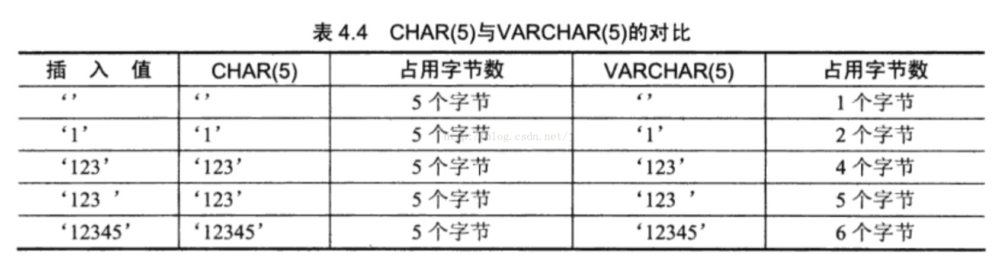
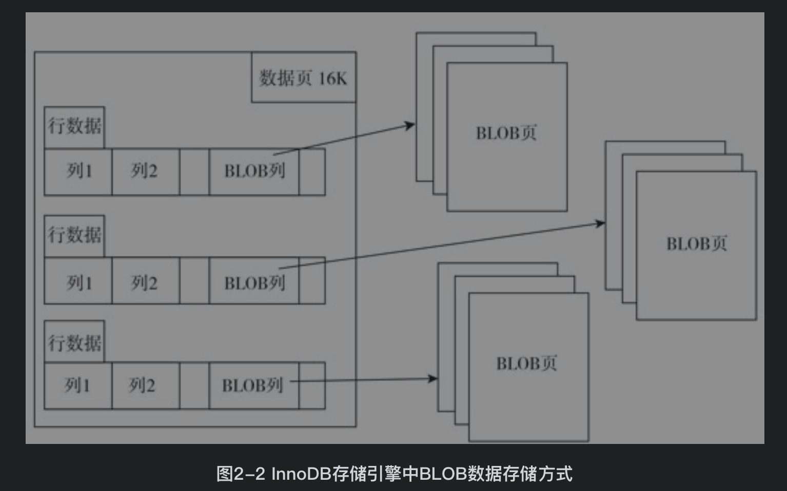

## 参考博文
[MySQL中数据类型介绍](https://blog.csdn.net/bzhxuexi/article/details/43700435)
[MySQL数据类型--浮点数类型和定点数类型](https://blog.csdn.net/u011794238/article/details/50902405)
[MySQL数据类型--字符串类型](https://blog.csdn.net/u011794238/article/details/50953414)
[MySQL中文文档](https://www.docs4dev.com/docs/zh/mysql/5.7/reference/blob.html)
[MySQL 中 datetime 和 timestamp 的区别与选择](https://segmentfault.com/a/1190000017393602)
[mysql 初始化 timestamp，提示 Invalid default value for 'xxx'](https://blog.csdn.net/plpldog/article/details/82788737)


[TOC]


# 1. 数据类型优化
## 1.1 数字类型
### 1.1.1 整型
bool = tinyint(1)

可以存储的范围值从-2^(N-1)^ ~ 2^(N-1)^-1 (N是存储的位数)

为整数类型指定宽度，例如int(11)没有实际意义，他只限制了客户端工具显示整数的个数，对存储和计算来说没有区别

### 1.1.2 浮点型(非精确类型)
decimal只是一种存储格式，cpu并不支持decimal计算，需求MYSQL服务器自行实现decimal。计算中decimal会转为double，需要额外的存储空间和计算开销，只有在需要精确计算时才使用。

decimal(18,9)表示小数点左右两边相加最大可以存18位数字，右边小数位最多可以存9位数字。小数精度超过限制的会四舍五入。float和double同规则

类型	|字节数(byte)
---|---|
FLOAT	|4
DOUBLE	|8
DECIMAL	|每9位数据占用4byte，小数点本身1byte，decimal(18,9)占用4+1+4=9byte
### 1.1.3 高精度类型
decimal

### 1.1.4 位类型
bit数据类型可以保存位字段的值。bit(M)表示可以存储M位，不足M位的在左边填充0。M的范围为1-64，占用的空间为(M+7)/8字节。为BIT（6）列分配一个值b'101'，其效果与分配b'000101'相同
```SQL
mysql> create table t5(a bit(4));
Query OK, 0 rows affected (0.03 sec)

//位值使用b'value'格式
mysql> insert into t5 select b'1000';
Query OK, 1 row affected (0.00 sec)
Records: 1  Duplicates: 0  Warnings: 0

mysql> select * from t5;
+------+
| a    |
+------+
|    |
+------+
1 row in set (0.00 sec)

//要使用hex函数才能查看位字段的值
mysql> select hex(a) from t5;
+--------+
| hex(a) |
+--------+
| 8      |
+--------+
1 row in set (0.00 sec)
```
### 1.1.5 关于数字的经典SQL编程问题
1. 数字辅助表
数字辅助表是一个只包含从1到N的N个整数的简单表

```SQL
mysql> create table nums(a int unsigned not null primary key);
Query OK, 0 rows affected (0.03 sec)

mysql> delimiter //
mysql> create procedure pCreateNums(in cnt int unsigned)
    ->        begin
    ->        declare s int unsigned default 1;
    ->        truncate table nums;
    ->        insert into nums select s;
    ->        while s*2 <= cnt do
    ->        begin
    ->        insert into nums select a+s from nums;
    ->        set s=s*2;
    ->        end;
    ->        end while;
    ->        end //
Query OK, 0 rows affected (0.01 sec)
mysql> delimiter ;

mysql> call pCreateNums(20000);
```
2. 连续范围问题
将一些连续范围的数表示成如下所示：

```SQL
mysql> create table n(a int unsigned not null primary key);
Query OK, 0 rows affected (0.02 sec)

mysql> insert into n values(1);
Query OK, 1 row affected (0.01 sec)

mysql> insert into n values(2);
Query OK, 1 row affected (0.00 sec)

mysql> insert into n values(3);
Query OK, 1 row affected (0.00 sec)

mysql> insert into n values(100);
Query OK, 1 row affected (0.01 sec)

mysql> insert into n values(101);
Query OK, 1 row affected (0.01 sec)

mysql> insert into n values(103);
Query OK, 1 row affected (0.00 sec)

mysql> insert into n values(104);
Query OK, 1 row affected (0.00 sec)

mysql> insert into n values(105);
Query OK, 1 row affected (0.00 sec)

//:=表示赋值，select @a:=0是将自定义变量@a初始化成0
//a表示计算出来的行号
mysql> select a, @a:=@a+1 rn from n,(select @a:=0) as b;
+-----+------+
| a   | rn   |
+-----+------+
|   1 |    1 |
|   2 |    2 |
|   3 |    3 |
| 100 |    4 |
| 101 |    5 |
| 103 |    6 |
| 104 |    7 |
| 105 |    8 |
+-----+------+
8 rows in set (0.00 sec)

//可以根据连续给出的行号来反映出连续范围的规律
//属于连续区间的数字a-rn是一样的
mysql> select a,rn,a-rn
    -> from
    -> (select a,@a:=@a+1 rn from n,(select @a:=0) as b)                        
    -> as c;
+-----+------+------+
| a   | rn   | a-rn |
+-----+------+------+
|   1 |    1 |    0 |
|   2 |    2 |    0 |
|   3 |    3 |    0 |
| 100 |    4 |   96 |
| 101 |    5 |   96 |
| 103 |    6 |   97 |
| 104 |    7 |   97 |
| 105 |    8 |   97 |
+-----+------+------+
8 rows in set (0.00 sec)

mysql> select min(a) start,max(a) end
    -> from 
    -> (
    -> select a,rn,a-rn as diff
    -> from
    -> (select a,@a:=@a+1 rn from n,(select @a:=0) as a)
    -> as b
    -> )as c
    -> group by diff;
+-------+------+
| start | end  |
+-------+------+
|     1 |    3 |
|   100 |  101 |
|   103 |  105 |
+-------+------+
3 rows in set (0.00 sec)
```

## 1.2 字符串类型
### 字符集
```SQL
//第一列是字符集的名称，第三列是排序规则,最后一列代表这个字符集的1个字符可能占用的最大字节空间，单位是字节（Byte）
//gbk是gb2312的超集，因此可以支持更多的汉字
//big5可能是繁体中文首选的字符集
mysql> show charset;
+----------+---------------------------------+---------------------+--------+
| Charset  | Description                     | Default collation   | Maxlen |
+----------+---------------------------------+---------------------+--------+
| big5     | Big5 Traditional Chinese        | big5_chinese_ci     |      2 |
| dec8     | DEC West European               | dec8_swedish_ci     |      1 |
| cp850    | DOS West European               | cp850_general_ci    |      1 |
| hp8      | HP West European                | hp8_english_ci      |      1 |
| koi8r    | KOI8-R Relcom Russian           | koi8r_general_ci    |      1 |
| latin1   | cp1252 West European            | latin1_swedish_ci   |      1 |
| latin2   | ISO 8859-2 Central European     | latin2_general_ci   |      1 |
| swe7     | 7bit Swedish                    | swe7_swedish_ci     |      1 |
| ascii    | US ASCII                        | ascii_general_ci    |      1 |
| ujis     | EUC-JP Japanese                 | ujis_japanese_ci    |      3 |
| sjis     | Shift-JIS Japanese              | sjis_japanese_ci    |      2 |
| hebrew   | ISO 8859-8 Hebrew               | hebrew_general_ci   |      1 |
| tis620   | TIS620 Thai                     | tis620_thai_ci      |      1 |
| euckr    | EUC-KR Korean                   | euckr_korean_ci     |      2 |
| koi8u    | KOI8-U Ukrainian                | koi8u_general_ci    |      1 |
| gb2312   | GB2312 Simplified Chinese       | gb2312_chinese_ci   |      2 |
| greek    | ISO 8859-7 Greek                | greek_general_ci    |      1 |
| cp1250   | Windows Central European        | cp1250_general_ci   |      1 |
| gbk      | GBK Simplified Chinese          | gbk_chinese_ci      |      2 |
| latin5   | ISO 8859-9 Turkish              | latin5_turkish_ci   |      1 |
| armscii8 | ARMSCII-8 Armenian              | armscii8_general_ci |      1 |
| utf8     | UTF-8 Unicode                   | utf8_general_ci     |      3 |
| ucs2     | UCS-2 Unicode                   | ucs2_general_ci     |      2 |
| cp866    | DOS Russian                     | cp866_general_ci    |      1 |
| keybcs2  | DOS Kamenicky Czech-Slovak      | keybcs2_general_ci  |      1 |
| macce    | Mac Central European            | macce_general_ci    |      1 |
| macroman | Mac West European               | macroman_general_ci |      1 |
| cp852    | DOS Central European            | cp852_general_ci    |      1 |
| latin7   | ISO 8859-13 Baltic              | latin7_general_ci   |      1 |
| utf8mb4  | UTF-8 Unicode                   | utf8mb4_general_ci  |      4 |
| cp1251   | Windows Cyrillic                | cp1251_general_ci   |      1 |
| utf16    | UTF-16 Unicode                  | utf16_general_ci    |      4 |
| utf16le  | UTF-16LE Unicode                | utf16le_general_ci  |      4 |
| cp1256   | Windows Arabic                  | cp1256_general_ci   |      1 |
| cp1257   | Windows Baltic                  | cp1257_general_ci   |      1 |
| utf32    | UTF-32 Unicode                  | utf32_general_ci    |      4 |
| binary   | Binary pseudo charset           | binary              |      1 |
| geostd8  | GEOSTD8 Georgian                | geostd8_general_ci  |      1 |
| cp932    | SJIS for Windows Japanese       | cp932_japanese_ci   |      2 |
| eucjpms  | UJIS for Windows Japanese       | eucjpms_japanese_ci |      3 |
| gb18030  | China National Standard GB18030 | gb18030_chinese_ci  |      4 |
+----------+---------------------------------+---------------------+--------+
41 rows in set (0.00 sec)

/*
Unicode是字符编码，不是字符集,它是一种在计算机上使用的字符编码。
它为每种语言中的每个字符设定了统一且唯一的二进制编码，以满足跨语言和跨平台进行文本转换和处理的要求
*/
mysql> use information_schema;
Reading table information for completion of table and column names
You can turn off this feature to get a quicker startup with -A

Database changed

//查询MySQL支持的Unicode编码的字符集
//utf8目前被视为utf8mb3，即最大占用3个字节空间，而utf8mb4可以视做utf8mb3的扩展
mysql> select * from character_sets where description like '%Unicode';
+--------------------+----------------------+------------------+--------+
| CHARACTER_SET_NAME | DEFAULT_COLLATE_NAME | DESCRIPTION      | MAXLEN |
+--------------------+----------------------+------------------+--------+
| utf8               | utf8_general_ci      | UTF-8 Unicode    |      3 |
| ucs2               | ucs2_general_ci      | UCS-2 Unicode    |      2 |
| utf8mb4            | utf8mb4_general_ci   | UTF-8 Unicode    |      4 |
| utf16              | utf16_general_ci     | UTF-16 Unicode   |      4 |
| utf16le            | utf16le_general_ci   | UTF-16LE Unicode |      4 |
| utf32              | utf32_general_ci     | UTF-32 Unicode   |      4 |
+--------------------+----------------------+------------------+--------+
6 rows in set (0.00 sec)

//查看当前使用的字符集
mysql> status;
--------------
/usr/local/mysql/bin/mysql  Ver 14.14 Distrib 5.7.23, for macos10.13 (x86_64) using  EditLine wrapper

Connection id:		8
Current database:	information_schema
Current user:		root@localhost
SSL:			Not in use
Current pager:		stdout
Using outfile:		''
Using delimiter:	;
Server version:		5.7.23 MySQL Community Server (GPL)
Protocol version:	10
Connection:		Localhost via UNIX socket
Server characterset:	utf8
Db     characterset:	utf8
Client characterset:	utf8
Conn.  characterset:	utf8
UNIX socket:		/tmp/mysql.sock
Uptime:			20 days 22 hours 3 min 16 sec

Threads: 1  Questions: 242  Slow queries: 0  Opens: 134  Flush tables: 1  Open tables: 123  Queries per second avg: 0.000
--------------

//MySQL可以细化每个对象字符集的设置
mysql> create table c(a varchar(10) charset gbk,b varchar(10) charset latin1);
```

### 字符集的排序规则
排序规则（Collation）是指对指定字符集下不同字符的比较规则。其特征有以下几点：
1）两个不同的字符集不能有相同的排序规则。
2）每个字符集有一个默认的排序规则。
3）有一些常用的命名规则。如_ci结尾表示大小写不敏感（case insensitive），_cs表示大小写敏感（case sensitive），_bin表示二进制的比较（binary）

```SQL
//查看mysql支持的各种排序规则
//show collation;
mysql> select collation_name,character_set_name from collations;
+--------------------------+--------------------+
| collation_name           | character_set_name |
+--------------------------+--------------------+
| big5_chinese_ci          | big5               |
| big5_bin                 | big5               |
| dec8_swedish_ci          | dec8               |
| dec8_bin                 | dec8               |
| cp850_general_ci         | cp850              |
| cp850_bin                | cp850              |
| hp8_english_ci           | hp8                |
| hp8_bin                  | hp8                |
| koi8r_general_ci         | koi8r              |
| koi8r_bin                | koi8r              |
| latin1_german1_ci        | latin1             |
| latin1_swedish_ci        | latin1             |
| latin1_danish_ci         | latin1             |
| latin1_german2_ci        | latin1             |
| latin1_bin               | latin1             |
| latin1_general_ci        | latin1             |
| latin1_general_cs        | latin1             |
| latin1_spanish_ci        | latin1             |
| latin2_czech_cs          | latin2             |
| latin2_general_ci        | latin2             |
| latin2_hungarian_ci      | latin2             |
| latin2_croatian_ci       | latin2             |
| latin2_bin               | latin2             |
| swe7_swedish_ci          | swe7               |
| swe7_bin                 | swe7               |
| ascii_general_ci         | ascii              |
| ascii_bin                | ascii              |
| ujis_japanese_ci         | ujis               |
| ujis_bin                 | ujis               |
| sjis_japanese_ci         | sjis               |
| sjis_bin                 | sjis               |
| hebrew_general_ci        | hebrew             |
| hebrew_bin               | hebrew             |
| tis620_thai_ci           | tis620             |
| tis620_bin               | tis620             |
| euckr_korean_ci          | euckr              |
| euckr_bin                | euckr              |
| koi8u_general_ci         | koi8u              |
| koi8u_bin                | koi8u              |
| gb2312_chinese_ci        | gb2312             |
| gb2312_bin               | gb2312             |
| greek_general_ci         | greek              |
| greek_bin                | greek              |
| cp1250_general_ci        | cp1250             |
| cp1250_czech_cs          | cp1250             |
| cp1250_croatian_ci       | cp1250             |
| cp1250_bin               | cp1250             |
| cp1250_polish_ci         | cp1250             |
| gbk_chinese_ci           | gbk                |
| gbk_bin                  | gbk                |
| latin5_turkish_ci        | latin5             |
| latin5_bin               | latin5             |
| armscii8_general_ci      | armscii8           |
| armscii8_bin             | armscii8           |
| utf8_general_ci          | utf8               |
| utf8_bin                 | utf8               |
| utf8_unicode_ci          | utf8               |
| utf8_icelandic_ci        | utf8               |
| utf8_latvian_ci          | utf8               |
| utf8_romanian_ci         | utf8               |
| utf8_slovenian_ci        | utf8               |
| utf8_polish_ci           | utf8               |
| utf8_estonian_ci         | utf8               |
| utf8_spanish_ci          | utf8               |
| utf8_swedish_ci          | utf8               |
| utf8_turkish_ci          | utf8               |
| utf8_czech_ci            | utf8               |
| utf8_danish_ci           | utf8               |
| utf8_lithuanian_ci       | utf8               |
| utf8_slovak_ci           | utf8               |
| utf8_spanish2_ci         | utf8               |
| utf8_roman_ci            | utf8               |
| utf8_persian_ci          | utf8               |
| utf8_esperanto_ci        | utf8               |
| utf8_hungarian_ci        | utf8               |
| utf8_sinhala_ci          | utf8               |
| utf8_german2_ci          | utf8               |
| utf8_croatian_ci         | utf8               |
| utf8_unicode_520_ci      | utf8               |
| utf8_vietnamese_ci       | utf8               |
| utf8_general_mysql500_ci | utf8               |
| ucs2_general_ci          | ucs2               |
| ucs2_bin                 | ucs2               |
| ucs2_unicode_ci          | ucs2               |
| ucs2_icelandic_ci        | ucs2               |
| ucs2_latvian_ci          | ucs2               |
| ucs2_romanian_ci         | ucs2               |
| ucs2_slovenian_ci        | ucs2               |
| ucs2_polish_ci           | ucs2               |
| ucs2_estonian_ci         | ucs2               |
| ucs2_spanish_ci          | ucs2               |
| ucs2_swedish_ci          | ucs2               |
| ucs2_turkish_ci          | ucs2               |
| ucs2_czech_ci            | ucs2               |
| ucs2_danish_ci           | ucs2               |
| ucs2_lithuanian_ci       | ucs2               |
| ucs2_slovak_ci           | ucs2               |
| ucs2_spanish2_ci         | ucs2               |
| ucs2_roman_ci            | ucs2               |
| ucs2_persian_ci          | ucs2               |
| ucs2_esperanto_ci        | ucs2               |
| ucs2_hungarian_ci        | ucs2               |
| ucs2_sinhala_ci          | ucs2               |
| ucs2_german2_ci          | ucs2               |
| ucs2_croatian_ci         | ucs2               |
| ucs2_unicode_520_ci      | ucs2               |
| ucs2_vietnamese_ci       | ucs2               |
| ucs2_general_mysql500_ci | ucs2               |
| cp866_general_ci         | cp866              |
| cp866_bin                | cp866              |
| keybcs2_general_ci       | keybcs2            |
| keybcs2_bin              | keybcs2            |
| macce_general_ci         | macce              |
| macce_bin                | macce              |
| macroman_general_ci      | macroman           |
| macroman_bin             | macroman           |
| cp852_general_ci         | cp852              |
| cp852_bin                | cp852              |
| latin7_estonian_cs       | latin7             |
| latin7_general_ci        | latin7             |
| latin7_general_cs        | latin7             |
| latin7_bin               | latin7             |
| utf8mb4_general_ci       | utf8mb4            |
| utf8mb4_bin              | utf8mb4            |
| utf8mb4_unicode_ci       | utf8mb4            |
| utf8mb4_icelandic_ci     | utf8mb4            |
| utf8mb4_latvian_ci       | utf8mb4            |
| utf8mb4_romanian_ci      | utf8mb4            |
| utf8mb4_slovenian_ci     | utf8mb4            |
| utf8mb4_polish_ci        | utf8mb4            |
| utf8mb4_estonian_ci      | utf8mb4            |
| utf8mb4_spanish_ci       | utf8mb4            |
| utf8mb4_swedish_ci       | utf8mb4            |
| utf8mb4_turkish_ci       | utf8mb4            |
| utf8mb4_czech_ci         | utf8mb4            |
| utf8mb4_danish_ci        | utf8mb4            |
| utf8mb4_lithuanian_ci    | utf8mb4            |
| utf8mb4_slovak_ci        | utf8mb4            |
| utf8mb4_spanish2_ci      | utf8mb4            |
| utf8mb4_roman_ci         | utf8mb4            |
| utf8mb4_persian_ci       | utf8mb4            |
| utf8mb4_esperanto_ci     | utf8mb4            |
| utf8mb4_hungarian_ci     | utf8mb4            |
| utf8mb4_sinhala_ci       | utf8mb4            |
| utf8mb4_german2_ci       | utf8mb4            |
| utf8mb4_croatian_ci      | utf8mb4            |
| utf8mb4_unicode_520_ci   | utf8mb4            |
| utf8mb4_vietnamese_ci    | utf8mb4            |
| cp1251_bulgarian_ci      | cp1251             |
| cp1251_ukrainian_ci      | cp1251             |
| cp1251_bin               | cp1251             |
| cp1251_general_ci        | cp1251             |
| cp1251_general_cs        | cp1251             |
| utf16_general_ci         | utf16              |
| utf16_bin                | utf16              |
| utf16_unicode_ci         | utf16              |
| utf16_icelandic_ci       | utf16              |
| utf16_latvian_ci         | utf16              |
| utf16_romanian_ci        | utf16              |
| utf16_slovenian_ci       | utf16              |
| utf16_polish_ci          | utf16              |
| utf16_estonian_ci        | utf16              |
| utf16_spanish_ci         | utf16              |
| utf16_swedish_ci         | utf16              |
| utf16_turkish_ci         | utf16              |
| utf16_czech_ci           | utf16              |
| utf16_danish_ci          | utf16              |
| utf16_lithuanian_ci      | utf16              |
| utf16_slovak_ci          | utf16              |
| utf16_spanish2_ci        | utf16              |
| utf16_roman_ci           | utf16              |
| utf16_persian_ci         | utf16              |
| utf16_esperanto_ci       | utf16              |
| utf16_hungarian_ci       | utf16              |
| utf16_sinhala_ci         | utf16              |
| utf16_german2_ci         | utf16              |
| utf16_croatian_ci        | utf16              |
| utf16_unicode_520_ci     | utf16              |
| utf16_vietnamese_ci      | utf16              |
| utf16le_general_ci       | utf16le            |
| utf16le_bin              | utf16le            |
| cp1256_general_ci        | cp1256             |
| cp1256_bin               | cp1256             |
| cp1257_lithuanian_ci     | cp1257             |
| cp1257_bin               | cp1257             |
| cp1257_general_ci        | cp1257             |
| utf32_general_ci         | utf32              |
| utf32_bin                | utf32              |
| utf32_unicode_ci         | utf32              |
| utf32_icelandic_ci       | utf32              |
| utf32_latvian_ci         | utf32              |
| utf32_romanian_ci        | utf32              |
| utf32_slovenian_ci       | utf32              |
| utf32_polish_ci          | utf32              |
| utf32_estonian_ci        | utf32              |
| utf32_spanish_ci         | utf32              |
| utf32_swedish_ci         | utf32              |
| utf32_turkish_ci         | utf32              |
| utf32_czech_ci           | utf32              |
| utf32_danish_ci          | utf32              |
| utf32_lithuanian_ci      | utf32              |
| utf32_slovak_ci          | utf32              |
| utf32_spanish2_ci        | utf32              |
| utf32_roman_ci           | utf32              |
| utf32_persian_ci         | utf32              |
| utf32_esperanto_ci       | utf32              |
| utf32_hungarian_ci       | utf32              |
| utf32_sinhala_ci         | utf32              |
| utf32_german2_ci         | utf32              |
| utf32_croatian_ci        | utf32              |
| utf32_unicode_520_ci     | utf32              |
| utf32_vietnamese_ci      | utf32              |
| binary                   | binary             |
| geostd8_general_ci       | geostd8            |
| geostd8_bin              | geostd8            |
| cp932_japanese_ci        | cp932              |
| cp932_bin                | cp932              |
| eucjpms_japanese_ci      | eucjpms            |
| eucjpms_bin              | eucjpms            |
| gb18030_chinese_ci       | gb18030            |
| gb18030_bin              | gb18030            |
| gb18030_unicode_520_ci   | gb18030            |
+--------------------------+--------------------+
222 rows in set (0.00 sec)

mysql> show charset like '%gbk';
+---------+------------------------+-------------------+--------+
| Charset | Description            | Default collation | Maxlen |
+---------+------------------------+-------------------+--------+
| gbk     | GBK Simplified Chinese | gbk_chinese_ci    |      2 |
+---------+------------------------+-------------------+--------+
1 row in set (0.00 sec)

//创建一个表，使用默认字符集utf8
mysql> create table tt(a varchar(10))charset=utf8;;
Query OK, 0 rows affected (0.02 sec)

mysql> insert into tt select 'a';
Query OK, 1 row affected (0.01 sec)
Records: 1  Duplicates: 0  Warnings: 0

mysql> insert into tt select 'A';
Query OK, 1 row affected (0.00 sec)
Records: 1  Duplicates: 0  Warnings: 0

//utf8字符集默认的排序规则是utf8_general_ci,对大小写不敏感
mysql> select * from tt where a='a';
+------+
| a    |
+------+
| a    |
| A    |
+------+
2 rows in set (0.00 sec)

mysql> select 'a'='A';
+---------+
| 'a'='A' |
+---------+
|       1 |
+---------+
1 row in set (0.00 sec)

//如果需要更改当前会话的排序规则，可以通过命令SET NAMES... COLLATE...来实现
mysql> set names utf8 collate utf8_bin;
Query OK, 0 rows affected (0.00 sec)

mysql> select 'a'='A';
+---------+
| 'a'='A' |
+---------+
|       0 |
+---------+
1 row in set (0.00 sec)
```


### char VS varchar
对于CHAR类型的字符串，MySQL数据库会自动对存储列的右边进行填充（Right Padded）操作，直到字符串达到指定的长度N。而在读取该列时，MySQL数据库会自动将填充的字符删除。

1、char适用于确定长度的字符串：如手机号码，邮政编码
2、varchar适用于不确定字符串的长度，比如：商品名称标题
3、char速度较快，但比较耗费空间，char（m）当实际存储字符串长度小于限定m大小的时候，会用空格右边填充达到m长度；
4、varchar（m）根据实际存储字符串的长度来决定占用空间；
5、varchar（m）的m的取值大小和数据库的编码有关，gdk编码下，中文占2个字节，utf8编码下，中文占3个字节；
6、表的一行记录中char和varchar的所有字段存储长度受65535字节制约
7、text类型不占剧表格中的数据容量限制，最长可存储65535个字节，实际应用中，字符长度大可考虑使用text类型





```SQL
CREATE TABLE `linkinframe`.`test` (
  `id` INT NOT NULL,
  `a` CHAR(5) NULL,
  `b` VARCHAR(5) NULL,
  PRIMARY KEY (`id`));

  INSERT INTO `linkinframe`.`test` (`id`, `a`, `b`) VALUES ('1','','');
INSERT INTO `linkinframe`.`test` (`id`, `a`, `b`) VALUES ('2','1','1');
INSERT INTO `linkinframe`.`test` (`id`, `a`, `b`) VALUES ('3','123','123');
INSERT INTO `linkinframe`.`test` (`id`, `a`, `b`) VALUES ('4','123 ','123 ');
INSERT INTO `linkinframe`.`test` (`id`, `a`, `b`) VALUES ('5','12345','12345');
//超过长度会被截断
INSERT INTO `linkinframe`.`test` (`id`, `a`, `b`) VALUES ('6','1234567','1234567');
```


MySQL数据类型	|含义|其他
---|---|---|
char(n)	|固定长度，最多255个字符|定义多长使用多长,删除末尾空格，适合经常更新
varchar(n)|	可变长度，最多65535个字符|仅使用必要的空间，保留末尾空格，适合列更新少


###  BINARY和VARBINARY
BINARY和VARBINARY与前面介绍的CHAR和VARCHAR类型有点类似，不同的是BINARY和VARBINARY存储的是二进制的字符串，而非字符型字符串。也就是说，BINARY和VARBINARY没有字符集的概念，对其排序和比较都是按照二进制值进行对比。

BINARY（N）和VARBINARY（N）中的N指的是字节长度，而非CHAR（N）和VARCHAR（N）中的字符长度

### blob vs text
blob家族用于采用二进制存储字符串，不区分大小写，存储的数据只能整体读出

text家族采用字符方式存储字符串，区分大小写

两者对超过长度的值会进行截断，不能对blob和text列的全部长度进行索引，必须指定索引前缀长度。而VARCHAR和VARBINARY的前缀长度是可选的

BLOB和TEXT类型的列不能有默认值，在排序时只使用列的前max_sort_length个字节

InnoDB会将大VARCHAR类型字符串（如VARCHAR（65530））自动转化为TEXT或BLOB类型

MySQL数据类型	|含义|其他
---|---|---|
tinytext	|可变长度，最多255个字符
text	|可变长度，最多65535个字符
mediumtext	|可变长度，最多2的24次方-1个字符
longtext	|可变长度，最多2的32次方-1个字符

MySQL数据类型	|含义|其他
---|---|---|
tinyblob	|
blob	|
mediumblob	|
longblob	|

数据页由许多的行数据组成，每行数据由列组成，对于列类型为BLOB的数据，InnoDB存储引擎只存储前20字节，而该列的完整数据则存放在BLOB的行溢出页中。在这种方式下，数据页中能存放大量的行数据，从而提高了数据的查询效率


### 枚举enum
将不重复的字符串存储成一个预定义的集合

MySQL存储枚举很紧凑，会将列表值压缩到1-2个字节中，保存每个值在列表中的位置(从1开始)，并在表的.frm文件中存储"数字-字符串"的映射关系

枚举的字符串列表是固定的，添加或者删除字符串都必须alter table，如果未来字符串会改变则不适合使用enum

例子：
```SQL
CREATE TABLE shirts (
    name VARCHAR(40),
    //枚举 value 必须是带引号的 string 文字
    size ENUM('x-small', 'small', 'medium', 'large', 'x-large')
);
INSERT INTO shirts (name, size) VALUES ('dress shirt','large'), ('t-shirt','medium'),
  ('polo shirt','small');
SELECT name, size FROM shirts WHERE size = 'medium';
+---------+--------+
| name    | size   |
+---------+--------+
| t-shirt | medium |
+---------+--------+
UPDATE shirts SET size = 'small' WHERE size = 'large';
COMMIT;
```
如果插入数字，那么该数字将被解释成位置；如果插入字符串的数字，并且和枚举中的数字匹配上，那么就插入该值，否则会被解释成索引：
```SQL
//原本的枚举中有'0','1','2'
mysql> INSERT INTO t (numbers) VALUES(2),('2'),('3');
mysql> SELECT * FROM t;
//如果 store 2，则将其解释为索引 value，并变为'1'(索引为 2 的 value)。
//如果 store '2'，它匹配枚举 value，所以它存储为'2'。
//如果store '3'，它不匹配任何枚举 value，因此它被视为索引并变为'2'(索引为 3 的 value)。
+---------+
| numbers |
+---------+
| 1       |
| 2       |
| 2       |
+---------+
```
## 1.3 日期和时间类型
| 类型 | 占据字节 | 表示形式 | 时区 | 表示范围 | 默认值 |
| :--- | :--- | :--- | :--- | :--- | :--- |
| datetime | 8 字节 | yyyy-mm-dd hh:mm:ss | 与时区无关，不会根据当前时区进行转换 | '1000-01-01 00:00:00.000000' to '9999-12-31 23:59:59.999999' | null |
| timestamp | 4 字节 | yyyy-mm-dd hh:mm:ss | 与时区有关，查询时自动检索当前时区并进行转换。比如，存储的是1970-01-01 00:00:00，客户端是北京，那么就加8个时区的小时1970-01-01 08:00:00 | '1970-01-01 00:00:01.000000' to '2038-01-19 03:14:07.999999' | 当前时间(CURRENT_TIMESTAMP）
date|3字节|yyyy-mm-dd||1000-01-01”到“9999-12-31
year|1字节
time|3字节|-838：59：59”～“838：59：59


mysql允许插入的数据形式：

```java
2016-10-01 20:48:59
2016#10#01 20/48/59
20161001204859
```
### datetime和date
```SQL
mysql> create t1(a datetime);
Query OK, 0 rows affected (0.03 sec)

//插入到数据库中的微秒级别会被截断，MySQL不精确微秒级别
mysql> insert into t11 select '2011-01-01 00:01:02.12345';
Query OK, 1 row affected (0.01 sec)
Records: 1  Duplicates: 0  Warnings: 0

mysql> select * from t11;
+---------------------+
| a                   |
+---------------------+
| 2011-01-01 00:01:02 |
+---------------------+
1 row in set (0.00 sec)

//使用microsecond函数提取微秒
mysql> select microsecond('2011-01-01 00:01:02.12345');
+------------------------------------------+
| microsecond('2011-01-01 00:01:02.12345') |
+------------------------------------------+
|                                   123450 |
+------------------------------------------+
1 row in set (0.00 sec)

//type_name(fsp)表示对秒小数的支持。type_name可以是time、datetime、timestamp，fsp表示对秒小数的精度
//CURTIME（）、SYSDATE（）和UTC_TIMESTAMP（）也支持fsp
mysql> select curtime(4);
+---------------+
| curtime(4)    |
+---------------+
| 14:11:36.7119 |
+---------------+
1 row in set (0.00 sec)
```
### timestamp
TIMESTAMP和DATETIME显示的结果是一样的，都是固定的“YYYY-MM-DD HH:MM:SS”的形式，实际存储的内容为“1970-01-0100:00:00”到当前时间的毫秒数

1. 可以使用current_timestamp在建表时给timestamp设置默认值。在不更新timestamp时他不会变
2. 可以使用on update current_timestamp在更新(update)某行时将timestamp设置为更新时间，如果没有发生更新则不变
```SQL
//使用current_timestamp给b设置默认值
mysql> create table t2(a int,b timestamp default current_timestamp);
Query OK, 0 rows affected (0.02 sec)

mysql> insert into t2(a) values(1);
Query OK, 1 row affected (0.00 sec)

mysql> select * from t2;
+------+---------------------+
| a    | b                   |
+------+---------------------+
|    1 | 2020-04-14 14:17:19 |
+------+---------------------+
1 row in set (0.00 sec)

————————————————————————————————————————————
//使用on update current_timestamp报错解决
mysql> create table t4(a int, b timestamp on update current_timestamp);
ERROR 1067 (42000): Invalid default value for 'b'
//将sql_mode的NO_ZERO_IN_DATE,NO_ZERO_DATE去掉
mysql> select @@session.sql_mode;
+-------------------------------------------------------------------------------------------------------------------------------------------+
| @@session.sql_mode                                                                                                                         |
+-------------------------------------------------------------------------------------------------------------------------------------------+
| ONLY_FULL_GROUP_BY,STRICT_TRANS_TABLES,NO_ZERO_IN_DATE,NO_ZERO_DATE,ERROR_FOR_DIVISION_BY_ZERO,NO_AUTO_CREATE_USER,NO_ENGINE_SUBSTITUTION |
+-------------------------------------------------------------------------------------------------------------------------------------------+
1 row in set (0.00 sec)
mysql> set session sql_mode='ONLY_FULL_GROUP_BY,STRICT_TRANS_TABLES,ERROR_FOR_DIVISION_BY_ZERO,NO_AUTO_CREATE_USER,NO_ENGINE_SUBSTITUTION'
    -> ;
Query OK, 0 rows affected, 1 warning (0.00 sec)
——————————————————————————————————————————————————————

//使用on update current_timestamp给b的值设置为行更新时
mysql> create table t2(a int,b timestamp [default] on update current_timestamp); 
Query OK, 0 rows affected (0.02 sec)

mysql> insert into t4(a) values(1);
Query OK, 1 row affected (0.01 sec)

mysql> select * from t4;
+------+---------------------+
| a    | b                   |
+------+---------------------+
|    1 | 0000-00-00 00:00:00 |
+------+---------------------+
1 row in set (0.00 sec)

mysql> insert into t4 values(2,current_timestamp);
Query OK, 1 row affected (0.00 sec)

mysql> select * from t4;
+------+---------------------+
| a    | b                   |
+------+---------------------+
|    1 | 0000-00-00 00:00:00 |
|    2 | 2020-04-14 14:37:41 |
+------+---------------------+
2 rows in set (0.00 sec)

//当更新a时，b的值会被更新成update的时间
mysql> update t4 set a=3 where a=2;
Query OK, 1 row affected (0.01 sec)
Rows matched: 1  Changed: 1  Warnings: 0

mysql> select * from t4;
+------+---------------------+
| a    | b                   |
+------+---------------------+
|    1 | 0000-00-00 00:00:00 |
|    3 | 2020-04-14 14:38:18 |
+------+---------------------+
2 rows in set (0.00 sec)

//当执行了update，但实际上a的值没发生更新时，b的值也不会变
mysql> update t4 set a=3 where a=2;
Query OK, 0 rows affected (0.00 sec)
Rows matched: 0  Changed: 0  Warnings: 0

mysql> select * from t4;
+------+---------------------+
| a    | b                   |
+------+---------------------+
|    1 | 0000-00-00 00:00:00 |
|    3 | 2020-04-14 14:38:18 |
+------+---------------------+
2 rows in set (0.00 sec)
```

### year和time
year占用1字节，在建表时可以定义显示宽度为year(2)或year(4)
对于YEAR(4)其显示年份的范围为1901～2155；对于YEAR(2)，其显示年份的范围为1970～2070。在YEAR(2)的设置下，00～69代表2000～2069年。

因为TIME类型不仅可以用来保存一天中的时间，也可以用来保存时间间隔，同时这也解释了为什么TIME类型也可以存在负值

和DATETIME类型一样，TIME类型同样可以显示微秒时间，但是在插入时，数据库同样会进行截断操作

### datetime VS timestamp

新建一个表

2019-6-11——2019-6-12-2


插入数据

2019-6-11——2019-6-12-3


查看数据，可以看到存进去的是NULL，timestamp会自动储存当前时间，而 datetime会储存NULL

2019-6-11——2019-6-12-4


把时区修改为东9区，再查看数据，会发现 timestamp 比 datetime 多一小时

2019-6-11——2019-6-12-5


### 与日期相关的函数
##### 1. NOW、CURRENT_TIMESTAMP和SYSDATE
```SQL
//三者都返回当前系统时间
mysql> select now(),current_timestamp(),sysdate();
+---------------------+---------------------+---------------------+
| now()               | current_timestamp() | sysdate()           |
+---------------------+---------------------+---------------------+
| 2020-04-14 14:47:21 | 2020-04-14 14:47:21 | 2020-04-14 14:47:21 |
+---------------------+---------------------+---------------------+
1 row in set (0.00 sec)

//now()和current_timestamp()是一样的，返回的是执行SQL语句的时间(而不管sleep了几秒)
//sysdate()返回的是执行到当前函数时的时间
mysql> select now(),current_timestamp(),sysdate(),sleep(2), now(),current_timestamp(),sysdate();
+---------------------+---------------------+---------------------+----------+---------------------+---------------------+---------------------+
| now()               | current_timestamp() | sysdate()           | sleep(2) | now()               | current_timestamp() | sysdate()           |
+---------------------+---------------------+---------------------+----------+---------------------+---------------------+---------------------+
| 2020-04-14 14:48:40 | 2020-04-14 14:48:40 | 2020-04-14 14:48:40 |        0 | 2020-04-14 14:48:40 | 2020-04-14 14:48:40 | 2020-04-14 14:48:42 |
+---------------------+---------------------+---------------------+----------+---------------------+---------------------+---------------------+
1 row in set (2.00 sec)
```

##### 2. 时间加减函数date_add()和date_sub()
```SQL
//interval的单位可以是day、year、MICROSECOND、SECOND、MINUTE、HOUR、WEEK、MONTH
mysql> select now() as now,date_add(now(), interval 1 day) as tomorrow,date_sub(now(),interval 1 day) as yesterday;
+---------------------+---------------------+---------------------+
| now                 | tomorrow            | yesterday           |
+---------------------+---------------------+---------------------+
| 2020-04-14 14:55:35 | 2020-04-15 14:55:35 | 2020-04-13 14:55:35 |
+---------------------+---------------------+---------------------+
1 row in set (0.00 sec)

//时间间隔可以是负数，可以用date_add实现date_sub
mysql> select now() as now,date_add(now(), interval 1 day) as tomorrow,date_add(now(),interval -1 day) as yesterday;
+---------------------+---------------------+---------------------+
| now                 | tomorrow            | yesterday           |
+---------------------+---------------------+---------------------+
| 2020-04-14 14:56:06 | 2020-04-15 14:56:06 | 2020-04-13 14:56:06 |
+---------------------+---------------------+---------------------+
1 row in set (0.00 sec)

//如果目标年份是闰月，那么返回的日期为2月29日；如果不是闰月，那么返回日期是2月28日
mysql> select date_add('2000-02-29',interval 4 year) as year;
+------------+
| year       |
+------------+
| 2004-02-29 |
+------------+
1 row in set (0.00 sec)

mysql> select date_add('2000-02-29',interval 1 year) as year;
+------------+
| year       |
+------------+
| 2001-02-28 |
+------------+
1 row in set (0.00 sec)
```
##### 3. 3. DATE_FORMAT
```SQL
mysql> select date_format(now(),'%Y%m%d');
+-----------------------------+
| date_format(now(),'%Y%m%d') |
+-----------------------------+
| 20200414                    |
+-----------------------------+
1 row in set (0.00 sec)
```
### 关于日期的经典SQL编程问题
1. 生日问题
根据某个用户的出生日期和当前日期，计算他最近的生日。通过对这个问题的处理，演示如何通过使用日期函数来正确处理闰月。

如果是闰月，那么返回2月29；如果不是闰月，那么返回1月1日。
例如有个人出生在1972年2月29日，当前是2005年9月26日，那么他最近的生日是2006年3月1日；如果当前是2007年9月26日，那么查询后应该返回2008年2月29日
```SQL
select name,birthday,if(cur>today,cur,next) as birth_day
from(
  //如果是闰年生日(birthday==29)并且当前是闰年(day(cur)!=28)，那么生日就直接返回29，否则要+1,date_add对闰年29加1会返回3月1日
  select name,birthday,today,date_add(cur,interval if(day(birthday==29)&&(day(cur)==28),1,0) day) as cur,
  date_add(next,interval if(day(birthday==29)&day(next)==28,1,0) day) as next
  from(
    select name,birthday,today,
    date_add(birthday,interval diff year) as cur,
    date_add(birthday,interval diff+1 year) as next
    from(
      select concat(last_name,'',first_name) as name,birth_date as birthday,
      (year(now()))-year(birth_date)) as diff,
      now() as today
      from employees
      )as a
  )as b
)as c
```

## 1.4 选择标识符
避免使用字符串类型作为标识字段的类型

## 1.5 类型属性
### unsigned
将数字类型无符号化，MySQL对unsigned类型操作的返回结果都是unsigned
```SQL
mysql> create table t(a int unsigned, b int unsigned);
Query OK, 0 rows affected (0.02 sec)

mysql> insert into t select 1,2;
Query OK, 1 row affected (0.01 sec)
Records: 1  Duplicates: 0  Warnings: 0

//两个无符号相减的结果是无符号
/*结果都是0xFFFFFFFF，只是0xFFFFFFFF可以代表两种值：
对于无符号的整型值，其是整型数的最大值，即4294967295；
对于有符号的整型数来说，第一位代表符号位，如果是1，表示是负数，这时应该是取反加1得到负数值，即-1
*/
mysql> select a-b from t;
ERROR 1690 (22003): BIGINT UNSIGNED value is out of range in '(`spring-class`.`t`.`a` - `spring-class`.`t`.`b`)'

mysql>set sql_mode='no_unsigned_subtraction';
mysql> select a-b from t;
//返回-1
```
### zerofill
一个用于显示的属性，如果数字的宽度不满足设置的宽度，将在数字前面填充0，但是MySQL中实际存储还是原来的数字。一旦启用ZEROFILL属性，MySQL数据库为列自动添加UNSIGNED属性
```SQL
mysql> show create table t;
+-------+---------------------------------------------------------------------------------------------------------------------------------------------------------+
| Table | Create Table                                                                                                                                            |
+-------+---------------------------------------------------------------------------------------------------------------------------------------------------------+
| t     | CREATE TABLE `t` (
  `a` int(10) unsigned DEFAULT NULL,
  `b` int(10) unsigned DEFAULT NULL
) ENGINE=InnoDB DEFAULT CHARSET=utf8mb4 COLLATE=utf8mb4_bin |
+-------+---------------------------------------------------------------------------------------------------------------------------------------------------------+
1 row in set (0.00 sec)

mysql> select * from t\G;
*************************** 1. row ***************************
a: 1
b: 2
1 row in set (0.00 sec)

mysql> alter table t change column a a int(4) unsigned zerofill;
Query OK, 0 rows affected (0.02 sec)
Records: 0  Duplicates: 0  Warnings: 0

mysql> select * from t\G;
*************************** 1. row ***************************
a: 0001
b: 2
1 row in set (0.00 sec)

mysql> select a,hex(a) from t\G;
*************************** 1. row ***************************
a: 0001
hex(a): 1
1 row in set (0.00 sec)
```
2. 重叠问题


# 2. Schema设计中的陷阱
1. 一个表中有太多的列

服务器层向存储引擎获取数据时是通过行缓冲，而放入行缓冲的数据是经过编码的，所以服务器需要将行缓冲中的内容解码成各个列。如果一个表中列非常的多，这个解码过程的代价是很大的

2. 表间有太多的关联

如果想要查询性能好，最好将表之间的关联限制在12个以内

3. 

# 3. 范式和反范式
第一范式：原子性
第二范式：非主属性完全依赖主属性，不存在部分依赖
第三范式：非主属性间不存在传递依赖

有时候利用反范式减少表之间的关联，增加一些必要的冗余字段会使得查询变得更加高效。

# 4. 缓存表和汇总表
使用汇总表保存一些汇总的数据，并且定期更新而不是实时更新，在损失一定实时性的情况下可以对原表减少一些压力。例如在一个繁忙的网站计算每小时的消息数量，如果时刻对消息表进行计算，他的压力会非常大

使用缓存表从主表中缓存部分列数据，缓存表可以使用存储结构更小的存储引擎

对计数器的场景，一开始建表如下：
```SQL
create table count(
    cnt int unsigned not null
)
```
但是每次更新都会加上排它锁，事务对cnt的执行都是串行执行。为了提高更新的并发度，将cnt扩展到多行，添加一个slot，并插入100行数据：
```SQL
create table count(
    slot tinyint unsigned not null primary key,
    cnt int unsigned not null
)
```
每次更新如下，随机选一个槽进行更新：
```SQL
update count set cnt=cnt+1 where slot=rand()*100;
```
那么每次获取计数如下：
```SQL
select sum(cnt) from count;
```
如果想每天更新计数器的值，可以添加一行时间列,不需要预先生成行：
```SQL
create table count(
    day date not null,
    slot tinyint unsigned not null primary key,
    cnt int unsigned not null
)
```
插入数据如下,然后根据day group计算每天的计数器值：
```
insert into count(day,slot,cnt) values(current_date(),rand()*100,1) on duplicate key update cnt=cnt+1;
```

# 5. 加快alter table操作的速度
MySQL执行大部分alter table的过程是创建一张新表，将旧表数据复制到新表，再删除旧表。

为列改变默认值，可以选择alter column而不是modify column，alter column将直接修改frm文件
```SQL
alter table example alter column rent set default 5;
```

