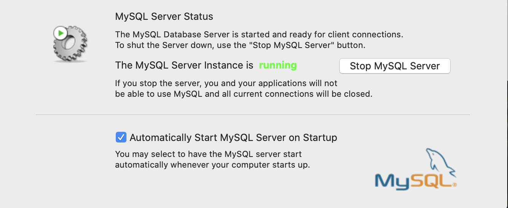

[TOC]

# 1. MySQL体系结构和存储引擎
## 1.1 数据库和实例
### 数据库
是操作系统的物理文件集合，例如表结构文件时.frm，InnoDB中数据和索引文件是.ibd，MyISAM的数据文件是.myd,索引文件是.myi

### 实例
MySQL数据库(是整个MySQL，不是我们定义的数据库)启动后就对应一个实例,MySQL数据库实例是单进程多线程的，并且有一个共享内存给多个线程使用

需要通过数据库实例来完成对数据库的操作,就是对文件的操作

在mac中start MySQL server就是产生了这个电脑安装的MySQL的实例


可以在活动监视器看到启动MySQL后对应一个mysqld的进程，所有对mysqld的请求都由这个进程处理


也可以通过以下命令查看MySQL启动后对应的进程
```SQL
chenpeipeideMacBook-Pro:~ chenpeipei$ ps -ef | grep mysqld
   74 83040     1   0 日12下午 ??         0:41.80 /usr/local/mysql/bin/mysqld --user=_mysql --basedir=/usr/local/mysql --datadir=/usr/local/mysql/data --plugin-dir=/usr/local/mysql/lib/plugin --log-error=/usr/local/mysql/data/mysqld.local.err --pid-file=/usr/local/mysql/data/mysqld.local.pid --keyring-file-data=/usr/local/mysql/keyring/keyring --early-plugin-load=keyring_file=keyring_file.so
  501  9301  9293   0  2:45下午 ttys002    0:00.00 grep mysqld
```

当要启动MySQL(实例时)，MySQL数据库会去读取配置文件，根据配置文件的参数来启动数据库实例 ([文件](./文件.md))
```shell
//查看当MySQL数据库实例启动时，会在哪些位置查找配置文件
chenpeipeideMacBook-Pro:~ chenpeipei$ mysql --help | grep my.cnf
                      order of preference, my.cnf, $MYSQL_TCP_PORT,
//MySQL会按照下面的顺序读取配置文件。如果有同名配置，以读取到的最后一个配置文件中的参数为准
/etc/my.cnf /etc/mysql/my.cnf /usr/local/mysql/etc/my.cnf ~/.my.cnf 
```

```SQL
//我们创建的数据库文件所在的位置
mysql> show variables like 'datadir';
ERROR 2006 (HY000): MySQL server has gone away
No connection. Trying to reconnect...
Connection id:    16
Current database: *** NONE ***

+---------------+------------------------+
| Variable_name | Value                  |
+---------------+------------------------+
| datadir       | /usr/local/mysql/data/ |
+---------------+------------------------+
1 row in set (0.00 sec)
```

## 1.2 连接MySQL
```SQL
//可以连接MySQL服务器的客户端身份
mysql> select * from user;
+-----------+---------------+-------------+-------------+-------------+-------------+-------------+-----------+-------------+---------------+--------------+-----------+------------+-----------------+------------+------------+--------------+------------+-----------------------+------------------+--------------+-----------------+------------------+------------------+----------------+---------------------+--------------------+------------------+------------+--------------+------------------------+----------+------------+-------------+--------------+---------------+-------------+-----------------+----------------------+-----------------------+-------------------------------------------+------------------+-----------------------+-------------------+----------------+
| Host      | User          | Select_priv | Insert_priv | Update_priv | Delete_priv | Create_priv | Drop_priv | Reload_priv | Shutdown_priv | Process_priv | File_priv | Grant_priv | References_priv | Index_priv | Alter_priv | Show_db_priv | Super_priv | Create_tmp_table_priv | Lock_tables_priv | Execute_priv | Repl_slave_priv | Repl_client_priv | Create_view_priv | Show_view_priv | Create_routine_priv | Alter_routine_priv | Create_user_priv | Event_priv | Trigger_priv | Create_tablespace_priv | ssl_type | ssl_cipher | x509_issuer | x509_subject | max_questions | max_updates | max_connections | max_user_connections | plugin                | authentication_string                     | password_expired | password_last_changed | password_lifetime | account_locked |
+-----------+---------------+-------------+-------------+-------------+-------------+-------------+-----------+-------------+---------------+--------------+-----------+------------+-----------------+------------+------------+--------------+------------+-----------------------+------------------+--------------+-----------------+------------------+------------------+----------------+---------------------+--------------------+------------------+------------+--------------+------------------------+----------+------------+-------------+--------------+---------------+-------------+-----------------+----------------------+-----------------------+-------------------------------------------+------------------+-----------------------+-------------------+----------------+
| localhost | root          | Y           | Y           | Y           | Y           | Y           | Y         | Y           | Y             | Y            | Y         | Y          | Y               | Y          | Y          | Y            | Y          | Y                     | Y                | Y            | Y               | Y                | Y                | Y              | Y                   | Y                  | Y                | Y          | Y            | Y                      |          |            |             |              |             0 |           0 |               0 |                    0 | mysql_native_password | *6BB4837EB74329105EE4568DDA7DC67ED2CA2AD9 | N                | 2018-08-26 11:07:38   |              NULL | N              |
| localhost | mysql.session | N           | N           | N           | N           | N           | N         | N           | N             | N            | N         | N          | N               | N          | N          | N            | Y          | N                     | N                | N            | N               | N                | N                | N              | N                   | N                  | N                | N          | N            | N                      |          |            |             |              |             0 |           0 |               0 |                    0 | mysql_native_password | *THISISNOTAVALIDPASSWORDTHATCANBEUSEDHERE | N                | 2018-08-26 11:02:00   |              NULL | Y              |
| localhost | mysql.sys     | N           | N           | N           | N           | N           | N         | N           | N             | N            | N         | N          | N               | N          | N          | N            | N          | N                     | N                | N            | N               | N                | N                | N              | N                   | N                  | N                | N          | N            | N                      |          |            |             |              |             0 |           0 |               0 |                    0 | mysql_native_password | *THISISNOTAVALIDPASSWORDTHATCANBEUSEDHERE | N                | 2018-08-26 11:02:00   |              NULL | Y              |
+-----------+---------------+-------------+-------------+-------------+-------------+-------------+-----------+-------------+---------------+--------------+-----------+------------+-----------------+------------+------------+--------------+------------+-----------------------+------------------+--------------+-----------------+------------------+------------------+----------------+---------------------+--------------------+------------------+------------+--------------+------------------------+----------+------------+-------------+--------------+---------------+-------------+-----------------+----------------------+-----------------------+-------------------------------------------+------------------+-----------------------+-------------------+----------------+
3 rows in set (0.00 sec)
```

# 2. InnoDB存储引擎
[InnoDB存储引擎](./InnoDB存储引擎.md)


# 3. 文件
[文件](./文件.md)


# 4. 表
[表](./表.md)


# 5. 索引与算法
[MySQL索引](./MySQL索引.md)


# 6. 锁
[锁](./锁.md)


# 7. 事务
[MySQL事务](./MySQL事务.md)


# 8. 备份与恢复
[备份与恢复](./备份与恢复.md)


# 9. 性能调优


# 10. InnoDB存储引擎源代码的编译和调试