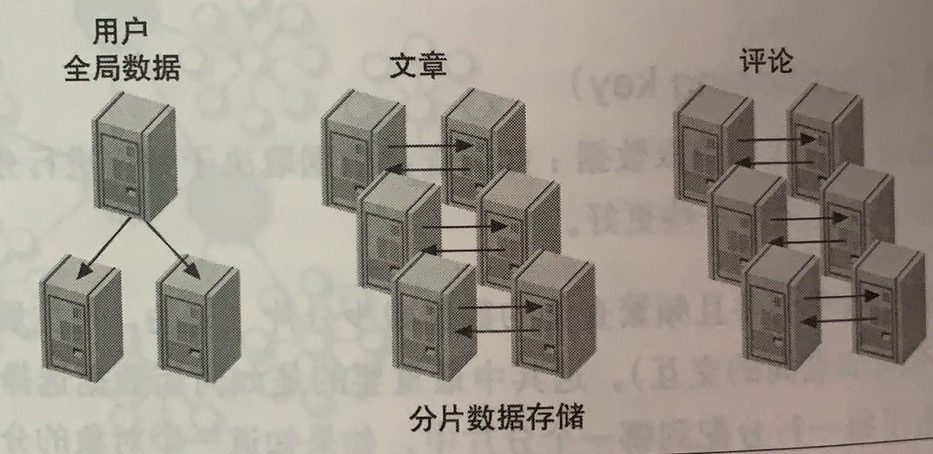
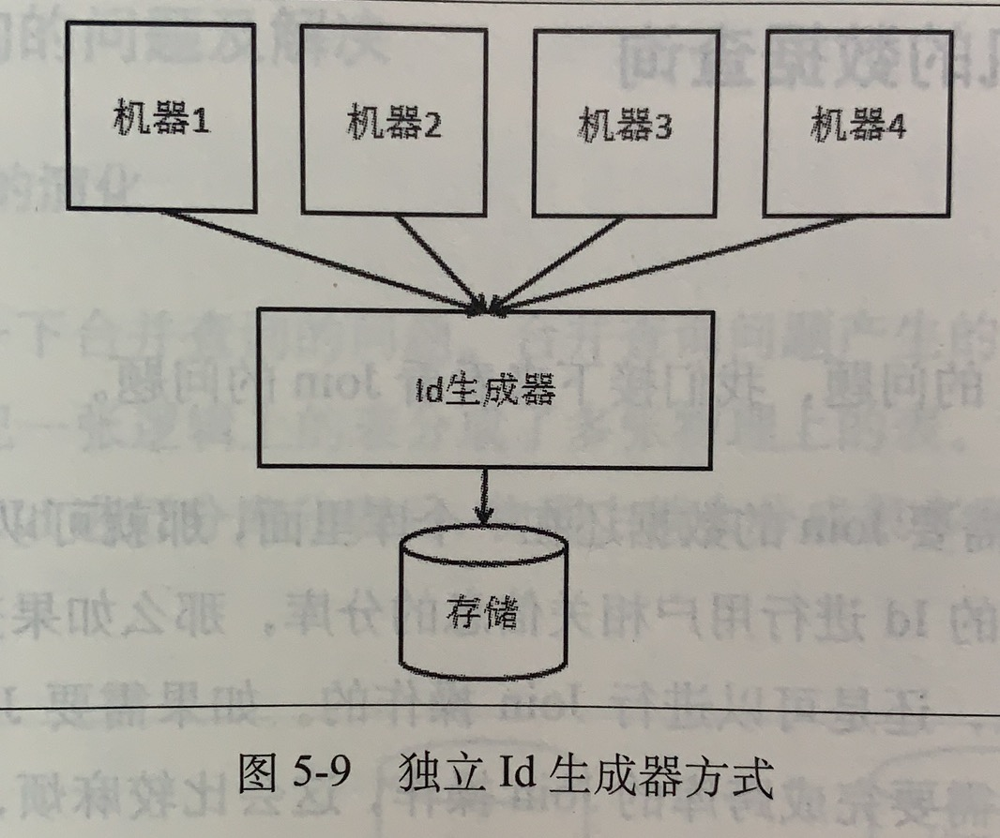
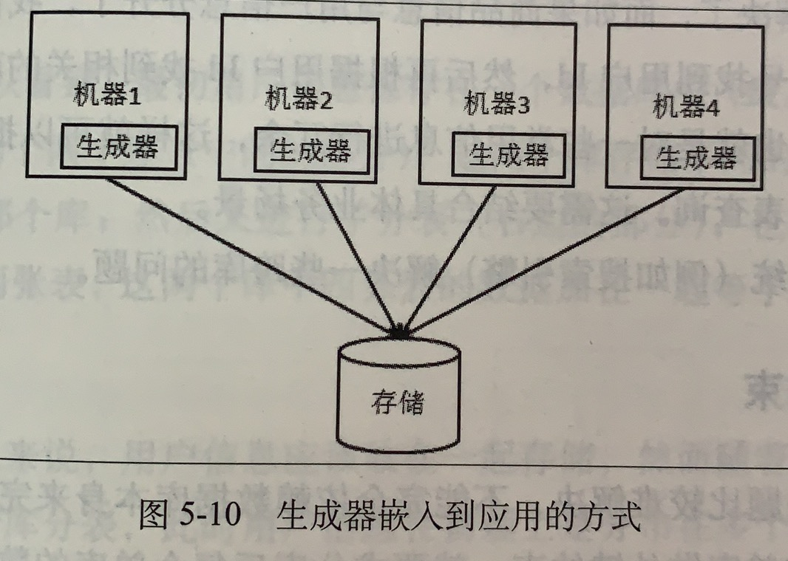
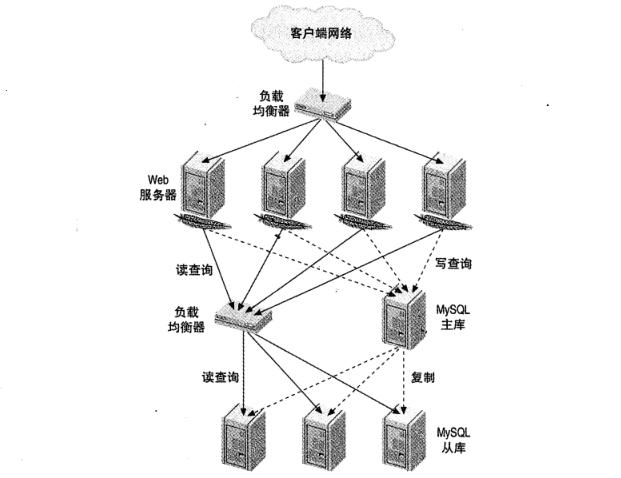

## 参考博文
[MySQL分库分表原理](https://www.jianshu.com/p/7aec260ca1a2)
[MySQL 分库分表方案，总结的非常好！](https://juejin.im/entry/5b5eb7f2e51d4519700f7d3c)
[mysql 分区/分表/读写分离/分片](https://my.oschina.net/zhanyu/blog/800228)
[一次难得的分库分表实践](https://crossoverjie.top/2019/07/24/framework-design/sharding-db-03/)
[MySQL分库分表，写得太好了](https://database.51cto.com/art/201809/583857.htm)

[TOC]

# 1. 垂直拆分
## 1.1 垂直分库
将一个数据库根据业务拆分成多个数据库

## 1.2 垂直分表
将一个大表的列拆分成多个小表，例如可以将不常用的列、长度特别长的列拆分出来成为扩展表，避免查询时内存的跨页加载问题。

# 2. 水平拆分(水平分片)
## 2.1 水平分表
将一个表的行数据拆分成多个表

## 2.2 水平分库分表
将一个表的行数据拆分成多个表并放到不同的数据库中，每个数据库有相同的表但是包含的行数据不同

### 2.2.1 分片算法
应尽量避免跨分片查询
#### 物理分片
1. hash取模

假设有用户表user,将其分成3个表user0,user1,user2.路由规则是对3取模,当uid=1时,对应到的是user1,uid=2时,对应的是user2.

2. 范围分片

从1-10000一个表,10001-20000一个表。

3. 地理位置分片

华南区一个表,华北一个表。

4. 时间分片

按月分片，按季度分片等等,可以做到冷热数据。

#### 逻辑分片
[MySQL分区表](./MySQL分区表.md)

### 2.2.2 分库引入的问题
1. 分布式事务问题

[分布式事务](./分布式事务.md)

做了垂直或水平分库后，必然会涉及到跨库执行SQL的问题，就产生了分布式事务的问题

可以选择分布式事务中间件解决

2. 跨库join的问题

分库后join操作将受到限制，无法join位于不同库的表，导致一次join需要拆分成多次查询

可以选择：1）建立全局表，所有数据库都有这张表；2）建立冗余字段，避免跨表查询；3）由应用层负责分别查询再组装

3. 横向扩容问题

如果采用hash水平分表，当数据量增加需要增加表后，会造成需要rehash的问题

4. 结果集合并、排序的问题

当数据被划分到不同库、表后，查询数据时必然有数据合并、排序的问题，每次查询都合并排序会有性能问题

可以选择走缓存

5. ID自增的问题
当单库分成多库后，需要考虑ID的连续性和唯一性。可以有两种解决方案：

1）独立ID生成器的方式

使用独立的存储来记录每个ID序列当前最大的值，每个应用都向ID生成器请求ID，ID生成器则向存储层请求

2) ID生成器嵌入应用的方式

每个应用单独完成独立ID生成器的工作，即自己向存储层请求

# 3. 读写分离
[复制](./复制.md)

# 4. 负载均衡
[负载均衡](./负载均衡.md)

负载均衡所做的工作是将请求分散到集群中可用的服务器上

