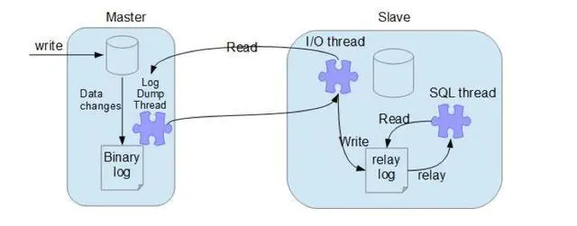
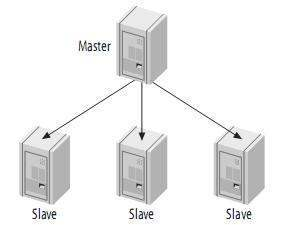
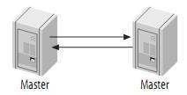
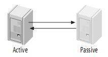
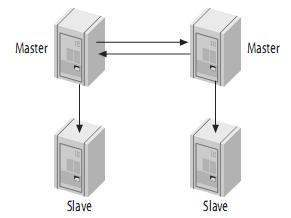
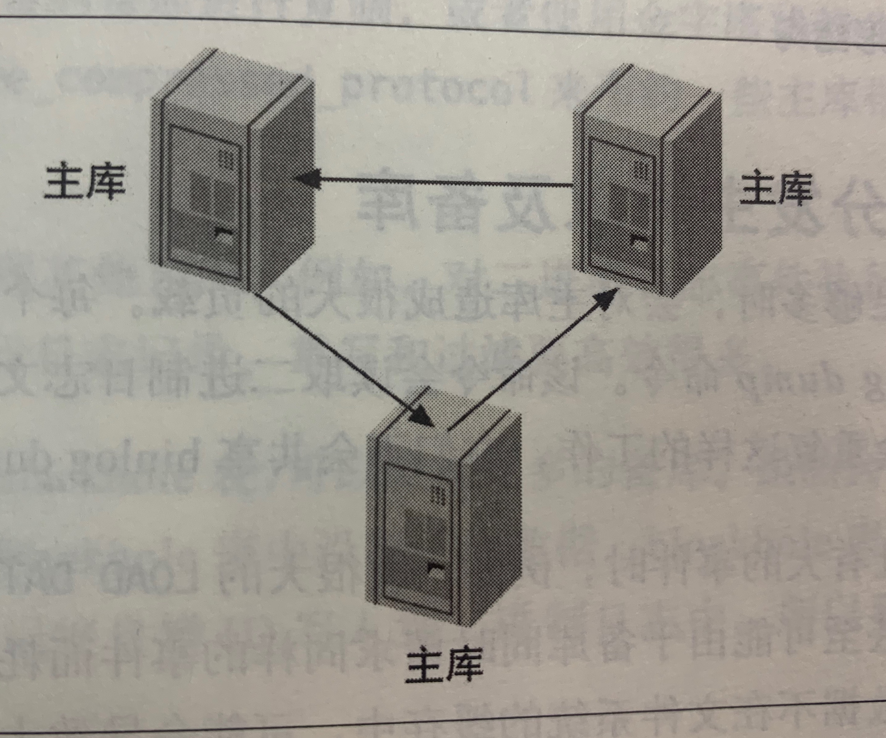
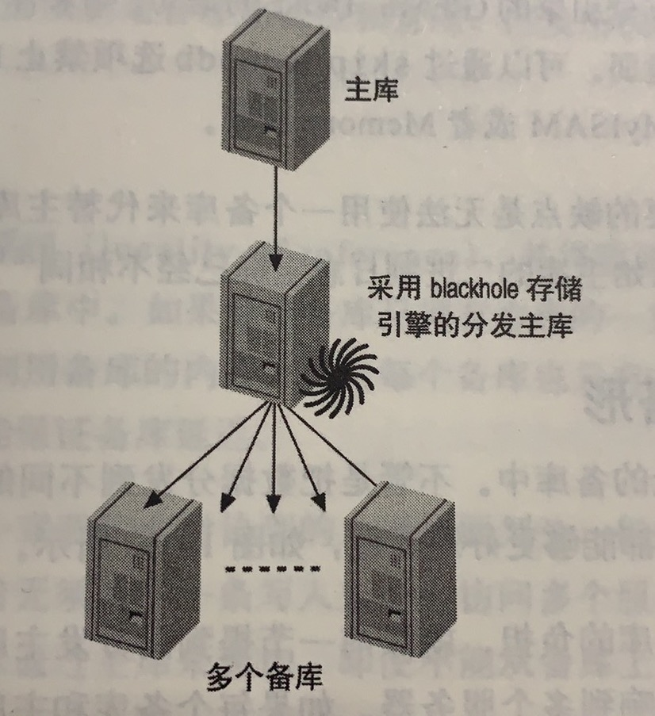
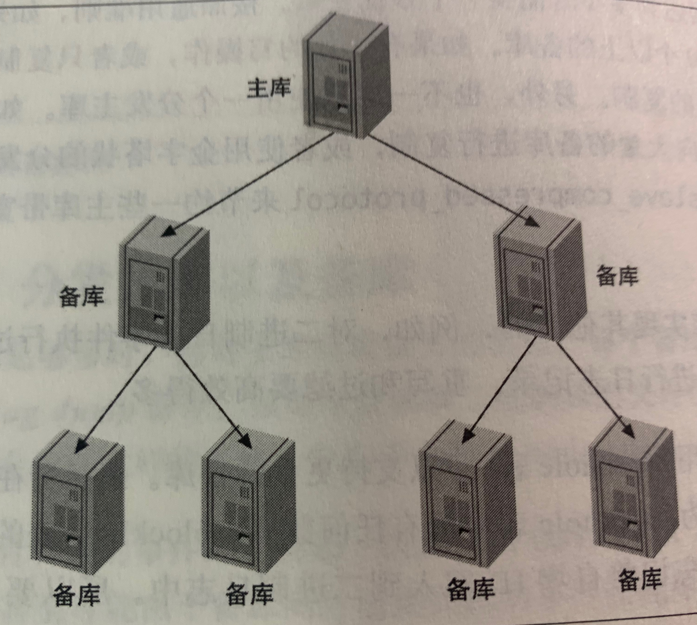

## 参考博文
[MySQL的复制原理以及流程](https://www.jianshu.com/p/63c1a1babfd1)
[MySql 主从复制及配置实现](https://segmentfault.com/a/1190000008942618)
[MySQL 复制方式](https://jin-yang.github.io/post/mysql-replication.html)
[MySQL 复制原理详解](https://cloud.tencent.com/developer/article/1005270)
[高可用数据库 UDB 主从复制延时的解决](https://www.infoq.cn/article/rAjl8d-AZ0VShlM8YUcv)
[高性能Mysql主从架构的复制原理及配置详解](https://blog.csdn.net/hguisu/article/details/7325124)

[TOC]


# 1. 复制工作步骤：记录——复制——重放
三个线程：
1. 主节点binary log dump线程(I/O线程)
当从节点和主节点连接时，主节点会生成binary log dump线程用于将二进制日志binary log中的事件发送给从节点。在读取binary log中的内容时，该线程会对内容加锁，当读取完后释放。

2. 从节点I/O线程
从节点执行start slave命令创建I/O线程，该线程会和主节点建立一个普通的客户端连接，接受主节点binary log dump线程发来的binary log内容，并把binary log记录在中继日志relay log上。

3. 从节点SQL线程
SQL线程从relay log中读取事件，并一条条执行保持主从的数据一致性。

## 异步复制
1. 主节点记录二进制日志：在事务提交前，主节点将更新事件顺序记录到内存的二进制日志中，然后再通知存储引擎提交事务，将日志刷到磁盘中。主节点将根据事务的提交顺序记录二进制日志。
2. 从节点执行start slave开启主从复制
3. 从节点创建I/O线程后和主节点建立有复制权限的连接，并请求在指定位置之后发送二进制日志的内容
4. 主节点接收到请求后创建I/O线程，分批的从指定位置后读取二进制日志内容返回给从节点的I/O线程
5. 从节点的I/O线程收到后，将内容记录在中继日志中，并将新日志名和位置记录在master-info中
6. SQL线程会实时监测中继日志中新增的内容，并将其解析成SQL语句执行(重放)

库在执行完客户端提交的事务后会立即将结果返给给客户端，并不关心从库是否已经接收并处理，这样就会有一个问题，主如果crash掉了，此时主上已经提交的事务可能并没有传到从库上

## 半同步复制
异步复制可能会造成主备的不一致。当事务提交后，主节点给客户端返回信息后崩溃，此时还没有将二进制日志复制给从节点，会造成数据不一致。

半同步复制是在从节点接收到日志后，主节点才可以向客户端返回结果

## 同步复制



# 2. 复制配置
有server1：192.168.0.1和server2：192.168.0.2两台服务器
## 创建复制账号
在主备库都创建同一个账号，然后备库的I/O的线程根据该账号和从库建立TCP/IP连接并获取二进制日志的内容
```SQL
mysql>grant replication slave,replication client on *.*
    ->to repl@'192.168.0.%' identified by 'p4ssword',;
```

## 配置主库和备库
配置主库：修改my.cnf文件
```SQL
# 设置server_id，一般设置为IP, 要独一无二的
server-id       = 10

# 开启二进制日志功能，最好是绝对路径。配置完要重启MySQL实例
log_bin         = /var/log/mysql/mysql-bin.log

# 主从复制的格式（mixed,statement,row，默认格式是statement）
binlog_format=mixed

# 二进制日志自动删除/过期的天数。默认值为0，表示不自动删除。
expire_logs_days=7

# 为每个session 分配的内存，在事务过程中用来存储二进制日志的缓存
binlog_cache_size=1M

# 复制过滤：不需要备份的数据库，不输出（mysql库一般不同步）
binlog-ignore-db=mysql

# 启用二进制日志后，重启后， show master status; 可以看到二进制相关信息
mysql> show master status;
+------------------+----------+--------------+------------------+
| File             | Position | Binlog_Do_DB | Binlog_Ignore_DB |
+------------------+----------+--------------+------------------+
| mysql-bin.000001 |      107 |              |                  |
+------------------+----------+--------------+------------------+

//查看二进制日志
mysql>show binary logs;

//查看二进制日志中的事件
mysql>show binlog events;
```
配置备库：修改my.cnf文件
```SQL
# 设置server_id，一般设置为IP, 要独一无二的
server-id       = 2

log_bin         = /var/log/mysql/mysql-bin.log

# 中继日志路径
relay_log       = /home/mysql/3301/mysql-relay-bin

# 允许从库将其重放的事件也记录到自身的二进制日志中，那么它的从库就可以从二进制日志中获取更新内容
log_slave_updates = 1

read_only = 1
```


## 启动复制
从库启动复制:
```SQL
mysql>  CHANGE MASTER TO
MASTER_HOST='server1',
MASTER_USER='repl',
MASTER_PASSWORD='123456',
MASTER_LOG_FILE='msyql-bin.00001',
MASTER_LOG_POS=0;

# 启动复制
mysql> start slave;
 
# 查看复制状态
mysql> show slave status;

*************************** 1. row ***************************
               Slave_IO_State: Waiting for master to send event
                  Master_Host: 127.0.0.1
                  Master_User: repl
                  Master_Port: 3306
                Connect_Retry: 60
              Master_Log_File: mysql-bin.000008
          Read_Master_Log_Pos: 107
               Relay_Log_File: mysql-relay-bin.000020
                Relay_Log_Pos: 253
        Relay_Master_Log_File: mysql-bin.000008
             Slave_IO_Running: Yes
            Slave_SQL_Running: Yes
        //当前某个数据库和它的主库之间的数据复制延时
        Seconds_Behind_Master: 0
             Master_Server_Id: 10

# Slave_IO_Running: Yes，Slave_SQL_Running: Yes 说明同步正常进行
# Seconds_Behind_Master: 0 就是完全同步了

# 主库上看线程
mysql> show processlist \G
*************************** 1. row ***************************
     Id: 44
   User: repl
   Host: localhost:32866
     db: NULL
Command: Binlog Dump
   Time: 73032
  State: Master has sent all binlog to slave; waiting for binlog to be updated
   Info: NULL


# 备库上看线程
mysql> show processlist \G
*************************** 1. row ***************************
     Id: 4
   User: system user
   Host: 
     db: NULL
Command: Connect
   Time: 73422
   # I/O线程
  State: Waiting for master to send event
   Info: NULL
*************************** 2. row ***************************
     Id: 5
   User: system user
   Host: 
     db: NULL
Command: Connect
   Time: 72417
   # SQL线程
  State: Slave has read all relay log; waiting for the slave I/O thread to update it
   Info: NULL
```
上面的案例是主备库都是新的，更典型的是一个运行已经一段时间的主库，要用一台新安装的从库与之同步，此时这台从库还没有数据。

# 3. 复制原理
## 3.1 基于语句的复制(STATEMENT)
主库将查询语句记录到二进制日志中，备库获取到这些语句后执行

优点：
1. 实现比较简单，主库只是记录下SQL语句，使二进制日志也更紧凑
2. 对于更新全表的数据来说，一条SQL语句占用的带宽更小

缺点：
1. 备库和主库执行语句的时间可能会不同
2. 一些语句例如current_user()可能不会被正确复制

## 3.2 基于行的复制(ROW)
主库将产生变动的数据记录在二进制日志中，从库直接复制数据

优点：
1. 从库不用重新执行SQL语句，复制更高效

缺点：
1. 如果是全表更新，每一行都会被记录，那么二进制日志会非常大

## 3.3 混合复制(MIXED)
MySQL会在两种复制方式下切换，默认是STATEMENT，当STATEMENT无法被正确复制时，使用ROW

# 4. 复制拓扑
1. 一个主库可以有很多备库，一个备库只能有一个主库
2. 每个备库必须有唯一的服务器ID
3. 备库可以作为主库，将其主库的变化传播到其它备库

## 4.1 一主库多备库
适合少写多读的场景，可以将读分摊到备库上




## 4.2 主动-主动 模式下的 主-主复制
双方都是对方的主库和备库

存在两个可写的服务器会发生很多问题，例如两台服务器在修改同一记录：
```SQL
//原先col=1
//服务器A上执行
mysql>update tb1 set col=col+1;

//服务器B上执行
mysql>update tb1 set col=col*2;
```
当执行基于行的复制时，服务器A复制B的语句执行后col为4，服务器B复制A的语句执行后col为3，但是没有报错



## 4.3 主动-被动 模式下的 主-主复制
两台服务器在配置上互为对方的主备，但是其中一台是只读的被动服务器

对称的配置使得服务器的维护、升级变得容易，反复切换主动和被动服务器很容易。

例如对表执行alter操作，该操作会锁住整表阻塞读写，可以选择将该操作切换到被动服务器上执行。具体过程为：停止主动服务器A上的I/O线程(避免对被动服务器的更新)，然后在被动服务器B上执行alter操作(此时主动服务器A可以继续做其他的操作)，当B执行完alter后交换AB的角色(A成为被动服务器,B成为主动服务器)，然后在A上执行复制线程，将被动服务器B中的二进制日志读取到中继日志中并执行。后面应用程序将请求B执行写操作。

两台服务器的服务器ID是相同的，将被动服务器设置成只读。当主动服务器上发生更新时，更新会被记录到二进制文件中。然后被动服务器会通过复制将更新记录到自己的中继日志中，当执行查询时会将更新记录到二进制日志中。但由于两台服务器的ID相同，所以主动服务器会过滤和自己ID相同的事件。





## 4.4 拥有备库的主-主结构



## 4.5 环形复制



## 4.6 主库、分发主库以及备库
分发主库负责提取主库的二进制日志



## 4.7 树或金字塔形



## 4.8 定制的复制方案
### 选择性复制
备库拥有主库的一部分数据并放入备库的内存，减轻主库的读负载

### 分离功能
OLTP在线事务处理

OLAP在线数据分析

将OLTP服务器的数据复制到OLAP的备库上

### 数据归档
使用备库存储主库上被删除的数据

### 将备库用于全文检索

### 只读备库

### 模拟多主库复制

### 创建日志服务器


# 5. 复制和容量规划


# 6. 复制管理和维护
## 监控复制
```SQL
//查看主库的二进制日志位置和配置
show master status;

//查看主库哪些二进制日志存在磁盘上
show master logs;

//查看复制事件
show binlog events in 'mysql-bin.000223' from 13634;
```

# 7. 数据同步一致性解决方案
## 1.半同步复制
等主从同步完成之后，主库上的写请求再返回

但是主库的写请求时延会增长，吞吐量会降低

## 2. 数据库中间件
1）所有的读写都走数据库中间件，通常情况下，写请求路由到主库，读请求路由到从库

2）记录所有路由到写库的key，在主从同步时间窗口内（假设是500ms），如果有读请求访问中间件，此时有可能从库还是旧数据，就把这个key上的读请求路由到主库。

3）在主从同步时间过完后，对应key的读请求继续路由到从库。

## 3. 缓存记录写key法
- 写流程：
```
1）如果key要发生写操作，记录在cache里，并设置“经验主从同步时间”的cache超时时间，例如500ms

2）然后修改主数据库
```

- 读流程：
```
1）先到缓存里查看，对应key有没有相关数据

2）有相关数据，说明缓存命中，这个key刚发生过写操作，此时需要将请求路由到主库读最新的数据。

3）如果缓存没有命中，说明这个key上近期没有发生过写操作，此时将请求路由到从库，继续读写分离。
```

该方案优点：

相对数据库中间件，成本较低


# 8. 主从复制延时问题
## 案例一：主库 DML 请求频繁
某些用户在业务高峰期间，特别是对于数据库主库有大量的写请求操作，即大量 insert、delete、update 等并发操作的情况下，会出现主从复制延时问题

由于主库大量的写请求操作，在短时间产生了大量的 binlog。这些操作需要全部同步到从库，并且执行，因此产生了主从的数据复制延时。

- 解决方案
```
如果是 MySQL 5.7 以下的版本，可以做分片 (sharding)，通过水平扩展 (scale out) 的方法打散写请求，提升写请求写入 binlog 的并行度。

如果是 MySQL 5.7 以上的版本，在 MySQL 5.7，使用了基于逻辑时钟 (Group Commit) 的并行复制。
而在 MySQL 8.0，使用了基于 Write Set 的并行复制。这两种方案都能够提升回放 binlog 的性能，减少延时
```

## 案例二：主库执行大事务
大事务指一个事务的执行，耗时非常长。常见产生大事务的语句有：

使用了大量速度很慢的导入数据语句，比如：INSERT INTO tb、SELECT∗FROMtb、LOAD DATA INFILE 等；
使用了 UPDATE、DELETE 语句，对于一个很大的表进行全表的 UPDATE 和 DELETE 等。

当大事务记录入 binlog 并同步到从库之后，从库执行这个事务的操作耗时也非常长，这段时间，就会产生主从复制延时

- 解决方案
```
对于这种情况引起的主从复制延时，我们的改进方法是：拆分大事务语句到若干小事务中，这样能够进行及时提交，减小主从复制延时
```


## 案例三：主库对大表执行 DDL 语句
DDL 全称为 Data Definition Language ，指一些对表结构进行修改操作的语句，比如，对表加一个字段或者加一个索引等等。当 DDL 对主库大表执行 DDL 语句的情况下，可能会产生主从复制延时

DDL 导致的主从复制延时的原因和大事务类似，也是因为从库执行 DDL 的 binlog 较慢而产生了主从复制延时

- 解决方案
```
遇到这种情况，我们主要通过 SHOW PROCESSLIST 或对 information_schema.innodb_trx 做查询，来找到阻塞 DDL 语句，
并 KILL 掉相关查询，让 DDL 正常在从库执行。

DDL 本身造成的延时难以避免，建议考虑：
避免业务高峰，尽量安排在业务低峰期执行 ；

set sql_log_bin=0 后，分别在主从库上手动执行 DDL（此操作对于某些 DDL 操作会造成数据不一致，请务必严格测试）
```

## 案例四：主库与从库配置不一致
各种硬件或者资源的配置差异都有可能导致主从的性能差异，从而导致主从复制延时发生：

硬件上：比如，主库实例服务器使用 SSD 磁盘，而从库实例服务器使用普通 SAS 盘，那么主库产生的写入操作在从库上不能马上消化掉，就产生了主从复制延时；
配置上：比如，RAID 卡写策略不一致、OS 内核参数设置不一致、MySQL 落盘策略不一致等，都是可能的原因

- 解决思路
```
考虑尽量统一 DB 机器的配置（包括硬件及选项参数）。甚至对于某些 OLAP 业务，从库实例硬件配置需要略高于主库
```

## 案例五：表缺乏主键或合适索引
在主从复制的 binlog_format 设置为’row’的情况下，比如有这样的一个场景，主库更新一张 500 万表中的 20 万行数据。binlog 在 row 格式下，记录到 binlog 的为 20 万次 update 操作，也就是每次操作更新 1 条记录。如果这条语句恰好有不好的执行计划，如发生全表扫描，那么每一条 update 语句需要全表扫描。此时 SQL Thread 重放将特别慢，造成严重的主从复制延时

- 解决方案
```
这种情况下，我们会去检查表结构，保证每个表都有显式自增主键，并协助用户建立合适索引
```


## 