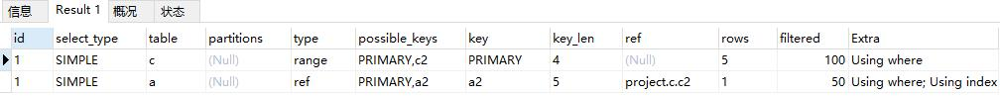
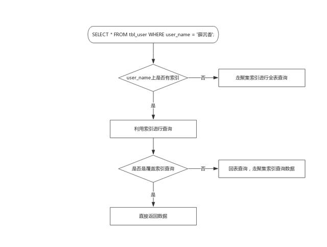
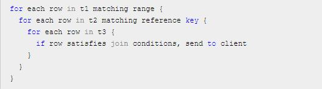
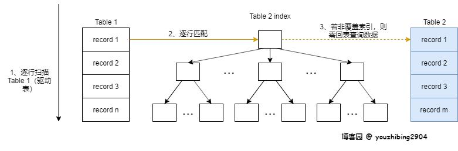
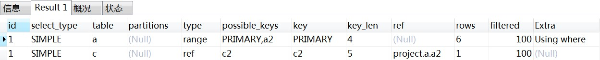
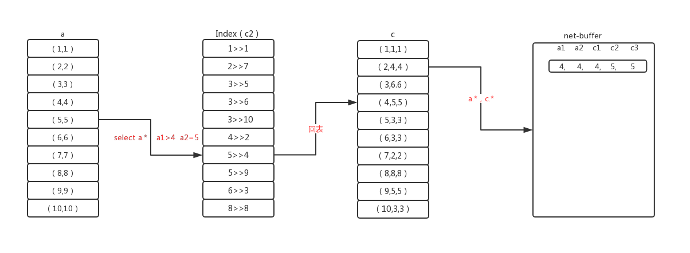
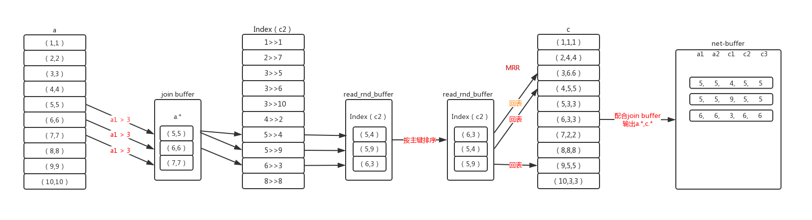
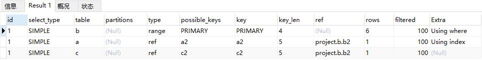
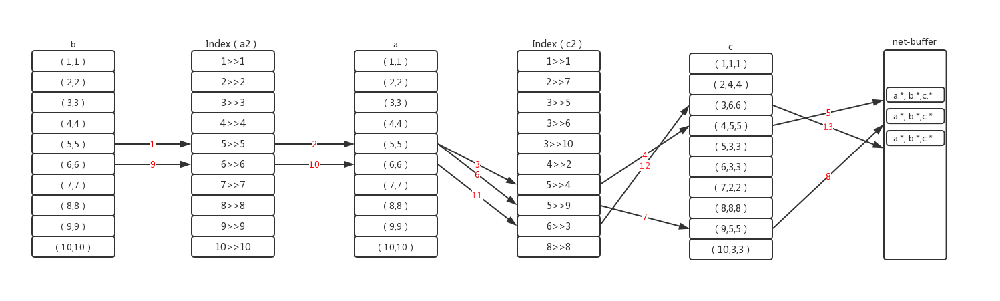

[Mysql多表连接查询的执行细节（一）](https://www.cnblogs.com/xueqiuqiu/articles/10517498.html) 
[神奇的 SQL 之 联表细节 → MySQL JOIN 的执行过程](https://blog.51cto.com/14455981/2459384)
[MySql专栏—— 关联查询join的流程以及优化](https://blog.csdn.net/huxiaodong1994/article/details/91668304)
[学习MYSQL之ICP、MRR、BKA](https://blog.51cto.com/qhd2004/1870996)

## 1. 语句执行顺序
1. 执行from
2. 执行on匹配数据
3. 执行join
4. 执行where过滤数据
5. 执行group by
6. 执行having
7. 执行select
8. 执行distinct
9. 执行order by
10. 执行limit

## 2. 联表算法
##### 驱动表
驱动表指多表关联查询时，第一个被处理的表。以该表为基础去关联查询下一个表。驱动表一般选择结果集(经条件过滤后)最少的那一个。left join一般是左表，right join一般是右表，inner join使用结果集小的表

结果集预估：使用where中的条件对表进行过滤，预估返回的行数，再对select中的字段预估字节大小，并做如下计算：
>>每行查询字节数 * 预估的行数 = 预估结果集

通过where预估结果行数，遵循以下规则：
>>如果where里没有相应表的筛选条件，无论on里是否有相关条件，默认为全表
如果where里有筛选条件，但是不能使用索引来筛选，那么默认为全表
如果where里有筛选条件，而且可以使用索引，那么会根据索引来预估返回的记录行数

举例：
```SQL
create table a(a1 int primary key, a2 int ,index(a2));  --双字段都有索引
create table c(c1 int primary key, c2 int ,index(c2), c3 int);  --双字段都有索引
create table b(b1 int primary key, b2 int);	--有主键索引
create table d(d1 int, d2 int); --没有索引

insert into a values(1,1),(2,2),(3,3),(4,4),(5,5),(6,6),(7,7),(8,8),(9,9),(10,10);
insert into b values(1,1),(2,2),(3,3),(4,4),(5,5),(6,6),(7,7),(8,8),(9,9),(10,10);
insert into c values(1,1,1),(2,4,4),(3,6,6),(4,5,5),(5,3,3),(6,3,3),(7,2,2),(8,8,8),(9,5,5),(10,3,3);  
insert into d values(1,1),(2,2),(3,3),(4,4),(5,5),(6,6),(7,7),(8,8),(9,9),(10,10);
```
执行以下查询，在where条件中有用到a的索引a1,c的索引c1，所以对a、c预估行数都是使用索引预估。select中获取a的所有字段，c的c2字段，所以c的结果集会比较小，c会作为驱动表
```SQL
select a.*,c.c2 from a join c on a.a2=c.c2 where a.a1>5 and c.c1>5;
```


将select c.c2改为c.*。此时的驱动表还是c，本来c的数据比a多，c.*的结果集会比a大，但是c仍然作为驱动表的原因是：如果以a作为驱动表，通过a.a1>5的条件遍历聚簇索引树获取到a的某条数据，此时已经能获取a.*数据，再通过a.a2=c.c2定位c中索引c2的某条索引记录，虽然通过c2可以获取到c1、c2两个字段，但是没有c3。所以还要通过二级索引c2查找聚簇索引树获取全部记录。这样要进行两次c的查询。

如果以c为驱动表，只需根据c.c1>5遍历聚簇索引树，此时能获取c.*数据。然后通过a.a2=c.c2定位a中索引a2的某条索引记录，通过a2就能获取a.*。少了一次c的回表查询。
```SQL
select a.*,c.* from a join c on a.a2=c.c2 where a.a1>5 and c.c1>5;
```

### 2.1 单表查询
如果where条件中的字段没有索引，将通过聚簇索引进行全表查询(即使是全表查询，也是用的聚簇索引树遍历叶子节点，只不过不能用到树的二分查找性质)。

如果有索引：如果是覆盖索引，那么直接返回数据。如果不是覆盖索引，那根据节点中存储的聚簇索引值去聚簇索引树中查询数据。


### 2.2 联表查询算法
基于嵌套循环算法（nested-loop algorithm）衍生出来
>>在使用索引关联的情况下:
(1)Index Nested-Loop join：索引嵌套循环
(2)Batched Key Access join：批量key嵌套循环

>>在未使用索引关联的情况下:
(1)Simple Nested-Loop join：简单嵌套循环
(2)Block Nested-Loop join 两种算法：缓存块嵌套循环

#### 2.2.1 简单嵌套循环SNL
逐条逐条匹配

相当于一个多重for循环，对外层表的每一条符合where条件的数据遍历内层表的每一条数据，将符合条件的放入结果集中。相当于要遍历n * m * x次。但是MySQL做了优化，即使没有where条件并且on条件上无索引也不会使用这种方法。



#### 2.2.2 缓存块嵌套循环BNL
每次扫描驱动表时，一次缓存多条数据到join buffer中，扫描被驱动表时，被驱动表每条数据都和join buffer中的每行数据比较。使用join buffer可以减少被驱动表的读表次数。

Join Buffer 存储的是驱动表中参与查询的列，包括 SELECT 的列、ON 的列、WHERE 的列，而不是驱动表中整行整行的完整记录

当被驱动表在连接键上没有索引并且驱动表在where过滤条件上也没索引时常使用BNL

假如驱动表有30条数据，被驱动表50条。在SNL情况下，需要读取被驱动表30*50次，每条数据被取出只做了1次比较。在BNL情况下，假如join buffer一次缓存10条数据，只需要读被驱动表3*50次，因为每条数据被取出做了10次比较。

#### 2.2.3 索引嵌套循环INL
被驱动表在连接键上有索引，逐条扫描驱动表的记录和被驱动表的索引记录比较，避免对被驱动表全表扫描


执行如下SQL。
首先因为where中使用a的索引a1进行过滤，所以确定驱动表为a1。

首先使用a.a1>4在a表的聚簇索引树中确定第一条记录a1=5，然后根据a.a2=c.c2关联到c的c2二级索引树，并取得对应的主键c1，然后去c的c1聚簇索引树上获取c.*，并将结果放入net-buffer。然后再取a1=5的下一个节点，直到结束。如果net-buffer满了，将数据发送给client并清空。net-buffer最小4k,最大16M,默认是1M
```SQL
select a.*,c.* from a join c on a.a2=c.c2 where a.a1>4;
```




#### 2.2.4 批量key嵌套循环BKA
因为如果被驱动表中的索引包含的数据不足以覆盖select，需要在去聚簇索引树中回表查找。BKA是在需要回表的情况下使用的，首先对聚簇索引树的回表查找是随机的，而因为MySQL的预读机制，可能要读的那一页已经从缓存中清除，那么这时候需要对聚簇索引树的回表查找变成顺序的。

BKA使用MRR(Multi-Range Read)将随机IO转换为顺序IO

首先对驱动表中符合where条件的数据都筛选出来放入join buffer中，然后根据a.a2=c.c2关联c的二级索引树c2，并将符合的记录放入read_rnd_buffer中，当read_rnd_buffer达到上限后，对数据按照主键递增排序，然后再查询聚簇索引。按照主键排序后，对聚簇索引的查找就变成顺序查找，在同一页的主键可以同批次被返回。


#### 2.2.5 两个以上表关联查询
执行前mysql执行器会确定好各个表的关联顺序。首先通过where条件，筛选驱动表b的第一条记录b5，然后将用此记录的关联字段b2与第二张表a的索引a2做关联，通过Btree定位索引位置，匹配的索引可能不止一条。当匹配上一条，查看where里是否有a2的过滤条件且条件是否需要索引之外的数据，如果要则回表，用a2索引上的主键去查询数据，然后做判断。通过则用join后的信息再用同样的方式来关联第三章表c

```SQL
select a.*,b.*,c.* from a join c on a.a2=c.c2 join b on c.c2=b.b2 where b.b1>4;
```


图中数字代表步骤，其中错误之处在于a2不需要再聚簇索引回表查询了

