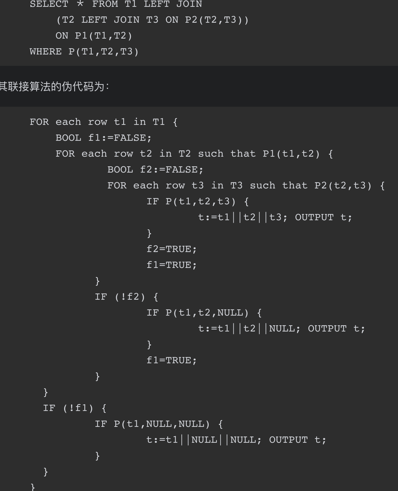
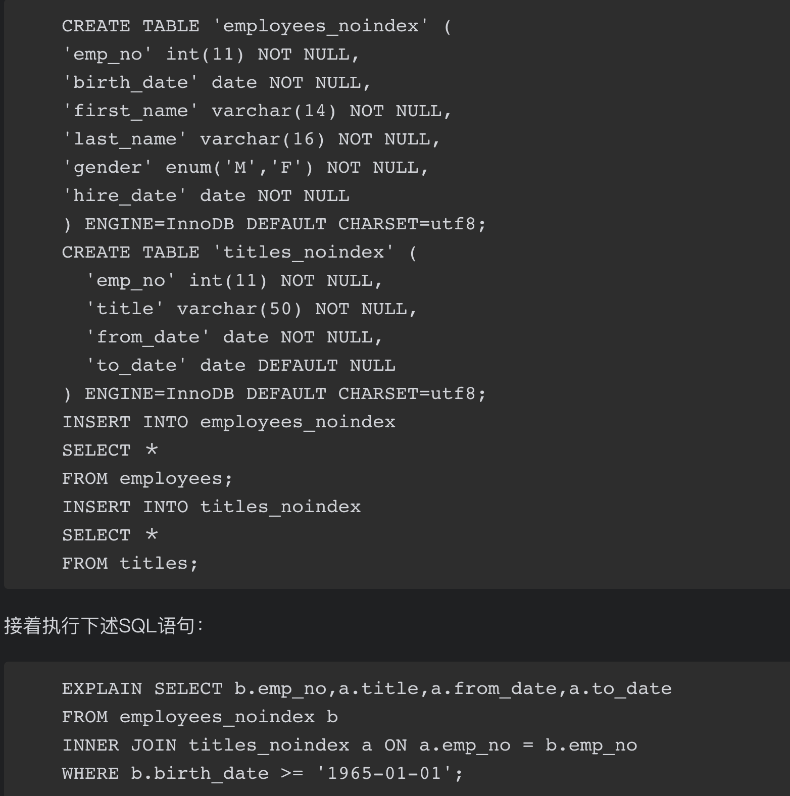
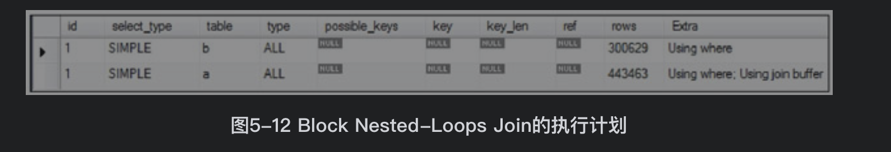

## 参考博文
[Mysql多表连接查询的执行细节（一）](https://www.cnblogs.com/xueqiuqiu/articles/10517498.html) 
[神奇的 SQL 之 联表细节 → MySQL JOIN 的执行过程](https://blog.51cto.com/14455981/2459384)
[MySql专栏—— 关联查询join的流程以及优化](https://blog.csdn.net/huxiaodong1994/article/details/91668304)
[学习MYSQL之ICP、MRR、BKA](https://blog.51cto.com/qhd2004/1870996)


[TOC]
## 1. 多表联接
多表联接是查询涉及三张或者更多张表之间的联接查询操作

对于inner join可以随意安排表的顺序，因为优化器会自己优化
```SQL
SELECT a.emp_no,c.first_name,b.title,d.dept_name
FROM dept_manager a
JOIN titles b ON a.emp_no = b.emp_no    
JOIN employees c ON c.emp_no = a.emp_no    
JOIN departments d ON D.dept_no = a.dept_no

//对于多表之间的INNER JOIN语句，也可以将进行INNER JOIN的表和ON过滤条件放在一起
SELECT a.emp_no,c.first_name,b.title,d.dept_name
FROM dept_manager a
JOIN (titles b, employees c,departments d)
ON(a.emp_no = b.emp_no AND c.emp_no = a.emp_no AND d.dept_no = a.dept_no);
```


## 2. 联表算法
驱动表指多表关联查询时，第一个被处理的表。以该表为基础去关联查询下一个表。驱动表一般选择结果集(经条件过滤后)最少的那一个。left join一般是左表，right join一般是右表，inner join使用结果集小的表

结果集预估：使用where中的条件对表进行过滤，预估返回的行数，再对select中的字段预估字节大小，并做如下计算：
>>每行查询字节数 * 预估的行数 = 预估结果集

通过where预估结果行数，遵循以下规则：
>>如果where里没有相应表的筛选条件，无论on里是否有相关条件，默认为全表
如果where里有筛选条件，但是不能使用索引来筛选，那么默认为全表
如果where里有筛选条件，而且可以使用索引，那么会根据索引来预估返回的记录行数

举例：
```SQL
create table a(a1 int primary key, a2 int ,index(a2));  --双字段都有索引
create table c(c1 int primary key, c2 int ,index(c2), c3 int);  --双字段都有索引
create table b(b1 int primary key, b2 int);	--有主键索引
create table d(d1 int, d2 int); --没有索引

insert into a values(1,1),(2,2),(3,3),(4,4),(5,5),(6,6),(7,7),(8,8),(9,9),(10,10);
insert into b values(1,1),(2,2),(3,3),(4,4),(5,5),(6,6),(7,7),(8,8),(9,9),(10,10);
insert into c values(1,1,1),(2,4,4),(3,6,6),(4,5,5),(5,3,3),(6,3,3),(7,2,2),(8,8,8),(9,5,5),(10,3,3);  
insert into d values(1,1),(2,2),(3,3),(4,4),(5,5),(6,6),(7,7),(8,8),(9,9),(10,10);
```
执行以下查询，在where条件中有用到a的索引a1,c的索引c1，所以对a、c预估行数都是使用索引预估。select中获取a的所有字段，c的c2字段，所以c的结果集会比较小，c会作为驱动表
```SQL
select a.*,c.c2 from a join c on a.a2=c.c2 where a.a1>5 and c.c1>5;
```


将select c.c2改为c.*。此时的驱动表还是c，本来c的数据比a多，c.*的结果集会比a大，但是c仍然作为驱动表的原因是：如果以a作为驱动表，通过a.a1>5的条件遍历聚簇索引树获取到a的某条数据，此时已经能获取a.*数据，再通过a.a2=c.c2定位c中索引c2的某条索引记录，虽然通过c2可以获取到c1、c2两个字段，但是没有c3。所以还要通过二级索引c2查找聚簇索引树获取全部记录。这样要进行两次c的查询。

如果以c为驱动表，只需根据c.c1>5遍历聚簇索引树，此时能获取c.*数据。然后通过a.a2=c.c2定位a中索引a2的某条索引记录，通过a2就能获取a.*。少了一次c的回表查询。
```SQL
select a.*,c.* from a join c on a.a2=c.c2 where a.a1>5 and c.c1>5;
```

### 2.1 单表查询
如果where条件中的字段没有索引，将通过聚簇索引进行全表查询(即使是全表查询，也是用的聚簇索引树遍历叶子节点，只不过不能用到树的二分查找性质)。

如果有索引：如果是覆盖索引，那么直接返回数据。如果不是覆盖索引，那根据节点中存储的聚簇索引值去聚簇索引树中查询数据。


### 2.2 联表查询算法
联接算法是MySQL数据库用于处理联接的物理策略。目前MySQL数据库仅支持Nested-Loops Join算法

基于嵌套循环算法（nested-loop algorithm）衍生出来
>>在使用索引关联的情况下:
(1)Index Nested-Loop join：索引嵌套循环
(2)Batched Key Access join：批量key嵌套循环

>>在未使用索引关联的情况下:
(1)Simple Nested-Loop join：简单嵌套循环
(2)Block Nested-Loop join：缓存块嵌套循环

#### 2.2.1 简单嵌套循环SNL
存储引擎对外部表的每一条数据遍历内部表的所有数据，先使用on条件判断是否匹配，如果匹配则将数据返回给服务器，服务器将使用where条件进行过滤
```SQL
select * from T1
inner join T2 on P1(T1,T2)
inner join T3 on P2(T2,T3)
where P(T1,T2,T3)
```
1. 当联接列没有索引时，SNL的算法为:
```SQL
//P1（t1，t2）、P2（t2，t3）表示两张表进行联接操作的条件,即存储引擎根据on条件进行两表连接筛选出符合条件的行
/*服务器执行这个三重循环。
在第一重循环里请求存储引擎的一行T1数据，然后根据这条t1数据和P1(t1,t2)条件向存储引擎请求一行T2的数据，
然后根据这条t2数据和P2(t2,t3)条件向存储引擎请求一行T3的数据，
最后服务器判断P(t1,t2,t3)，即用where条件过滤
*/
//如果where条件中带有索引的条件，存储引擎就不用全表扫描数据，就可以根据索引过滤返回合适的数据了
for each row t1 in T1 {
    for each row t2 in T2 such that P1(t1,t2){
        for each row t3 in T3 such that P2(t2,t3){
            if P(t1,t2,t3){
                t:=t1||t2||t3;
                output t;
            }
        }
    }
}
```


如果是inner join，表的执行顺序或许会被优化，不和join的顺序相同。如果两个表的连接列索引或者都没有索引，一般情况都会使用数据量小的作为外表。否则总是选择将联接列含有索引的表作为内部表。
如果两个表都有索引，会使用数据量小的作为外表是因为内部表的扫描次数总是索引的高度，与记录的数量无关。
```SQL
for each row t3 in T3 {
    for each row t2 in T2 such that P2(t2,t3){
        for each row t1 in T1 such that P2(t1,t3){
            if P(t1,t2,t3){
                t:=t1||t2||t3;
                output t;
            }
        }
    }
}
```
2. 但是如果内部表的连接列存在索引，就不会全表扫描内部表，而是扫描内部表的索引，根据索引就可以判断on和where条件
被驱动表在连接键上有索引，逐条扫描驱动表的记录和被驱动表的索引记录比较，避免对被驱动表全表扫描


执行如下SQL。
首先因为where中使用a的索引a1进行过滤，所以确定驱动表为a1。

首先使用a.a1>4在a表的聚簇索引树中确定第一条记录a1=5，然后根据a.a2=c.c2关联到c的c2二级索引树，并取得对应的主键c1，然后去c的c1聚簇索引树上获取c.*，并将结果放入net-buffer。然后再取a1=5的下一个节点，直到结束。如果net-buffer满了，将数据发送给client并清空。net-buffer最小4k,最大16M,默认是1M
```SQL
select a.*,c.* from a join c on a.a2=c.c2 where a.a1>4;
```


3. 在inner join情况下，如果where条件满足索引条件下推的要求，SQL优化器会将where判断放到外部循环中，即由存储引擎执行，那么可以减少传给服务器的数据量
```SQL
//P(t1,t2,t3)=C1(t1)&C2(t2)&C3(t3)
for each row t1 in T1 such that C1(t1){
    for each row t2 in T2 such that P1(t1,t2) and C2(t2){
        for each row t3 in T3 such that P2(t2,t3) and C3(t3){
            if P(t1,t2,t3){
                t:=t1||t2||t3;
                output t;
            }
        }
    }
}
```
4. 对于inner join，执行时表的顺序可以优化变换。但是对于outer join不可以。


#### 2.2.2 缓存块嵌套循环BNL
每次扫描驱动表时，一次缓存多条数据到join buffer中，扫描被驱动表时，被驱动表每条数据都和join buffer中的每行数据比较。使用join buffer可以减少被驱动表的读表次数。BNL只支持inner join，不支持outer join

每次联接使用一个Join Buffer，因此多表的联接可以使用多个Join Buffer。Join Buffer在联接发生之前进行分配，在SQL语句执行完后进行释放

Join Buffer 存储的是驱动表中参与查询的列，包括 SELECT 的列、ON 的列、WHERE 的列，而不是驱动表中整行整行的完整记录

当被驱动表在连接键上没有索引并且驱动表在where过滤条件上也没索引时常使用BNL

假如驱动表有30条数据，被驱动表50条。在SNL情况下，需要读取被驱动表30*50次，每条数据被取出只做了1次比较。在BNL情况下，假如join buffer一次缓存10条数据，只需要读被驱动表3*50次，因为每条数据被取出做了10次比较。



可以看到Extra列中提示Using join buffer



#### 2.2.4 批量key嵌套循环BKA
因为如果被驱动表中的索引包含的数据不足以覆盖select，需要在去聚簇索引树中回表查找。BKA是在需要回表的情况下使用的，首先对聚簇索引树的回表查找是随机的，而因为MySQL的预读机制，可能要读的那一页已经从缓存中清除，那么这时候需要对聚簇索引树的回表查找变成顺序的。

BKA使用[MRR(Multi-Range Read)](./MySQL索引.md)将随机IO转换为顺序IO

首先对驱动表中符合where条件的数据都筛选出来放入join buffer中，然后根据a.a2=c.c2关联c的二级索引树c2，并将符合的记录放入read_rnd_buffer中，当read_rnd_buffer达到上限后，对数据按照主键递增排序，然后再查询聚簇索引。按照主键排序后，对聚簇索引的查找就变成顺序查找，在同一页的主键可以同批次被返回。


#### 2.2.5 两个以上表关联查询
执行前mysql执行器会确定好各个表的关联顺序。首先通过where条件，筛选驱动表b的第一条记录b5，然后将用此记录的关联字段b2与第二张表a的索引a2做关联，通过Btree定位索引位置，匹配的索引可能不止一条。当匹配上一条，查看where里是否有a2的过滤条件且条件是否需要索引之外的数据，如果要则回表，用a2索引上的主键去查询数据，然后做判断。通过则用join后的信息再用同样的方式来关联第三章表c

```SQL
select a.*,b.*,c.* from a join c on a.a2=c.c2 join b on c.c2=b.b2 where b.b1>4;
```


图中数字代表步骤，其中错误之处在于a2不需要再聚簇索引回表查询了

