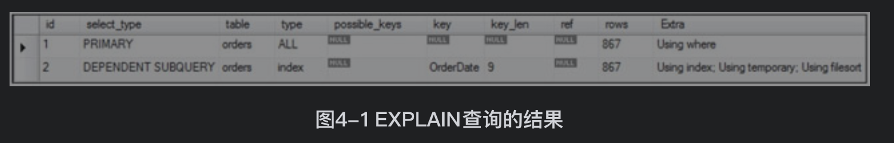
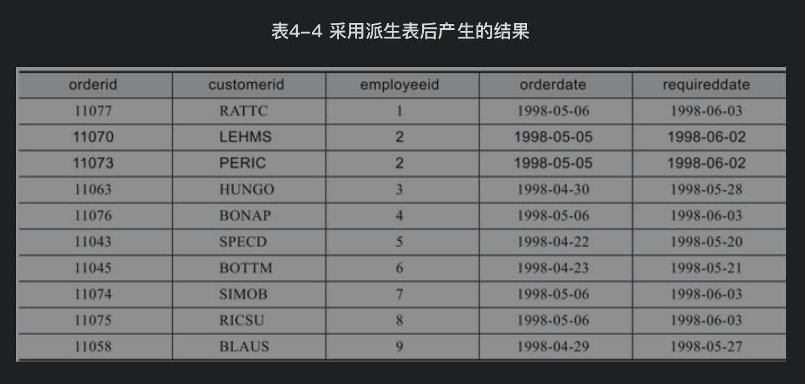
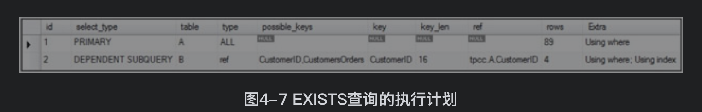
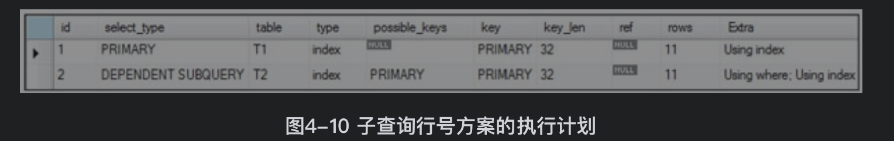
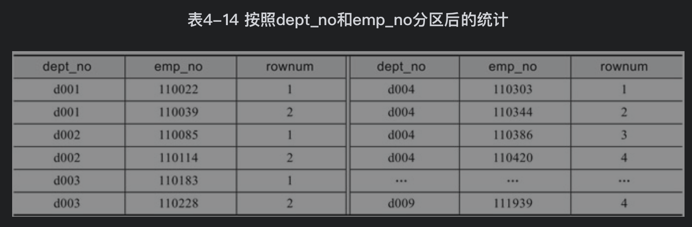
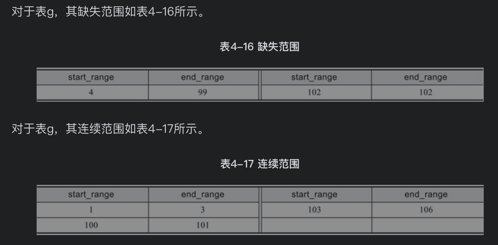
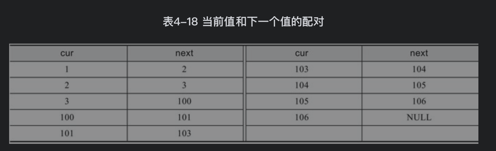

[TOC]


# 1. 子查询概述
## 1.1 使用子查询进行比较
```SQL
//表t1中有些值与表t2中的最大值相同，该子查询可以查找出所有这些行数
select col1 from t1 
where col1=(select max(col2) from t2);

//表t1中的有些行含有的值会在给定的列中出现两次，该例子可以查找出所有这些行
/*
对外表的每一行循环内表，如果t1中的某个id出现过2次，那么将会被选出来
*/
select * from t1 as t
where 2=(select count(*) from t1 where t1.id=t=id);
```

## 1.2 使用ANY、IN和SOME进行子查询
### any
any对于子查询返回的列中的任一数值，如果比较结果为TRUE，则返回TRUE

```SQL
//假设表t1中有一行包含（10）。如果表t2包含（21，14，7），则表达式为TRUE
//如果表t2包含（20，10），或者表t2为空表，则表达式为FALSE
//如果表t2包含（NULL， NULL， NULL），则表达式为UNKNOWN
select s1 from t1 where s1 > any (select s1 from t2);
```
### in
in和=any等价
```SQL
select s1 from t1 where s1 = any (select s1 from t2);
select s1 from t1 where s1 in (select s1 from t2);
```
some和any等价
```SQL
select s1 from t1 where s1 <> any (select s1 from t2);
select s1 from t1 where s1 <> some (select s1 from t2);
```

### all
all对于子查询返回的列中的所有值，如果比较结果为TRUE，则返回TRUE

```SQL
//假设表t1中有一行包含（10）。如果表t2包含（-5，0，+5），则表达式为TRUE，因为10比t2中的所有三个值都大
//如果表t2包含（12，6，NULL，-100），则表达式为FALSE，因为表t2中有一个值12大于10
//如果表t2包含（0，NULL，1），则表达式为UNKNOWN
//如果表t2为空表，则结果为TRUE
select s1 from t1 where s1 > all (select s1 from t2);

//如果表t2为空表，则结果为null
select s1 from t1 where s1 > (select s1 from t2);

//如果表t2为空表，则结果为null
select s1 from t1 where s1 > all (select max(s1) from t2);
```

not in和<>all等价
```SQL
select s1 from t1 where s1 <> all (select s1 from t2);
select s1 from t1 where s1 not in (select s1 from t2);
```

# 2. 独立子查询
独立子查询是不依赖外部查询而运行的子查询

返回被所有美国员工都至少处理过1次的客户
```SQL
select customer_id 
from orders 
where employee_id in
(select employee_id from employees where country='USA')
group by customer_id
having count(distinct employee_id)=
(select count(*) from employees where country='USA')
```

返回每个月产生的最后一个订单
```SQL
//子查询通过把订单按月分组并返回每个分组中最大的日期结果
select order_id,customer_id,employee_id,order_date
from orders
where order_date in
(select max(order_date) from orders group by(date_format(order_date,'%Y%m'))
)
```
但是上述语句在用explain分析时，看到子查询被优化成相关子查询。如果子查询和外部查询分别返回M和N行，那么该子查询被扫描为O（N+M*N）而不是O（M+N）

优化器对于IN子句，如果不是显式的列表定义，如IN ('a','b','c')，那么IN子句都会被转换为EXISTS的相关子查询


那么上述查询在执行时会被变成相关子查询，这个相关子查询需要进行多次的分组操作(对于每条外部表的数据都要做一次group by
```SQL
select order_id,customer_id,employee_id,order_date
from orders as A
where exists(
    select * from orders
    group by(date_format(order_date,'%Y%m'))
    having max(order_date)=A.order_date
);
```

可以对上述语句优化成如下，再嵌套一层子查询，将其作为[派生表](./派生表.md)来避免多次的分组操作
```SQL
select order_id,customer_id,employee_id,order_date
from orders as A
where exists(
    select * from (
        select max(order_date) from orders group by(date_format(order_date,'%Y%m'))
    )B
    where A.order_date=B.order_date
);
```

# 3. 相关子查询
相关子查询会引用外部查询列，对于外部查询的每一行都会执行一次内部子查询

查询每个员工最大订单日期的订单。一个员工可能有多个订单具有相同的订单日期，所以可能会为每个员工返回多行数据
```SQL
select order_id,customer_id,employee_id,order_date,required_date
from orders as A
where order_date=
(select max(order_date) from orders as B where A.employee_id=B.employee_id);

//以下是错的解法，可能包含不是该员工的订单。因为没有关联employee_id，可能某个order_date不是这个员工的最大日期，而是别人的最大日期
select order_id,customer_id,employee_id,order_date,required_date
from orders 
where order_date in
(select max(order_date) from orders group by employee_id);
```
优化上述查询，先添加一个唯一索引
```SQL
create unique index idx_empid_od_rd_oid on orders(employee_id,order_date,required_date,order_id);
```
再将子查询改写为派生表
```SQL
select order_id,customer_id,employee_id,order_date,required_date
from orders as A,
(select employee_id,max(order_date) as order_date from orders group by employee_id) as B
where A.order_date=B.order_date and A.employee_id=B.employee_id;
```


如果只想为每个员工返回一行数据，可能还需要引入一个条件，即最大订单ID的那行数据
```SQL
select order_id,customer_id,employee_id,order_date,required_date
from orders as A
where order_date=
(select max(order_date) from orders as B where A.employee_id=B.employee_id)
and order_id =
(select max(order_id) from orders as B where A.employee_id=B.employee_id)
```
改写为派生表
```SQL
select order_id,customer_id,employee_id,order_date,required_date
from orders as A,
(select employee_id,max(order_date) as order_date from orders group by employee_id) as B,
(select employee_id,max(order_id) as order_id from orders group by employee_id) as C
where A.order_date=B.order_date and A.employee_id=B.employee_id and A.order_id=C.order_id and A.employee_id=C.employee_id;
```

# 4. exists谓词
## exists
根据子查询是否有行返回，exists返回true或者false，如果返回的是unknown，exists返回false。只取到第一条匹配的就返回true (semi-join：对外部row source的每个键值，查找到内部row source匹配的第一个键值后就返回)

exists只关心行是否存在，而不会去取各列的值。所以exists子查询可以尽管使用select *

查询返回来自西班牙（Spain）且发生过订单的消费者
```SQL
select customer_id,company_name
from customers as A
where country='Spain'
and exists
(select * from orders as B where B.customer_id=A.customer_id)
```

SQL优化器先使用country='Spain'条件将country列为Spain的行数据取出，然后对于每个customer_id去order表上的customer_id索引匹配，检查orders表中是否有customerid的订单


一般情况下，in和exists执行计划相同，下面的SQL等价
```SQL
select customer_id,company_name
from customers
where country='Spain'
and customer_id in (select customer_id from orders);
```

## not exists
对于含null的列表，in总是返回true和unknown，not in总是返回false和unknown，对于NOT EXISTS，其总是返回TRUE和FALSE

# 5. 派生表
[派生表](./派生表.md)


# 6. 子查询可以解决的经典问题
## 行号
行号是指按顺序为查询结果集的行分配的连续整数

```SQL
mysql> create table sales(emp_id varchar(10) not null,mgr_id varchar(10) not null,
Query OK, 0 rows affected (0.03 sec)
```


```SQL
mysql> select emp_id,(select count(*) from sales as T2 where T2.emp_id<=T1.emp_id) as rowNum from sales as T1;
+--------+--------+
| emp_id | rowNum |
+--------+--------+
| A      |      1 |
| B      |      2 |
| C      |      3 |
| D      |      4 |
| E      |      5 |
| F      |      6 |
| G      |      7 |
| H      |      8 |
| I      |      9 |
| J      |     10 |
+--------+--------+
10 rows in set (0.01 sec)
```


按照qty和empid的顺序生成行号
```SQL
mysql> select emp_id,qty,(select count(*) from sales as T2 where T2.qty<T1.qty or(T2.qty=T1.qty and T2.emp_id<=T1.emp_id)) as rowNum from sales as T1 order by qty,emp_id;
+--------+-----+--------+
| emp_id | qty | rowNum |
+--------+-----+--------+
| B      | 100 |      1 |
| G      | 100 |      2 |
| J      | 100 |      3 |
| H      | 150 |      4 |
| C      | 200 |      5 |
| D      | 200 |      6 |
| E      | 250 |      7 |
| I      | 250 |      8 |
| A      | 300 |      9 |
| F      | 300 |     10 |
+--------+-----+--------+
10 rows in set (0.00 sec)
```
## 分区
对于表dept_manager，按dept_no分区，并按照emp_no升序进行分区统计

适合数据量小的情况
```SQL
select dept_no,emp_no,
(select count(*) from dept_manager as T2
where T2.dept_no=T1.dept_no and T2.emp_no<=T1.emp_no
) as rowNum
from dept_manager as T1
order by dept_no,emp_no;
```


## 最小缺失值问题
对于数据3，4，6，7，最小缺失值是1；对于1、2、3、4、6、7、9，最小缺失值是5
```SQL
mysql> CREATE TABLE x
(a INT UNSIGNED PRIMARY KEY,
b CHAR(1) NOT NULL);
Query OK, 0 rows affected (0.02 sec)

mysql> insert into x values(3,'a');
Query OK, 1 row affected (0.00 sec)

mysql> insert into x values(4,'b');
Query OK, 1 row affected (0.01 sec)

mysql> insert into x values(6,'c');
Query OK, 1 row affected (0.00 sec)

mysql> insert into x values(7,'d');
Query OK, 1 row affected (0.01 sec)

使用not exists来判断是否存在连续值使得A.a+1=B.a
mysql> select 
    -> case 
    -> when not exists(select a from x where a=1) then 1
    -> else (select min(a)+1 from x as A where not exists(select * from x as B where A.a+1=B.a)) 
    -> end as missing;
+---------+
| missing |
+---------+
|       1 |
+---------+
1 row in set (0.01 sec)

//对最小缺失值进行补缺操作，则可以通过INSERT...SELECT语句来实现
mysql> insert into x
    -> select 
    -> case 
    -> when not exists(select a from x where a=1) then 1
    -> else (select min(a)+1 from x as A where not exists(select * from x as B where A.a+1=B.a)) 
    -> end as missing,'p';
Query OK, 1 row affected (0.01 sec)
Records: 1  Duplicates: 0  Warnings: 0

mysql> select * from x;
+---+---+
| a | b |
+---+---+
| 1 | p |
| 3 | a |
| 4 | b |
| 6 | c |
| 7 | d |
+---+---+
5 rows in set (0.00 sec)
```

## 缺失范围和连续范围
```SQL
mysql> create table g(a int );
Query OK, 0 rows affected (0.02 sec)

mysql> insert into g select 1;
Query OK, 1 row affected (0.01 sec)
Records: 1  Duplicates: 0  Warnings: 0

mysql> insert into g select 2;
Query OK, 1 row affected (0.01 sec)
Records: 1  Duplicates: 0  Warnings: 0

mysql> insert into g select 3;
Query OK, 1 row affected (0.00 sec)
Records: 1  Duplicates: 0  Warnings: 0

mysql> insert into g select 100;
Query OK, 1 row affected (0.01 sec)
Records: 1  Duplicates: 0  Warnings: 0

mysql> insert into g select 101;
Query OK, 1 row affected (0.00 sec)
Records: 1  Duplicates: 0  Warnings: 0

mysql> insert into g select 103;
Query OK, 1 row affected (0.00 sec)
Records: 1  Duplicates: 0  Warnings: 0

mysql> insert into g select 104;
Query OK, 1 row affected (0.00 sec)
Records: 1  Duplicates: 0  Warnings: 0

mysql> insert into g select 105;
Query OK, 1 row affected (0.00 sec)
Records: 1  Duplicates: 0  Warnings: 0

mysql> insert into g select 106;
Query OK, 1 row affected (0.00 sec)
Records: 1  Duplicates: 0  Warnings: 0
```


缺失范围：
```SQL
//寻找缺失范围的start_range
mysql> select a+1 as start_range from g as A where not exists( select * from g as B where A.a+1=B.a) and 
//排除已有数据的最后一个数
a<(select max(a) from g);
+-------------+
| start_range |
+-------------+
|           4 |
|         102 |
+-------------+
2 rows in set (0.01 sec)

//最后通过子查询为每个间断点返回表g中下一个已有的值并减1
mysql> select a+1 as start_range,(select min(a)-1 from g as C where C.a>A.a) as end_range from g as A
    -> where not exists( select * from g as B where A.a+1=B.a) and a<(select max(a) from g)
    -> ;
+-------------+-----------+
| start_range | end_range |
+-------------+-----------+
|           4 |        99 |
|         102 |       102 |
+-------------+-----------+
2 rows in set (0.00 sec)

//另一种方法是对当前值和他的下一个值匹配，如果差值为1就是连续的
/*
可以看到next-cur的值为1表示连续的值，不连续的值为（3，100）、（101，103），
而我们要求的不连续范围为（4，99）、（102，102），也就是（cur+1，next-1）就是我们要求的缺失范围
*/
mysql> select cur+1 as start_range,next-1 as end_range from  
(select a as cur,(select min(a) from g as B where B.a>A.a) as next from g as A) as C where next-cur>1;
+-------------+-----------+
| start_range | end_range |
+-------------+-----------+
|           4 |        99 |
|         102 |       102 |
+-------------+-----------+
2 rows in set (0.00 sec)
```


连续范围：
[Schema与数据类型优化](./Schema与数据类型优化.md)