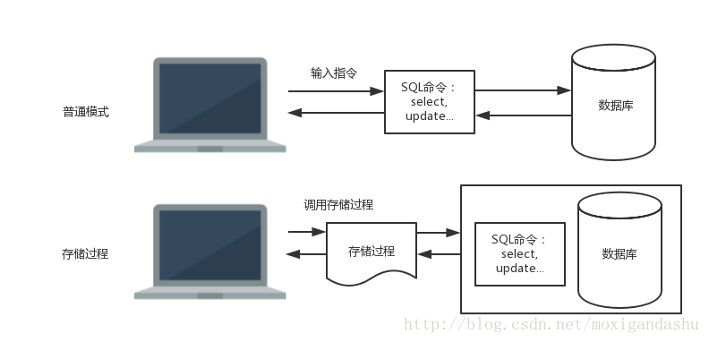
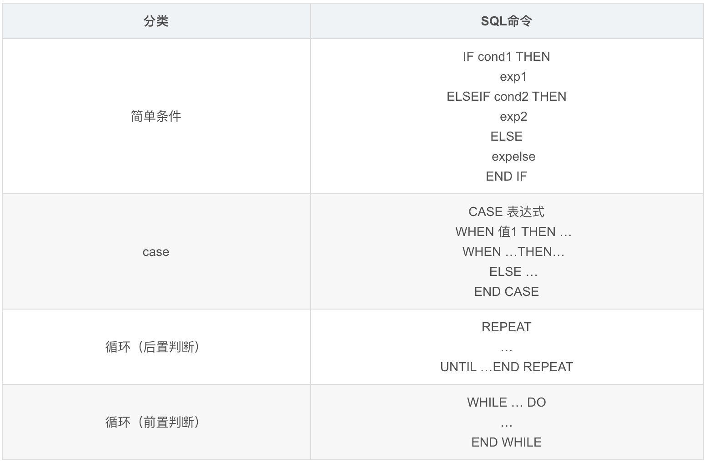

##### 参考博文
[MySQL数据库存储过程](https://blog.csdn.net/moxigandashu/article/details/64616135)
[MySQL 储存过程-原理、语法、函数详细说明](https://www.cnblogs.com/jiangxiaobo/p/7448854.html)
[MySQL存储函数](https://www.yiibai.com/mysql/stored-function.html)
[MySQL 自定义函数和存储过程的使用](https://itbilu.com/database/mysql/Nye1nX0Bb.html)


## 1.3.1 存储过程
存储过程和存储函数被统称为存储程序

存储过程是一组为了完成特定功能而事先编写好的代码，经编译后存储在数据库中，只需编译一次，用户通过指定存储过程名字和参数来调用存储过程。

每个数据库连接都有对存储过程的执行计划缓存，如果多个连接调用到同一个存储过程，将会重复存在多个缓存

存储过程优点：
>>1. 存储过程可以被重复使用，用户只需指定存储过程名字和参数，不用自己重复输入SQL指令
>>2. 可以减轻网络传输的压力，只需要传递存储过程的名字
>>3. 可以限制用户对表的直接访问，而让用户访问存储过程



#### 创建存储过程
```SQL
CREATE PROCEDURE 存储过程名(参数种类1 参数1 数据类型1,[...])
BEGIN
具体的procedure(处理)
END

//参数种类：in(输入参数)、out(输出参数)、inout(既是输入参数也是输出参数)

CALL 存储过程名(参数,...)
```

存储过程语句：


delimiter //表示将//作为分隔符，默认分隔符是；，不然存储过程中含有的；将无法识别。最后要将分隔符改回来
```SQL
//使用if
mysql>delimiter //
mysql>create procedure search(in p_name varchar(20))
    ->begin 
    ->if p_name=null or p_name='' then
    ->select * from customer;
    ->else
    ->select * from customer where name like p_name;
    ->end if;
    ->end
    ->//
mysql>delimeter ;

mysql>CALL sp_search_customer('王%');
mysql>CALL sp_search_customer('');

//使用输出参数
//使用while
mysql>delimiter //
mysql>create procedure factorial(in p_num int, out p_result int)
    ->begin
    ->set p_result=1;
    ->while p_num>1 do
    ->set p_result=p_result*p_num;
    ->set p_num=p_num-1;
    ->end while;
    ->end
    ->//
mysql>delimeter ;

//select into直接将查询到的值赋值给返回参数，查询结果只能有一个值
mysql>delimiter //
mysql>CREATE PROCUDURE productpricing(  
OUT p1 DECIMAL(8,2),  
OUT ph DECIMAL(8,2),  
OUT pa DECIMAL(8,2)  
)  
    ->BEGIN  
    ->SELECT Min(prod_price) INTO pl FROM products;  
    ->SELECT Max(prod_price) INTO ph FROM products;   
    ->SELECT Avg(prod_price) INTO pa FROM products;  
    ->END; 
    ->//
mysql>delimeter ;

//在调用存储过程时请在输出参数前面加上@，这样结果将保存到“@变量名“中
mysql>call factorial(5,@res);
mysql>select @res;
|----
|@res|
|----|
|120 |
|----

mysql>call factorial(0,@res);
mysql>select @res;
|----
|@res|
|----|
|1 |
|----

//使用repeate
mysql>delimiter //
mysql>create procedure factorial(in p_num int, out p_result int)
    ->begin
    ->set p_result=1;
    ->repeate
    ->set p_result=p_result*p_num;
    ->set p_num=p_num-1;
    ->until p_num<=1;
    ->end repeat;
    ->end
    ->//
mysql>delimeter ;
//此时0！的结果是0
mysql>call factorial(0,@res);
mysql>select @res;
|----
|@res|
|----|
|1 |
|----

//使用case
mysql>delimiter //
mysql>create procedure search(in p_depart int)
    ->begin
    ->case p_depart
    ->when 1 then
    ->select name,depart from employee where depart='销售';
    ->when 2 then
    ->select name,depart from employee where depart='研发';
    ->else
    ->select name,depart from employee where depart='行政';
    ->end case;
    ->end
    ->//
mysql>delimeter ;

//定义局部变量
DECLARE 变量名 数据类型 [初始值...]
SET 变量名=

mysql>delimiter //
    ->create procedure search(in p_depart int)
    ->begin
    ->declare tem char(4);
    ->case p_depart
    ->when 1 then
    ->set tem='销售';
    ->case p_depart
    ->when 1 then
    ->set tem='研发';
    ->else
    ->set tem='行政';
    ->end case;
    ->select name,depart from employee where depart=tem;
    ->end
    ->//
mysql>delimeter ;


```

#### 查看存储过程
```SQL
//查看数据库中是否存在存储过程
mysql>show procedure status;

//查看存储过程的具体信息
mysql>show create procedure 存储过程名
```

#### 删除存储过程
```SQL
DROP PROCEDURE 存储过程名;
```
#### 自定义变量
1. 客户端
```SQL
mysql> SELECT 'Hello World' into @x;
Query OK, 1 row affected (0.00 sec)
mysql> select @x;
+-------------+
| @x          |
+-------------+
| Hello World |
+-------------+
1 row in set (0.01 sec)

mysql> SET @y='Goodbye Cruel World';
Query OK, 0 rows affected (0.01 sec)
mysql> select @y;
+---------------------+
| @y                  |
+---------------------+
| Goodbye Cruel World |
+---------------------+
1 row in set (0.00 sec)

mysql> set @z=1+2+3;
Query OK, 0 rows affected (0.00 sec)
mysql> select @z;
+------+
| @z   |
+------+
|    6 |
+------+
1 row in set (0.00 sec)
```

## 1.3.2 存储函数
### 创建存储函数
```SQL
//存储函数所有参数都是in,不能指定out，inout
//在returns语句后指定返回值的类型，并且只能返回一个值
//DETERMINISTIC声明一个函数是确定性函数，如果对于相同的输入函数返回相同的输出，那就认为是确定性的
CREATE FUNCTION function_name(param1 paramtype,param2 paramtype,…) RETURNS datatype
   [NOT] DETERMINISTIC
begin
 return ...
end
```

```SQL
mysql>delimiter //
    ->create function CustomerLevel(p_creditLimit double) returns varchar(10)
    ->deterministic
    ->begin
    ->declare lvl varchar(10);
    ->IF p_creditLimit > 50000 THEN
    ->SET lvl = 'PLATINUM';
    ->elseif (p_creditLimit <= 50000 AND p_creditLimit >= 10000) THEN
    -> SET lvl = 'GOLD';
    ->elseif p_creditLimit < 10000 THEN
    -> SET lvl = 'SILVER';
    ->end if;
    ->return lvl;
    ->end
    ->//
mysql>delimiter ;

//使用存储函数
SELECT customerName, CustomerLevel(creditLimit)
FROM customers
ORDER BY customerName;

//在存储过程中使用存储函数
mysql>delimiter //
    ->create procedure getCustomerLevel(in number int,out level varchar(10))
    ->begin
    ->declare credit double;
    ->SELECT creditlimit INTO credit FROM customers WHERE customerNumber = number;
    ->SELECT CUSTOMERLEVEL(credit) 
    INTO level;
    ->end
    ->//
mysql>delimiter ;

mysql>DELIMITER //
    ->CREATE FUNCTION getName(id INT) RETURNS CHAR(50)
    ->RETURN (SELECT name FROM t WHERE id=id);
    ->//
mysql>DELIMITER ;

mysql>SELECT getName(1);
+----------------+
| getName(1) |
+----------------+
| itbilu.com |
+----------------+
1 row in set (0.00 sec)
```
存储过程 VS 存储函数
1. 存储过程可以定义多个返回值对象，可以返回集合；存储函数必须而且只能返回一个值或表对象
2. 存储过程可以定义in、out、inout对象；存储函数只有in对象
3. 存储过程用于执行一组复杂的操作，只能使用call独立执行而不能在SQL语句中执行；存储函数则用于执行某一个针对性的功能，而且可以嵌在SQL语句中执行(如用于select)，存储函数可以在返回表对象时放在from语句后
