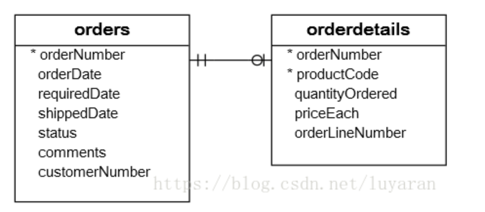

## 参考博文
[mysql派生表（Derived Table）简单解析&使用的小例子](https://blog.csdn.net/luyaran/article/details/80925672)


[TOC]


# 概念
当SELECT语句的FROM子句中使用独立子查询时，我们将其称为派生表。只执行一次会将结果保存完，这个查询结束完后就会清除

```SQL
SELECT 
    column_list
FROM
*    (SELECT 
*        column_list
*    FROM
*        table_1) derived_table_name;
WHERE derived_table_name.column > 1...
```

派生表列的名称必须唯一,一般SQL没有这样的限制
```SQL
mysql>  select 'c' as a,'b' as a;
+---+---+
| a | a |
+---+---+
| c | b |
+---+---+
1 row in set (0.00 sec)

mysql> select * from (select 'c' as a,'b' as a) as T;
ERROR 1060 (42S21): Duplicate column name 'a'
```

# 举例

```SQL
SELECT 
    productCode, 
    ROUND(SUM(quantityOrdered * priceEach)) sales
FROM
    orderdetails
        INNER JOIN
    orders USING (orderNumber)
WHERE
    YEAR(shippedDate) = 2018
GROUP BY productCode
ORDER BY sales DESC
LIMIT 5;
```
可以将上述结果作为派生表放入其他查询中使用
```SQL

SELECT 
    productName, sales
FROM
#    (SELECT 
#        productCode, 
#        ROUND(SUM(quantityOrdered * priceEach)) sales
#    FROM
#        orderdetails
#    INNER JOIN orders USING (orderNumber)
#    WHERE
#        YEAR(shippedDate) = 2018
#    GROUP BY productCode
#    ORDER BY sales DESC
#    LIMIT 5) top5_products_2018
INNER JOIN products USING (productCode);
```