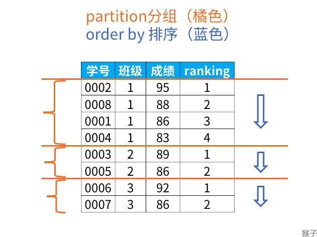
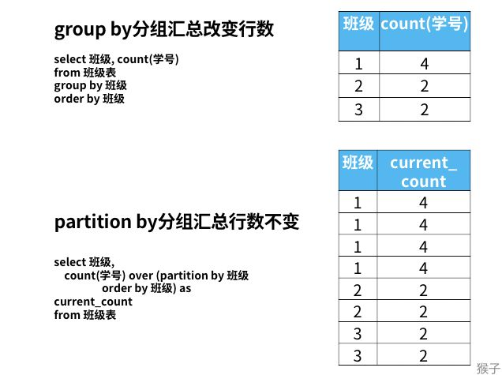
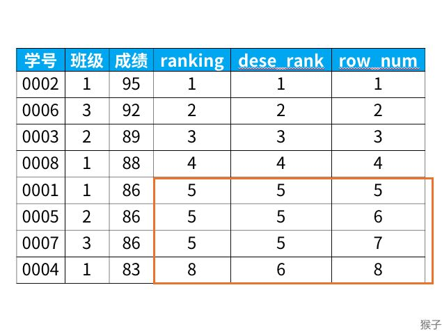
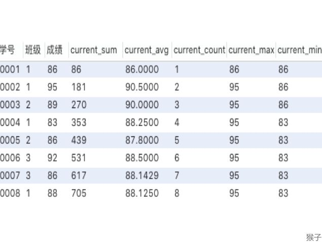

[TOC]

# 窗口函数

[https://zhuanlan.zhihu.com/p/92654574](https://zhuanlan.zhihu.com/p/92654574)


在MySQL查询过程中，我们会经常会做类似以下的查询。对于这类查询就可以使用窗口函数
```
排名问题：每个部门按业绩来排名
topN问题：找出每个部门排名前N的员工进行奖励
```
# 业务场景


在近期的一个需求中，碰到一类查询场景：
在一堆直播记录中，针对每个商品找出最开播时间最近的一条直播记录。


针对这类查询场景想到的方案通常是：


1. 根据商品ID做group by
1. 对每个group中的商品做倒序，取第一条记录


类似的场景还有：


- 一堆学生成绩中对每个学生按班级来排名
- 一堆学生中对排名前N的学生进行表彰


那么group by的局限性就出来了：


1. group by的限制在于在select语句中不能出现非group by的字段(但是能做聚合运算)，那么想select其他字段就要写子查询
1. group by后只能返回一条结果数据


这个时候就可以搬出窗口函数了！


# 什么是窗口函数
窗口函数，也叫OLAP函数（Online Anallytical Processing，联机分析处理），可以对数据库数据进行实时分析处理。


窗口函数的基本语法如下：
```
<窗口函数> over (partition by <用于分组的列名>
                order by <用于排序的列名>)
```


从语法中可以看到窗口函数的partition by相当于group by，order by相当于order by


简单来说窗口函数就是对每个group by后的组开一个窗口，每个组都在自己的窗口中进行排序操作


和group by不同之处在于：
1. 窗口函数对每个组的数据分别进行排序和计算，并且返回所有的数据行
2. 窗口函数只能写在select语句中


# 窗口函数分类
## 专用窗口函数 rank, dense_rank, row_number
专用窗口函数根据partition by的列进行分组，然后在组内进行排序并返回每个窗口内的行数。

在每个班级内按成绩排名


希望得到如下的结果


实现如下
```
select *,
   rank() over (partition by 班级
                 order by 成绩 desc) as ranking
from 班级表
```


窗口函数的实现原理如下，首先使用partition by进行分组，然后使用order by在组内进行排序



窗口函数和group by的区别如下



rank, dense_rank, row_number的区别如下：
```
select *,
   rank() over (order by 成绩 desc) as ranking,
   dense_rank() over (order by 成绩 desc) as dese_rank,
   row_number() over (order by 成绩 desc) as row_num
from 班级表
```
```
rank函数：这个例子中是5位，5位，5位，8位，也就是如果有并列名次的行，会占用下一名次的位置。比如正常排名是1，2，3，4，但是现在前3名是并列的名次，结果是：1，1，1，4。

dense_rank函数：这个例子中是5位，5位，5位，6位，也就是如果有并列名次的行，不占用下一名次的位置。比如正常排名是1，2，3，4，但是现在前3名是并列的名次，结果是：1，1，1，2。

row_number函数：这个例子中是5位，6位，7位，8位，也就是不考虑并列名次的情况。比如前3名是并列的名次，排名是正常的1，2，3，4。
```



## **聚合函数作为窗口函数**
**
对自身记录以及自身记录以上的行进行聚合计算，聚合函数后面的括号中必须填字段


聚合函数sum在窗口函数中，是对自身记录、及位于自身记录以上的数据进行求和的结果。比如0004号，在使用sum窗口函数后的结果，是对0001，0002，0003，0004号的成绩求和，若是0005号，则结果是0001号~0005号成绩的求和，以此类推


```
select *,
   sum(成绩) over (order by 学号) as current_sum,
   avg(成绩) over (order by 学号) as current_avg,
   count(成绩) over (order by 学号) as current_count,
   max(成绩) over (order by 学号) as current_max,
   min(成绩) over (order by 学号) as current_min
from 班级表
```

