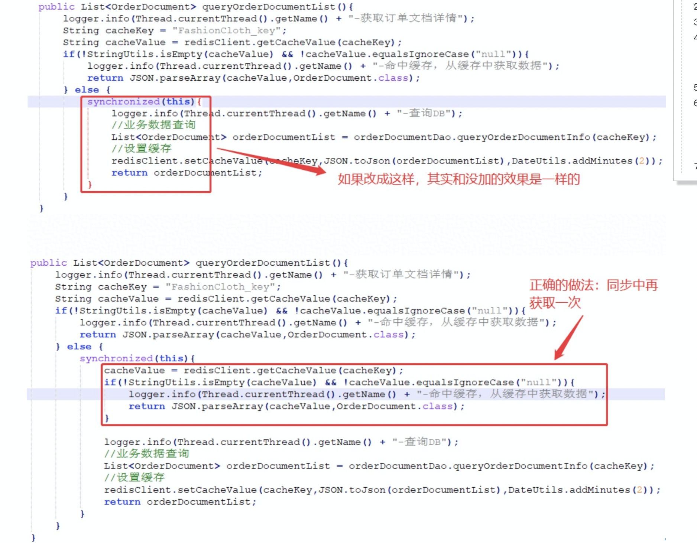
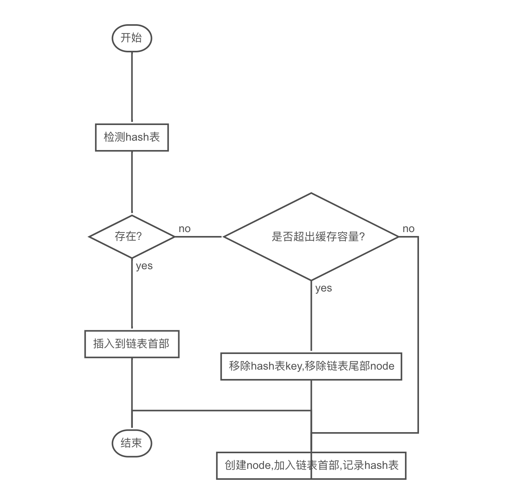
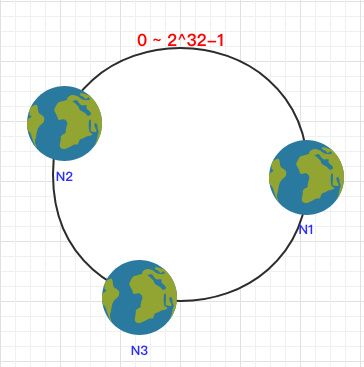
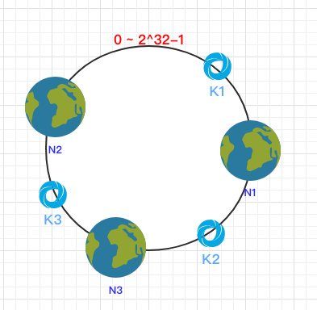
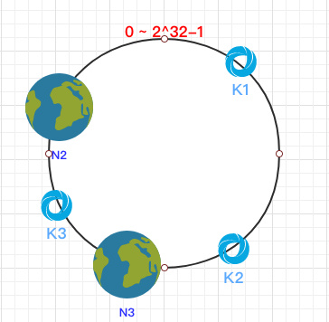
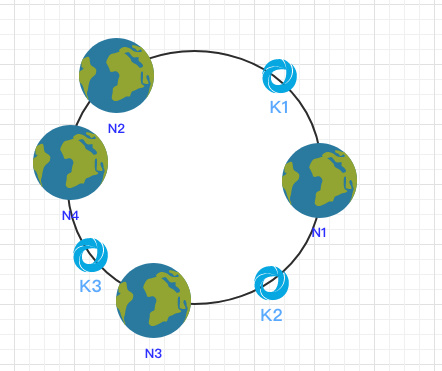
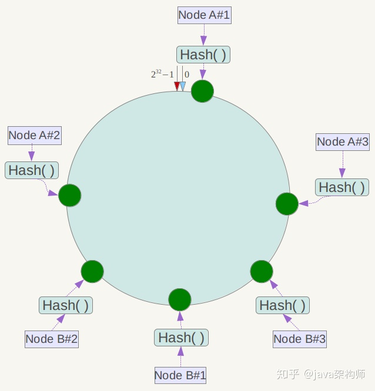

## 参考博文
[大型网站技术架构：核心原理与案例分析](大型网站技术架构：核心原理与案例分析)
[如何保证缓存(redis)与数据库(MySQL)的一致性](https://developer.aliyun.com/article/712285)
[图解一致性哈希算法](https://segmentfault.com/a/1190000021199728)
[一致性 Hash 算法分析](https://crossoverjie.top/2018/01/08/Consistent-Hash/)


[TOC]

# 1. 本地缓存
将数据存储在进程内存中

# 2. 分布式缓存

#### 缓存预热
在缓存系统启动时就将数据库中的部分数据加载到缓存中

#### 缓存穿透
不恰当、频繁的请求某个不存在的数据，缓存不命中而导致大量请求落在数据库上。

解决方案：
```
1. 一个简单的策略是缓存中也存储一些不存在的数据，比如存储value为null的数据

2. 接口层增加校验，如用户鉴权校验，id做基础校验，id<=0的直接拦截
```


#### 缓存雪崩
缓存雪崩是指在我们设置缓存时采用了相同的过期时间，导致缓存在某一时刻同时失效，请求全部转发到DB，DB瞬时压力过重雪崩。

解决方案：
```
1. 大多数系统设计者考虑用加锁或者队列的方式保证来保证不会有大量的线程对数据库一次性进行读写，
从而避免失效时大量的并发请求落到底层存储系统上。

2. 还有一个简单方案是将缓存失效时间分散开，比如我们可以在原有的失效时间基础上增加一个随机值，
比如1-5分钟随机，这样每一个缓存的过期时间的重复率就会降低，就很难引发集体失效的事件

3. 热点数据永不过期
```

#### 缓存击穿
对于一些设置了过期时间的key，如果这些key可能会在某些时间点被超高并发地访问，是一种非常“热点”的数据。这个时候，需要考虑一个问题：缓存被“击穿”的问题，这个和缓存雪崩的区别在于这里针对某一key缓存，前者则是很多key。

缓存在某个时间点过期的时候，恰好在这个时间点对这个Key有大量的并发请求过来，这些请求发现缓存过期一般都会从后端DB加载数据并回设到缓存，这个时候大并发的请求可能会瞬间把后端DB压垮

解决方案：
1. JVM锁：线程先去获取锁，获取到的线程才可以请求数据库


2. 分布式锁：redis分布式锁，Zookeeper分布式锁，Tair分布式锁等


#### 缓存更新
除了缓存服务器自带的缓存失效策略之外（Redis默认的有6中策略可供选择），我们还可以根据具体的业务需求进行自定义的缓存淘汰，

常见的策略有两种：
```
1. 定时去清理过期的缓存；

2. 当有用户请求过来时，再判断这个请求所用到的缓存是否过期，过期的话就去底层系统得到新数据并更新缓存。
```
两者各有优劣，第一种的缺点是维护大量缓存的key是比较麻烦的，第二种的缺点就是每次用户请求过来都要判断缓存失效，逻辑相对比较复杂！具体用哪种方案，大家可以根据自己的应用场景来权衡。


#### 缓存降级
当访问量剧增、服务出现问题（如响应时间慢或不响应）或非核心服务影响到核心流程的性能时，仍然需要保证服务还是可用的，即使是有损服务。系统可以根据一些关键数据进行自动降级，也可以配置开关实现人工降级。

降级的最终目的是保证核心服务可用，即使是有损的。而且有些服务是无法降级的（如加入购物车、结算）。

在进行降级之前要对系统进行梳理，看看系统是不是可以丢卒保帅；从而梳理出哪些必须誓死保护，哪些可降级；比如可以参考日志级别设置预案：

（1）一般：比如有些服务偶尔因为网络抖动或者服务正在上线而超时，可以自动降级；

（2）警告：有些服务在一段时间内成功率有波动（如在95~100%之间），可以自动降级或人工降级，并发送告警；

（3）错误：比如可用率低于90%，或者数据库连接池被打爆了，或者访问量突然猛增到系统能承受的最大阀值，此时可以根据情况自动降级或者人工降级；

（4）严重错误：比如因为特殊原因数据错误了，此时需要紧急人工降级

# 缓存和数据库一致性
客户端对数据库中的数据主要有两类操作，读(select)与写(DML)。针对放入redis中缓存的热点数据，当客户端想读取的数据在缓存中就直接返回数据，即命中缓存(cache hit)，当读取的数据不在缓存内，就需要从数据库中将数据读入缓存，即未命中缓存(cache miss)。所以读操作并不会导致缓存与数据库中的数据不一致。
  
对于写操作(DML)，缓存与数据库中的内容都需要被修改，但两者的执行必定存在一个先后顺序，这可能会导致缓存与数据库中的数据不再一致，此时主要需要考虑两个问题：
  1、执行顺序的问题：先更新缓存还是先更新数据库？
  2、更新缓存的策略问题：当缓存中的内容变化时，是选择修改缓存(update)，还是直接淘汰缓存(delete)？

针对这两点问题，一共可以分为四种方案：
  1、先更新缓存，再更新数据库；
  2、先更新数据库，再更新缓存；
  3、先淘汰缓存，再更新数据库；
  4、先更新数据库，再淘汰缓存


## 更新缓存还是淘汰缓存
- 淘汰缓存：直接将缓存中的旧值淘汰
操作简单，但是会有一次缓存不命中，需要查询一次DB

- 更新缓存
a)不会有缓存不命中的情况
b)当更新操作简单，例如只是直接修改缓存中的某个值，那代价和淘汰缓存差不多。但是如果缓存的修改需要涉及到多个值的计算，例如商品信息的缓存中，还要从DB计算折扣信息，这个时候还是直接淘汰缓存比较合适


## 执行顺序的问题
### 更新缓存和更新DB
当两个线程对同一个数据进行更新时，会产生以下可能导致DB和缓存的数据不一致性：
方案一、先更新(update)缓存，再更新数据库
  线程A更新了缓存
  线程B更新了缓存
  线程B更新了数据库
  线程A更新了数据库
方案二、先更新数据库，再更新(update)缓存
  线程A更新了数据库
  线程B更新了数据库
  线程B更新了缓存
  线程A更新了缓存


解决方案：
1. 可以对缓存中的数据加锁，获取到锁的数据才能执行更新缓存和DB的操作
2. 更新cache的消耗更大，且很有可能造成数据的不一致，可以直接淘汰cache


### 淘汰缓存和更新DB
这里主要分为两个方面来考虑：
  1、更新数据库与淘汰缓存是两个步骤，只能先后执行，如果在执行过程中后一步执行失败，哪种方案的影响最小？
  2、如果不考虑执行失败的情况，但更新数据库与淘汰缓存必然存在一个先后顺序，在上一个操作执行完毕，下一个操作还未完成时，如果并发较大，仍旧会导致数据库与缓存中的数据不一致，在这种情况下，用哪种方案影响最小？

另外，对于数据库而言，读写操作可以只作用在同一台服务器上，即底层只有一个数据库，也可以将读操作放在从库，写操作放在主库，即底层是主从架构，对于主从架构还需要考虑主从延迟，本文针对的是单节点模式


#### 更新数据库与淘汰缓存是两个步骤，只能先后执行，如果在执行过程中后一步执行失败，哪种方案的影响最小？
**方案一、先淘汰缓存，再更新DB**
假如淘汰缓存成功，更新DB失败，那么最多会有一次缓存不命中。但其实如果这里更新DB失败了，也要重试机制

**方案二、先更新DB，再淘汰缓存**
假如DB更新成功，淘汰缓存失败，会出现DB和缓存的数据不一致性。那么对淘汰缓存使用重试机制，如果返回错误码就重试

在业务中，无论是淘汰缓存还是更新数据库，我们都需要确保它们真正完成了，所以个人认为在情景一下两种方案并没有什么优劣之分


#### 假设没有操作会执行失败，单DB，读写并发场景
**方案一、先淘汰缓存，再更新数据库**

1、在正常情况下，A、B两个线程先后对同一个数据进行读写操作：
  A线程进行写操作，先淘汰缓存，再更新数据库
  B线程进行读操作，发现缓存中没有想要的数据，从数据库中读取更新后的新数据

2、在并发量较大的情况下，会有以下情况：
  a)A线程进行写操作，先成功淘汰缓存，但由于网络或其它原因，还未更新数据库或正在更新
  b)B线程进行读操作，发现缓存中没有想要的数据，从数据库中读取数据并放入缓存，但此时A线程还未完成更新操作，所以读取到的是旧数据。
  c)在B线程将旧数据读入缓存后，A线程终于将DB更新完成。最终造成不一致，缓存是老数据，DB是新数据

可以引入延时双删解决：
  a)A线程进行写操作，先成功淘汰缓存，但由于网络或其它原因，还未更新数据库或正在更新
  b)B线程进行读操作，从数据库中读入旧数据，共耗时N秒
  c)在B线程将旧数据读入缓存后，A线程将数据更新完成，此时数据不一致
  d)A线程将数据库更新完成后，休眠M秒(M比N稍大即可)，然后再次淘汰缓存，此时缓存中即使有旧数据也会被淘汰，此时可以保证数据的一致性
  e)其它线程进行读操作时，缓存中无数据，从数据库中读取的是更新后的新数据

在并发量较大的情况下，采用异步更新缓存的策略：
  a)A线程进行写操作，先成功淘汰缓存，但由于网络或其它原因，还未更新数据库或正在更新
  b)B线程进行读操作，发现缓存中没有想要的数据，从数据库中读取数据，但B线程只是从数据库中读取想要的数据，并不将这个数据放入缓存中，所以并不会导致缓存与数据库的不一致
  c)A线程更新数据库后，通过订阅binlog来异步更新缓存


**方案二、先更新数据库，再淘汰缓存**
在正常情况下：
  a)A线程进行写操作，更新数据库，淘汰缓存
  b)B线程进行读操作，从数据库中读取新的数据
不会有问题

在并发较大的情况下，情形1：
  a)A线程进行写操作，更新数据库，还未淘汰缓存
  b)B线程从缓存中可以读取到旧数据，此时数据不一致
  c)A线程完成淘汰缓存操作
  d)其它线程进行读操作，从数据库中读入最新数据，数据最终一致

在并发较大的情况下，情形2：
  a)A线程进行写操作，更新数据库，但更新较慢，缓存也未淘汰
  b)B线程进行读操作，读取了缓存中的旧数据
但这种情况没什么问题，毕竟更新操作都还未完成，数据库与缓存中都是旧数据，没有数据不一致

在并发较大的情况下，情形3：
  a)缓存初始无数据，A线程读取DB中的数据，但未写入Cache。
此时分为两种情况，还未读取数据库的数据，已读取数据库的数据，不过由于网络等问题数据还未传输到缓存
  b)B线程执行写操作，更新数据库，淘汰缓存
  c)B线程写操作完成后，A线程才将数据库的数据读入缓存，此时数据会不一致
不过这种情况发生的概率极低，因为一般读操作要比写操作要更快
万一担心存在这种可能，可以用“延迟双删”策略，在A线程读操作完成后再淘汰一次缓存

【单节点下两种方案对比】
1. 先淘汰cache，再更新数据库：
  采用同步更新缓存的策略，可能会导致数据长时间不一致，如果用延迟双删来优化，还需要考虑究竟需要延时多长时间的问题——读的效率较高，但数据的一致性需要靠其它手段来保证
  采用异步更新缓存的策略，不会导致数据不一致，但在数据库更新完成之前，都需要到数据库层面去读取数据，读的效率不太好——保证了数据的一致性，适用于对一致性要求高的业务

2. 先更新数据库，再淘汰cache：
  无论是同步/异步更新缓存，都不会导致数据的最终不一致，在更新数据库期间，cache中的旧数据会被读取，可能会有一段时间的数据不一致，但读的效率很好——保证了数据读取的效率，如果业务对一致性要求不是很高，这种方案最合适


#### 假设没有操作会失败，主从DB，读写分离，读写并发场景


# LRU
当数据在最近一段时间经常被访问，那么它在以后也会经常被访问。这就意味着，如果经常访问的数据，我们需要然其能够快速命中，而不常访问的数据，我们在容量超出限制时将其淘汰

## 基于双向链表+Hash表实现
- get
对于get操作,我们首先查阅hashmap，如果存在的话，直接将Node从当前位置移除，然后插入到链表的首部，在链表中实现删除直接让node的前驱节点指向后继节点，很方便.如果不存在，那么直接返回Null

- put
1. 看hashmap里面有没有这个key
2. 如果有并且value不同，就替换value。然后把节点移到链表头部
3. 如果没有看hashmap是否满了，如果没满，就把节点放入hashmap并且插入到表头。如果满了，就把链表中最后一个节点删除，并从hashmap中移除，再执行新节点的插入操作



# 一致性hash算法
当我们在做数据库分库分表或者是分布式缓存时，不可避免的都会遇到一个问题:
如何将数据均匀的分散到各个节点中，并且尽量的在加减节点时能使受影响的数据最少

可以想到以下几种方法：
1. Hash 取模
2. 一致 Hash 算法
3. 虚拟节点

## Hash 取模
传入的key按照index = hash(key) % N 算出要存放的节点。但是当增加或者删除节点的时候，就要重新计算

## 一致 Hash 算法
将所有的哈希值构成了一个环，其范围在 0 ~ 2^32-1

1. 将节点根据IP做hash(key)散列到环上



2. 将数据用一样的hash(key)散列到环上，按照顺时针方向将数据定位到节点

按照顺时针方向就可以把 k1 定位到 N1节点，k2 定位到 N3节点，k3 定位到 N2节点


### 容错性
当一个节点宕机时，只影响他前面的数据

假设N1宕机了，依然根据顺时针方向，k2 和 k3 保持不变，只有 k1 被重新映射到了 N3。这样就很好的保证了容错性，当一个节点宕机时只会影响到少少部分的数据


### 拓展性
在 N2 和 N3 之间新增了一个节点 N4 ，这时会发现受影响的数据只有 k3，其余数据也是保持不变，所以这样也很好的保证了拓展性



一致性hash算法仍然有负载均衡和数据倾斜问题，引入N4节点只减轻了N3的压力，对N1 N2没有任何作用

## 虚拟节点
为了解决负载均衡和数据倾斜问题，引入虚拟节点

每个物理节点都对应一组虚拟节点散列到环上，先确定数据对应的虚拟几点，再根据虚拟节点确定物理节点

