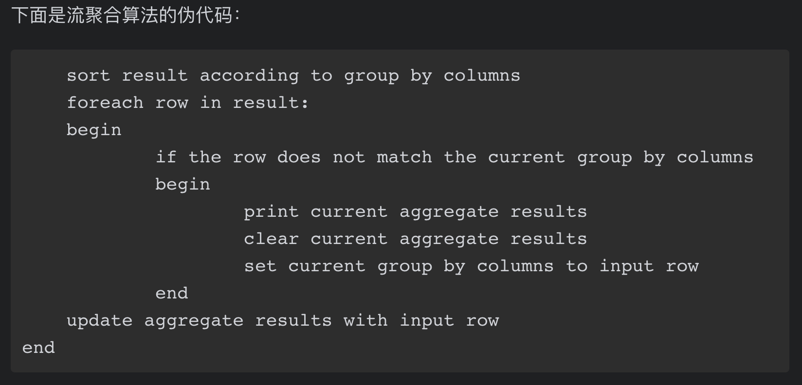
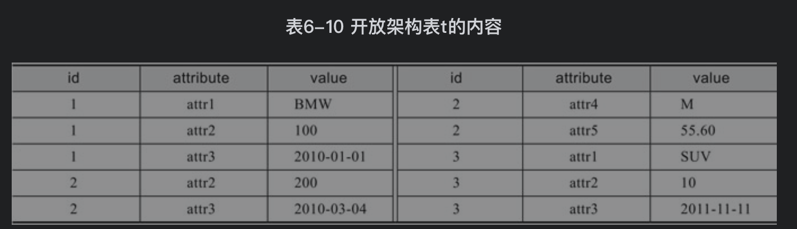
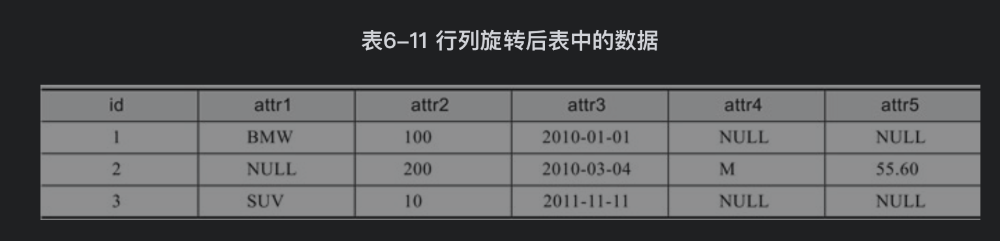

[TOC]

# 1. 聚合
## 1.1 聚合函数
```SQL
AVG（）
BIT_AND（）
BIT_OR（）
BIT_XOR（）
COUNT（DISTINCT）
COUNT（）
GROUP_CONCAT（）
MAX（）[插图]MIN（）
STD（）[插图]STDDEV_POP（)
STDDEV_SAMP（）
STDDEV（）
SUM（）
VAR_POP（）
VAR_SAMP（）
```

GROUP_CONCAT将分组后的非NULL数据通过连接符进行拼接，对NULL数据返回NULL值
```SQL
mysql> create table z(a int,b int);
Query OK, 0 rows affected (0.02 sec)

mysql> insert into z select 1,200;
Query OK, 1 row affected (0.00 sec)
Records: 1  Duplicates: 0  Warnings: 0

mysql> insert into z select 1,100;
Query OK, 1 row affected (0.01 sec)
Records: 1  Duplicates: 0  Warnings: 0

mysql> insert into z select 1,100;
Query OK, 1 row affected (0.01 sec)
Records: 1  Duplicates: 0  Warnings: 0

mysql> insert into z select 2,400;
Query OK, 1 row affected (0.01 sec)
Records: 1  Duplicates: 0  Warnings: 0

mysql> insert into z select 2,500;
Query OK, 1 row affected (0.01 sec)
Records: 1  Duplicates: 0  Warnings: 0

mysql> insert into z select 3,null;
Query OK, 1 row affected (0.00 sec)
Records: 1  Duplicates: 0  Warnings: 0

mysql> select a,group_concat(b) from z group by a;
+------+-----------------+
| a    | group_concat(b) |
+------+-----------------+
|    1 | 200,100,100     |
|    2 | 400,500         |
|    3 | NULL            |
+------+-----------------+
3 rows in set (0.00 sec)

//group_concat可以添加参数：DISTINCT选项可以去除重复值，ORDER BY选项可以对列进行排序，SEPARATOR用于选择拼接的字符串值
mysql> select a,group_concat(distinct b order by b desc separator ':') from z group by a;
+------+--------------------------------------------------------+
| a    | group_concat(distinct b order by b desc separator ':') |
+------+--------------------------------------------------------+
|    1 | 200:100                                                |
|    2 | 500:400                                                |
|    3 | NULL                                                   |
+------+--------------------------------------------------------+
3 rows in set (0.00 sec)
```

## 1.2 聚合的算法
MySQL的聚合是流聚合，流聚合依赖group by获得的值。如果一个SQL查询中包含的GROUP BY语句多于一列，流聚合会先根据GROUP BY对行进行排序

流聚合的伪代码。例如max函数，一开始先对group by的列进行排序，然后判断改行是不是属于当前分组，如果是则拿改行和当前的最大值比较和更新。如果不属于，则输出当前最大值，把改行作为新的分组并更新当前最大值会改行


可以看到Extra列中显示Using temporary和Using filesort，这是因为采用流聚合算法会先对数据进行排序。如果想避免排序操作，可以在group by的列上添加索引

# 2. 附加属性聚合

# 3. 连续聚合
连续聚合是按时间顺序对有序数据进行聚合的操作

## 3.1 累积聚合


## 3.2 滑动聚合


## 3.3 年初至今聚合


# 4. Pivoting
Pivoting是一项可以把行旋转为列的技术，用户需要提前知道旋转的属性列的值

## 4.1 开放架构
开放架构是一种用于频繁更改架构的一种设计模式。他把列变成行，每行存储一个列的值，多个列组成逻辑上的一行，逻辑上行的列可以各不相同。
对开放架构增加、删除列就很方便，只要增加、删除表中数据就可以，但是查询数据不如之前普通的数据表直观，需要结合Pivoting技术

```SQL
//id标识这个属性属于哪行，attribute是某行的列，value是这列的值
CREATE TABLE t(
id INT,
attribute VARCHAR(10),
value VARCHAR(20),
PRIMARY KEY(id,attribute));

//id为1的是一行，2的是一行。
//第一行有attr1、attr2、attr3三个列；第二行有attr2、attr3、attr4、attr5四个列
INSERT INTO t SELECT 1,'attr1','BMW';
INSERT INTO t SELECT 1,'attr2','100';
INSERT INTO t SELECT 1,'attr3','2010-01-01';
INSERT INTO t SELECT 2,'attr2','200';
INSERT INTO t SELECT 2,'attr3','2010-03-04';
INSERT INTO t SELECT 2,'attr4','M';
INSERT INTO t SELECT 2,'attr5','55.60';
INSERT INTO t SELECT 3,'attr1','SUV';
INSERT INTO t SELECT 3,'attr2','10';
INSERT INTO t SELECT 3,'attr3','2011-11-11';
```


通过下列Pivoting技术进行行列互转以得到数据
```SQL
//Pivoting先根据ID分组，然后通过已知的5列数据，通过case得到每列的值。因为用了group by，所以一定要用聚合函数得到每列的值(也可以用min函数)
SELECT id,
MAX(CASE WHEN attribute='attr1' THEN value END) AS attr1,
MAX(CASE WHEN attribute='attr2' THEN value END) AS attr2,
MAX(CASE WHEN attribute='attr3' THEN value END) AS attr3,
MAX(CASE WHEN attribute='attr4' THEN value END) AS attr4,
MAX(CASE WHEN attribute='attr5' THEN value END) AS attr5
FROM t GROUP BY id;
```


## 4.2 关系除法


