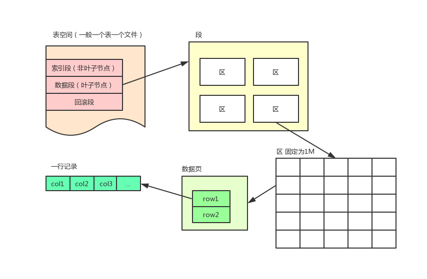
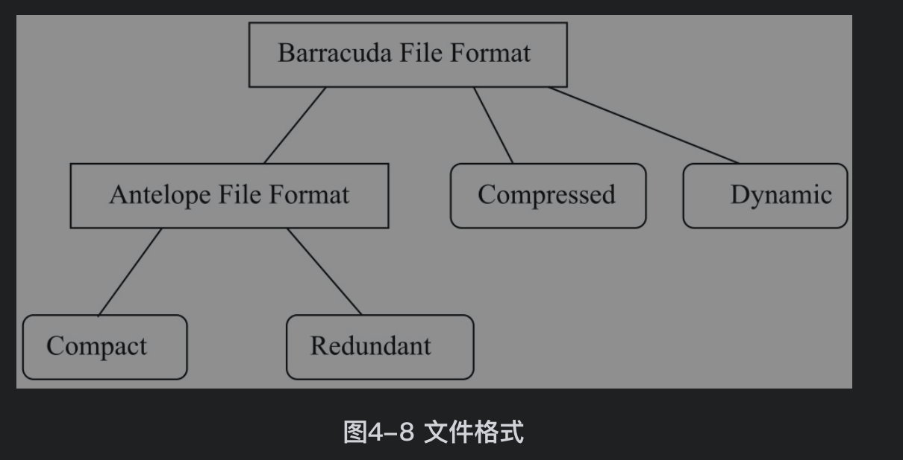
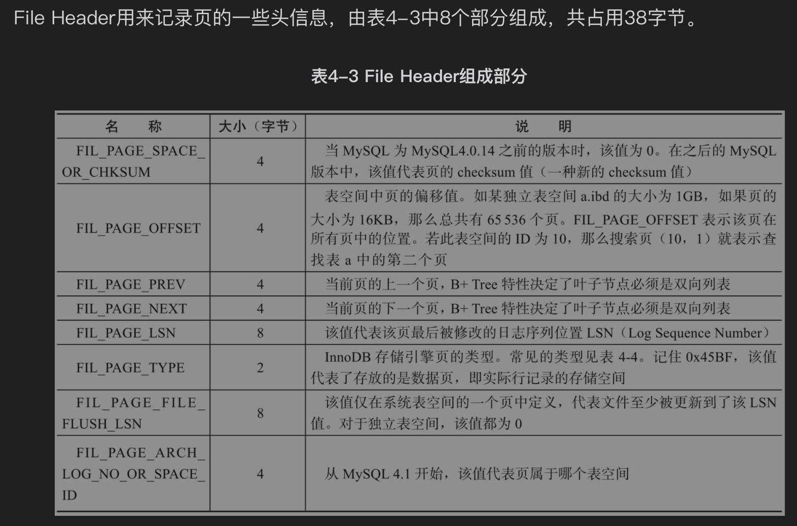
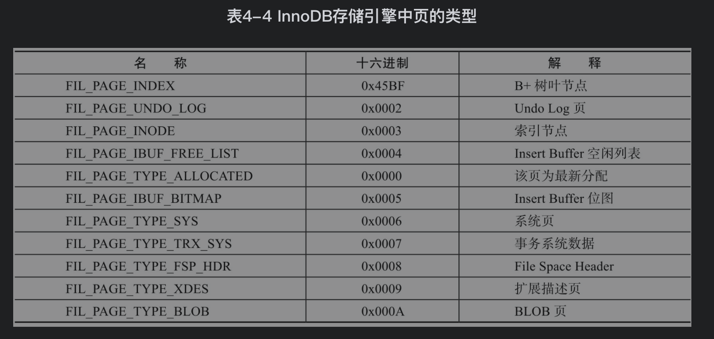
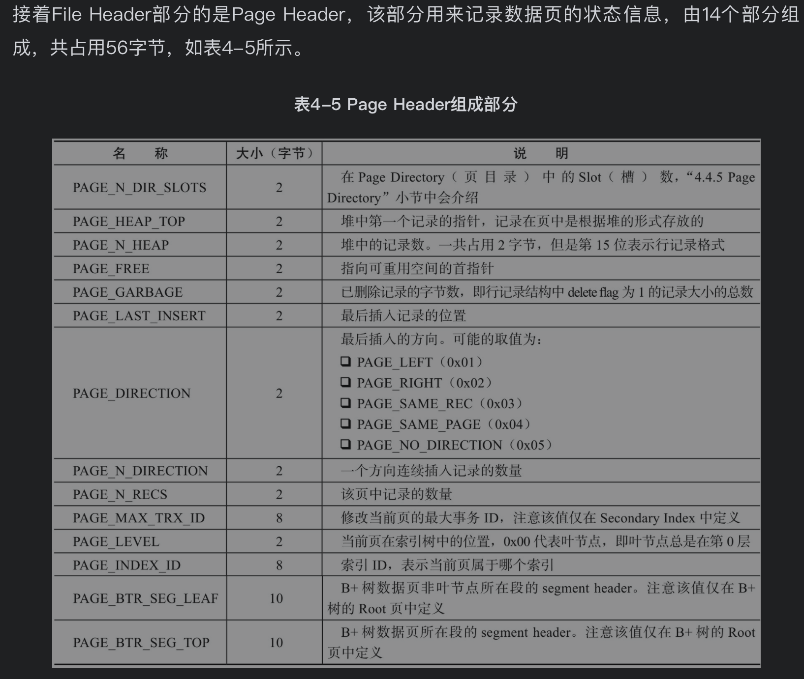
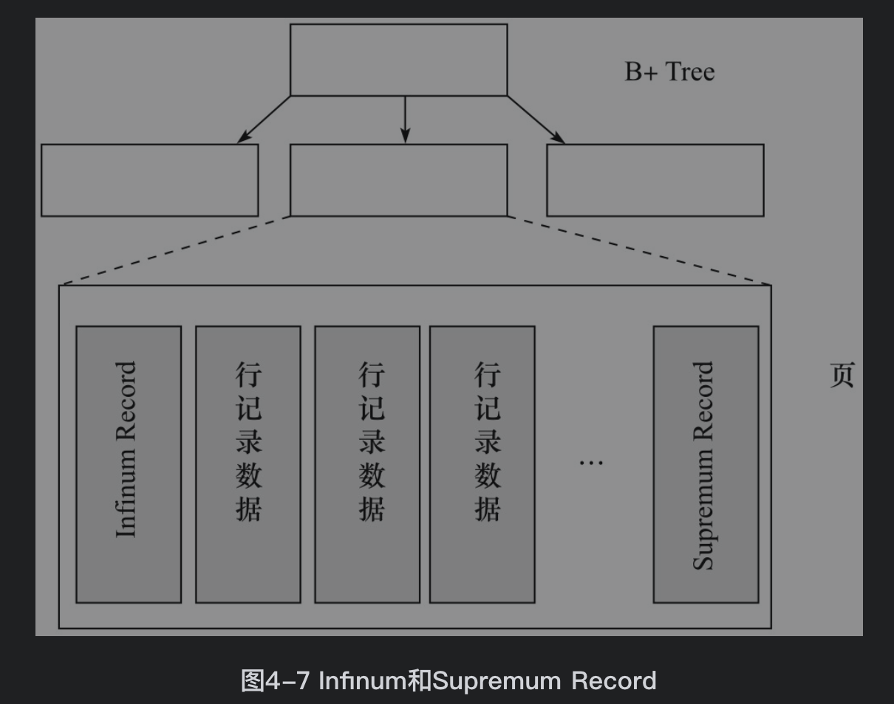
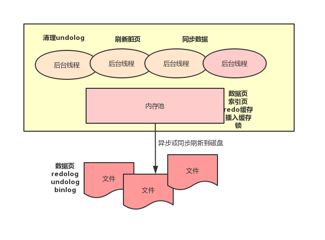

[TOC]

# 1. 索引组织表
InnoDB的表都以主键顺序存储，这样的表叫索引组织表。如果没有显示定义主键，InnoDB会自动创建一个主键：
1. 如果有非空唯一索引，根据定义索引的顺序，选择第一个非空唯一索引作为主键
2. 如果没有则自动创建一个6字节大小的指针

# 2. InnoDB逻辑存储结构
从逻辑上来看，所有数据都放在一个表空间中。表空间又由段（segment）、区（extent）、页（page）组成



## 表空间
默认情况下有一个共享表空间ibdata1，但如果启用了innodb_file_per_table，每个表的数据会单独放到各自的表空间中。

但是放入各自表空间的只是索引、数据、插入缓冲Bitmap页，其他类的数据，如回滚（undo）信息，插入缓冲索引页、系统事务信息，二次写缓冲（Double write buffer）等还是存放在原来的共享表空间内。

## 段
常见的段有数据段、索引段、回滚段。

在InnoDB中数据即索引，数据段是B+树的叶子节点，索引段是B+树的非叶节点

## 区
区由连续的64个页(每页16KB)组成，每个区的大小为1MB。

刚创建表时的默认大小是96KB而不是1MB是因为一开始在段中先用32个页大小的碎片页存放数据，当他们都用完了之后才申请连续的64页

## 页
在InnoDB存储引擎中，常见的页类型有：
1. 数据页（B-tree Node）
2. undo页（undo Log Page）
3. 系统页（System Page）
4. 事务数据页（Transaction system Page）
5. 插入缓冲位图页（Insert Buffer Bitmap）
6. 插入缓冲空闲列表页（Insert Buffer Free List）
7. 未压缩的二进制大对象页（Uncompressed BLOB Page）
8. 压缩的二进制大对象页（compressed BLOB Page）

## 行
每个页最多存放7992行数据

# 3. InnoDB行记录格式
在旧版本中(Antelope)，使用Compact和Redundant两种格式来存放行记录数据

在新版本中(Barracuda)，使用Compressed和Dynamic两种格式来存放行记录数据



```SQL
//row_format属性表示当前所使用的行记录结构类型
mysql> show table status like 'account';

+---------+--------+---------+------------+------+----------------+-------------+-----------------+--------------+-----------+----------------+---------------------+---------------------+------------+-------------+----------+----------------+---------+
| Name    | Engine | Version | Row_format | Rows | Avg_row_length | Data_length | Max_data_length | Index_length | Data_free | Auto_increment | Create_time         | Update_time         | Check_time | Collation   | Checksum | Create_options | Comment |
+---------+--------+---------+------------+------+----------------+-------------+-----------------+--------------+-----------+----------------+---------------------+---------------------+------------+-------------+----------+----------------+---------+
| account | InnoDB |      10 | Dynamic    |    6 |           2730 |       16384 |               0 |            0 |         0 |             15 | 2020-04-24 13:54:12 | 2020-04-24 14:14:25 | NULL       | utf8mb4_bin |     NULL |                |         |
+---------+--------+---------+------------+------+----------------+-------------+-----------------+--------------+-----------+----------------+---------------------+---------------------+------------+-------------+----------+----------------+---------+
1 row in set (0.01 sec)
```
## Compact行记录格式


## Redundant行记录格式

## 行溢出数据
BLOB这类大对象的数据可能会被存储在真正的数据页之外,不过也不是一定的,即使是VARCHAR数据也有可能被放在行溢出数据中(页类型为Uncompress BLOB Page)

B+树每个页中至少有两行数据，如果只能放下一行数据，那么存储引擎会自动将行放入行溢出数据页中。只要一页能至少放两行记录，不管是不是BLOB，都会放在数据页中


## Compressed和Dynamic行记录格式
新的两种记录格式对于存放在BLOB中的数据采用了完全的行溢出的方式

## CHAR的行结构存储
CHAR（N）中的N指的是字符的长度
```SQL
//CHAR_LENGTH求字符长度，LENGTH求字节长度
mysql> SELECT a,CHAR_LENGTH(a),LENGTH(a)
    -> FROM j\G;
    *************************** 1. row ***************************
    a: ab
    CHAR_LENGTH(a): 2
    LENGTH(a): 2
    *************************** 2. row ***************************
    a: 我们
    CHAR_LENGTH(a): 2
    LENGTH(a): 4
    *************************** 3. row ***************************
    a: a
    CHAR_LENGTH(a): 1
    LENGTH(a): 1
    3 rows in set (0.00 sec)
```

# 4. InnoDB数据页结构


## File Header（文件头）





## Page Header（页头）



## Infimun和Supremum Records
每个数据页都有两条虚拟行记录来限定记录边界。
Infimum记录是比该页中任何主键值都要小的值，Supremum指比任何可能大的值还要大的值



## User Records（行记录）和 Free Space（空闲空间）
User Records实际存储行记录的内容，InnoDB存储引擎表总是B+树索引组织的

Free Space代表空闲空间，也是双向链表组织的，在一条记录被删除后，该空间会被加入到空闲链表中

## Page Directory（页目录）
存放行记录的相对位置，记录指针成为槽，可能多行数据放在一个槽中。假设有（'i'，'d'，'c'，'b'，'e'，'g'，'l'，'h'，'f'，'j'，'k'，'a'），同时假设一个槽中包含4条记录，则Slots中的记录可能是（'a'，'e'，'i'

数据库通过索引找到页后，将页加载进内存。然后根据Page Directory在页中执行二分查找找到槽，再通过recorder header中的next_record来继续查找相关记录


## File Trailer（文件结尾信息）
用来检测页是否已经完整地写入磁盘


# 5. Named File Format机制
InnoDB存储引通过Named File Formats机制来解决不同版本下页结构兼容性的问题

```SQL
mysql> select @@version;
+------------+
| @@version  |
+------------+
| 5.7.23-log |
+------------+
1 row in set (0.01 sec)

mysql> show variables like 'innodb_file_format';
+--------------------+-----------+
| Variable_name      | Value     |
+--------------------+-----------+
| innodb_file_format | Barracuda |
+--------------------+-----------+
1 row in set (0.00 sec)
```

# 6. 约束
对于InnoDB存储引擎本身而言，提供了以下几种约束：
1. Primary Key
2. Unique Key：CREATE UNIQUE INDEX、alter table add unique key keyname(column)
3. Foreign Key：foreign key (id) references othertable(id)
4. Default
5. NOT NULL

## 约束的创建和查找
1. 创建表时定义约束
2. 利用alter table定义约束


# 7. 视图
[视图](./视图.md)

# 8. 分区表
[分区表](./MySQL分区表.md)


# 9. InnoDB存储模型
当查询的时候会先通过索引定位到对应的数据页，然后检测数据页是否在缓冲池内，如果在就直接返回，如果不在就去聚簇索引中通过磁盘 IO 读取对应的数据页并放入缓冲池。

一个数据页会包含多个数据行。缓存池通过 LRU 算法对数据页进行管理，也就是最频繁使用的数据页排在列表前面，不经常使用的排在队尾，当缓冲池满了的时候会淘汰掉队尾的数据页。

从磁盘新读取到的数据页并不会放在队列头部而是放在中间位置，这个中间位置可以通过参数进行修改。缓冲池也可以设置多个实例，数据页根据哈希算法决定放在哪个缓冲池


