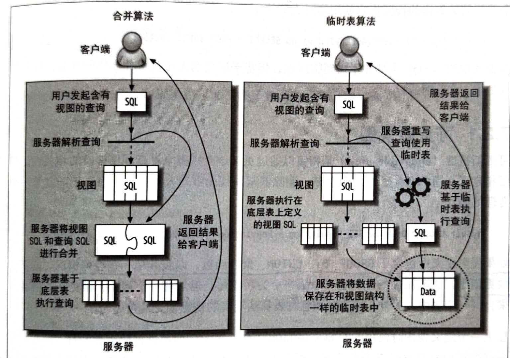

## 参考博文
[深入解析MySQL视图VIEW](https://www.cnblogs.com/geaozhang/p/6792369.html)

[TOC]


# 1. 视图的操作
#### 创建视图
如果创建视图指定了列名，那么在访问时就要使用指定的列名，否则列名和定义视图时select语句中基表的列名一样
```SQL
CREATE [OR REPLACE]   
　　[ALGORITHM = {UNDEFINED | MERGE | TEMPTABLE}]  
　　[DEFINER = { user | CURRENT_USER }]  
　　[SQL SECURITY { DEFINER | INVOKER }]
VIEW view_name [(column_list)]  
AS select_statement  
　　[WITH [CASCADED | LOCAL] CHECK OPTION]

mysql> create view v_F_players(编号,名字,性别,电话)
    -> as
    -> select PLAYERNO,NAME,SEX,PHONENO from PLAYERS
    -> where SEX='F'
    -> with check option;
Query OK, 0 rows affected (0.00 sec)

mysql> desc v_F_players;
+--------+----------+------+-----+---------+-------+
| Field  | Type     | Null | Key | Default | Extra |
+--------+----------+------+-----+---------+-------+
| 编号    | int(11)  | NO   |     | NULL    |       |
| 名字    | char(15) | NO   |     | NULL    |       |
| 性别    | char(1)  | NO   |     | NULL    |       |
| 电话    | char(13) | YES  |     | NULL    |       |
+--------+----------+------+-----+---------+-------+
4 rows in set (0.00 sec)

mysql> select * from  v_F_players;
+--------+-----------+--------+------------+
| 编号    | 名字      | 性别    | 电话        |
+--------+-----------+--------+------------+
|      8 | Newcastle | F      | 070-458458 |
|     27 | Collins   | F      | 079-234857 |
|     28 | Collins   | F      | 010-659599 |
|    104 | Moorman   | F      | 079-987571 |
|    112 | Bailey    | F      | 010-548745 |
+--------+-----------+--------+------------+
5 rows in set (0.02 sec)
```
#### 查看视图
```SQL
//查看视图创建信息
mysql> show create view v_F_players;
*************************** 1. row ***************************
View: v_F_players
Create View: CREATE ALGORITHM=UNDEFINED DEFINER=`root`@`localhost` SQL SECURITY DEFINER VIEW `v_F_players` AS select `PLAYERS`.`PLAYERNO` AS `编号`,`PLAYERS`.`NAME` AS `名字`,`PLAYERS`.`SEX` AS `性别`,`PLAYERS`.`PHONENO` AS `电话` from `PLAYERS` where (`PLAYERS`.`SEX` = 'F') WITH CASCADED CHECK OPTION
character_set_client: utf8
collation_connection: utf8_general_ci
1 row in set (0.00 sec)

//有关视图的信息记录在information_schema数据库中的views表中
mysql> select * from information_schema.views 
    -> where TABLE_NAME='v_F_players'\G;
*************************** 1. row ***************************
TABLE_CATALOG: def
TABLE_SCHEMA: TENNIS
TABLE_NAME: v_F_players
VIEW_DEFINITION: select `TENNIS`.`PLAYERS`.`PLAYERNO` AS `编号`,`TENNIS`.`PLAYERS`.`NAME` AS `名字`,`TENNIS`.`PLAYERS`.`SEX` AS `性别`,`TENNIS`.`PLAYERS`.`PHONENO` AS `电话` from `TENNIS`.`PLAYERS` where (`TENNIS`.`PLAYERS`.`SEX` = 'F')
CHECK_OPTION: CASCADED
IS_UPDATABLE: YES
DEFINER: root@localhost
SECURITY_TYPE: DEFINER
CHARACTER_SET_CLIENT: utf8
COLLATION_CONNECTION: utf8_general_ci
1 row in set (0.00 sec) 
```

#### 更改视图
当基表中的字段发生改变，视图中也要做改变维持和基表的关系
```SQL
//在视图存在的情况下修改，不存在的情况下创建
create or replace view view_name as select ...;

ALTER
    [ALGORITHM = {UNDEFINED | MERGE | TEMPTABLE}]
    [DEFINER = { user | CURRENT_USER }]
    [SQL SECURITY { DEFINER | INVOKER }]
VIEW view_name [(column_list)]
AS select_statement
    [WITH [CASCADED | LOCAL] CHECK OPTION]
```

#### DML操作更新视图
对视图的DML操作最终都是对基表的DML操作
```SQL
mysql> create view v_student as select * from student;

mysql> select * from v_student;
+--------+--------+------+
| 学号    | name   | sex  |
+--------+--------+------+
|      1 | 张三    | M    |
|      2 | 李四    | F    |
|      5 | 王五    | NULL |
+--------+--------+------+

mysql> update v_student set name='钱六' where 学号='1';

mysql> select * from student;
+--------+--------+------+
| 学号    | name   | sex  |
+--------+--------+------+
|      1 | 钱六    | M    |
|      2 | 李四    | F    |
|      5 | 王五    | NULL |
+--------+--------+------+
```
当定义视图的select子句中包含如下情况时，不能对视图做DML操作：
>>1. select子句中包含distinct、group by、having、order
>>2. select子句中包含聚集函数sum()、min()、max()、count()
>>3. select语句中包含union、union all等集合运算符
>>4. from子句中包含多个表
>>5. 视图的ALGORITHM = TEMPTABLE （使用临时表总是使视图不可更新）
>>6. where子句中包含相关子查询

#### 删除视图
```SQL
//使用IF EXISTS选项使得删除不存在的视图时不抛出异常
DROP VIEW [IF EXISTS]   
view_name [, view_name] ...
```

#### 使用WITH CHECK OPTION约束 
对视图做DML操作时，不能违反视图定义时where条件的约束
```SQL
mysql> create view v_veterans
    -> as
    -> select * from PLAYERS
    -> where birth_date < '1960-01-01'
    -> with check option;
Query OK, 0 rows affected (0.01 sec)

mysql> update v_veterans
    -> set BIRTH_DATE='1970-09-01'
    -> where PLAYERNO=39;
ERROR 1369 (HY000): CHECK OPTION failed 'TENNIS.v_veterans'
```
如果是定义嵌套视图(在视图上定义视图)，with check option有两个可选项
>>1. with cascade check option:检查所有视图，即包括嵌套视图和底层视图
>>2. with local check option:只检查要更新的视图本身，即不包括底层视图

#### 定义视图使用的算法
>>CREATE [OR REPLACE]   
　　==[ALGORITHM = {UNDEFINED | MERGE | TEMPTABLE}]==
　　[DEFINER = { user | CURRENT_USER }]  
　　[SQL SECURITY { DEFINER | INVOKER }]
VIEW view_name [(column_list)]  
AS select_statement  
　　[WITH [CASCADED | LOCAL] CHECK OPTION]

1. UNDEFINED：MySQL将自动选择所要使用的算法,默认选项。MySQL会尽可能使用合并算法


2. MERGE(合并算法)：将视图的定义直接包含进查询的SQL中。
```SQL
create view oceania as
select * from country where continent='oceania'
with check option

select code, name from oceania where name='Australia';

//那么在执行上面的查询时，MySQL会将视图定义的select包含进查询的select中：
select * from country where continent='oceania' and name='Australia';
```

3. TEMPTABLE(临时表算法)：将视图定义中的select语句的结果放进临时表中，当对视图执行查询时直接访问临时表.

只要视图中的列无法和原表建立一一对应的映射关系，比如包含groupby 、distinct、聚合函数、union、子查询等，MySQL都将使用临时表算法
```SQL
//
create view oceania as
select * from country where continent='oceania'
with check option

select code, name from oceania where name='Australia';

//那么在执行上面的查询时，MySQL会基于视图创建一个临时表，然后再在临时表上执行查询
create temporary table temp_oceania as
select * from country where continent='oceania'
select code, name from temp_oceania where name='Australia';

//如果使用临时表实现视图，那么explain中会显示派生表derived
explain select * from view_name
id:select_type
1 primary
2 derived
```
