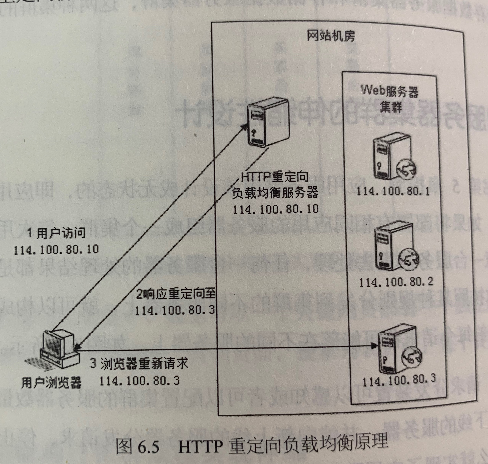
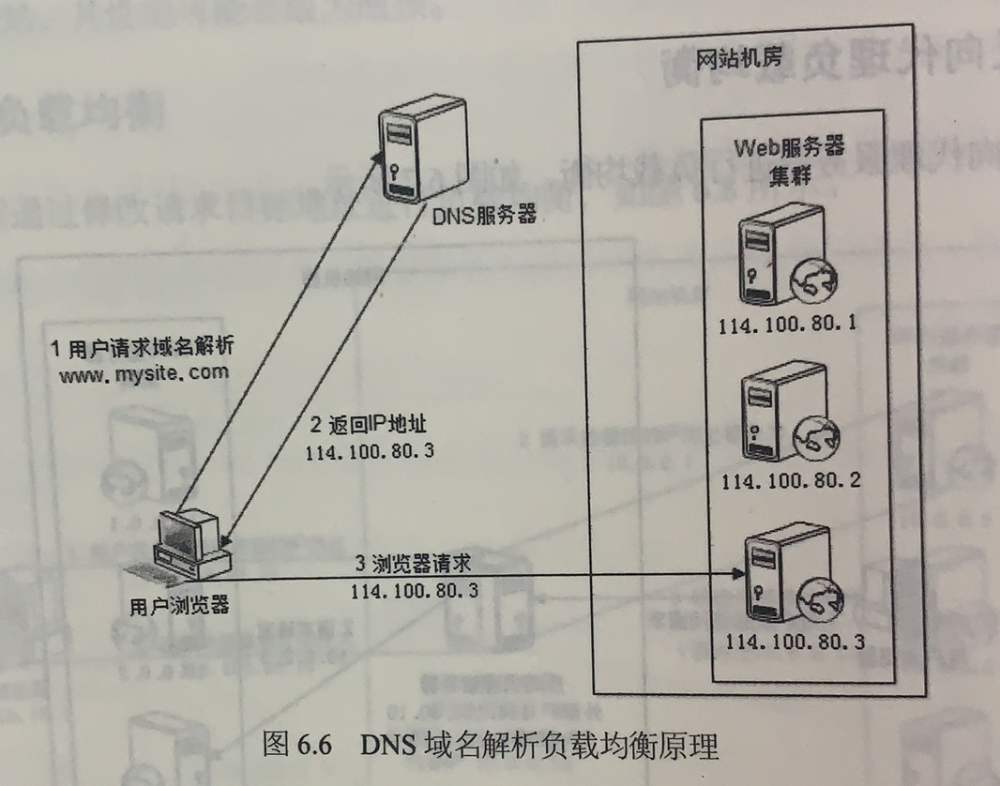
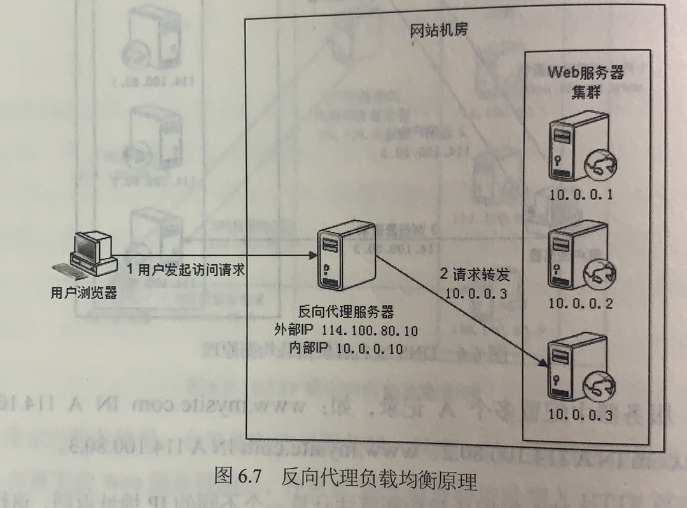
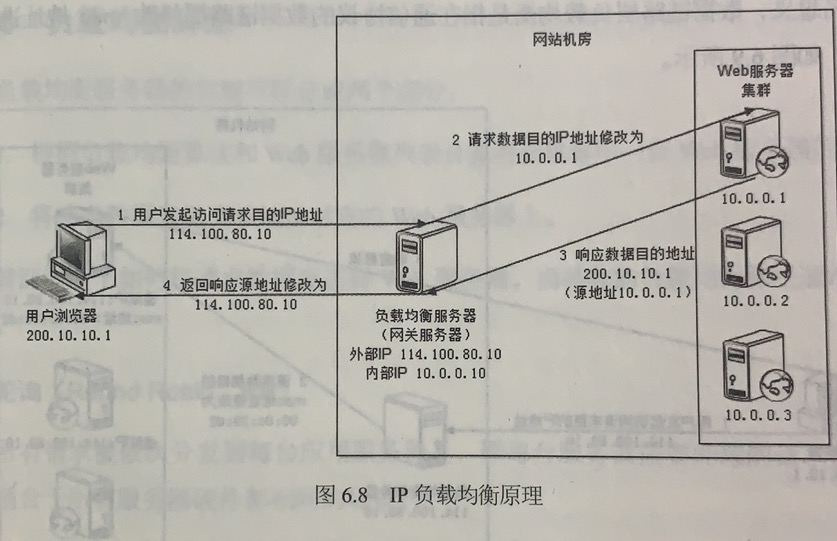
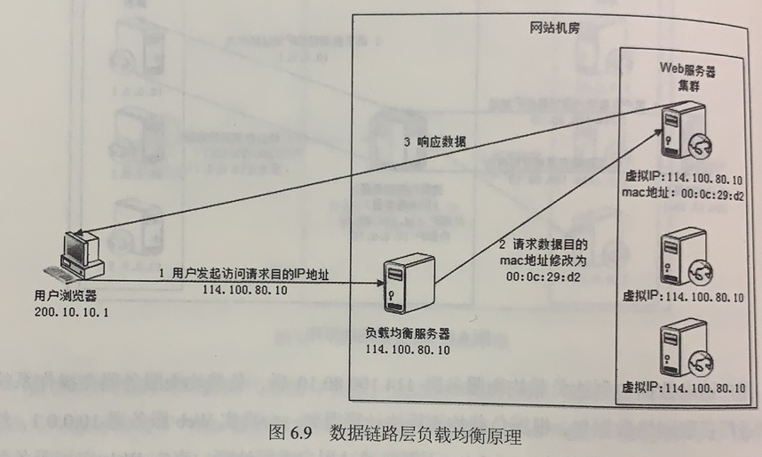

## 参考博文
[大型网站技术架构：核心原理与案例分析](大型网站技术架构：核心原理与案例分析)
[高并发负载均衡（一）——企业架构分析和DNS](https://blog.csdn.net/daybreak1209/article/details/50962663)

[TOC]

# 1. 负载均衡分类
## 1.1 HTTP重定向负载均衡
在DNS上注册域名和对应的IP时，不注册服务器的IP，而注册负载均衡服务器的IP，当用户请求某个域名时，DNS将返回负载均衡服务器的IP地址

当用户访问域名www.mysite.com时，DNS服务器域名解析得到的IP是HTTP重定向负载均衡服务器的IP114.100.80.10，然后浏览器再请求这个IP。
HTTP重定向负载均衡服务器是普通的应用服务器，他将根据负载均衡算法从web服务器集群中得到一个IP(例如114.100.80.3)并放入HTTP重定向响应302中返回给浏览器，然后浏览器再次向真实的物理IP114.100.80.3请求服务。

这种访问方式的缺点是浏览器需要经过两次请求(向HTTP重定向负载均衡服务器的请求和向真实web服务器的请求)，并且HTTP302响应码重定向有可能被搜索引擎判断为SEO作弊，所以这种方式不常用

## 1.2 DNS域名解析负载均衡
直接将DNS作为负载均衡服务器，在DNS配置域名和多个服务器的映射关系，在DNS解析的时候使用负载均衡算法选出合适的服务器

在DNS服务器中配置域名www.mysite.com的多个IP，www.mysite.com114.100.80.1、www.mysite.com114.100.80.2、www.mysite.com114.100.80.3。
当浏览器请求域名解析www.mysite.com时，DNS服务器会根据负载均衡算法得到一个IP地址114.100.80.3返回给浏览器，然后浏览器再访问该IP请求服务

直接将负载均衡的工作交给DNS的好处是省去了管理维护负载均衡服务器的麻烦，DNS还支持基于地理位置的域名解析，将域名解析成离用户最近的服务器地址。
域名解析负载均衡的缺点是，由于DNS的多层解析，每一层都可能对域名到IP的关系进行缓存，当某台服务器下线时，DNS需要较长的时间生效。

这种方法在实际中运用比较多，实际的场景是在DNS配置的IP也是内部负载均衡服务器的IP，然后由内部负载均衡服务器再做一次负载均衡。

## 1.3 反向代理负载均衡
在DNS中配置的IP是反向代理服务器的IP。

用户对服务的请求必须是经过反向代理，如果反向代理缓存结果将直接返回，否则由反向代理请求内部服务，然后再返回给用户。

所以反向代理要配置外部IP和内部IP，当和用户交互时使用外部IP，当在内部和web服务器集群打交道时使用内部IP。所有的web服务器集群就不需要外部IP了，只用内部IP

浏览器请求解析www.mysite.com时，DNS服务器会根据负载均衡算法得到一个反向代理的外部地址114.100.80.10返回给浏览器，浏览器请求反向代理服务器，反向代理服务器将根据负载均衡算法得到一台服务器10.0.0.3并将请求转发给服务器，服务器收到请求后处理并将结果返回给反向代理服务器，反向代理服务器再将结果返回给用户。

反向代理负载均衡转发请求是在HTTP协议层面上，即应用层

## 1.4 IP负载均衡
在DNS中配置的IP是负载均衡服务器的IP

浏览器请求解析www.mysite.com时，DNS服务器会根据负载均衡算法得到一个负载均衡服务器的外部地址114.100.80.10返回给浏览器，浏览器请求负载均衡服务器，负载均衡服务器将在网络内核进程抓取网络数据包，并将根据负载均衡算法得到一台服务器10.0.0.3，然后把数据目的IP地址改为10.0.0.3(不需要通过用户进程处理，处理性能更好)，真实服务器收到请求后处理并向负载均衡服务器返回响应，负载均衡服务器将数据报源地址修改成自身的外部IP114.100.80.10后返回给用户

真实服务器如何向负载均衡服务器返回响应有两种方式：
1）负载均衡服务器在修改目的IP地址的同时将源IP地址修改成自身内部IP10.0.0.10
2）另一种是直接将负载均衡服务器同时作为网关服务器

IP负载均衡在网络层上修改

## 1.5 数据链路层负载均衡(直接路由方式DR)
在DNS中配置的IP是负载均衡服务器的IP

负载均衡服务器的IP和web服务器的集群的虚拟IP一样，不修改IP数据包的源地址和目的地址，只修改mac地址，服务器处理完后直接将请求返回给用户。

因为只有负载均衡服务器连着网关，所以请求只能到他。

用户浏览器经过DNS解析后请求负载均衡服务器114.100.80.10，负载均衡服务器将根据负载均衡算法将请求数据的目的mac地址改为00:0c:29:d2，服务器收到请求后处理并直接将响应返回给用户。

数据链路层负载均衡在数据链路层上修改，是大型网站常用的，例如好用的LVS就是数据链路层负载均衡开源产品，

# 2. 负载均衡算法
## 2.1 轮询RR
所有请求被轮流发到各个服务器上，适用于所有服务器硬件都相同的场景

## 2.2 加权轮询WRR
根据服务器硬件配置权重，按照权重分配请求

## 2.3 随机
随机分配请求

## 2.4 最少连接
记录每个服务器正在处理的连接数，将请求分配到最少连接数的服务器上

## 2.5 源地址散列
根据请求来源的IP地址进行hash计算得到服务器，可以实现同一个用户的请求总是被分配到相同服务器上，并将处理的上下文信息存储在这个服务器上。
[一致性hash算法](./缓存.md)

# 3. 集群下的session管理
[集群下的session管理](./集群下的session管理.md)