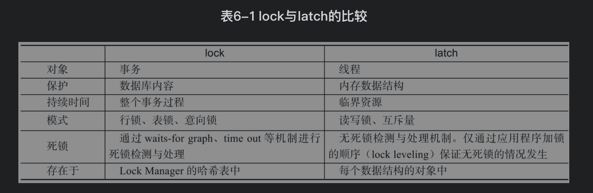
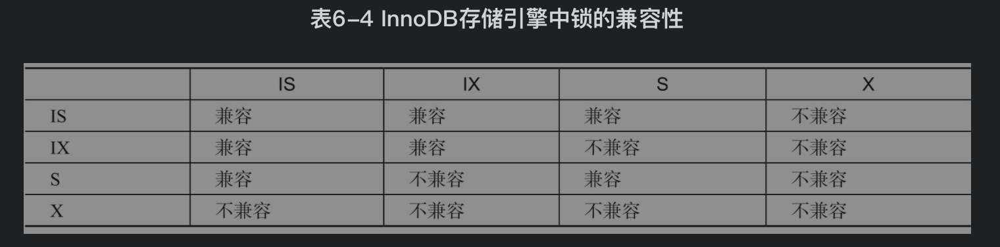
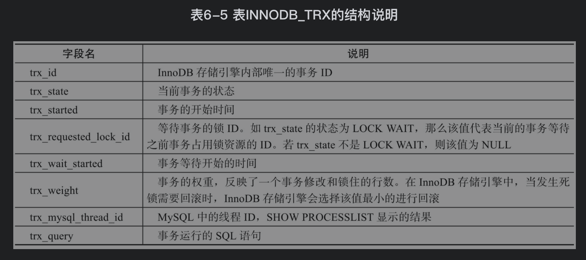
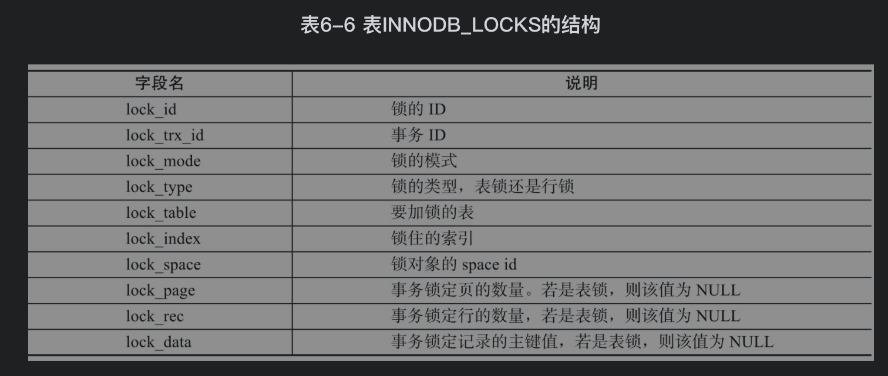
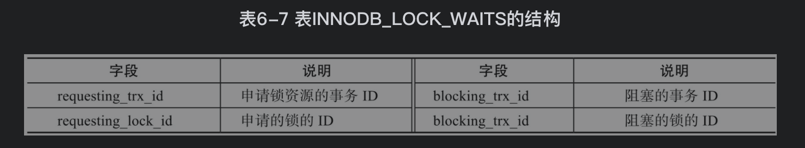
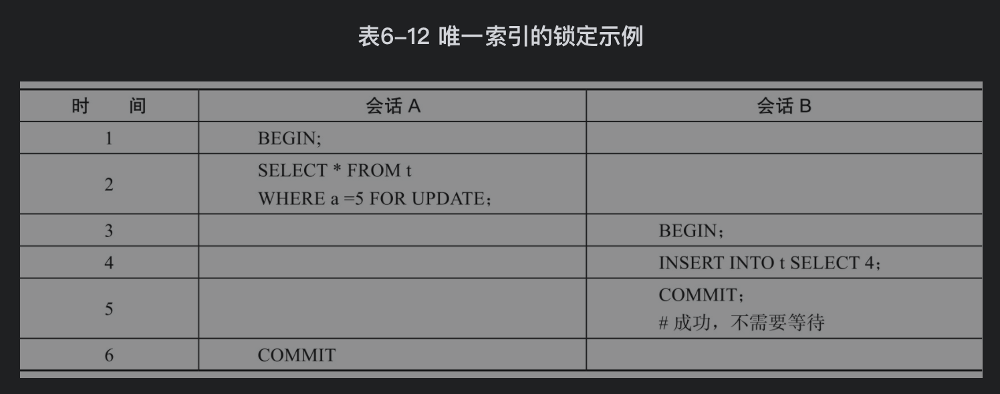
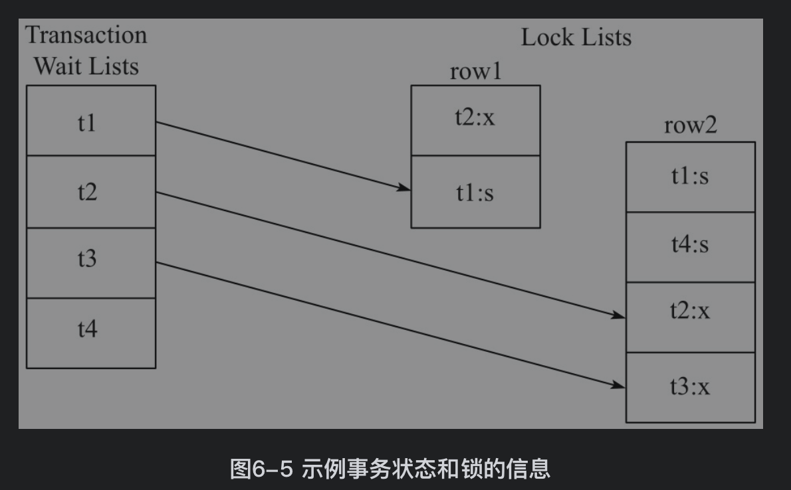
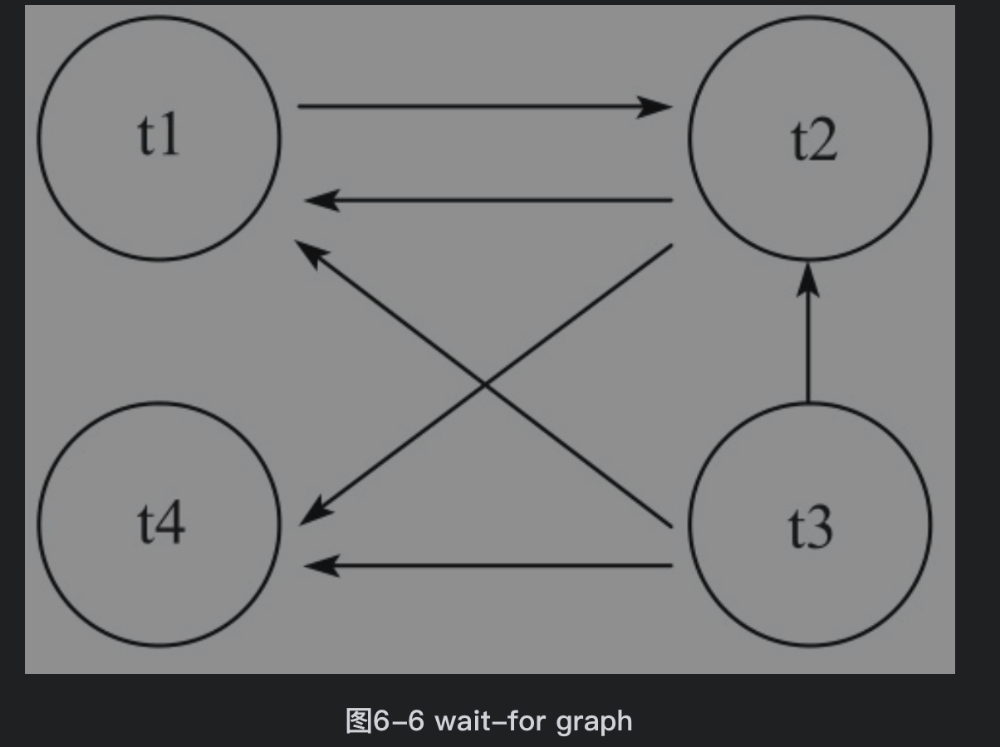

## 参考博文
[mysql的锁机制(读锁，写锁，表锁，行锁，悲观锁，乐观锁，间隙锁)](https://blog.csdn.net/qq_44766883/article/details/105879308)
[select for update引发死锁分析](https://www.cnblogs.com/micrari/p/8029710.html)


[TOC]

# 1. lock和latch
本章关注lock


# 2. InnoDB中的锁
## 锁类型
InnoDB实现了两种行锁：
1. 共享锁（S Lock），允许事务读一行数据。其他事务能加S锁、读、不能改
2. 排他锁（X Lock），允许事务删除或更新一行数据。其他事务不能加任何锁、可以读

update,delete,insert都会自动给涉及到的数据加上排他锁.
select语句默认不会加任何锁类型，如果加排他锁可以使用select …for update语句，加共享锁可以使用select … lock in share mode语句。

所以加过排他锁的数据行在其他事务中是不能修改数据的，也不能通过for update和lock in share mode锁的方式查询数据，但可以直接通过select …from…查询数据，因为普通查询没有任何锁机制

为了在多粒度上加锁， InnoDB使用意向锁（Intention Lock）将锁定的对象分成多个层次。如果要对最细粒度加锁，需要先对粗粒度对象上锁


如果要对某页的记录r上X锁，那么需要先对数据库A、表、页上意向锁IX，才能给记录r上X锁。如果在这之前已经有别的事务对表加了X锁，那么记录r上就不能加X锁，因为不能在表上加IX锁，要等别的事务将锁释放

InnoDB中的意向所就是表级别的锁：
1. 意向共享锁（IS Lock），事务想要获得一张表中某几行的共享锁，在给一个数据行加共享锁前必须先取得该表的IS锁
2. 意向排他锁（IX Lock），事务想要获得一张表中某几行的排他锁，在给一个数据行加排他锁前必须先取得该表的IX锁



在INFORMATION_SCHEMA架构下添加了表INNODB_TRX、INNODB_LOCKS、INNODB_LOCK_WAITS。通过这三张表，用户可以更简单地监控当前事务并分析可能存在的锁问题

```SQL
//通过列state可以观察到trx_id为730FEE的事务当前正在运行，而trx_id为7311F4的事务目前处于“LOCK WAIT”状态
mysql> SELECT * FROM information_schema.INNODB_TRX\G;
*************************** 1. row ***************************
trx_id: 7311F4
trx_state: LOCK WAIT
trx_started: 2010-01-04 10:49:33
trx_requested_lock_id: 7311F4:96:3:2
trx_wait_started: 2010-01-04 10:49:33
trx_weight: 2
trx_mysql_thread_id: 471719
trx_query: select * from parent lock in share mode
*************************** 2. row ***************************
trx_id: 730FEE
trx_state: RUNNING
trx_started: 2010-01-04 10:18:37
trx_requested_lock_id: NULL
trx_wait_started: NULL
trx_weight: 2
trx_mysql_thread_id: 471718
trx_query: NULL
2 rows in set (0.00 sec)
```



```SQL
//trx_id为730FEE的事务向表parent加了一个X的行锁，ID为7311F4的事务向表parent申请了一个S的行锁
//两者申请相同的资源，所以7311F4等待了
mysql> SELECT * FROM information_schema.INNODB_LOCKS\G;
*************************** 1. row ***************************
lock_id: 7311F4:96:3:2
lock_trx_id: 7311F4
lock_mode: S
lock_type: RECORD
lock_table: 'mytest'.'parent'
lock_index: 'PRIMARY'
lock_space: 96
lock_page: 3
lock_rec: 2
lock_data: 1
*************************** 2. row ***************************
lock_id: 730FEE:96:3:2
lock_trx_id: 730FEE
lock_mode: X
lock_type: RECORD
lock_table: 'mytest'.'parent'
lock_index: 'PRIMARY'
lock_space: 96
lock_page: 3
lock_rec: 2
lock_data: 1
2 rows in set (0.00 sec)
```


```SQL
mysql> SELECT* FROM information_schema.INNODB_LOCK_WAITS\G;
*************************** 1. row ***************************
requesting_trx_id: 7311F4
requested_lock_id: 7311F4:96:3:2
blocking_trx_id: 730FEE
blocking_lock_id: 730FEE:96:3:2
1 row in set (0.00 sec)
```



## 一致性非锁定读
一致性非锁定读是select通过[MVCC](./MVCC.md)去读快照读，而不等待X锁的释放

## 一致性锁定读
当前读


## 自增长与锁
InnoDB对有自增长列的表会有一个自增长计数器，当往表中添加数据时，会执行以下语句:
锁在完成对自增长值插入的SQL语句后立即释放，而不是等事务完成才释放
```SQL
select max(auto_inc_col) from t for update;
```

## 外键与锁
InnoDB中，如果没有显示对外键加索引，存储引擎会自动给这个外键加索引

对于外键值的插入或更新，首先去查询父表的记录，读取父表的方式是SELECT…LOCK IN SHARE MODE，会给父表加上S锁，如果父表上有X锁，那么子表会等待

# 3. 锁的算法
## 3.1行锁的3种算法
### Record Lock：锁叶节点中的某行
总是会去锁住内存中B+树叶子节点(某个页)的某一行记录，如果没有设置索引，将使用隐式主键锁定

### Gap Lock：间隙锁，只锁定索引节点的某个范围

### Next-Key Lock∶Gap Lock+Record Lock，叶节点和索引节点都会锁
目的是为了解决Phantom Problem，InnoDB对于行的查询都是采用这种锁定算法

例如一个索引有10，11，13和20这四个值，那么该索引可能被Next-Key Locking的区间为：
```SQL
(-∞,10]
(10,11]
(11, 13]
(13，20]
(20,+ ∞)
```

当查询的索引有唯一属性时，存储引擎会将Next-Key Lock降级为Record Lock，只去锁住一条对应的索引记录
在会话A中只对a=5这条记录加X锁，而不是锁定(2,5]这个范围。因为a是主键即是唯一索引，会将Next-Key Lock降级为Record Lock,所以会话B insert 4 的语句不会被阻塞
```SQL
mysql> create table t(a int primary key);
Query OK, 0 rows affected (0.02 sec)

mysql> insert into t select 1;
Query OK, 1 row affected (0.01 sec)
Records: 1  Duplicates: 0  Warnings: 0

mysql> insert into t select 2;
Query OK, 1 row affected (0.01 sec)
Records: 1  Duplicates: 0  Warnings: 0

mysql> insert into t select 5;
Query OK, 1 row affected (0.01 sec)
Records: 1  Duplicates: 0  Warnings: 0
```



降级只发生在查询的列发生在唯一索引的情况下
查询b=3的记录，采用Next-Key Lock加锁。因为有两个索引，所以要分别加锁。对于聚集索引a,仅对列a等于5的索引加上X的Record Lock;对于辅助索引b,加上的是Next-Key Lock，锁定的范围是（1，3]。除此之外， 存储引擎还对辅助索引的下一个键值加gap lock,即还有一个辅助索引范围为（3，6）的锁。Gap Lock的作用是为了阻止多个事务将记录插入到同一范围内，而这会导致Phantom Problem问题的产生
```SQL
CREATE TABLE z (
    a INT,
    b INT, 
    PRIMARY KEY(a), 
    KEY(b) 
);

INSERT INTO z SELECT 1,1;
INSERT INTO z SELECT 3,1;
INSERT INTO z SELECT 5,3;
INSERT INTO z SELECT 7,6;
INSERT INTO z SELECT 10,8;

select * from z where b=3 for update;
```
那么在另一个会话中执行以下语句都会被阻塞：
```SQL
//会话A中已经对索引为a=5的记录加X锁
SELECT * FROM z WHERE a = 5 LOCK IN SHARE MODE;
//插入a=4没问题，但是b=2在范围(1,3]中，被阻塞
INSERT INTO z SELECT 4,2;
//插入a=6没问题，但是b=5在gap lock的范围(3,6)中，被阻塞
INSERT INTO z SELECT 6,5;
```


## 3.2 解决Phantom Problem(幻行)
Phantom Problem是指在同一事务下，连续执行两次同样的SQL语句可能导致不同的结果
事务T1执行以下语句但是没有提交返回结果5，当另一个事务插入一条数据4后，T1再次执行会得到结果4和5，就产生了幻行问题，违背了事务的隔离性(一个事务能看到其他事务的执行结果)
所以采用Next-Key Lock，会对（2，+∞）这个范围加X锁，对于这个范围的插入都是不被允许的
```SQL
select * from t where a>2 for update;
```
# 4. 锁问题
## 脏读
某个事务对缓冲池中的某条记录做了修改但是还没提交，另一个事务能读到这个未提交的修改，违背了事务的隔离性

脏读发生的条件是需要事务的隔离级别为READ UNCOMMITTED

## 不可重复读
一个事务多次读取某一数据，但由于这期间其他事务做了提交更改，导致这个事务多次读取的记录不一致

不可重复读发生的隔离级别是READ COMMITTED

InnoDB存储引擎的默认事务隔离级别是READ REPEATABLE，采用Next-Key Lock算法，避免了不可重复读的现象

## 丢失更新
一个事务的更新操作会被另一个事务的更新操作所覆盖，从而导致数据的不一致

在当前数据库的任何隔离级别下，都不会导致数据库理论意义上的丢失更新问题

# 5. 阻塞


# 6. 死锁
死锁只存在于并发的情况

在REPEATEABLE-READ隔离级别下，如果两个线程同时对相同条件记录用SELECT…FOR UPDATE加排他锁，在没有符合该记录情况下，两个线程都会加锁成功。程序发现记录尚不存在，就试图插入一条新记录，如果两个线程都这么做，就会出现死锁
这种情况下，将隔离级别改成READ COMMITTED，就可以避免问题。
当隔离级别为READ COMMITED时，如果两个线程都先执行SELECT…FOR UPDATE，判断是否存在符合条件的记录，如果没有，就插入记录。此时，只有一个线程能插入成功，另一个线程会出现锁等待，当第１个线程提交后，第２个线程会因主键重出错，但虽然这个线程出错了，却会获得一个排他锁！这时如果有第３个线程又来申请排他锁，也会出现死锁。对于这种情况，可以直接做插入操作，然后再捕获主键重异常，或者在遇到主键重错误时，总是执行ROLLBACK释放获得的排他锁

数据使用wait-for graph（等待图）进行死锁检测。需要数据库保存两个信息。事务代表图中节点，边代表某事务等待前面事务占用的资源
1. 锁的信息链表
2. 事务等待链表

共有t1,t2,t3,t4四个事务，t2对row1占有x锁，t1、t4对row2占有s锁,t1等待t2占有的row1资源，t2等待t1、t4占有的row2资源,t3等待t1、t2、t4占有的资源。所以t1,t2之间存在死锁，InnoDB存储引擎会选择回滚undo量最小的事务



## 必要条件
1. 互斥使用
2. 不可抢占
3. 占有并申请
4. 循环等待


## 处理死锁的方法
### 预防死锁
预防死锁的方法是通过破坏产生死锁的四个必要条件中的一个或几个，避免发生死锁

### 避免死锁
每一个进程在进入系统时，必须申明在运行过程中，可能需要每种资源类型的最大单元数目，其数目不应该超过系统所拥有的资源总量，当进程请求一组资源时，系统首先必须确认是否有足够的资源分配给该进程，若有，会再进一步计算将这些资源分配给进程后，是否会使系统处于不安全的状态，如果不会，才将资源分配给它，否则让进程等待

### 检测死锁
当一个线程请求锁失败时，这个线程可以遍历锁的关系图看看是否有死锁发生。检测到死锁时，一个可行的方法是释放所有锁，回退，并且等待一段随机的时间后重试

### 解除死锁
  1)抢占资源，从一个或多个进程中抢占足够数量的资源，分配给死锁进程，以解除死锁状态

  2)终止进程，终止系统中的一个或多个死锁进程，直至打破循环环路，使系统从死锁状态解脱出来


# 7. 锁升级
