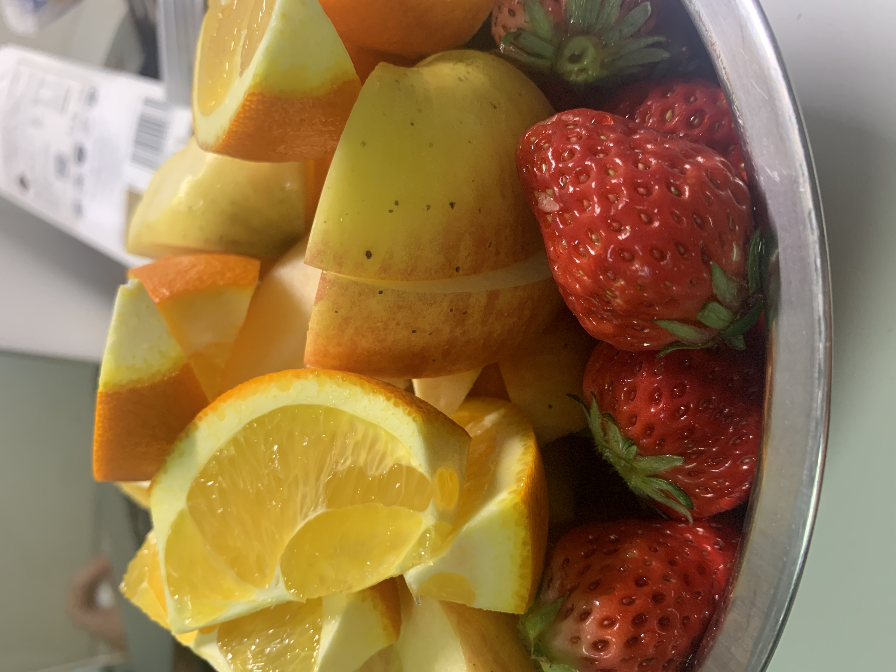

@author Peipei Chen 🥐

[TOC]
# 2020年3月10日
## 今日小结
### 📚学习
看了MYSQL的MVCC，具体内容集中在版本链(三个字段)和readview两块。
[MVCC](./MVCC.md)

### 🍔生活
今天玩了拼图，好好玩。重点是！吃炸鸡了，肥肥真快乐，吃完炸鸡怕胖的肥肥不快乐。

### 🏃运动
今天练了hiit，打酱油的一天嘻嘻嘻

## 明日计划
1. 改论文✅
2. 把mysql的语句加锁博文看完❎

# 2020年3月11日
## 今日小结
### 🤖学习
改了论文的需求部分，mysql的语句加锁博文还是没看完呜呜呜呜呜

### 🍲生活

🌮吃的开心---三汁焖锅好好吃，面条、卷边好好吃，我老公的厨艺up up up！！！

🏋玩的开心---达成走6公里跑去西溪湿地上公共厕所的伟大目标！

💴买的开心---今天逛菜市场了，买了很便宜的菜，盒马会员不香了。。。🍓又是草莓味的一天，而且很便宜！！！老公说给我买花花🌹，最后买了盆驱蚊草🌱，好笑哈哈哈哈~~~~~

### 🥇运动
emmmm,走路10公里就算运动了吧！

## 明日计划
1. 一定要把mysql的语句加锁博文看完！！！！！ ⚠️没看完，中途看到一半看索引去了。。
2. 一定把胸肩补上！！！✅
3. 保持和今天一样的好心情❌
4. 论文降重❎

# 2020年3月12日
## 今日小结
### 📖学习
看了MySQL的索引部分：复习了B树和B+树，聚簇索引和非聚簇索引的区别

### ☔️生活
一坨屎。。。吵架了。。。

### 🏃‍♀️运动
今天做了胸肩，🐻还是做不动啊。。。。

## 明日计划
1. 依旧是语句加锁博客。。。还有数据库索引剩下的部分 ❎
2. 运动就hiit和背吧❎
3. 希望雨过天晴🌞✅
4. 论文降重✅

# 2020年3月13日
## 今日小结
### 👀学习
就论文降重弄了下，hhhhh索引和锁还是没看完，效率不是很高啊

### 🤡生活
和好了，还吃了火锅，糍粑真好吃

### 🏋运动
呜呜呜呜，没有练背，走了7公里。。明天练背！感觉屁股🍑扁扁了。。。

## 明日计划
1. 誓死要看完！！✅
2. 练背✅
3. 腌鸡爪❎ 选择了做春饼嘻嘻

# 2020年3月14日
## 今日小结
### 🤔学习
今天算是最认真的一天吧！把索引、锁的博客都看了，虽然还是一知半解。先继续把高性能MySQL看下去吧！

明天也是要一样的认真啊！

### 🔆生活
今天是美好的一天~

学习上觉得有收获~

还做了春卷~~~期待明天能吃🤤

晚上去西溪北苑逛了一下，吃了好吃的梅菜干扣肉饼🥞，买了很久没吃的柿饼🦁

今天说羡慕某同学，我老公🤵不开心了。可是我还是更喜欢我们俩的小生活。🛋🛋

### 👊运动
今天练背了，手好痛，希望练到了！

## 明日计划
1. 练个琴 ❎
2. 开始英语口语的学习，初步1h ✅
3. 腌鸡爪 ✅老公代我完成哈哈哈
4. 明天练臀，练爆！✅
5. 最好能把高性能第2章看完 ✅

# 2020年3月15日
## 今日小结
### 👏学习
今天高性能第二章看完了，潦草的看了一下基准测试，第三章看了一半，主要是关于性能分析的一些工具和命令

### 🌼生活
今天吃了一天不新鲜的食物哈哈哈
①花卷，虽然豆芽不新鲜了，但是还是出乎意料的好吃啊👍
②鸡胸肉，有点臭臭了
③二刷鸡爪，虽然鸡爪有点不新鲜了，但是改变了一下菜谱，就很好吃啊

🔔🔔在🔔此向处理了一天不新鲜食物的老公致敬

今天也是肥肥的一天。。。。还吃了玉米🌽片。。。罪恶

明天要！去！吃！好！吃！的！了！

烦死了，为什么我爸要逼我去面试事业单位，我不喜欢。

anyway，今天也是super happy的一天~~~😊

### 🏀运动
来大姨妈了，练了个臀🍑，我还活着。

## 明日计划
1. 嘉里中心走起，打卡清明饼 ✅
2. 看EXPLAIN，最好第三章能看完 ✅
3. 克制。。。为了清明饼不在家吃零食 ✅
4. 晚上回来英语1h ✅
5. 练琴 ✅

# 2020年3月16日
## 今日小结
### 👩‍🏫‍学习
今天看了explain，后面部分草草的看了一下，以后用到了再细究把。。

今天英语练了两个音标，长音/i:/和短音/I/，嘴巴都练酸了。口语还是不容易啊。
### 👫生活
今天出去玩啦，去嘉里中心了，累累的

打卡大兴糕团，没有期待中的好吃，太寡淡了！送的糕点🍮比较好吃

打卡泰式菜天泰，就没有期待中好吃啊。。送的虾片🦐最好吃

打卡六甲牧场，期待已久的牛乳冰淇淋🍦，就还可以吧，也没有达到预期值，太贵了。

小米新冲牙器到了，谢谢窝公🍄🍄

给老公买手机📱了，我对老公可是真爱啊！老公说手机真贵。。

anyway，开心又极度劳累的一天，虚虚本虚🤕了。。。

### 🐷运动
大姨妈期间运动全身上下酸痛，我已经是废人了。明天练个胸肩

## 明日计划
1. 高性能第三章看完，看部分第四章 ✅
2. 拼图1h ✅
3. 运动胸肩 ✅
4. 选好尤克里里曲目和曲谱 ✅就是last dance了！
5. 尤克里里30min ✅
6. 盒马采购 ✅

# 2020年3月17日
## 今日小结

### 💻学习
今天把第四章看完了，主要介绍了一些MySQL数据类型、数据库设计的误区等。都还是潦草的看，没有深究。
剑桥英语学了长音/u:/和短音/u/两个， 开始有点疲惫了！

### 🕍生活
感觉又是忙碌充实的一天，早上起来浑浑噩噩过去后，看玩看玩。

然后下午去盒马、菜场采购了，累累的，辛苦我老公提了那么多东西。菜场买的鸡爪🐔真咸，🍓就很好吃啊。

晚上还拼图了一会，拼图🏛可真好玩~~~

想弹的尤克里里🎸曲目选定了last dance，希望能慢慢学成把~~~

还有今天郁金香🌷终于开花了，真是超级慢熟的发发🌸了。

### 📈运动
今天练了胸肩，不知道练到没有，肱三头💪在颤抖！

## 明日计划
1. 看高性能第5章 ✅
2. 剑桥英语下一页 ❎
3. 搞定论文查重 ✅
4. 尤克里里30min ❎
5. 暂定hiit，hiit不动就再说！❎
6. 和老公做草莓蛋饼 ✅

# 2020年3月18日
## 今日小结
### ☘学习
今天可以说是没有学习吧！弄了下论文去重，心疼查重钱。我老公查了200块！然后第五章讲的是索引，大部分内容都在之前看过了，还有两小节没有看，打酱油。。。

### 🍄生活
今天也是浑浑噩噩的一天！陪我老公降重，老公哭哭。然后老公给我做了另类草莓鸡蛋糕🥚，介于蒸蛋和甜点的间的蛋甜点🍮，实名认证热的🍓很难吃！期待明天的香蕉鸡蛋饼

### 🥕运动
运动什么运动，不运动！

## 明日计划
1. 论文预审工作 ✅
2. hiit！ ✅
3. 剑桥英语下一页 ❎
4. 看高性能第六章 ▶️
5. 练last dance~ ✅

# 2020年3月19日
## 今日小结
### 🃏学习
今天一天都在弄论文预审的材料，填了两个表格，写了一下专业实践总结。也没干什么别的了，第六章翻了2页！罪过罪过。。。

### 🌝生活
今天也是好好生活的一天啊~

和老公去买菜了，买了好多水果。老公给我买了我最爱的荸荠、草莓🍓，还买了芒果。喜欢我老公~~

今天🍓非常好吃！浓郁的草莓味，酸酸甜甜🌈，口感超好！

然后给老公买的新手机到了，终于可以抛弃响应速度慢到我以为卡了的小破手机📱了！

今天练了一句last dance，没节奏感星人哭哭了😿

今天是克制的一天，我吃了好少好少的零食呢，就半个沙琪玛！半个！

花花开了，可是我家小香🌷怎么开的那么开，没有含苞待放的感觉，还歪歪的，注意你的姿态！

古怪的风信子长了个瘤，又开了一个小分支，发发🌺可真神奇啊~~

### 🌊运动
今天hiit了！还是挺累的把！

## 明日计划
1. 继续看高性能第六章 ⚠️
2. 练琴30min ✅
3. 等待老师回复，把材料传到FTP ✅
4. 练背 ✅
5. 坚持少吃零食！✅

# 2020年3月20日
## 今日小结
### 🦀学习
今天不适合学习哈哈哈哈，第六章就看了一点。主要看了下MySQL查询执行的大概过程，重点内容是查询优化器如何优化的部分。欲知详情如何请等明天划水！
### 🐼生活
still a happy day!!😁😁😁

今天和老公去吃牛肉🍲火锅了！非常不错的火锅！便宜又好吃！

今天今天！老公给我买衣服了！好多好看的衣服，稀饭！买新衣服🎀可真开心，喜欢嘻嘻。想起柜子里的新衣服就想穿！喜欢小红小绿小蓝~

有了新手机之后，我老公就是超级摄影师了📹，期待老公给我拍美照！

今天老公给我做了糖醋鸡肉🐤，辛苦老公了啦，我都吃光光，好吃😋~~~

今天感觉到热热得了，是夏天🔆的味道~~

今天我居然吃到撑！家里的富贵水果都吃不下了。。

### 🦐运动
今天练了硬拉和划船，硬拉减重了，不太拉得动嘻嘻。

## 明日计划
1. 拼图1h ❎
2. 继续第六章！✅
3. 菜场买菜 ✅
4. 练琴30min ✅
5. hiit ✅

# 2020年3月21日
## 今日小结
### 🐒学习
今天继续再看第六章，主要看的是多表连接查询的内容，讲了几个联表查询的算法。然后口语学了长音/o:/和短音/o/

看的还是好慢的把！
### 🦁生活
今天呢，就慢慢的看看书📚。。

然后练琴🎸练到第二句了，视频看了老半天才看明白是怎么回事，笨笨星人+五音不全星人。

今天去买菜🥕了，老公说每天把我喂饱今天的任务⛳️就完成了，嘻嘻喜欢我老公🍼~~

老公今天又给我做了新菜，锅包鸡肉🍖哈哈哈，除了有点柴一切都完美🌟！

有点饿饿，我是兔子🐰。。。

为什么好天气如此短暂，才晴朗了几天就是连续的暴雨☔️，哭哭。我的太子湾之行呜呜呜。。。

### 🐥运动
今天认真的做了hiit🏃，大概我就是fittness woman把！

## 明日计划
1. 继续第六章！✅
2. 练琴30min ✅
3. 臀腿运动 ✅
4. 陪老公做番茄土豆牛腩 ✅

# 2020年3月22日
## 今日小结
### 🏫学习
今天把第六章看完了，主要看的部分是对一些查询的优化，比如limit使用覆盖索引、group优化等，更明白了覆盖索引的使用以及在查询时对聚簇索引树是怎么用的。不管用不用得到索引，都会去聚簇索引树读数据。innodb的聚簇索引树🌲就是数据文件。

### 🏖生活
今天也是开心的一天~~

上午起床我公就开始给我做番茄土豆牛腩🐂。实名认证老公做的真的炒鸡好吃😋啊。牛腩的那个味道让我觉得好吃到跺脚🌋。不可能再有比老公做的好吃的了。剩下来的汤底做红烧牛肉面🍜也是豆浆油条一般的搭配！

今天又是资产阶级的一天，水果🍊🍎🍓一大盆哈哈哈哈~

今天练琴🎸的前半段算是摸清楚门路了，就是多练习了。后半段fighting💪！

### 🏟运动
今天认真的纠正了深蹲的动作，活动度不够蹲不下去啊，总是屁股眨眼。我的大屁屁🍑啥时候才长出来呢。。

## 明日计划
1. 高性能第七章 ❎         
2. 练琴30min ✅
3. hiit ✅
4. 吃螺蛳粉！✅

# 2020年3月23日
## 今日小结
### 🚌学习
今天无心学习啊。整个人都不在状态，颓废的一天。。

### 📸生活
两个字：颓废！🕯
啥也不想做，练琴、看书都不想做。。希望明天能恢复状态。。😭
今天吃了螺蛳粉和炸鸡，碳水真好吃又真罪恶

### 🛢运动
打酱油般的做了hiit。。

## 明日计划
1. 继续第七章！必须看！✅
2. 胸肩+深蹲矫正 ✅
3. 练琴30min ✅
4. 盒马买菜 ✅

# 2020年3月24日
## 今日小结
### 🌶学习
今天看了MySQL的一些高级特性，看了分区表、视图、存储过程，都是看了下用法。

剑桥英语学了两个音，好难学哦。

### 🍯生活
今天是饱饱的一天！

今天去盒马血拼了，感觉赚到，薅羊毛🐑也太开心了吧！

晚上老公给我做了红烧鸡翅🍗，超级好吃的，最近吃的有点好啊~~

今天！吃甜品了！草莓🍓芝士蛋糕🍰，芝士🧀那么好吃怎么可以不吃芝士！

### 🍋运动
今天主要是矫正深蹲的动作。感觉应该屁股重点放中间，在缓缓蹲下的过程中，屁股有一种上翘的感觉。

继续加油💪~~~

## 明日计划
1. 修牙刷！✅
2. 吃饭桶！✅
3. hiit ❎
4. 复习学过的音标 ❎
5. 如果下午回来了看会第七章 ❎

# 2020年3月25日
## 今日小结

### 学习
今日不宜学习！

### 生活
今天去修牙刷了，给换了一只新的牙刷🦷，赚到！没白跑这一趟！

今天打卡了饭桶家，也就紫菜包饭🍚还可以吧，没有期待中的好吃。

今天老公和我吵架了😡，他凶我了，我就不喜欢他了。

晚上的简易寿喜锅🍲还八错，比饭桶家要满足

### 运动
我胖了可是我没有运动，哭哭。

## 明日计划
1. 继续第七章
2. 练琴30min
3. 拼图1h
4. 练背
5. 应该要改论文

