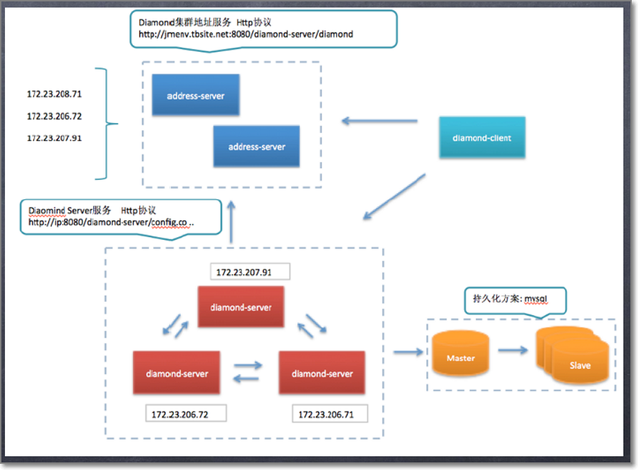

[TOC]

# 1. 作用
分布式配置中心，实现了配置的持久化管理和实时动态推送

它有很多应用场景，如数据库动态切换和扩容，业务系统开关配置运行时变更等

# 2. 架构
- **服务发现者**：提供服务发现的功能，封装了集群的扩容和下线
- **server集群**：是一个web服务集群，无单点。借助diamond client给应用方提供http服务实现配置的持久化、动态推送。服务间进行数据的增量同步
- **数据持久层**
- **diamond客户端**




### 优点
1. 使用集群，无单点
2. 提供http服务，无状态，逻辑简单


# 3. 配置的推送和获取


## 推送
1. 应用方通过diamond客户端推送配置，将向server集群发送http请求
2. 一台server会将数据写入DB，在保存到本地文件中(**如何选出这台服务者?**)
3. 这台server向其他server发送http请求，做同2的操作

## 获取
1. diamond client启动时会向服务发现者获取server集群的地址列表
2. diamond client向server发送http请求
3. server将本地文件中的数据返回给client
4. client收到数据后将数据存到缓存和容灾文件中，缓存有效期内都从缓存获取。还会将数据的MD5值存在内存中，有一个定时任务检验server中的数据是否发生了变化


# 4. 数据同步
数据存在的地方有：DB、server本地文件、client本地缓存、client本地容灾文件

数据最新性：DB > server > client

### 4.1 DB和server之间
server会有定时任务去MySQL dump所有数据

### 4.2 server之间
server收到数据后会存到MySQL，然后存在本地文件中，再给其他server发送http消息同步数据

### 4.3 server和client之间
使用了长轮询的方案[轮询和连接](../java基础/网络编程/轮询和连接.md)


# 4. 快速开发
- add maven reliance

```java
<dependency>
  <groupId>com.taobao.diamond</groupId>
  <artifactId>diamond-client</artifactId>
  <version>3.8.3</version>
</dependency>
```


- example code 

```java
import java.io.IOException;

import com.taobao.diamond.client.Diamond;
import com.taobao.diamond.manager.ManagerListenerAdapter;

/**
 * 配置中心，管理所有动态配置;基本用法
 * 
 * @author ConfigCenter
 *
 */
public class ConfigCenter {
    // 属性/开关
    private static String config = "";

    private static void initConfig() {
        // 启动只用一次场景，直接get获取配置值
        try {
            String configInfo = Diamond
                    .getConfig("yanlin", "yanlin", 1000);
            System.out.println("dataId+group:" + configInfo);
        } catch (IOException e1) {

        }

        // 启动用，并且变化需要立即推送最新值
        Diamond.addListener("yanlin", "yanlin",
                new ManagerListenerAdapter() {
                    public void receiveConfigInfo(String configInfo) {
                        try {
                            config = configInfo;
                            System.out.println(configInfo);
                        } catch (Exception e) {
                            e.printStackTrace();
                        }
                    }
                });
    }

    public static void main(String[] args) throws IOException {
        // 如果使用spring，此类等同于init方法
        initConfig();
        // 测试让主线程不退出，因为订阅配置是守护线程，主线程退出守护线程就会退出，实际代码中不需要。
        while (true) {
            try {
                Thread.sleep(1000);
            } catch (InterruptedException e) {
            }
        }
    }
    // 通过get接口把配置值暴露出去使用
    public static String getConfig() {
        return config;
    }
}
```

