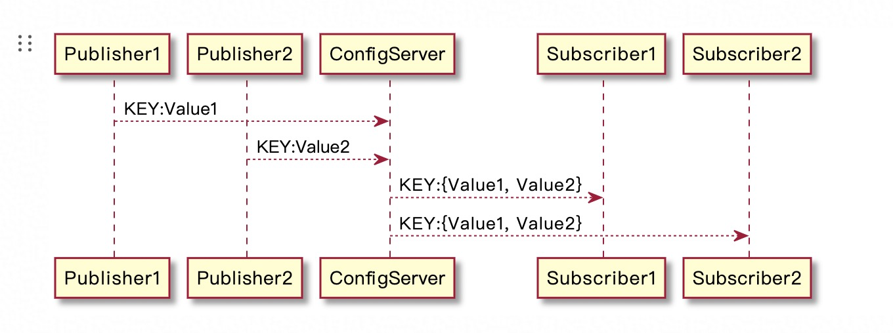

[TOC]


## 使用
将service包的接口打成二方包调用，调用者和服务提供者都需要配置


1. 自己的应用实现service

impl需要注册成hsf服务的提供者，xml配置或者注解配置
服务提供者的配置会发送到
```java
//注解配置（同时包含了@Component注解，首先他得是一个bean，其次才能提供远程服务）
@HSFProvider(serviceInterface = ContentReadService.class, serviceVersion = "${hsf.provider.service.version}")
public class ContentReadServiceImpl implements ContentReadService {
}


//xml配置
//1. bean配置
<bean id="juQianNiuSellerreportService" class="com.taobao.ju.mango.service.mtop.JuQianNiuSellerreportServiceImpl"/>

//2. HSF服务配置
<bean class="com.taobao.hsf.app.spring.util.HSFSpringProviderBean" init-method="init">
	<property name="serviceInterface" value="com.taobao.ju.mango.service.mtop.JuQianNiuSellerreportService"/>
	<property name="target" ref="juQianNiuSellerreportService"/>
	<property name="serviceVersion" value="${hsf.provider.service.version}"/>
	<property name="serializeType" value="java"/>
</bean>

<bean class="com.taobao.hsf.app.spring.util.HSFSpringProviderBean" init-method="init">
    <!--[设置] 发布服务的接口-->
    <property name="serviceInterface" value="com.alibaba.middleware.hsf.guide.api.service.OrderService"/>
    <!--[设置] 服务的实现对象 target必须配置[ref]，为需要发布为HSF服务的spring bean id-->
    <property name="target" ref="引用的BeanId"/>
    <!--[设置] 服务的版本-->
    <property name="serviceVersion" value="1.0.0"/>
    <!--[设置] 服务的归组-->
    <property name="serviceGroup" value="HSF"/>
    <!--[设置] 服务的响应时间-->
    <property name="clientTimeout" value="3000"/>
    <!--[设置] 服务传输业务对象时的序列化类型-->
    <property name="preferSerializeType" value="hessian2"/>
</bean>
```


2. 别人的应用调用

配置service的consumer，xml配置或者注解配置
```java
//注解配置（同时包含了@autowired注解，首先他得是一个bean，其次才能提供远程服务）
@HSFConsumer(serviceVersion = "${hsf.version.mango}")
private MarketContentApplyService marketContentApplyService;

//xml配置
<bean id="uicReadService" class="com.taobao.hsf.app.spring.util.HSFSpringConsumerBean" init-method="init">
	<property name="interfaceName" value="com.taobao.uic.common.service.userinfo.UicReadService"/>
	<property name="version" value="${hsf.version.uic}"/>
</bean>
```


但是这样的话会有一个问题，当服务端添加一个service的时候，调用端就要在自己的应用中配置对应的HSFSpringConsumerBean，会很麻烦。所以可以直接在服务端通过一个client来包掉这部分配置，服务端将HSFSpringConsumerBean注册好放到一个文件里，然后调用端加载client的时候将文件加载进来，这样就相当于在调用端配置了HSFSpringConsumerBean

以下是服务端代码：
```java
public class CargoClient implements InitializingBean, ApplicationContextAware {
    
    @Override
    public void afterPropertiesSet() throws Exception {
        init();
    }

    public void init() {
        if (started.compareAndSet(false, true)) {
            try {
                if (StringUtils.isBlank(appName)) {
                    throw new CargoException("appName must not be null.");
                }
                //会将配置HSFSpringConsumerBean的文件加载进来
                clientContainer = new CargoClientContext(this);
                Cargo.init(this);
                try {
                    Thread.sleep(maxWaitTimeForCsAddress);
                } catch (InterruptedException e) {
                    logger.error(e.getMessage(), e);
                }
            } catch (Exception e) {
                throw new CargoException("cargo client start exception.", e);
            }
        }
    }
}


public class CargoClientContext extends ClassPathXmlApplicationContext {

    private static final String CONFIG_FILES = "classpath:com/taobao/ju/cargo/bootstrap/config/cargo-hsf.xml";
    public CargoClientContext(CargoClient cargoClient) {
        super(new String[]{CONFIG_FILES}, false);
        this.addBeanFactoryPostProcessor(new PropertyConfigurer(cargoClient, new DiamondConfigLoader()));
        super.refresh();
    }
}
```


下面的文件就是配置了HSFSpringConsumerBean的cargo-hsf.xml
```xml
<?xml version="1.0" encoding="UTF-8"?>
<beans xmlns="http://www.springframework.org/schema/beans"
       xmlns:xsi="http://www.w3.org/2001/XMLSchema-instance"
       xsi:schemaLocation="http://www.springframework.org/schema/beans http://www.springframework.org/schema/beans/spring-beans.xsd"
        default-autowire="byName">

    <bean id="signRecordReadService" class="com.taobao.hsf.app.spring.util.HSFSpringConsumerBean">
        <property name="interfaceName" value="com.taobao.ju.cargo.service.signrecord.SignRecordReadService"/>
        <property name="version" value="${cargo.service.version}"/>
    </bean>

    <bean id="signRecordWriteService" class="com.taobao.hsf.app.spring.util.HSFSpringConsumerBean">
        <property name="interfaceName" value="com.taobao.ju.cargo.service.signrecord.SignRecordWriteService"/>
        <property name="version" value="${cargo.service.version}"/>
    </bean>
</beans>
```
Cargo里面就包含了各个service对应的client
```java
package com.taobao.ju.cargo.bootstrap;
/**
 * @author: liangzhan.qj
 */
public class Cargo {

    public static BranchWriteClient branchUpdate() {
        return applicationContext.getBean("branchWriteClient", BranchWriteClient.class);
    }

    public static MaterialServiceClient material() {
        return applicationContext.getBean("materialServiceClient", MaterialServiceClient.class);
    }
}

```


service对应的client里面就包装了service
```java
package com.taobao.ju.cargo.client.branch;

@Component
public class BranchWriteClient extends ServiceClient {

    @Resource
    private BranchProcessWriteService branchProcessWriteService;

    public Void auditReject(final BranchQueryInfo branchQueryInfo, final BizContext bizContext, final Operator operator) {
        return clientTemplate.execute(new CargoServiceInvoker<Void>() {
            @Override
            public ResultDO<Void> invoke() {
                return branchProcessWriteService.auditReject(branchQueryInfo, bizContext, operator, appInfo);
            }
        });
    }
}

```


在调用端就可以用如下调用:
```java
Cargo.marketContent().query().getContentBySignRecordId(contentQueryInfo, new AppInfo("porsche"));
```


# 非XML配置
### 服务端发布
服务通过HSFApiProviderBean将服务注册到configserver,configserver将地址推送给客户端

服务端需要将下列信息通过init()接口发布给configserver
dataId=全限定类目+版本
```java
public class Start {
    public static void main(String[] args) {
        // 设置project.name，方便在ops系统中查到对应的应用名
        System.setProperty("project.name", "HSF-Guide-Server-Normal");
        System.out.println("HSF-Guide-Server-Normal begin start @ " + new Date());

        // 启动Spring容器,获取OrderService这个Bean
        ClassPathXmlApplicationContext application = new ClassPathXmlApplicationContext(
                "classpath:dao.xml", "classpath:datasource.xml", "classpath:biz.xml");
        application.start();
        application.registerShutdownHook();
        Object target = application.getBean("orderService");

        // ---------------------- 装配 -----------------------//
        // [设置] HSF服务发布逻辑
        HSFApiProviderBean hsfApiProviderBean = new HSFApiProviderBean();
        // [设置] 发布服务的接口
        hsfApiProviderBean.setServiceInterface("com.alibaba.middleware.hsf.guide.api.service.OrderService");
        // [设置] 服务的实现对象
        hsfApiProviderBean.setTarget(target);
        // [设置] 服务的版本
        hsfApiProviderBean.setServiceVersion("1.0.0");
        // [设置] 服务的归组
        hsfApiProviderBean.setServiceGroup("HSF");
        // [设置] 服务的响应时间
        hsfApiProviderBean.setClientTimeout(3000);
        // [设置] 服务传输业务对象时的序列化类型
        hsfApiProviderBean.setPreferSerializeType("hessian2");

        // ---------------------- 发布 -----------------------//
        // [发布] HSF服务
        try {
            hsfApiProviderBean.init();
        } catch (Exception ex) {
            ex.printStackTrace();
        }

        System.out.println("HSF-Guide-Server-Normal started @ " + new Date());

        /**
            StopGuard.guard();启动了一个端口12306，当什么不做的时候，主线程会卡在这里，当外部通过telnet localhost 12306并输入shutdown，可以使主线程从guard()方法退出，优雅的结束整个流程
        */
        StopGuard.guard();

        // ---------------------- 停止 -----------------------//
        // [停止] HSF服务
        try {
            //会把当前提供者注册的所有服务元信息进行注销，最终会关闭服务线程池
            hsfApiProviderBean.shutdownHSFServer();
        } catch (Exception ex) {
            ex.printStackTrace();
        }

        application.close();
    }
}
```

### 客户端调用
```java
// ---------------------- 装配 -----------------------//
// [设置] HSF服务订阅逻辑
HSFApiConsumerBean hsfApiConsumerBean = new HSFApiConsumerBean();
// [设置] 订阅服务的接口
hsfApiConsumerBean.setInterfaceName("com.alibaba.middleware.hsf.guide.api.service.OrderService");
// [设置] 服务的版本
hsfApiConsumerBean.setVersion("1.0.0");
// [设置] 服务的归组
hsfApiConsumerBean.setGroup("HSF");
// ---------------------- 订阅 -----------------------//
// [订阅] HSF服务，同步等待地址推送，默认false(异步)，同步默认超时时间3000毫秒
hsfApiConsumerBean.init(true);

// ---------------------- 代理 -----------------------//
// [代理] 获取HSF代理
OrderService orderService = (OrderService) hsfApiConsumerBean.getObject();
// ---------------------- 调用 -----------------------//
// [调用] 发起HSF调用
OrderModel orderModel = orderService.queryOrder(1L);
```

### configserver的注册和订阅
注册中心根据key将服务地址进行聚合，将其推送给订阅了这个Key的服务订阅者



- 使用publisher发布服务
```java
public class PublisherMain {
    public static void main(String[] args) {
        // 注册登记表
        // 发布者名称与DataId,其中DataId是标识与订阅方之间关系的Key,这个是关键
        PublisherRegistration<String> registration = new PublisherRegistration<String>("weipeng2k-publisher", "com.alibaba.OrderService:1.0.0");
        registration.setGroup("HSF");

        // 创建一个发布者
        Publisher<String> register = PublisherRegistrar.register(registration);
        Scanner scanner = new Scanner(System.in);

        String line;

        while ((line = scanner.nextLine()) != null) {
            if (line.equals("quit")) {
                break;
            } else {
                // 发布数据
                System.out.println("Publish:" + line);
                register.publish(line);
            }
        }
        // ConfigServer客户端无法停止下来，只能如此
        System.exit(1);
    }
}
```

- 使用subscriber订阅服务
```java
public class SubscriberMain {
    public static void main(String[] args) {
        // 数据订阅表
        // 订阅人的Id
        SubscriberRegistration subscriberRegistration = new SubscriberRegistration("weipeng2k-subscriber", "com.alibaba.OrderService:1.0.0");
        subscriberRegistration.setGroup("HSF");

        Subscriber subscriber = SubscriberRegistrar.register(subscriberRegistration);
        subscriber.setDataObserver(new SubscriberDataObserver() {
            @Override
            public void handleData(String dataId, List<Object> data) {
                System.out.println("收到dataId:" + dataId);
                System.out.println("数据:" + data);
                System.out.println("运行在:" + Thread.currentThread());
            }
        });
    }
}
```

- 测试
```java
//服务端发布
二阶堂红丸
Publish:二阶堂红丸

//消费端订阅
收到dataId:com.alibaba.OrderService:1.0.0
数据:[二阶堂红丸]
运行在:Thread[main,5,main]
```


{
    "activityBrandAndCategory": {
        "startGray": true,
        "grayExpression": "true",
        "valveList": [
            "activityShopHasBrandValve"
        ]
    },
    "activityPitSignNum": {
        "startGray": true,
        "grayExpression": "true",
        "valveList": [
            "activityPitPlanMaxSignNumValve"
        ]
    },
    "taoActivityPitMachineRuleAtLeastOne": {
        "startGray": true,
        "grayExpression": "true",
        "valveList": [
            "activityPitMachineAtLeastOneValve"
        ]
    },
    "activityCategory": {
        "startGray": true,
        "grayExpression": "true",
        "valveList": [
            "activityCategoryValve"
        ]
    },
    "activityInvite": {
        "startGray": true,
        "grayExpression": "true",
        "valveList": [
            "activityInviteOnlyValve"
        ]
    },
    "activityWhiteList": {
        "startGray": true,
        "grayExpression": "true",
        "valveList": [
            "activityWhiteSellerListValve"
        ]
    },
    "activityGroupApplyNum": {
        "startGray": true,
        "grayExpression": "true",
        "valveList": [
            "activityGroupApplyNumValve"
        ]
    },
    "activityPitValidRecord": {
        "startGray": true,
        "grayExpression": "true",
        "valveList": [
            "activityPitMaxValidSignNumValve"
        ]
    },
    "sellerInNewUplusItemRule": {
        "startGray": true,
        "grayExpression": "true",
        "valveList": [
            "activityApplyItemInUplusValve"
        ]
    },
    "activityBase": {
        "startGray": true,
        "grayExpression": "true",
        "valveList": [
            "activityApplyTimeValve"
        ]
    },
    "activityMainRecord": {
        "startGray": true,
        "grayExpression": "true",
        "valveList": [
            "activityMainRecordValve"
        ]
    },
    "activityUplusItemPool": {
        "startGray": true,
        "grayExpression": "true",
        "valveList": [
            "activityApplyItemInUplusValve"
        ]
    },
    "activityPitMachine": {
        "startGray": true,
        "grayExpression": "true",
        "valveList": [
            "activityPitMachineValve"
        ]
    },
    "activityPitValidRule": {
        "startGray": true,
        "grayExpression": "true",
        "valveList": [
            "activityPitApplyEndTimeAndVisibleValve"
        ]
    },
    "activitySellerSelection": {
        "startGray": true,
        "grayExpression": "true",
        "valveList": [
            "activitySellerSelectionValve"
        ]
    },
    "activityMachine": {
        "startGray": true,
        "grayExpression": "true",
        "valveList": [
            "activityMachineValve"
        ]
    },
    "activityExtraMachine": {
        "startGray": true,
        "grayExpression": "true",
        "valveList": [
            "activityMachineValve"
        ]
    },
    "activitySellerRole": {
        "startGray": true,
        "grayExpression": "true",
        "valveList": [
            "activitySellerRoleValve"
        ]
    },
    "activityUnifyEntrance": {
        "startGray": true,
        "grayExpression": "true",
        "valveList": [
            "activityUnifyEntranceValve"
        ]
    },
    "activityEntrance": {
        "startGray": true,
        "grayExpression": "true",
        "valveList": [
            "activityCampaignEntranceValve"
        ]
    },
    "activitySellerMutual": {
        "startGray": true,
        "grayExpression": "true",
        "valveList": [
            "activitySellerMutualValve"
        ]
    },
    "activitySellerPool": {
        "startGray": true,
        "grayExpression": "true",
        "valveList": [
            "activitySellerSelectionValve"
        ]
    },
    "activityPitApplyEndTimeRule": {
        "startGray": true,
        "grayExpression": "true",
        "valveList": [
            "activityPitApplyEndTimeAndVisibleValve"
        ]
    },
    "activityMarketingRule": {
        "startGray": true,
        "grayExpression": "true",
        "valveList": [
            "signRecordMarketingRuleCheckValve",
            "signRecordPitMarketingRuleCheckValve"
        ]
    },
    "activityFeeTemplateRule": {
        "startGray": true,
        "grayExpression": "true",
        "valveList": [
            "activityFeeTemplateValve"
        ]
    },
    "BrandCategoryBreakthroughCheck": {
        "startGray": true,
        "grayExpression": "true",
        "valveList": [
            "itemCrossBrandCategoryValve"
        ]
    },
    "ItemBrandCountCheck": {
        "startGray": true,
        "grayExpression": "true",
        "valveList": [
            "itemCrossBrandCountValve"
        ]
    },
    "ActivityAppliableRule": {
        "startGray": true,
        "grayExpression": "true",
        "valveList": [
            "signRecordCanAddItemTimeValve"
        ]
    },
    "SignRecordExistRule": {
        "startGray": true,
        "grayExpression": "true",
        "valveList": [
            "sameSellerValve"
        ]
    },
    "ICItemCheckForJu": {
        "startGray": true,
        "grayExpression": "true",
        "valveList": [
            "sameSellerValve",
            "taxPolicyValve",
            "fixPriceItemCheckCCShopValve",
            "bpuValve",
            "itemStatusValve"
        ]
    },
    "ICBuyCheckForJu": {
        "startGray": true,
        "grayExpression": "true",
        "valveList": [
            "sameSellerValve",
            "taxPolicyValve",
            "fixPriceItemCheckCCShopValve",
            "itemStatusValve"
        ]
    },
    "ItemAddMachineCheck": {
        "startGray": true,
        "grayExpression": "true",
        "valveList": [
            "invalidSignRecordCanAddItemValve",
          "onlyTopItemSignValve",
          "singleSignItemCanMultiApplyValve",
          "inviteItemValve",
          "itemMachineValve"
        ]
    },
       "ItemEditMachineCheck": {
        "startGray": true,
        "grayExpression": "true",
        "valveList": [
            "itemMachineValve"
        ]
    },
    "ItemPresaleCheck": {
        "startGray": true,
        "grayExpression": "true",
        "valveList": [
            "coopApplySignableValve",
            "presaleShopNormalValve"
        ]
    },
    "SellerPunishRule": {
        "startGray": true,
        "grayExpression": "true",
        "valveList": [
            "sellerPunishValve"
        ]
    },
    "FeeTemplateCheck": {
        "startGray": true,
        "grayExpression": "true",
        "valveList": [
            "feeTemplateCheckValve"
        ]
    },
    "DeliverServiceRule": {
        "startGray": true,
        "grayExpression": "true",
        "valveList": [
            "packageLogisticsCheckValve"
        ]
    },
    "ItemCodStatusCheck": {
        "startGray": true,
        "grayExpression": "true",
        "valveList": [
            "codItemStatusCheckValve"
        ]
    },
    "PilaoqiCheck": {
        "startGray": true,
        "grayExpression": "true",
        "valveList": [
            "fatiguePeriodCheckValve"
        ]
    },
    "ItemTMALLDacuCheckRule": {
        "startGray": true,
        "grayExpression": "true",
        "valveList": [
            "coopApplySignableValve"
        ]
    },
    "TarpaItemBrandHitCheckRule": {
        "startGray": true,
        "grayExpression": "true",
        "valveList": [
            "brandPoolCheckValve"
        ]
    },
    "ICItemTagCheckRule": {
        "startGray": true,
        "grayExpression": "true",
        "valveList": [
            "privilegeDepositeValve"
        ]
    },
    "ItemPromotionCheckRule": {
        "startGray": true,
        "grayExpression": "true",
        "valveList": [
            "itemPromotionCheckValve"
        ]
    },
    "PresaleSupportItemRule": {
        "startGray": true,
        "grayExpression": "true",
        "valveList": [
            "presaleItemCanSignCheckValve"
        ]
    },
    "PresalePriceCheckRule": {
        "startGray": true,
        "grayExpression": "true",
        "valveList": [
            "coopApplyPriceValve",
            "presalePriceValve"
        ]
    },
    "PresaleDeliveryTimeRule": {
        "startGray": true,
        "grayExpression": "true",
        "valveList": [
            "presaleDeliveryTimeValve"
        ]
    },
    "PresaleInventoryRule": {
        "startGray": true,
        "grayExpression": "true",
        "valveList": [
            "presaleInventoryValve"
        ]
    },
    "ActicityItemInPoolCheckRule": {
        "startGray": true,
        "grayExpression": "true",
        "valveList": [
            "kouBeiItemInPoolValve"
        ]
    },
    "PresalePriceModifyRule": {
        "startGray": true,
        "grayExpression": "true",
        "valveList": [
            "presalePropertyEditValve"
        ]
    },
    "PriceCooperationRule": {
        "startGray": true,
        "grayExpression": "true",
        "valveList": [
            "priceCooperationValve"
        ]
    },
    "ItemPitMachineRule": {
        "startGray": true,
        "grayExpression": "true",
        "valveList": [
            "itemPitMachineValve",
          "itemPitDimensionValve"
        ]
    },
      "ItemPitApplyTimeRule": {
        "startGray": true,
        "grayExpression": "true",
        "valveList": [
            "itemPitApplyTimeValve"
        ]
    },
    "ItemInUplusDataSetRule": {
        "startGray": true,
        "grayExpression": "true",
        "valveList": [
            "itemInNewUplusValve"
        ]
    },
    "ItemPriceLiveRoomRule": {
        "startGray": true,
        "grayExpression": "true",
        "valveList": [
            "itemLiveRoomPriceValve"
        ]
    },
    "AuctionItemCheckRule": {
        "startGray": true,
        "grayExpression": "true",
        "valveList": [
            "auctionItemValve"
        ]
    },
    "EnableAddItemRule": {
        "startGray": true,
        "grayExpression": "true",
        "valveList": [
            "invalidSignRecordCanAddItemValve",
            "blackHouseCheckFlowValve",
            "signRecordCanAddItemTimeValve",
          "noneItemActivityCanNotSignValve"
        ]
    },
    "ItemSkuTypeRule": {
        "startGray": true,
        "grayExpression": "true",
        "valveList": [
            "itemEditSkuTypeValve"
        ]
    },
    "ItemDoubleSignCheckRule": {
        "startGray": true,
        "grayExpression": "true",
        "valveList": [
            "coopApplySignableValve"
        ]
    },
    "ItemOnSaleCannotIncreasePriceForBybtRule": {
        "startGray": true,
        "grayExpression": "true",
        "valveList": [
            "bybtIncreasePriceValve"
        ]
    },
    "ICStatusRule": {
        "startGray": true,
        "grayExpression": "true",
        "valveList": [
            "itemStatusValve"
        ]
    },
    "ItemOriginInventoryRule": {
        "startGray": true,
        "grayExpression": "true",
        "valveList": [
            "noInventoryItemApplyValve"
        ]
    },
    "ItemInPitRecommendDataSetRule": {
        "startGray": true,
        "grayExpression": "true",
        "valveList": [
            "itemInPitDatasetValve"
        ]
    },
    "ItemInNewUplusRule": {
        "startGray": true,
        "grayExpression": "true",
        "valveList": [
            "itemInNewUplusValve"
        ]
    },
    "RepeatApplyItemCheck": {
        "startGray": true,
        "grayExpression": "true",
        "valveList": [
        	"itemDefaultCanApplyValve",
            "itemApplyConflictCheckValve",
            "formalItemMultiApplyTimeConflictCheckValve",
            "itemSiteApplyConflictCheckValve",
            "itemCanApplyPresaleValve",
            "tmcItemApplyPromotionConflictCheckValve",
            "itemXFXcanApplyValve",
            "itemRepeatApplyCheckValve",
            "itemApplyNumberCheckValve",
            "tmcItemApplyTimeConflictCheckValve"
        ]
    }
}