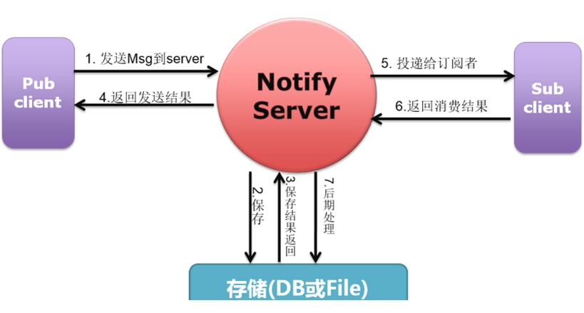

# Notify

Message-oriented middleware(MOM) 

It's a software infrastructure focused on sending and receiving messages between distributed systems

# 1. JMS model 

## 1.1 P2P
Notify-1


## 1.2 Publish/Subscribe

notify use this model


# 2. Notify Deploy Structure


- Notify Server SEDA

1. A request is divided into several phases to handle, phases are independent from each other.
1. Inside of phase use event driven model, a new request will be put in event queue.
1. Inside phase, a thread will be chosen in it's thread pool to handle request. And deliver request to next phase.


      
    


# 3. Notify's Reliable Message Service

Notify server's service quality:

1. exactly-once
1. at-least-once: may repeat deliver
1. at-most-once: may lose msg 





- distributed transaction message


# 4. Notify's Load Balancing


# 5. Topic And Message Type

Topic and message type represents same kind message type. Topic is first level and message type represents second level.

Notify use Topic to offer service, and topic restrict the message type pf service.

subscriber subscribe message type's message under topic


- Publisher get notify list from config server according to topic. And the message type should conform to notify's restriction
Notify-14


- subscriber subscribe message type


# 6. Message Type

## 6.1 Simple Message

```java
notifyManager.sendMessage(Message)
```


## 6.2 Transaction Message

- message publish and business operation are all in one transaction
- business operation is in SendMessageCallback

```java
notifyManager.sendMessage(Message, SendMessageCallback)
```


# 7. Send Message

## 7.1 Send Type

### 7.1.1 Sync And No Transaction

- SendResult result = notifyManager.sendMessage(stringMessage);

```java
private static void sendNoTransactionMessage(NotifyManager notifyManager) {
    StringMessage stringMessage = new StringMessage();
    stringMessage.setBody("NoTranscationTestStringMessage");
   
    /**
    * 必填属性
    */
    stringMessage.setTopic(TOPIC);
    stringMessage.setMessageType(MESSAGE_TYPE);
    
    /**
    * 可选属性，使用前，请务必仔细看Notify的User guide的Message章节
    */
    stringMessage.setSendOnceMessage(true);// 默认值为false
    stringMessage.setPostTimeout(10000);// 默认值10*1000毫秒
    stringMessage.setClientPostTimeout(3000);// 默认值3*1000毫秒
    stringMessage.setTimeToLive(7 * 24 * 3600);// 默认值，为-1
    stringMessage.setDLQTime(7 * 24 * 3600);// 默认值，NotifyServer配置文件决定
    stringMessage.setStringProperty("customHeader", "customValue"); // 该可选属性是一个系列
    SendResult result = notifyManager.sendMessage(stringMessage);
    
    if (result.isSuccess()) {
        // 发送成功后处理
        System.out.println("消息发送成功");
    }
    else {
    	System.out.println("消息发送失败，原因：" + result.getErrorMessage());
    }
}
```


### 7.1.2 Async And No Transaction

- Future<SendResult> result = notifyPublisher.asynSendMessage(stringMessage, asynListener);

```java
private static void asynSendNoTransactionMessage(NotifyManager notifyPublisher) throws Exception {
    AsynSendResultListener asynListener = new SimpleAsynListener();
    StringMessage stringMessage = new StringMessage();
    stringMessage.setBody("NoTranscationTestStringMessage");
   
    /**
    * 必填属性
    */
    stringMessage.setTopic(TOPIC);
    stringMessage.setMessageType(MESSAGE_TYPE);
    stringMessage.setGroupId(GROUPID);
    
    /**
    * 可选属性，使用前，请务必仔细看Notify的User guide的Message章节
    */
    stringMessage.setSendOnceMessage(true);// 默认值为false
    stringMessage.setPostTimeout(10000);// 默认值10*1000毫秒
    stringMessage.setClientPostTimeout(3000);// 默认值3*1000毫秒
    stringMessage.setTimeToLive(7 * 24 * 3600);// 默认值，为-1
    stringMessage.setDLQTime(7 * 24 * 3600);// 默认值，NotifyServer配置文件决定
    stringMessage.setStringProperty("customHeader", "customValue"); // 该可选属性是一个系列
    
    // 可以使用Future方式或者异步Listener返回结果，二选一即可，不必同时使用两者
    Future<SendResult> result = notifyPublisher.asynSendMessage(stringMessage, asynListener);
    if (result.get().isSuccess()) {
        // 发送成功后处理
        System.out.println("消息发送成功");
    }
    else {
    	System.out.println("消息发送失败，原因：" + result.get().getErrorMessage());
    }
}
```


### 7.1.3 Sync And Transaction

- SendResult result = notifyManager.sendMessage(bytesMessage, new SendMessageCallback() { } );

```java
private static void sendTransactionMessage(NotifyManager notifyManager) {
    // 创建BytesMessage
    final BytesMessage bytesMessage = new BytesMessage();
    
    // 设置消息内容
    bytesMessage.setBody("TranscationTestBytesMessage".getBytes());
    
    // 设置消息其他信息
    bytesMessage.setTopic(TOPIC);
    bytesMessage.setMessageType(MESSAGE_TYPE);
    bytesMessage.setStringProperty("customHeader", "customValue");
    
    // 发送事务消息
    SendResult result = notifyManager.sendMessage(bytesMessage, new SendMessageCallback() {
        public Object doInTransaction(MessageStatus status) {
            // 这个例子是一个跟业务操作相结合的例子
            // 这个地方抛出异常或者设置status.setRollbackOnly();会回滚half消息。
            // 如果这个还没有成功回滚，而应用或者NotifyServer Down掉，
            // NotifyServer会发送消息来Check这个Half的message
            // 使用和业务操作结合的方式发送消息，一定要注册一个CheckMessageListener
            return null;
        }
    });
    
    if (result.isSuccess()) {
        // 发送成功后处理
        System.out.println("消息发送成功");
    }
    else {
    	System.out.println("消息发送失败，原因：" + result.getErrorMessage());
    }
}
```


### 7.1.4 Async And Transaction

- Future<SendResult> result = notifyPublisher.asynSendMessage(bytesMessage, new SendMessageCallback(){}, asynListener);

```java
private static void asynSendTransactionMessage(NotifyManager notifyPublisher) throws Exception {
    AsynSendResultListener asynListener = new SimpleAsynListener();
    
    // 创建BytesMessage
    final BytesMessage bytesMessage = new BytesMessage();
    
    // 设置消息内容
    bytesMessage.setBody("TranscationTestBytesMessage".getBytes());
    
    // 设置消息其他信息
    bytesMessage.setTopic(TOPIC);
    bytesMessage.setMessageType(MESSAGE_TYPE);
    bytesMessage.setGroupId(GROUPID);
    bytesMessage.setStringProperty("customHeader", "customValue");
    
    // 发送事务，消息可以使用Future方式或者异步Listener返回结果，二选一即可，不必同时使用两者
    Future<SendResult> result = notifyPublisher.asynSendMessage(bytesMessage, new SendMessageCallback() {
        public Object doInTransaction(MessageStatus status) {
            // 这个例子是一个跟业务操作相结合的例子
            // 这个地方抛出异常或者设置status.setRollbackOnly();会回滚half消息。
            // 如果这个还没有成功回滚，而应用或者NotifyServer Down掉，
            // NotifyServer会发送消息来Check这个Half的message
            // 使用和业务操作结合的方式发送消息，一定要注册一个CheckMessageListener
            return null;
        }
    }, asynListener);
    
    if (result.get().isSuccess()) {
        // 发送成功后处理
        System.out.println("消息发送成功");
    }
    else {
    	System.out.println("消息发送失败，原因：" + result.get().getErrorMessage());
    }
}
```


### 7.1.5 Reliable Async And No Transaction

- SendResult result = notifyPublisher.reliableAsynSendMessage(stringMessage);

```java
private static void reliableAsynSendNoTransactionMessage(NotifyManager notifyPublisher) {
    StringMessage stringMessage = new StringMessage();
    stringMessage.setBody("NoTranscationTestStringMessage");
    
    /**
    * 必填属性
    */
    stringMessage.setTopic(TOPIC);
    stringMessage.setMessageType(MESSAGE_TYPE);
    stringMessage.setGroupId(GROUPID);
    
    /**
    * 可选属性，使用前，请务必仔细看Notify的User guide的Message章节
    */
    stringMessage.setSendOnceMessage(true);// 默认值为false
    stringMessage.setPostTimeout(10000);// 默认值10*1000毫秒
    stringMessage.setClientPostTimeout(3000);// 默认值3*1000毫秒
    stringMessage.setTimeToLive(7 * 24 * 3600);// 默认值，为-1
    stringMessage.setDLQTime(7 * 24 * 3600);// 默认值，NotifyServer配置文件决定
    stringMessage.setStringProperty("customHeader", "customValue"); // 该可选属性是一个系列
    SendResult result = notifyPublisher.reliableAsynSendMessage(stringMessage);
    
    if (result.isSuccess()) {
        // 发送成功后处理
        System.out.println("消息发送成功");
    }
    else {
    	System.out.println("消息发送失败，原因：" + result.getErrorMessage());
    }
}
```


### 7.1.6 Reliable Async And Transaction

- SendResult result = notifyPublisher.reliableAsynSendMessage(bytesMessage, new SendMessageCallback(){});

```java
private static void reliableAsynSendTransactionMessage(NotifyManager notifyPublisher) {
    // 创建BytesMessage
    final BytesMessage bytesMessage = new BytesMessage();
    
    // 设置消息内容
    bytesMessage.setBody("TranscationTestBytesMessage".getBytes());
    
    // 设置消息其他信息
    bytesMessage.setTopic(TOPIC);
    bytesMessage.setMessageType(MESSAGE_TYPE);
    bytesMessage.setGroupId(GROUPID);
    bytesMessage.setStringProperty("customHeader", "customValue");
    
    // 发送事务消息
    SendResult result = notifyPublisher.reliableAsynSendMessage(bytesMessage, new SendMessageCallback() {
        public Object doInTransaction(MessageStatus status) {
            // 这个例子是一个跟业务操作相结合的例子
            // 这个地方抛出异常或者设置status.setRollbackOnly();会回滚half消息。
            // 如果这个还没有成功回滚，而应用或者NotifyServer Down掉，
            // NotifyServer会发送消息来Check这个Half的message
            // 使用和业务操作结合的方式发送消息，一定要注册一个CheckMessageListener
            return null;
        }
    });
    if (result.isSuccess()) {
        // 发送成功后处理
        System.out.println("消息发送成功");
    }
    else {
    	System.out.println("消息发送失败，原因：" + result.getErrorMessage());
    }
}
```

## 7.2 Send Message Type

### 7.2.1 Bytes

```java
//创建BytesMessage
BytesMessage bytesMessage = new BytesMessage();

// 设置消息内容
bytesMessage.setBody("TranscationTestBytesMessage".getBytes());

// 设置消息其他信息
bytesMessage.setTopic(TOPIC);
bytesMessage.setMessageType(MESSAGE_TYPE);
bytesMessage.setStringProperty("customHeader", "customValue");
SendResult result = notifyManager.sendMessage(bytesMessage);
```


### 7.2.2 String

```java
StringMessage stringMessage = new StringMessage();
stringMessage.setBody("NoTranscationTestStringMessage");

/**
* 必填属性
*/
stringMessage.setTopic(TOPIC);
stringMessage.setMessageType(MESSAGE_TYPE);

/**
* 可选属性，使用前，请务必仔细看Notify的User guide的Message章节
*/
stringMessage.setSendOnceMessage(true);// 默认值为false
stringMessage.setPostTimeout(10000);// 默认值10*1000毫秒
stringMessage.setClientPostTimeout(3000);// 默认值3*1000毫秒
stringMessage.setTimeToLive(7 * 24 * 3600);// 默认值，为-1
stringMessage.setDLQTime(7 * 24 * 3600);// 默认值，NotifyServer配置文件决定
stringMessage.setStringProperty("customHeader", "customValue"); // 该可选属性是一个系列
SendResult result = notifyManager.sendMessage(stringMessage);
```


### 7.2.3  Stream

```java
StreamMessage streamMessage = new StreamMessage();
streamMessage.writeString("NoTranscationTestStringMessage");
streamMessage.writeInt(999);
streamMessage.writeFloat(888.88f);
streamMessage.writeDouble(777.777);
streamMessage.writeLong(66666666);
streamMessage.writeShort((short) 55);
streamMessage.writeByte((byte) 1);

/**
* 必填属性
*/
streamMessage.setTopic(TOPIC);
streamMessage.setMessageType(MESSAGE_TYPE);
streamMessage.setGroupId(GROUPID);

/**
* 可选属性，使用前，请务必仔细看Notify的User guide的Message章节
*/
streamMessage.setSendOnceMessage(true);// 默认值为false
streamMessage.setPostTimeout(10000);// 默认值10*1000毫秒
streamMessage.setClientPostTimeout(3000);// 默认值3*1000毫秒
streamMessage.setTimeToLive(7 * 24 * 3600);// 默认值，为-1
streamMessage.setDLQTime(7 * 24 * 3600);// 默认值，NotifyServer配置文件决定
streamMessage.setStringProperty("customHeader", "customValue"); // 该可选属性是一个系列
SendResult result = notifyPublisher.sendMessage(streamMessage);
```


### 7.2.4 Object

```java
ObjectMessage objectMessage = new ObjectMessage();

//可序列化对象
TradeRefund obj = new TradeRefund("refund-orderId001", "refund-desc");
objectMessage.setObject(obj);

/**
* 必填属性
*/
objectMessage.setTopic(TOPIC);
objectMessage.setMessageType(MESSAGE_TYPE);
objectMessage.setGroupId(GROUPID);

/**
* 可选属性，使用前，请务必仔细看Notify的User guide的Message章节
*/
objectMessage.setSendOnceMessage(true);// 默认值为false
objectMessage.setPostTimeout(10000);// 默认值10*1000毫秒
objectMessage.setClientPostTimeout(3000);// 默认值3*1000毫秒
objectMessage.setTimeToLive(7 * 24 * 3600);// 默认值，为-1
objectMessage.setDLQTime(7 * 24 * 3600);// 默认值，NotifyServer配置文件决定
objectMessage.setStringProperty("customHeader", "customValue"); // 该可选属性是一个系列
SendResult result = notifyPublisher.sendMessage(objectMessage);
```


### 7.2.5 package

```java
private static void sendPackageMessage(NotifyManager notifyPublisher){
    BytesMessage msg1 = new BytesMessage();
    msg1.setBody("TranscationTestBytesMessage".getBytes());
    msg1.setTopic(TOPIC);
    msg1.setMessageType(MESSAGE_TYPE);
    msg1.setGroupId(GROUPID);
    
    BytesMessage msg2 = new BytesMessage();
    msg2.setBody("TranscationTestBytesMessage".getBytes());
    msg2.setTopic(TOPIC);
    msg2.setMessageType(MESSAGE_TYPE);
    msg2.setGroupId(GROUPID);
    
    PackagedMessage packageMsg = new PackagedMessage();
    packageMsg.addMessage(msg1);
    packageMsg.addMessage(msg2);
    notifyPublisher.sendMessage(packageMsg);
}
```


### 7.2.6 Packet Serialization

- single message

```java
private static void sendOnePackageMessage(NotifyManager notifyPublisher){
    ExamplePacket packet = new ExamplePacket();
    packet.setValue("orderId", 123456L);
    packet.setValue("address", "创业大厦六楼");
    packet.setValue("content", "Nike 6 篮球鞋6双");
    
    BytesMessage msg = new BytesMessage();
    msg.setTopic(TOPIC);
    msg.setMessageType(MESSAGE_TYPE);
    msg.setGroupId(GROUPID);
    msg.setBody(packet.toByteArray());
    
    SendResult result = notifyPublisher.sendMessage(msg);
    
    if (result.isSuccess()) {
        // 发送成功后处理
        System.out.println("Package 消息发送成功!");
        System.out.println(result.getMessageId());
    }
    else {
    	System.out.println("消息发送失败，原因：" + result.getErrorMessage());
    }
}
```


- message list

```java
private static void sendManyPackageMessage(NotifyManager notifyPublisher){
    List<ExamplePacket> packetList = new LinkedList<ExamplePacket>();
    
    ExamplePacket packetOne = new ExamplePacket();
    packetOne.setValue("orderId", 123456L);
    packetOne.setValue("address", "创业大厦六楼");
    packetOne.setValue("content", "Nike 6 篮球鞋6双");
    
    ExamplePacket packetTwo = new ExamplePacket();
    packetTwo.setValue("orderId", 1234567L);
    packetTwo.setValue("address", "创业大厦六楼");
    packetTwo.setValue("content", "Nike 7 篮球鞋7双");
    
    ExamplePacket packetThree = new ExamplePacket();
    packetThree.setValue("orderId", 12345678L);
    packetThree.setValue("address", "创业大厦六楼");
    packetThree.setValue("content", "Nike 8 篮球鞋8双");
    
    packetList.add(packetOne);
    packetList.add(packetTwo);
    packetList.add(packetThree);
    
    ExampleListPacket packets = new ExampleListPacket();
    packets.setValue("packetList", packetList);
    
    BytesMessage msg = new BytesMessage();
    msg.setTopic(TOPIC);
    msg.setMessageType(MESSAGE_TYPE);
    msg.setGroupId(GROUPID);
    msg.setBody(packets.toByteArray());
    
    SendResult result = notifyPublisher.sendMessage(msg);
    
    if (result.isSuccess()) {
        // 发送成功后处理
        System.out.println("Package 消息发送成功!");
        System.out.println(result.getMessageId());
    }
    else {
    	System.out.println("消息发送失败，原因：" + result.getErrorMessage());
    }
}
```


# 8. Subscribe Message

## 8.1 Subscribe Type

### 8.1.1 Direct 

subscribe message precisely, topic、messagetype and groupId are all should be identical

```java
/**
* 直接订阅，Notify1.7.0以下版本（老版本）只有直接订阅这种
* 方式，直接订阅订阅方式也是兼容了老的订阅方式。
* @param subscriber
*/
public static void subscribeByDirect(NotifyManager subscriber){
    //topic messagetype groupId
	subscriber.subscribe(Binding.direct("_NOTIFYTEST", "test-trade-refund", "S-NT-aoqiong-test", -1, true));
}
```


### 8.1.2 Pattern 

```java
/**
* MessageType支持正则表达式的Pattern订阅方式，比如你想要
* 订阅交易多有订单成功的消息只需要把messageType写成
* *.-trade-success的方式。
* @param subscriber
*/ 
public static void subscribeByPattern(NotifyManager subscriber){
	subscriber.subscribe(Binding.pattern("TRADE", "*.-trade-success", "S-NT-aoqiong-test", -1, true));
}
```


### 8.1.3 Header

```java
/**
* Header是用于根据消息的属性订阅的，该订阅方式适合于订阅特定的
* 消息，过滤掉一些不符合要求的消息。如你想订阅自己命名的
* property.boolean == false的消息。该属性通过Message的
* setBooleanProperty()方法设置。
* @param subscriber
*/
public static void subscribeByHeader(NotifyManager subscriber){
    /**
    * Header类型匹配支持的属性列表如下：<br>
    * 字段名 含义<br>
    * GMTCreate 消息的创建时间<br>
    * GMTLastDelivery 消息的上次投递时间<br>
    * timeToLive 消息的存活时间<br>
    * sendOnceMessage 消息是否是一次投递，true为是<br>
    * deliverCount 消息的投递次数<br>
    * messageType 消息的MessageType<br>
    * groupId 消息的发送分组名<br>
    * Committed 是否为half消息，true为否<br>
    * bornTIme 消息在发送端的创建时间<br>
    * dlqTIme 消息的DLQTime<br>
    * priority 消息的优先级<br>
    * property.name 用户自定义属性.名称<br>
    */
    subscriber.subscribe(Binding.header("_NOTIFYTEST",
    "sendOnceMessage == true || (priority == 1 && property.boolean == false)", "S-NT-aoqiong-test", -1, true));
}
```


### 8.1.4 Fanout

```java
/**
* Fanout订阅方式适合于一个topic下面所有的消息，如果你想订阅交易所有的
* 消息就可以通过这种方式。
* @param subscriber
*/
public static void subscribByFanout(NotifyManager subscriber){
	subscriber.subscribe(Binding.fanout("_NOTIFYTEST", "S-NT-aoqiong-test", -1, true));
}
```


### 8.1.5 SubscriptionHelper

```java
public static void helperSubscription(NotifyManager notifyManager){
    SubscriptionHelper helper = new SubscriptionHelper(notifyManager);
    
    //Direct直接订阅
    helper.addSubscription("_NOTIFYTEST", "test-trade-refund", true, -1);
    
    //Pattern正则表达式订阅
    helper.addPatternSubscription("_NOTIFYTEST","*.-trade-refund", true, -1);
    
    //Header方式订阅
    helper.addHeaderSubscription("_NOTIFYTEST", "property.boolean == true",true,-1);
    
    //fanout方式订阅
    helper.addFanoutSubscription("_NOTIFYTEST", true, -1);
    
    try {
    	helper.init();
    } catch (Exception e) {
    	e.printStackTrace();
    }
}
```


### 8.1.6 Broadcast

- broadcast 

each subscriber will receive identical message

- no broadcast

in same group, only one subscriber will receive message

Notify-16


## 8.2 Open/Close Subscribe

### 8.2.1 Open Subscribe

reveive delivered message 

```java
/**
* 打开订阅，临时关闭的消息会投递过来，比如某个时间段把订阅
* 关系暂时关闭了，过段时间再打开，在关闭订阅的这段时间的
* 消息不会丢掉,这时候就会投递过来。
* @param subscriber
*/ 
public static void openSubscription(NotifyManager subscriber){
	subscriber.openSubscription(Binding.direct("_NOTIFYTEST", "test-trade-refund", "S-NT-aoqiong-test", -1, true));
}
```


### 8.2.2 Close Subscribe

stop receive message and message will be stored in DB

```java
/**
* 关闭订阅，这时消息就暂时不会往客户端发送了，这些消息会暂存
* 在数据库里面，当订阅关系打开时，这些消息就会投递过来。
* @param subscriber
*/
public static void closeSubscription(NotifyManager subscriber){
	subscriber.closeSubscription(Binding.direct("_NOTIFYTEST", "test-trade-refund", "S-NT-aoqiong-test", -1, true));
}
```


# 9. Client Direct Connect

client of sender direct connect with client of subscriber without passing notify server 
 
## 9.1 Connect With Sender


## 9.2 Connect With Subscriber

