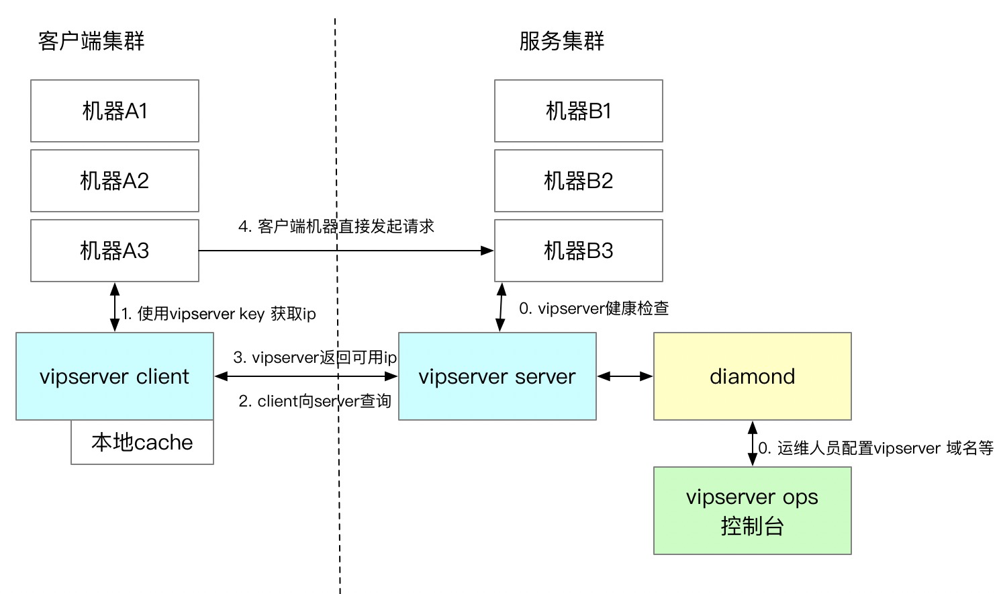

# 概述
VIPserver是一个七层负载均衡中间件，提供多业务同单元优先、同机房优先、同区域优先等一系列的调度策略

是P2P的方式，调用方和被调用方直接是直接联系的，vipserver只作为获取ip的边边链路

关于负载均衡：[负载均衡](../mysql/负载均衡.md)

# 原理
现在有两个集群，A集群要请求B集群，链路如下：

1. B集群要在VipServer上注册VipServer key(B集群机器列表的标识)
2. A集群根据B的VipServer key向VipServer获取B的某台IP，然后A直接请求这台机器

